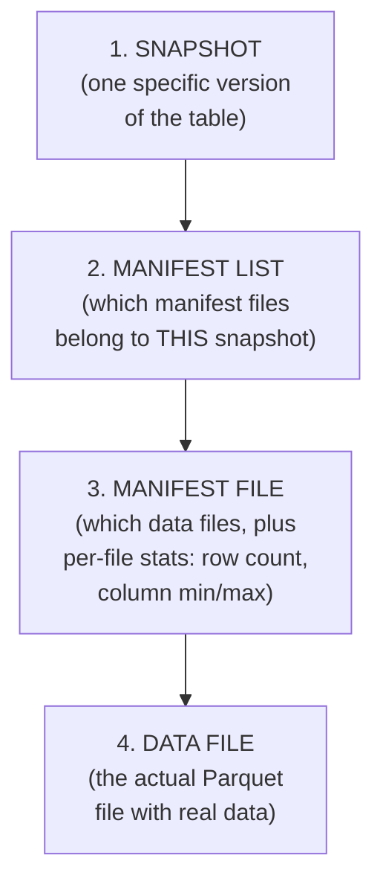
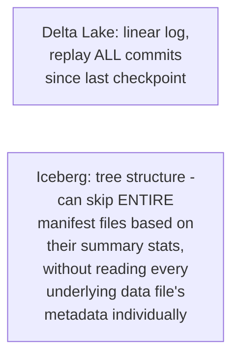

# Iceberg — Junior

<!-- level-focus -->
At junior level, focus on this question:

> What are the four levels of Iceberg's metadata tree, and what does each
> one actually contain?

---

## The four-level tree

- **Snapshot**: represents the table at one point in time — analogous to
  a specific version/commit in Delta Lake's log, but Iceberg represents it
  as a pointer into the tree below rather than a position in a linear log.
- **Manifest list**: for a given snapshot, the set of manifest files that
  together describe every data file currently part of the table.
- **Manifest file**: lists a batch of actual data files, along with
  per-file statistics (row counts, column-level min/max — the same
  pruning-enabling statistics from the File Format professional page's
  Parquet footer discussion, but tracked at the table-metadata level too).
- **Data file**: the actual Parquet (or ORC/Avro) file containing real
  rows.

## Why a tree instead of Delta Lake's linear log

> 🎓 **Takeaway:** Iceberg's tree structure (snapshot → manifest list →
> manifest → data file) exists specifically to enable **pruning at every
> level** of the tree — a query can skip entire manifest files (and
> therefore thousands of underlying data files) based on manifest-level
> summary statistics alone, without needing to inspect each data file
> individually — this is `professional.md`'s subject, made possible
> structurally by this exact tree shape.

## Test yourself

1. What information does a manifest file contain about the data files it
   lists?
2. Why does representing the table as a tree (rather than Delta Lake's
   linear log of add/remove operations) create a structural opportunity
   for skipping large groups of files at once?
3. If you wanted to query the table "as of yesterday," which level of the
   tree would you need to locate first?

Continue to [`middle.md`](middle.md).
