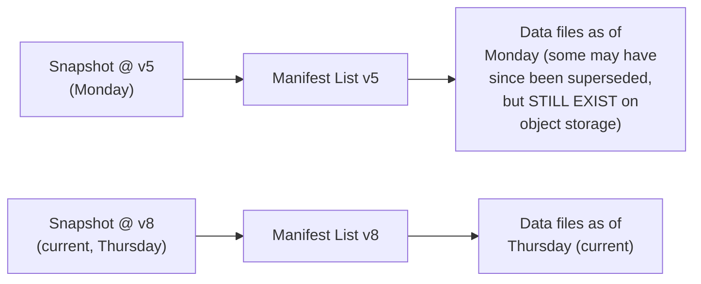

# Iceberg — Middle

<!-- level-focus -->
At middle level, focus on this question:

> How does querying an old snapshot reconstruct a past table state without
> needing to read any of the table's current data?

Prerequisite: [`junior.md`](junior.md).

---

## Every snapshot is a fully independent, self-contained pointer



```sql
-- Query the table as it existed at a specific past snapshot
SELECT * FROM my_table VERSION AS OF 5;

-- Or by timestamp
SELECT * FROM my_table TIMESTAMP AS OF '2024-01-15 00:00:00';
```

Because each snapshot points to its **own** manifest list (which points
to the specific data files that were part of the table **at that
version**), querying an old snapshot simply means starting the read path
from that older snapshot's manifest list instead of the current one —
no replay of intervening operations needed at all (unlike Delta Lake's
log, where reconstructing an old version conceptually means replaying up
to that point). As long as the underlying data files an old snapshot
references haven't been physically deleted (via `VACUUM`/expiration,
analogous to Delta Lake's `VACUUM`), that old snapshot remains fully,
independently queryable.

> 🎓 **Takeaway:** time travel in Iceberg is a direct consequence of the
> tree structure from `junior.md` — an old snapshot is simply a different,
> independent root pointing into a (possibly overlapping) set of data
> files, not a state you have to reconstruct by replaying history. This
> is structurally different from Delta Lake's approach, even though both
> systems offer the same user-facing "time travel" capability.

## Test yourself

1. Why doesn't querying an old Iceberg snapshot require replaying any
   intervening commits, unlike (conceptually) Delta Lake's log-based
   approach?
2. What would make an old snapshot's data become unqueryable, even though
   the snapshot metadata itself might still exist?
3. Why can two different snapshots (an old one and the current one)
   safely reference some of the **same** underlying data files, without
   any conflict?

Continue to [`senior.md`](senior.md).
