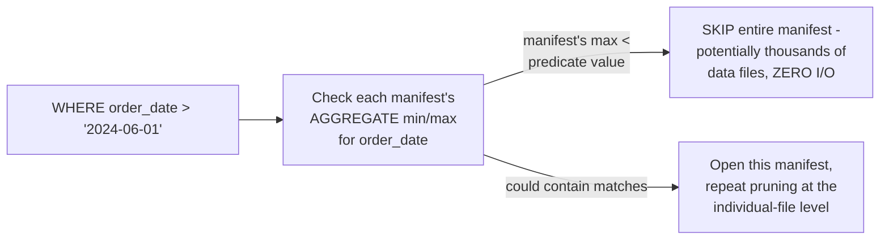
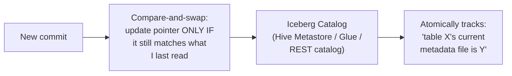

# Iceberg — Professional

<!-- level-focus -->
At professional level, focus on this question:

> How does the manifest tree structure enable pruning at massive table
> scale, and what does choosing an Iceberg catalog implementation actually
> involve?

Prerequisite: [`senior.md`](senior.md).

---

## Manifest-level pruning: skipping millions of files without touching them

Each manifest file (per `junior.md`) stores **summary statistics** for
the data files it lists — including, critically, an aggregated min/max
range across **all** the files in that manifest for each partition
column. A query planner can compare its filter predicate against a
manifest's **aggregate** statistics and skip the **entire manifest** (and
every one of the potentially thousands of data files it references)
without opening a single one of those files — this is the exact same
min/max-pruning principle from the File Format professional page's
Parquet-footer discussion, applied one level higher, at the
manifest-of-many-files granularity instead of the single-file granularity.



This two-level pruning (skip whole manifests, then skip individual files
within surviving manifests) is precisely what lets Iceberg scale to
tables with **millions** of files while keeping query planning fast — a
query never needs to inspect metadata for files it can already rule out
at the coarser manifest level, directly addressing the "listing millions
of objects" cost problem that would otherwise dominate query planning
time at this scale (echoing the small-files/metadata-scaling concerns
from the File System professional page, solved here at the table-format
metadata layer rather than the filesystem layer).

## Catalog choice: where "what is the current snapshot" lives

Iceberg separates the **table format** (the tree structure covered
throughout this topic) from the **catalog** — the service responsible for
atomically tracking "which metadata file is the current one" for a given
table name, so that a commit (creating a new snapshot) is atomic from the
perspective of anyone looking up the table by name. Production catalog
choices include a **Hive Metastore**-compatible catalog (for
compatibility with existing Hadoop-ecosystem tooling), **AWS Glue**
(a managed catalog service), and **REST catalogs** (a newer, engine-
agnostic HTTP API specification) — this catalog choice is itself
effectively a coordination-service decision (per the Coordination
Services professional page): the catalog must provide an atomic
compare-and-swap ("update the table's current metadata pointer only if
it still matches what I last read") to make concurrent commits safe,
exactly the same optimistic-concurrency mechanism from the Delta Lake
professional page's version-claiming discussion, just delegated to
whichever catalog service you choose rather than implemented via object
storage's own conditional writes directly.



## Production checklist (staff-level)

1. **Design table partitioning and expected query filter patterns
   together, upfront**, even though hidden partitioning (`senior.md`)
   makes later changes non-disruptive — getting it closer to right
   initially still reduces the number of files/manifests with poor
   pruning characteristics accumulated before an evolution is applied.
2. **Choose a catalog implementation based on your existing ecosystem
   and multi-engine requirements** — a REST catalog offers the most
   engine-agnostic future-proofing; Hive Metastore/Glue offer better
   compatibility with existing Hadoop-ecosystem tooling if that's already
   in place.
3. **Monitor manifest file count and size distribution** as a distinct
   metric from data file count — an excessive number of small manifest
   files (from many small, frequent commits) degrades the pruning
   efficiency this whole page relies on; periodic manifest rewriting/
   compaction addresses this, analogous to Delta Lake's checkpointing.
4. **Verify your chosen catalog provides genuine atomic compare-and-swap
   semantics** for the "current metadata pointer" update — this is the
   load-bearing correctness guarantee for concurrent commit safety,
   echoing the Delta Lake professional page's optimistic concurrency
   discussion.
5. **In an architecture review choosing between Iceberg and Delta Lake,
   weigh multi-engine interoperability (Iceberg's stronger historical
   focus, being a vendor-neutral specification with a broader catalog
   ecosystem) against Spark-centric ecosystem maturity (historically
   Delta Lake's strength, though both have converged significantly)** —
   this decision should be explicit and revisited as both projects evolve.

## Cheat Sheet

```text
+------------------------------------------------------------------+
|                    ICEBERG — INTERNALS & SCALE                      |
+------------------------------------------------------------------+
| Manifest-level pruning: each manifest stores AGGREGATE min/max        |
| across all its data files - query planner skips ENTIRE manifests       |
| (potentially thousands of files) with ZERO I/O, based on manifest-    |
| level stats alone, before even considering individual-file pruning     |
| -> enables scaling to MILLIONS of files without slow query planning   |
+------------------------------------------------------------------+
| Catalog: separate service tracking "current metadata pointer" per      |
| table NAME - must provide ATOMIC COMPARE-AND-SWAP for safe concurrent  |
| commits (Hive Metastore, AWS Glue, or a newer vendor-neutral REST       |
| catalog spec) - this is a coordination-service decision                |
+------------------------------------------------------------------+
| Monitor manifest file count/size distribution separately from data     |
| file count - excessive small manifests from frequent commits degrade  |
| pruning efficiency; periodic manifest compaction addresses this         |
+------------------------------------------------------------------+
```

## Test yourself

1. Why does manifest-level aggregate min/max pruning let Iceberg scale
   query planning to millions of data files without opening each one
   individually?
2. Why must an Iceberg catalog provide atomic compare-and-swap semantics
   for the current-metadata pointer, and what would go wrong without it?
3. Design the catalog choice and manifest-compaction schedule for an
   organization running both Spark and Trino against the same Iceberg
   tables, receiving thousands of small commits per day.

## Further Reading

- Apache Iceberg documentation — "Iceberg Table Spec" (the full snapshot/
  manifest-list/manifest/data-file tree specification) and "Catalogs."
- Netflix Technology Blog — "Iceberg: A modern table format for
  large-scale analytic datasets" (the original motivating engineering
  writeup).
- See also: [Delta Lake — professional](../delta-lake/professional.md),
  [File Format — professional](../../file-format/professional.md).
