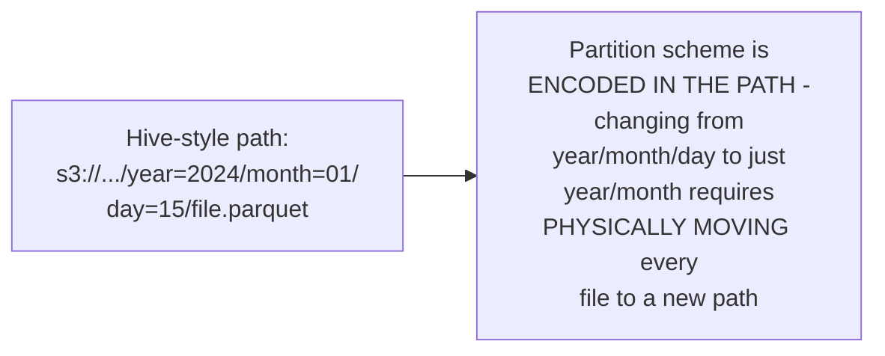
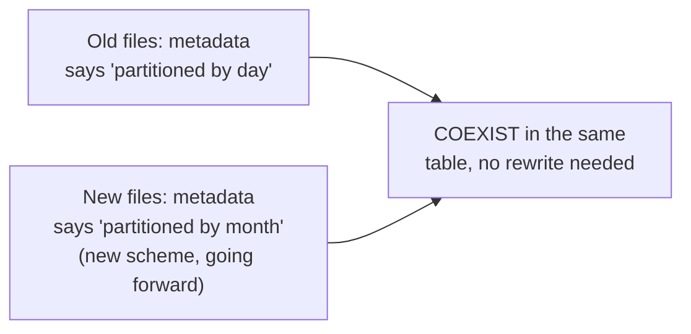

# Iceberg — Senior

<!-- level-focus -->
At senior level, focus on this question:

> Why can Iceberg let you change a table's partitioning scheme without
> rewriting all existing data, unlike traditional Hive-style partitioning?

Prerequisite: [`middle.md`](middle.md).

---

## The Hive-style problem: partitioning is baked into the file path



Traditional Hive-style partitioning encodes the partition values directly
into the file's storage path — this means the partitioning scheme is a
**physical**, not just logical, property of the data. Changing it (e.g.
realizing `day`-level partitioning is too fine-grained and switching to
`month`-level) requires rewriting/moving every single existing file to a
new path structure — a massive, disruptive operation for a large table.

## Iceberg's hidden partitioning: partition info lives in metadata, not the path

```mermaid
flowchart LR
    IcebergFile["Iceberg data file path:\ns3://.../data/\nabc123-def456.parquet\n(NO partition info\nin the path at all)"]
    Manifest["Manifest file records:\n'this file belongs to\npartition (year=2024,\nmonth=01)' as METADATA"]
    IcebergFile -.-.- Manifest
```

Iceberg tracks which partition each data file belongs to as **metadata**
(in the manifest files, per `junior.md`) rather than encoding it in the
physical file path at all — this is what "hidden partitioning" means.
Because the partition scheme is a metadata concept, **partition
evolution** is possible: you can change the partitioning strategy for
**future** writes (switch from day to month granularity) while **existing**
files keep their original metadata-recorded partition info, unchanged —
no data movement required at all. A query spanning both old and new
partition schemes correctly reads each file according to its own
recorded partition metadata.



> 🎯 **Senior takeaway:** Iceberg's hidden partitioning decouples the
> logical concept of "partition" from the physical file layout — this is
> precisely what makes partition evolution a metadata-only operation
> instead of a full-table data migration, directly solving a real,
> well-documented Hive-style pain point that required careful, disruptive
> planning to work around previously.

## Test yourself

1. Why does Hive-style partitioning require physically moving files to
   change the partitioning scheme, while Iceberg does not?
2. Why can old files (partitioned by day) and new files (partitioned by
   month) coexist correctly in the same Iceberg table without any
   rewriting?
3. What real operational pain point does hidden partitioning solve for a
   team that initially over-partitioned a table (too many small
   partitions) and wants to fix it going forward without a disruptive
   migration?

Continue to [`professional.md`](professional.md) to see manifest pruning
and catalog choice at production scale.
