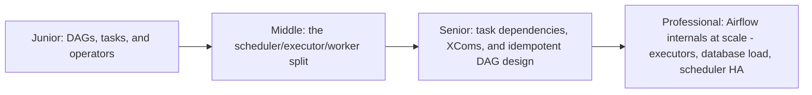
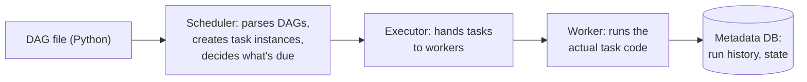

# Airflow

> A Python-based workflow orchestrator: define pipelines as directed
> acyclic graphs (DAGs) of tasks, and let a scheduler, executor, and
> metadata database handle dependency resolution, retries, and historical
> run tracking. The most widely deployed general-purpose data pipeline
> orchestrator.

## Choose a level

| Level | Guide | You are done when |
|---|---|---|
| Junior | [DAGs, tasks, operators](junior.md) | You can write a simple DAG with task dependencies and explain what each piece does. |
| Middle | [Scheduler, executor, worker](middle.md) | You can trace a task from "scheduled" to "running" through Airflow's components. |
| Senior | [XComs and idempotent design](senior.md) | You can design a DAG that's safe to re-run and doesn't misuse XComs for large data. |
| Professional | [Airflow internals at scale](professional.md) | You can diagnose scheduler/database bottlenecks in a large-scale Airflow deployment. |

## Practice rule

Before writing any DAG, ask: "if this exact DAG run is manually re-triggered
tomorrow with the same execution date, does it produce the same result, or
does it duplicate/corrupt something?" If you can't answer confidently, the
DAG isn't idempotent yet.

## Related

- [Schedule-Driven Background Jobs](../17-background-jobs/schedule-driven/README.md)
- [Durable Execution (Temporal)](../17-background-jobs/durable-execution-temporal/README.md)
