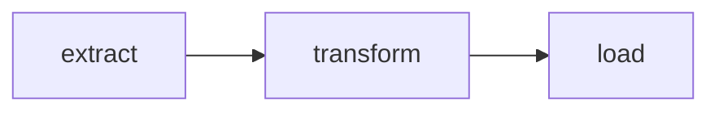
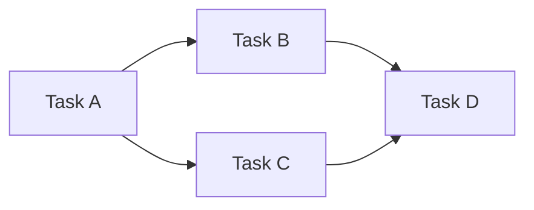

# Airflow — Junior

<!-- level-focus -->
At junior level, focus on this question:

> What is a DAG, a task, and an operator, and how do they combine into a
> pipeline definition?

---

## A DAG is a directed acyclic graph of tasks

```python
from airflow import DAG
from airflow.operators.python import PythonOperator
from datetime import datetime

with DAG(
    dag_id="daily_sales_report",
    schedule="0 2 * * *",   # cron: 2am daily
    start_date=datetime(2024, 1, 1),
    catchup=False,
) as dag:

    extract = PythonOperator(task_id="extract", python_callable=extract_sales_data)
    transform = PythonOperator(task_id="transform", python_callable=transform_data)
    load = PythonOperator(task_id="load", python_callable=load_to_warehouse)

    extract >> transform >> load   # defines the DEPENDENCY order
```



- **DAG**: the whole pipeline definition — a graph where nodes are tasks
  and edges are dependencies (`>>` means "must run after"). "Acyclic" means
  no task can depend on itself, even indirectly — a pipeline can't loop
  back on itself.
- **Task**: one unit of work (`extract`, `transform`, `load` above) — a
  single node in the DAG.
- **Operator**: the template/class that defines *what kind* of work a task
  does — `PythonOperator` runs a Python function, `BashOperator` runs a
  shell command, and there are hundreds of provider-specific operators
  (`S3ToRedshiftOperator`, `KubernetesPodOperator`, etc.).

## Dependencies determine execution order, not timing



`D` only runs once **both** `B` and `C` have completed successfully — the
DAG structure is purely about **ordering and dependency**, letting
independent branches (`B` and `C` here) run in parallel while still
guaranteeing `D` waits for both.

> 🎓 **Takeaway:** a DAG is a declarative description of "what depends on
> what" — you don't write imperative "run this, then run that" code;
> you declare the dependency graph, and Airflow's scheduler figures out
> what can run when.

## Test yourself

1. Why must a DAG be acyclic — what would a cycle even mean for a
   pipeline's execution order?
2. In the 4-task example, could `B` and `C` run at the same time? Why or
   why not?
3. What's the difference between a "DAG," a "task," and an "operator" —
   could a single operator be used to define multiple different tasks?

Continue to [`middle.md`](middle.md).
