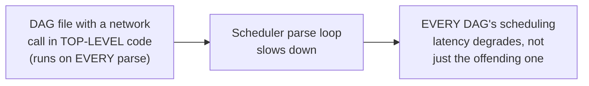
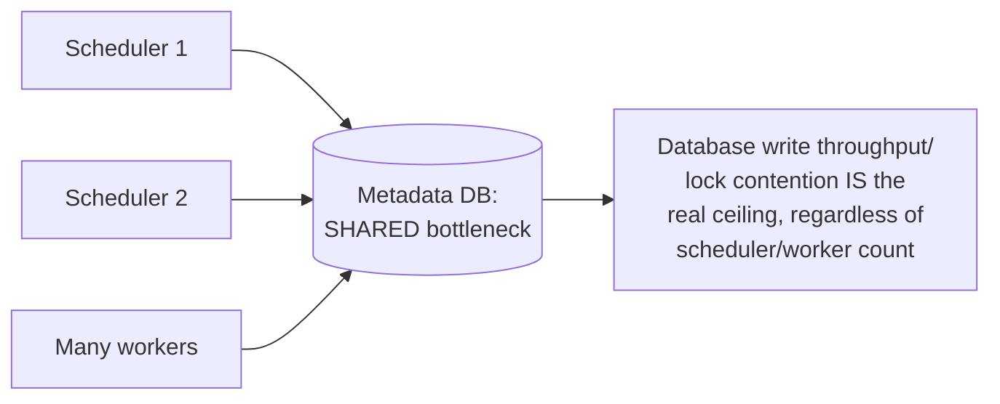

# Airflow — Professional

<!-- level-focus -->
At professional level, focus on this question:

> What are the real, documented bottlenecks in a large-scale Airflow
> deployment (scheduler parsing latency, metadata database load, executor
> choice), and how do you diagnose and fix each?

Prerequisite: [`senior.md`](senior.md).

---

## DAG parsing latency: the scheduler's hidden cost

The scheduler **re-parses every DAG file** on a configurable interval
(`min_file_process_interval`) to detect changes and evaluate schedules —
this means DAG file **complexity** directly affects scheduler
responsiveness across the **entire deployment**, not just the slow DAG's
own scheduling. A DAG file that does expensive work at **parse time**
(a network call inside the DAG file's top-level code, executed every time
the scheduler parses it — a well-documented Airflow anti-pattern) can
single-handedly degrade scheduling latency for every other DAG sharing
that scheduler.



## Metadata database as the central bottleneck

Every scheduler decision, every task state transition, and every XCom
(`senior.md`) writes to the **same metadata database** — at high DAG/task
volume, this database's write throughput and lock contention (per the
Locking & Concurrency Control professional page) becomes the actual
ceiling on how many tasks the whole deployment can process concurrently,
regardless of how many workers you add. This is why Airflow 2.0+'s HA
scheduler (multiple scheduler processes, using the
`SELECT ... FOR UPDATE SKIP LOCKED` pattern from the Schedule-Driven
Background Jobs professional page) still shares one underlying database
as the real throughput ceiling — adding more scheduler processes helps
with scheduling latency and failover, but doesn't remove the database as
the shared bottleneck resource.



## Executor choice as a scale decision

`middle.md`'s executor choice has real production consequences at scale:
`CeleryExecutor` requires operating a separate message broker (Redis/
RabbitMQ) and Celery worker fleet, adding infrastructure but providing
mature, well-tested distributed task execution; `KubernetesExecutor`
spins up a fresh pod per task, providing strong per-task resource
isolation (a direct application of the Bulkhead pattern at the
task-execution level) at the cost of per-task pod startup latency
(echoing the scaling-lag discussion from the Queue-Based Load Leveling
professional page) — a poor fit for very short, high-frequency tasks where
pod startup overhead dominates actual task runtime.

## Production checklist (staff-level)

1. **Never perform expensive work (network calls, heavy computation) in a
   DAG file's top-level code** — anything outside a task's callable
   function body runs on every scheduler parse cycle, for every DAG file,
   and directly degrades deployment-wide scheduling latency.
2. **Monitor metadata database write latency and lock contention as a
   primary Airflow health metric**, not just scheduler/worker CPU — this
   is the actual shared bottleneck resource at scale, per the Locking &
   Concurrency Control professional page's principles applied here.
3. **Choose executor based on task shape and scale, not just familiarity**
   — `KubernetesExecutor`'s per-task pod isolation is valuable for
   heterogeneous, resource-varying workloads, but its per-task startup
   latency makes it a poor fit for many short, frequent tasks;
   `CeleryExecutor` suits high-frequency, relatively homogeneous task
   fleets better.
4. **Route large data through actual storage, never XComs**, per
   `senior.md`, and audit existing DAGs for this anti-pattern proactively —
   it's a common, insidious source of gradually degrading metadata
   database performance.
5. **In a capacity-planning review for a growing Airflow deployment,
   model the metadata database's write throughput against your target
   task volume explicitly** — this is the ceiling that ultimately
   determines how much the deployment can scale, more than scheduler or
   worker count alone.

## Cheat Sheet

```text
+------------------------------------------------------------------+
|                    AIRFLOW — INTERNALS & SCALE                      |
+------------------------------------------------------------------+
| Scheduler RE-PARSES every DAG file on an interval - expensive TOP-    |
| LEVEL code in a DAG file (network calls, heavy computation) degrades   |
| scheduling latency for EVERY DAG, not just the offending one          |
+------------------------------------------------------------------+
| Metadata database = the SHARED bottleneck resource. Every scheduling   |
| decision, task state transition, and XCom writes here. HA scheduler   |
| (multiple scheduler processes) helps latency/failover but does NOT     |
| remove the DB as the real throughput ceiling                          |
+------------------------------------------------------------------+
| Executor choice is a scale decision:                                  |
|   CeleryExecutor: mature, needs a broker + worker fleet, good for      |
|     high-frequency homogeneous tasks                                  |
|   KubernetesExecutor: strong per-task resource isolation (bulkhead-    |
|     style), but per-task pod startup latency - poor fit for short,     |
|     frequent tasks                                                    |
+------------------------------------------------------------------+
```

## Test yourself

1. Why does an expensive network call in a DAG file's top-level code
   degrade scheduling for unrelated DAGs, not just the DAG containing it?
2. Why doesn't adding more HA scheduler processes remove the metadata
   database as Airflow's ultimate throughput ceiling?
3. A team has thousands of short (sub-second), high-frequency tasks and is
   choosing between CeleryExecutor and KubernetesExecutor. Which would you
   recommend, and why?

## Further Reading

- Apache Airflow documentation — "Scheduler," "Executors," and "Best
  Practices" (top-level code performance guidance).
- Astronomer Engineering Blog — production Airflow scaling case studies
  and metadata database tuning guidance.
- See also: [Schedule-Driven Background Jobs — professional](../17-background-jobs/schedule-driven/professional.md),
  [Locking & Concurrency Control — professional](../../databases/transaction/locking-and-concurrency-control/professional.md).
