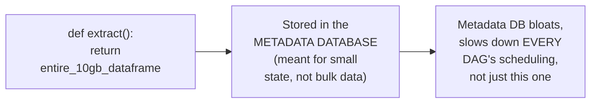
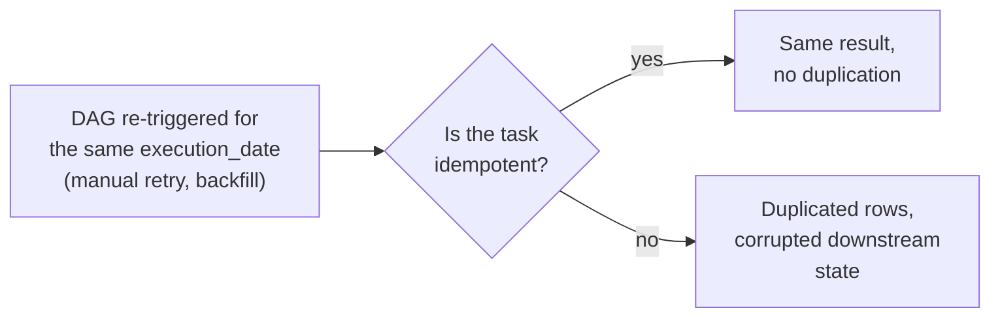

# Airflow — Senior

<!-- level-focus -->
At senior level, focus on this question:

> How do XComs work, why are they dangerous for large data, and what makes
> a DAG genuinely safe to re-run?

Prerequisite: [`middle.md`](middle.md).

---

## XComs: passing small data between tasks

```python
def extract(**context):
    row_count = fetch_and_load_data()
    return row_count  # automatically pushed to XCom

def notify(**context):
    count = context["ti"].xcom_pull(task_ids="extract")
    send_slack_message(f"Extracted {count} rows")
```

**XCom** ("cross-communication") is Airflow's built-in mechanism for
passing small values between tasks — a task's return value is
automatically stored in the metadata database, and downstream tasks
retrieve it via `xcom_pull`.

## Why XComs are dangerous for large data



The metadata database is sized and tuned for **small, frequent** state
records (task status, small config values) — not for passing gigabytes of
actual data between tasks. A task that returns a large DataFrame as an
XCom bloats the metadata database and can degrade scheduler performance
for **every** DAG in the deployment, not just the offending one. The
correct pattern: tasks should write large intermediate data to actual
storage (S3, a data warehouse table) and pass only a **reference**
(a file path, a table name) via XCom — never the data itself.

## Idempotent DAG design: safe to re-run

```python
def load_partition(execution_date, **context):
    # BAD: appends every time, re-running duplicates data
    df.to_sql("sales", con=engine, if_exists="append")

    # GOOD: idempotent - overwrites this specific partition,
    # safe to re-run for the same execution_date any number of times
    df.to_sql(f"sales_{execution_date}", con=engine, if_exists="replace")
```



Because Airflow's `catchup` (see
[Schedule-Driven Background Jobs — senior](../17-background-jobs/schedule-driven/senior.md))
and manual re-triggering both mean a DAG run for a **specific**
`execution_date` can happen more than once, every task must be written
using the same idempotency discipline from
[Retries & Idempotency](../17-background-jobs/retries-and-idempotency/README.md) —
typically by making writes **overwrite-by-partition** rather than
append-only.

> 🎯 **Senior takeaway:** XComs are for small state, not data payloads —
> route large intermediate results through real storage with a reference
> passed via XCom instead. And every task must be designed assuming it
> could run more than once for the same logical execution — idempotent,
> overwrite-based writes, not blind appends.

## Test yourself

1. Why does storing a large DataFrame in an XCom degrade scheduling
   performance for unrelated DAGs, not just the one that did it?
2. Rewrite the "BAD" load example so it's safe to re-run for the same
   `execution_date` any number of times.
3. Design an XCom-based handoff between an `extract` task and a
   `transform` task where the extracted data is 50GB — what should
   actually be passed via XCom?

Continue to [`professional.md`](professional.md) to diagnose scheduler and
database bottlenecks at production scale.
