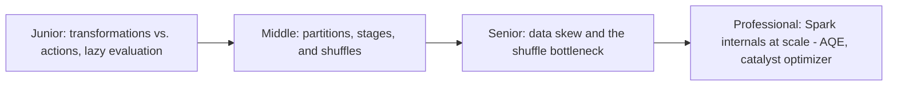
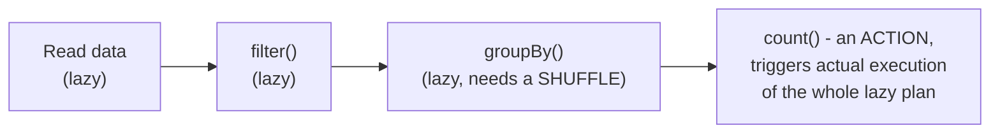

# Spark

> A distributed compute engine built around one core abstraction —
> transformations on partitioned data, lazily planned and executed as a
> DAG of stages across a cluster. Understanding lazy evaluation, shuffles,
> and partitioning is the difference between a Spark job that scales and
> one that mysteriously falls over at 10x data volume.

## Choose a level

| Level | Guide | You are done when |
|---|---|---|
| Junior | [Transformations, actions, laziness](junior.md) | You can explain why nothing actually runs until an action is called. |
| Middle | [Partitions, stages, shuffles](middle.md) | You can identify which operations trigger a shuffle and why that matters. |
| Senior | [Data skew](senior.md) | You can diagnose a job where one partition is far larger than the others and explain the fix. |
| Professional | [AQE and Catalyst at scale](professional.md) | You can explain how Spark's optimizer and adaptive execution change a job's plan at runtime. |

## Practice rule

Before running a Spark job on production-scale data, ask: "does any
transformation in this pipeline require a shuffle (`groupBy`, `join`,
`repartition`), and if so, is my data reasonably evenly distributed across
the join/group key?" An uneven key distribution is the single most common
cause of a Spark job that works fine in testing and falls over in
production.

## Related

- [Query Optimization](../../databases/performance/query-optimization/README.md)
- [OLTP vs OLAP](../../databases/operation/oltp-vs-olap/README.md)
