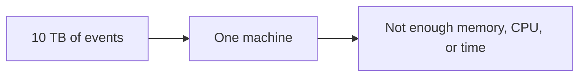
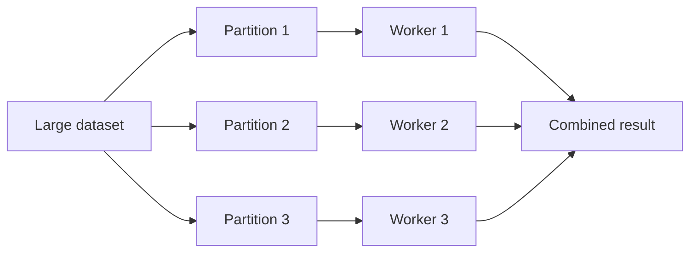
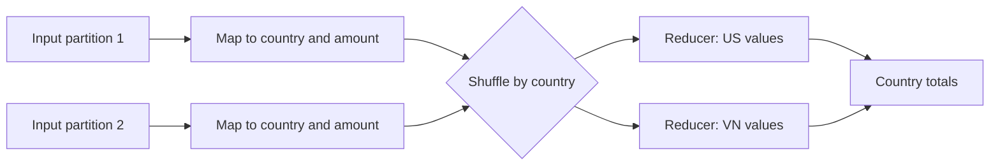
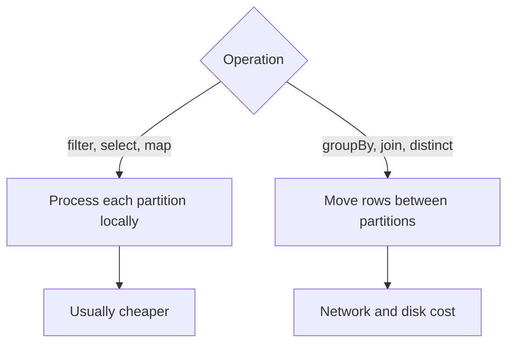
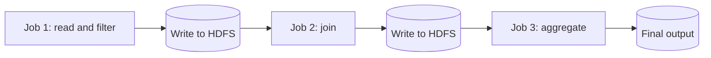
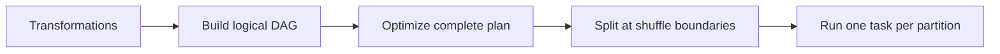

# Spark - Junior

At junior level, focus on one question:

> How does Spark divide a large dataset into partitions, process them in
> parallel, and combine the results?

## The original problem: one machine is not enough

Imagine processing 10 TB of web events on one computer:



A single machine must read every row and perform every calculation. Adding
more data makes the same machine slower, and eventually the data no longer
fits on its disks or in memory.

Distributed processing starts with **divide and conquer**:

1. Divide one large dataset into smaller **partitions**.
2. Send partitions to worker machines.
3. Process partitions at the same time.
4. Combine the partial results.



A **partition** is a logical chunk of rows. One Spark task processes one
partition. If a dataset has 100 partitions, Spark can create 100 tasks and
run several at once, limited by the available executor cores.

Partitions make the work scalable because workers can process different
chunks independently. They also provide fault recovery: if one task fails,
Spark can recompute that partition instead of restarting all work.

## MapReduce: the foundation

Google's MapReduce model made divide-and-conquer practical for large data.
It has three important phases:

1. **Map:** process each input record independently and emit key-value pairs.
2. **Shuffle:** move values so that identical keys meet on the same worker.
3. **Reduce:** combine all values for each key.

Suppose the input contains orders and we need revenue per country:

```text
US,100
VN,40
US,25
VN,10
```

The map phase emits:

```text
(US, 100)  (VN, 40)  (US, 25)  (VN, 10)
```

The shuffle groups values by key:

```text
US -> [100, 25]
VN -> [40, 10]
```

The reduce phase calculates the totals:

```text
US -> 125
VN -> 50
```



## Why shuffling is necessary

Before the shuffle, records for `US` may exist in many partitions. A worker
cannot calculate the final `US` total from only its local partition.

The shuffle redistributes records, usually using a key hash:

```text
target partition = hash(key) % number_of_partitions
```

This guarantees that equal keys reach the same destination partition.
Operations such as `groupBy`, `join`, `distinct`, and `repartition` need this
kind of data movement.

Shuffling is expensive because Spark may need to:

- serialize rows;
- write intermediate data to local disk;
- transfer data across the network;
- sort or hash the records;
- read the data again on another executor.

By contrast, `filter`, `select`, and `map` usually work inside each existing
partition. Spark calls these **narrow transformations** because output
partitions depend on only a small number of input partitions.



## How classic Hadoop MapReduce works

Classic Hadoop MapReduce normally writes intermediate output to disk between
jobs. A multi-step pipeline becomes several separate MapReduce jobs:



This design is durable and simple, but repeated disk writes, reads, and job
startup make iterative or multi-stage pipelines slow. The programming model
is also rigid: most work must be expressed as a chain of map and reduce jobs.

## Why Spark is usually faster and easier

Spark keeps the divide-and-conquer idea but replaces a rigid sequence of
MapReduce jobs with a **directed acyclic graph**, or DAG, of transformations.

```python
orders = spark.read.parquet("s3://lake/orders")
result = (
    orders
    .filter("status = 'completed'")
    .groupBy("country")
    .sum("amount")
)
result.write.mode("overwrite").parquet("s3://lake/country_revenue")
```

The read, filter, and group are **lazy**: they build a plan. The write is an
**action** that asks Spark to optimize and execute that plan.



Spark improves on classic MapReduce in several ways:

| Classic MapReduce | Spark |
|---|---|
| Materializes results between separate jobs | Pipelines narrow operations in one stage |
| Repeatedly reads and writes intermediate data | Can retain reusable data in memory and spill when needed |
| Mostly map and reduce functions | SQL, DataFrames, joins, aggregations, streaming, and ML APIs |
| Optimizes one job at a time | Optimizes the complete DAG before execution |
| High startup cost for iterative algorithms | Reuses executors across stages and iterations |
| Recovery uses durable intermediate files | Recovery can recompute lost partitions from lineage |

Spark is **not always in memory**, and it is not automatically faster. It
still reads source data, writes shuffle files, spills when memory is tight,
and writes final output. A badly partitioned Spark job with large shuffles or
skewed keys can be slower than a well-designed MapReduce job.

## A useful execution model

When reading Spark code, reason in this order:

1. **Dataset:** what records are being processed?
2. **Partition:** how is the dataset divided?
3. **Task:** what local work happens to each partition?
4. **Shuffle:** which operation must move rows by key?
5. **Stage:** which operations can be pipelined before the next shuffle?
6. **Action:** what triggers execution?

For the example above:

```text
read partitions -> local filter -> shuffle by country -> local sums -> write
```

The filter can run beside the read in one stage. `groupBy("country")` creates
a shuffle boundary because all orders for one country must meet. The reduce
side then sums each shuffled partition.

## Practical rules

- Use many partitions to expose parallelism, but avoid millions of tiny ones.
- Filter early so fewer rows cross the network during later shuffles.
- Select only required columns to reduce disk and network bytes.
- Expect `groupBy`, large joins, `distinct`, and `repartition` to shuffle.
- Check the Spark UI for stage boundaries, task duration, input size, shuffle
  read/write, spills, and unusually large partitions.
- Never use `collect()` for a large dataset; it moves all rows to the driver.

Continue to [`middle.md`](middle.md).

## Test yourself

1. How does partitioning apply the divide-and-conquer idea to a 10 TB
   dataset?
2. Why does MapReduce need a shuffle between map and reduce?
3. Why can `filter` run locally while `groupBy` usually moves data?
4. What does Spark's DAG improve compared with several Hadoop MapReduce jobs?
5. Why is “Spark processes everything in memory” an incorrect explanation?
