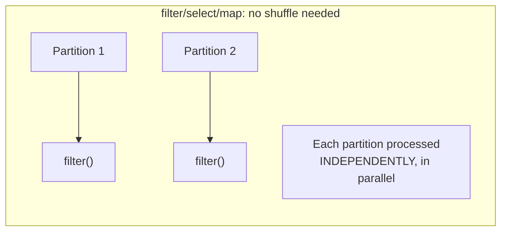
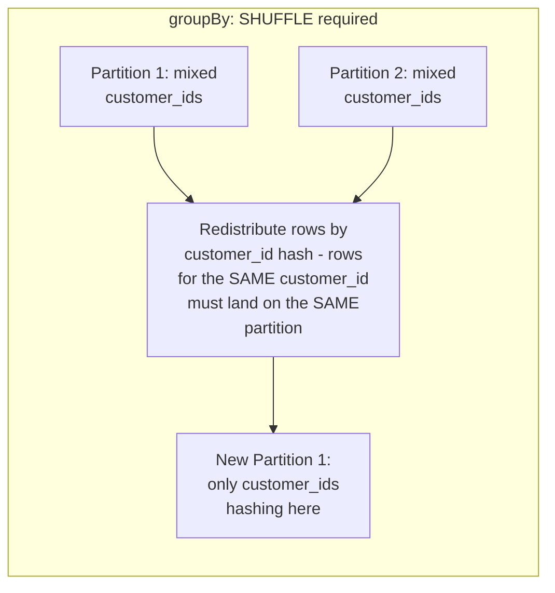
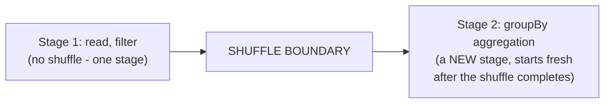

# Spark — Middle

<!-- level-focus -->
At middle level, focus on this question:

> Which operations require a shuffle, and why does a shuffle split a job
> into separate stages?

Prerequisite: [`junior.md`](junior.md).

---

## Partitions: how Spark splits data across the cluster

Spark splits a dataset into **partitions** distributed across executors —
each partition is processed independently, in parallel, by one executor
core at a time. Many transformations (`filter`, `select`, `map`) can be
applied to each partition **independently**, with no data movement between
partitions needed at all.

## Shuffles: when data must move between partitions

`groupBy`, `join`, `distinct`, and `repartition` all require a **shuffle**:
rows must be physically **redistributed** across partitions so that all
rows sharing the same key (the `groupBy`/`join` key) end up on the
**same** partition, where the aggregation/join can actually happen.

A shuffle is expensive: it means writing intermediate data to disk on
every executor, transferring it across the network to the executors that
need it, and reading it back — a fundamentally different (and much more
costly) operation than a purely local, per-partition transformation.

## Shuffles split a job into stages

Spark's execution plan is divided into **stages** at every shuffle
boundary — a stage is a sequence of operations that can run without any
data movement between partitions; a new stage begins whenever a shuffle is
required, because every task in the new stage needs the shuffle's output
to be complete before it can start.

> 🎓 **Takeaway:** shuffles are the expensive, network/disk-bound
> operation in Spark, and they're the reason a job's execution plan has
> multiple stages — understanding which of your operations trigger a
> shuffle is the first step toward understanding where your job actually
> spends its time.

## Test yourself

1. Why does `filter()` never require a shuffle, while `groupBy()` almost
   always does?
2. Why is a shuffle more expensive than a purely local, per-partition
   operation — what specific costs (disk, network) does it incur?
3. For a pipeline with `read → filter → join → groupBy → write`, how many
   stages would you expect, and where are the boundaries?

Continue to [`senior.md`](senior.md).
