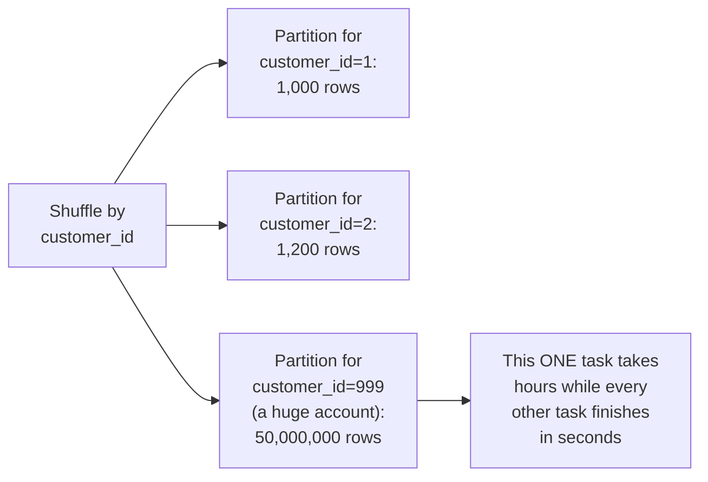

# Spark — Senior

<!-- level-focus -->
At senior level, focus on this question:

> How does data skew cause one Spark task to take dramatically longer than
> all the others, and how do you fix it?

Prerequisite: [`middle.md`](middle.md).

---

## The skew problem: one partition, disproportionately large



If your join/group key has a **highly skewed** distribution (a single
customer, product, or category accounting for a disproportionate share of
rows — a Zipfian distribution, common in real-world data), the shuffle
sends a hugely disproportionate number of rows to **one** partition. That
partition's task becomes a **straggler**, taking far longer than every
other task combined, while the rest of the cluster sits idle waiting for
it — the job's total runtime is bottlenecked by this single slow task,
regardless of how many executors you add.

## Mitigations

```mermaid
flowchart LR
    Salting["Salting: append a random\nsuffix to the hot key,\nsplit it into N sub-keys,\naggregate results after"] --> Spread["Spreads the hot key's rows\nacross N partitions instead\nof one"]
    BroadcastJoin["Broadcast join: if one side\nof a join is small enough,\nsend the WHOLE small table\nto every executor - NO\nshuffle needed for the join\nat all"] --> NoSkew["Sidesteps skew entirely\nfor that join"]
```



- **Salting**: append a random suffix to the skewed key (splitting one hot
  key into several sub-keys), spreading its rows across multiple
  partitions, then combining the partial results in a final aggregation
  step — the same technique from the Cache Stampede professional page's
  hot-key sharding, applied to Spark shuffles.
- **Broadcast join**: if one side of a join is small enough to fit in
  memory on every executor (a small dimension table, per the Kimball
  Modeling topic), Spark can **broadcast** the whole small table to every
  executor instead of shuffling the large table — eliminating the shuffle
  (and any skew risk) for that specific join entirely.

```python
from pyspark.sql.functions import broadcast

result = large_df.join(broadcast(small_dimension_df), "customer_id")
```

> 🎯 **Senior takeaway:** skew isn't a bug in Spark — it's a direct
> consequence of your data's real-world key distribution meeting a hash-
> based shuffle partitioning strategy. Diagnose it by looking at the Spark
> UI's task duration distribution (one task taking 100x longer is the
> signature), and fix it with salting (spread the hot key) or broadcast
> joins (eliminate the shuffle for small-table joins) as appropriate.

## Test yourself

1. Why does adding more executors NOT fix a data-skew straggler-task
   problem?
2. Walk through how salting spreads a hot key's rows across multiple
   partitions, and what extra step is needed to combine the results
   correctly afterward.
3. Why does a broadcast join eliminate skew risk entirely for that
   specific join, rather than just mitigating it?

Continue to [`professional.md`](professional.md) to see how Spark's
Adaptive Query Execution and Catalyst optimizer address these issues at
runtime.
