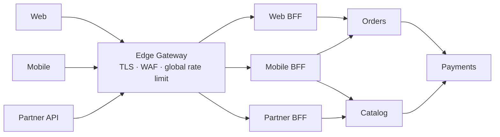

# API Gateway — Interview

A tiered question bank on the API gateway: the single, programmable entry point in front of your services. Questions run from fundamentals to staff-level judgment. Answers are written to be spoken — tight, concrete, and honest about trade-offs.

1. What is an API gateway and why do teams introduce one?
2. What are its core responsibilities?
3. Gateway vs load balancer vs reverse proxy vs service mesh?
4. Edge gateway vs BFF vs internal gateway — how do they differ?
5. Explain request aggregation. When is it worth it?
6. Local vs distributed rate limiting — how do you choose?
7. How does auth offload work with JWT/JWKS and mTLS?
8. The gateway is a single point of failure. How do you make it HA?
9. What latency does the extra hop cost, and how do you keep it low?
10. What is the "God gateway" anti-pattern and how do you avoid it?
11. Managed vs self-hosted (AWS API Gateway vs Kong/Envoy/NGINX)?
12. Who owns the gateway in an organization?
13. How do you version and safely change gateway config?
14. Kong vs Envoy vs NGINX vs AWS API Gateway — pick one, when?

---

## Q1: What is an API gateway and why do teams introduce one?

An API gateway is a reverse proxy that sits at the edge of your system and mediates every client request before it reaches a backend service. Instead of clients talking directly to dozens of services, they talk to one address; the gateway routes each request to the right upstream and applies a shared set of cross-cutting concerns on the way in and out — TLS termination, authentication, rate limiting, request/response transformation, and observability.

The reason it exists is consolidation. In a microservices system, concerns like "verify this token," "reject if over quota," "add a trace ID," and "terminate TLS" are identical across every service. Without a gateway, each team reimplements them, inconsistently. The gateway pulls those concerns to one enforcement layer so services can stay thin and focus on business logic. It also decouples the client's view of the API from the internal service topology: you can split, merge, rename, or relocate services behind the gateway without breaking clients.

## Q2: What are its core responsibilities?

Routing is the base: match on host, path, header, or method and forward to the correct upstream, including canary and weighted splits. On top of that sit the cross-cutting concerns:

- **TLS termination** — decrypt HTTPS at the edge so internal hops can be plaintext or mTLS.
- **Authentication and authorization** — validate JWTs, API keys, or mTLS certs; reject unauthenticated traffic before it costs a backend anything.
- **Rate limiting and quotas** — protect upstreams and enforce per-client tiers.
- **Request/response transformation** — header manipulation, protocol translation (REST↔gRPC), payload shaping.
- **Aggregation** — fan out to multiple services and compose one response.
- **Observability** — inject trace/correlation IDs, emit metrics and access logs at a single choke point.
- **Resilience** — timeouts, retries, circuit breaking, and load shedding at the edge.

The discipline is knowing which of these belong at the edge and which belong in the service. The gateway should own generic policy, not business rules.

## Q3: Gateway vs load balancer vs reverse proxy vs service mesh?

They overlap because they are all proxies, but they operate at different layers with different intent.

| Component | Layer | Primary job | Aware of | State |
|---|---|---|---|---|
| Load balancer | L4 / L7 | Distribute traffic across identical replicas | Hosts, health | Minimal |
| Reverse proxy | L7 | Front and shield backends, cache, terminate TLS | HTTP | Some (cache) |
| **API gateway** | L7 | Apply API-level policy: auth, rate limit, routing, aggregation | APIs, clients, quotas | Config, quotas, keys |
| Service mesh | L7 | Service-to-service (east-west) traffic control | Every service call | Distributed (sidecars) |

A load balancer answers "which of these identical instances gets the request." A reverse proxy is the general pattern the gateway is built on. An API gateway is a reverse proxy that understands *APIs, clients, and policies* — it is the north-south (client-to-system) edge. A service mesh handles east-west (service-to-service) traffic with per-instance sidecars, giving mutual TLS, retries, and telemetry between internal services. Gateway and mesh are complementary: the gateway guards the front door; the mesh governs the hallways. Many production systems run both, and Envoy is commonly the data plane for each.

## Q4: Edge gateway vs BFF vs internal gateway — how do they differ?

They differ by who they serve. An **edge gateway** is the single public front door: TLS, WAF, coarse auth, global rate limiting. It is client-agnostic and stays generic.

A **Backend-for-Frontend (BFF)** is a gateway-like layer dedicated to one client type — web, iOS, Android — that shapes responses to exactly what that client needs, does aggregation, and holds client-specific logic. You add a BFF when different clients pull the same API in conflicting directions; each team owns its BFF and evolves it without coordinating with the others.

An **internal gateway** sits between internal domains or teams, enforcing contracts and policy on service-to-service calls that shouldn't traverse the public edge. A mature setup layers them: clients hit the edge gateway, which routes to per-client BFFs, which call services governed by internal gateways or a mesh.

## Q5: Explain request aggregation. When is it worth it?

Aggregation is the gateway (or a BFF) fanning a single client request out to several services and composing their responses into one payload. A mobile "home screen" call becomes parallel calls to profile, feed, and notifications, merged before returning. The win is chattiness: one client round trip over a high-latency mobile link instead of three, with the fan-out happening inside the datacenter where calls are cheap.

It is worth it when the client is latency-sensitive and the composition is stable and generic. It stops being worth it the moment the composition encodes business logic — deciding *what* to show, applying pricing rules, resolving entitlements. That logic belongs in a service, not the edge, or you get a God gateway (Q10). Prefer to keep aggregation in a BFF owned by the client team rather than in the shared edge gateway, and always fan out in parallel with a strict overall timeout and partial-response handling so one slow upstream doesn't sink the whole call.

## Q6: Local vs distributed rate limiting — how do you choose?

**Local** rate limiting counts requests in each gateway node's own memory. It is fast and has zero external dependency, but with N nodes behind a load balancer, a "100 req/s" limit effectively becomes up to `100 × N` because no node sees the global total. **Distributed (global)** rate limiting keeps counters in a shared store (Redis, a dedicated rate-limit service) so the limit is enforced across the whole fleet, at the cost of a network hop and a shared dependency on the hot path.

| Aspect | Local | Distributed / global |
|---|---|---|
| Accuracy across fleet | Approximate (× nodes) | Exact global limit |
| Latency added | ~0 | One network hop per check |
| Dependency | None | Shared store (SPOF risk) |
| Best for | Coarse per-node protection, DoS damping | Billing quotas, strict per-client SLAs |

The pragmatic answer is a hybrid: a generous local limit to shed obvious abuse cheaply, plus a distributed limit for anything tied to money or contractual quotas. Use a token-bucket or sliding-window algorithm, and make the distributed check fail-open (allow on Redis outage) or fail-closed depending on whether availability or strict enforcement matters more for that limit.

## Q7: How does auth offload work with JWT/JWKS and mTLS?

Auth offload means the gateway authenticates the caller once, at the edge, so backends don't each reimplement it. For **JWT**, the client presents a signed token; the gateway validates the signature, issuer, audience, and expiry, then forwards the request with the verified identity (often as trusted headers) to the upstream. Crucially, the gateway fetches the issuer's public keys from a **JWKS** endpoint and caches them, so it can verify signatures without a call to the auth server on every request. Key rotation is handled by the `kid` header selecting the right key and refreshing the JWKS cache when an unknown `kid` appears.

For **mTLS**, both sides present certificates; the gateway verifies the client cert against a trusted CA, proving service or client identity at the transport layer — common for partner and machine-to-machine traffic. Two cautions: offloading authN (who you are) to the edge is fine, but authZ (what you may do) on specific resources usually still needs the service, since only it knows resource ownership — don't push fine-grained authorization entirely to the gateway. And once you strip the client TLS at the edge, the internal network must be trusted or re-secured with mTLS, or a spoofed internal header defeats the whole scheme.

## Q8: The gateway is a single point of failure. How do you make it HA?

By definition every request flows through it, so if it's down, everything is down. You make it highly available by never running one of it. Deploy a horizontal pool of stateless gateway instances behind an L4 load balancer or anycast/DNS, spread across multiple availability zones so a zone loss doesn't take the edge with it. Keep the instances truly stateless — config, keys, and quota counters live in shared stores or are pushed to the fleet — so any instance can serve any request and you can add or replace nodes freely.

Health checks eject bad instances; autoscaling absorbs load spikes; and rolling or blue-green deploys mean a bad config release can't blackhole all traffic at once. Push resilience upstream too: timeouts, circuit breakers, and load shedding so a failing backend degrades one route rather than exhausting gateway connections and cascading. For serious footprints, run active-active across regions with global load balancing, so an entire region can fail out. The gateway remains a *logical* single entry point; physically it is a redundant, multi-AZ fleet.

## Q9: What latency does the extra hop cost, and how do you keep it low?

The gateway adds one network hop plus its processing time. On a well-tuned gateway the added latency is typically low single-digit milliseconds for routing, header work, and cached JWT validation. It grows when you make it do expensive work inline: an uncached JWKS fetch, a synchronous distributed rate-limit lookup, heavy body transformation, or a chatty aggregation with a slow upstream.

Keep it low by caching aggressively (JWKS keys, auth decisions, hot responses), doing rate-limit and auth checks with local fast paths, and reusing upstream connections via keep-alive pools instead of new TCP+TLS handshakes per request. Terminate TLS once at the edge, run gateway nodes close to clients (or use a CDN/edge tier in front), and fan out aggregations in parallel with tight timeouts. Measure the gateway's own contribution as a separate span in your traces; if the gateway is adding tens of milliseconds, something is running synchronously on the hot path that shouldn't be. The hop is real but usually a worthwhile tax for the consolidation it buys — the failure mode is a gateway that quietly accretes slow, blocking work.

## Q10: What is the "God gateway" anti-pattern and how do you avoid it?

The God gateway is what you get when business logic leaks into the edge. It starts innocently — a small transformation, a special-case route, a bit of enrichment — and over time the gateway accumulates per-endpoint scripts, conditional business rules, orchestration, and knowledge of every service's internals. It becomes a shared monolith that every team must change to ship anything, a deployment bottleneck, and a fragile hot path where one team's config change can break another's traffic. It re-centralizes exactly the coupling microservices were meant to remove.

You avoid it by keeping the gateway to generic, declarative, cross-cutting policy: routing, auth, rate limiting, TLS, observability — things true for *all* traffic. Anything client-specific or business-specific goes into a BFF (owned by the client team) or a service, not the shared edge. Treat gateway config as versioned, reviewed, per-route configuration rather than a place to script logic. The test question is: "does this rule know something about the business or a specific client?" If yes, it doesn't belong in the shared gateway.

## Q11: Managed vs self-hosted (AWS API Gateway vs Kong/Envoy/NGINX)?

**Managed** (AWS API Gateway, Google API Gateway, Azure APIM) means the cloud provider runs the control and data plane. You get HA, scaling, patching, and deep integration with the provider's ecosystem for free, and you're up in an afternoon. The trade-offs are cost at high volume (per-request pricing adds up fast), less control over the request path and latency, feature ceilings, and vendor lock-in. Managed is the right default for small-to-mid teams, spiky or unpredictable traffic, and shops already all-in on one cloud.

**Self-hosted** (Kong, Envoy, NGINX, Tyk) means you run the software. You get full control over plugins, routing, latency, and portability across clouds, and cost becomes infrastructure rather than per-request — cheaper at very high sustained volume. The price is operational ownership: you run the HA fleet, upgrades, and the shared config/quota stores yourself, and you need the platform team to do it well. Choose self-hosted when you need custom behavior the managed product can't express, you're at a scale where per-request pricing hurts, or you're deliberately multi-cloud. Many teams start managed and migrate the moment cost or control becomes the binding constraint.

## Q12: Who owns the gateway in an organization?

A shared platform or infrastructure team owns the gateway *product* — the runtime, HA, upgrades, plugin framework, and the guardrails — because it is a critical shared dependency and letting every team hand-edit the global edge is how you get outages and a God gateway. But ownership of the *routes and policies* should be federated: application teams own their own route definitions, rate limits, and auth requirements, expressed as versioned config in their own repos, and the platform validates and rolls them out through a pipeline.

This is the "paved road" model: the platform team provides a safe, self-service way for teams to configure their slice of the gateway without touching everyone else's. The failure modes are the two extremes — a central team as a manual bottleneck for every route change, or a free-for-all where anyone edits shared config. The healthy answer is platform-owned runtime, team-owned config, automated and reviewed rollout. BFFs, by contrast, are owned wholesale by their client teams, which is part of why they exist.

## Q13: How do you version and safely change gateway config?

Because a bad gateway change can take down everything, config must be treated as production code, not console clicks. Keep it declarative and in version control (GitOps), so every route, rate limit, and auth rule is reviewed, diffed, and auditable, with a clear owner. Roll changes out progressively — canary the new config to a small slice of traffic or a subset of nodes, watch error rates and latency, then proceed — rather than flipping the whole fleet at once. Keep the previous config one command away so rollback is instant.

Validate before deploy: schema-check the config, run contract tests against critical routes, and in staging replay real traffic shapes. For behavioral changes (new auth on a route, a tighter limit), announce and use feature flags or shadow/dry-run modes so you can observe the effect before enforcing it. And separate config releases from software releases — most incidents come from a config change, so you want to deploy, observe, and roll back config on its own fast track independent of gateway binary upgrades.

## Q14: Kong vs Envoy vs NGINX vs AWS API Gateway — pick one, when?

These are the usual finalists, and the honest answer names the trade-off rather than a favorite.

- **NGINX** — a battle-tested reverse proxy and load balancer; fast, lightweight, ubiquitous. Great when you need proxying, TLS, and simple routing and are comfortable configuring it. Full API-gateway features (rich auth, quotas, dev portal) need NGINX Plus or add-ons; the community edition is more proxy than gateway.

- **Envoy** — a modern L7 proxy with a dynamic control-plane (xDS) API, first-class observability, and gRPC/HTTP2 support. It is the data plane behind many gateways *and* service meshes (Istio, Contour, Ambassador), so it's the strong pick when you want one technology for both north-south and east-west and don't mind the control-plane complexity.

- **Kong** — a full API-management platform (built on NGINX/OpenResty, with newer Envoy-based paths) with a rich plugin ecosystem, auth, rate limiting, and a dev portal out of the box. The pragmatic choice when you want gateway *features* fast and self-hosted, without building on raw Envoy.

- **AWS API Gateway** — fully managed, deeply integrated with Lambda and IAM, zero ops. Best inside AWS at small-to-mid scale; watch per-request cost and lock-in as volume grows.

Decision shortcut: managed AWS shop → API Gateway; want features fast, self-hosted → Kong; want one proxy for gateway and mesh with maximum control → Envoy; need a lean, proven proxy and will configure the rest → NGINX. The best answer in an interview ties the pick to the specific constraints — team size, cloud strategy, scale, and how much custom behavior you need.

*Next step:* [REST Design at Scale — Junior](../rest-design-at-scale/junior.md)
