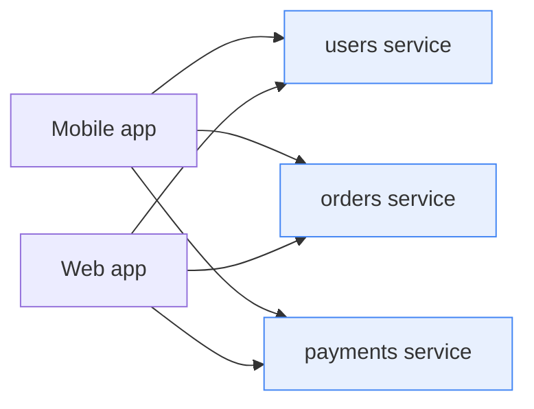
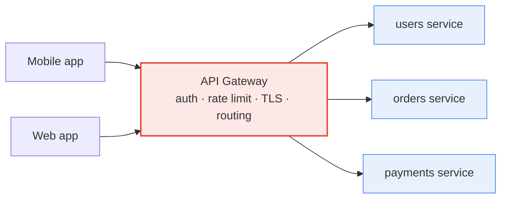

# API Gateway — Junior

<!-- level-focus -->
At junior level, focus on this question:

> How can I apply **API Gateway** in one small example and prove the result?

Use the smallest realistic scenario that exposes the decision and its failure behavior.
## 1. The problem: clients calling services directly

Imagine an app backed by many small services: `users`, `orders`, `payments`, `catalog`, `notifications`. If the mobile app or browser talks to each service directly, several problems appear at once:

- **The client must know every service's address.** Add a service, rename one, or move it to a new host, and every client has to be updated and re-released.
- **Every service re-implements the same boring work.** Each one needs to check authentication tokens, enforce rate limits, terminate TLS, log requests, and add CORS headers. That's the same code copied into five, ten, fifty services — and it drifts out of sync.
- **The client is tightly coupled to your internal layout.** If your architecture is exposed to the outside world, you can't reshape it without breaking clients.
- **A screen that needs three services makes three round trips** from a phone on a slow network.

These shared responsibilities — auth, rate limiting, TLS, logging, routing — are called **cross-cutting concerns**: they apply to *every* request regardless of which service handles it. Copying them into every service is wasteful and error-prone.

## 2. What an API gateway is

An API gateway is a server that acts as the **single front door** for all client traffic. Clients only ever know one address — the gateway's. The gateway looks at each incoming request and forwards it to the correct backend service, applying the cross-cutting concerns once, in one place.

Think of it like the front desk of a large office building. Visitors don't wander the hallways looking for the person they need. They check in at reception, show ID, and reception directs them to the right floor. The gateway is that reception desk for your services.

The key idea: **the gateway centralizes the concerns that every request shares**, so individual services can focus only on their own business logic.

## 3. The core jobs

A gateway does four fundamental jobs at the junior level.

**Routing.** The gateway maps a request path to a backend service. A request to `/orders/123` goes to the `orders` service; `/users/me` goes to the `users` service. The client never learns those services' real network addresses — it only knows the public paths.

**Authentication.** The gateway verifies *who* is making the request before it reaches any service — typically by validating an API key, a session token, or a JWT. Invalid requests are rejected at the door, so backend services can trust that traffic reaching them is already authenticated.

**Rate limiting.** The gateway caps how many requests a client may send in a time window (for example, 100 requests per minute per API key). This protects backends from being overwhelmed, whether by a buggy client, a traffic spike, or abuse.

**TLS termination.** Clients connect to the gateway over HTTPS (encrypted). The gateway decrypts the traffic — this is called *terminating TLS* — and forwards it to backends over the internal network. Certificates live in one place instead of on every service.

Gateways often do more (request aggregation, response caching, header rewriting), but these four are the foundation.

## 4. Before vs after: a staged view

**Stage 1 — Before: clients call each service directly.** Every client knows every address, and each service repeats auth, TLS, and rate limiting.

**Stage 2 — After: one gateway in front.** Clients know only the gateway. Auth, TLS, and rate limiting happen once, then requests are routed inward.

The number of arrows a client must manage drops from *many* to *one*, and the cross-cutting logic collapses into a single box.

## 5. Direct-to-service vs via-gateway

| Concern | Direct to service | Via API gateway |
|---|---|---|
| Client knows addresses | Every service's address | Only the gateway's |
| Authentication | Re-implemented in each service | Enforced once at the gateway |
| Rate limiting | Per-service, inconsistent | Centralized, uniform policy |
| TLS / certificates | Managed on every service | Terminated once at the gateway |
| Coupling to internals | Client tied to service layout | Internal layout hidden behind paths |
| Changing a service address | Update and redeploy all clients | Update gateway route only |
| Logging & monitoring | Scattered across services | One consistent place to observe traffic |

## 6. When you do and don't need one

A gateway is not free — it's one more component to run, and every request passes through it, so it must be reliable and fast.

**You benefit from a gateway when:** you have several backend services, multiple kinds of clients (mobile, web, third parties), and you want auth, rate limiting, and TLS handled consistently in one place.

**You may not need one yet when:** you have a single small service or a simple app. A plain reverse proxy or the service itself can handle basic routing and TLS. Introduce a gateway when the number of services and cross-cutting concerns starts to hurt — not before.

## 7. Common gateways you'll hear about

You rarely build a gateway from scratch. Widely used options include:

- **Kong** — an open-source gateway built on NGINX, extended with plugins (see [konghq.com](https://konghq.com)).
- **Envoy** — a high-performance proxy often used as a gateway and inside service meshes.
- **AWS API Gateway** — a managed gateway service on AWS (see [aws.amazon.com/api-gateway](https://aws.amazon.com/api-gateway)).
- **NGINX** — a web server and reverse proxy commonly configured to act as a gateway (see [nginx.org](https://nginx.org)).

At this stage, just recognize the names and know they all solve the same problem: one front door doing routing, auth, rate limiting, and TLS.

## 8. Key takeaways

- An API gateway is the **single entry point** in front of your backend services.
- It exists so **clients don't call dozens of services directly** and so **cross-cutting concerns are centralized**.
- Its four core jobs are **routing, authentication, rate limiting, and TLS termination**.
- Compared to direct calls, a gateway **hides internal layout, reduces duplication, and gives one place** to enforce policy and observe traffic.
- It adds a component to operate, so reach for one when you have **multiple services and shared concerns** — not for a single tiny app.

*Next step:* [API Gateway — Middle](middle.md)

---

## Apply it

1. Choose one small, known input for **API Gateway**.
2. Predict the output or observable behavior.
3. Run the smallest example or probe that exercises the concept.
4. Change one input to trigger a failure or boundary case.
5. Explain the evidence using the guide's vocabulary.

## Verify your work

- Record the exact input, command or code path, and output.
- Repeat the probe and confirm the result is consistent.
- Show one expected success and one expected failure.
- Resolve any difference between the prediction and the evidence.

## Review questions

- What problem does API Gateway solve in the example?
- Which input changes the observed result, and why?
- What is the smallest useful success check?
- Which beginner mistake would your evidence catch?
