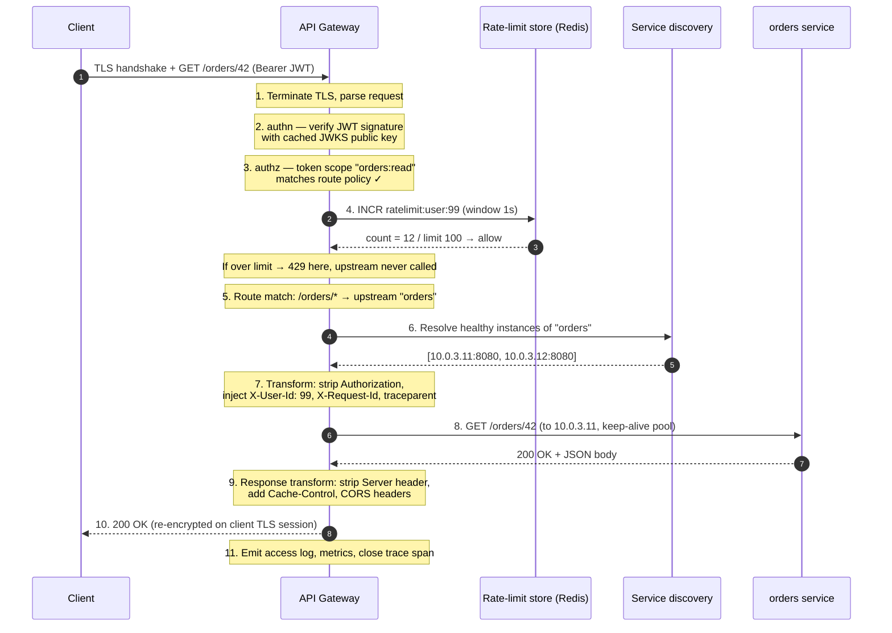

# API Gateway — Middle

<!-- level-focus -->
At middle level, focus on this question:

> Where does **API Gateway** belong in a maintainable component, and which trade-off selects the design?

Use the smallest realistic scenario that exposes the decision and its failure behavior.
## 1. The request lifecycle in order

A gateway is a deterministic pipeline. The *order* of stages is not cosmetic — it is a security and cost decision. Cheap, defensive checks run before expensive ones so that hostile or malformed traffic is dropped before it consumes CPU, a backend connection, or a downstream call.

The canonical inbound order:

1. **TLS termination** — decrypt the connection so the gateway can read headers and body. The client's TLS session ends here; a new (often mTLS) hop starts toward the upstream.
2. **Request parsing & normalization** — parse the HTTP request line, headers, and (lazily) body. Reject malformed framing, oversized headers, or bad host.
3. **Authentication (authn)** — *who are you?* Validate the JWT signature, the API key, or the mTLS client cert. Reject unauthenticated traffic.
4. **Authorization (authz)** — *are you allowed here?* Check scopes/claims/roles against the matched route's policy.
5. **Rate limiting / quota** — is this identity within its budget? Reject with `429` if over.
6. **Route matching** — resolve the request (host + path + method + headers) to a route and its upstream service.
7. **Request transformation** — rewrite path, inject/strip headers (e.g. add `X-Request-Id`, `X-Forwarded-For`, propagate trace context), remap body if configured.
8. **Upstream dispatch** — pick a healthy instance (load balancing over the discovered pool), open/reuse a connection, forward the request.
9. **Response transformation** — rewrite status/headers/body on the way back, strip internal headers, add CORS or cache headers.
10. **Response emission** — re-encrypt on the client TLS session and stream bytes back; emit access logs, metrics, and the completed trace span.

> Why authn before rate limiting? Because you usually want *per-identity* quotas. But a coarse **per-IP** connection/rate limit often runs even *earlier* (before parsing) to blunt volumetric floods that never present a valid identity. Real gateways run limits at more than one layer.

---

## 2. The filter / plugin pipeline model

Every production gateway implements the lifecycle above as an **ordered chain of interceptors** around a routing core. The names differ; the shape is identical.

| Gateway | Extension unit | Where logic runs | Phase model |
|---|---|---|---|
| Kong | **Plugin** (Lua/Go/WASM) | Per route, service, consumer, or global | `access`, `header_filter`, `body_filter`, `log` phases |
| Envoy | **HTTP filter** | Per listener filter chain | Ordered `decodeHeaders`/`decodeData` (inbound), `encodeHeaders`/`encodeData` (outbound) |
| AWS API Gateway | **Integration + authorizer + usage plan** | Managed stages | Method request → authorizer → integration request → integration → integration response → method response |
| NGINX | **Directive / module / `njs`** | Per `location` | Request phases: `rewrite`, `access`, `content`, `log` |

Two properties make this model powerful:

- **Composability.** Each filter is a small, single-purpose unit (validate JWT, add header, count a request). You attach them declaratively to a route; the gateway executes them in order. Adding auth to a new route is a config change, not code.
- **Bidirectionality.** A filter sees the request on the way *in* and can also act on the response on the way *out*. Envoy makes this explicit with separate decode (downstream→upstream) and encode (upstream→downstream) methods; Kong splits `access` (inbound) from `header_filter`/`body_filter` (outbound).

A filter can **short-circuit**: an auth filter that rejects a request returns `401` immediately and no later filter or the upstream ever runs. This is exactly why order matters — a short-circuit early in the chain saves all downstream work.

---

## 3. Trace one request end-to-end

Follow `GET /orders/42` from an authenticated mobile client through an edge gateway to an `orders` service, with a per-user rate limit and a header transform.



Key observations from the trace:

- The **JWT is stripped** before hitting the upstream and replaced with a trusted internal header (`X-User-Id`). Backends never re-validate the token; they trust the gateway. (Internal mTLS keeps that trust boundary honest.)
- The **rate-limit check (step 4)** happens before route dispatch, so an over-budget caller costs one Redis `INCR`, not a backend request.
- **Trace context** (`traceparent`) is injected so the upstream span links to the gateway span — the gateway is usually the root of the distributed trace.

---

## 4. Auth offload: JWT and API keys

"Auth offload" means the gateway performs authentication *once*, at the edge, so every downstream service is freed from re-implementing it. Two common mechanisms:

**JWT validation (stateless).** The client presents a signed token. The gateway:

1. Parses the token and reads the `alg` and `kid` (key id) from the header.
2. Fetches the issuer's **public key** from a JWKS endpoint — *cached*, refreshed periodically, so validation needs no network call per request.
3. Verifies the signature, then checks `exp` (expiry), `iss` (issuer), and `aud` (audience) claims.
4. Extracts scopes/roles from claims for the authz step.

Because verification is a local signature check against a cached key, JWT auth adds sub-millisecond cost and no per-request dependency. The trade-off: revoking a token before it expires requires a denylist (extra state) — covered in the senior tier.

**API keys (opaque, stateful).** The client sends a key (header or query param). The gateway looks it up in a store (in-memory cache backed by a database) to resolve the consumer, their plan, and their quota. Simpler for machine-to-machine traffic, but every validation is a lookup, so the store must be fast and cached.

Pin `alg` to an allow-list and reject `alg: none`. Accepting the token's self-declared algorithm is a classic JWT bypass — an attacker sets `alg: none` or swaps RS256 for HS256 to sign with the public key.

---

## 5. Rate limiting inside the gateway

The gateway is the natural rate-limit point because it sees every request and the identity behind it. The workhorse algorithm is the **token bucket**:

- A bucket holds up to `B` tokens (the burst capacity).
- Tokens refill at rate `r` per second (the sustained rate).
- Each request removes one token. If the bucket is empty, the request is rejected (`429 Too Many Requests`), typically with a `Retry-After` header.

Token bucket allows short bursts (up to `B`) while enforcing an average rate `r` — which matches real traffic better than a rigid fixed window. Contrast the common in-gateway algorithms:

| Algorithm | Bursts | Boundary behavior | Cost |
|---|---|---|---|
| Fixed window | Allowed at edges | Doubles allowance at window boundary | Cheapest (one counter) |
| Sliding window | Smoothed | No boundary spike | Moderate |
| Token bucket | Up to bucket size | Smooth after burst | Cheap, common default |
| Leaky bucket | None (constant drain) | Fully smoothed output | Moderate |

**Local vs distributed.** A single gateway node can keep counters in memory. But with N gateway replicas behind a load balancer, per-node counters let a client get `N × limit`. The fix is a shared store — usually Redis — where each request does an atomic `INCR` (fixed window) or a small Lua script (token bucket) so all replicas share one counter. This trades a network round-trip for correctness; the senior tier discusses the latency/accuracy trade-off and approximate local limiting.

---

## 6. Route matching and upstream selection

Routing resolves an incoming request to *one* upstream. Match predicates, in typical precedence:

- **Host** — `api.example.com` vs `admin.example.com`.
- **Path** — exact (`/health`) beats prefix (`/orders/*`). Most specific match wins.
- **Method** — `GET /orders/42` and `DELETE /orders/42` can route to different backends.
- **Headers / query** — version pinning (`Accept: application/vnd.v2+json`), canary headers, tenant selectors.

Once a route resolves to a **service** (a logical name like `orders`), the gateway must pick a concrete instance from that service's healthy pool. This is where routing meets load balancing: round-robin, least-connections, or consistent-hash over the instances returned by discovery (next section). Unhealthy instances — those failing active health checks or tripping the circuit breaker — are excluded from selection.

---

## 7. Request / response aggregation

Aggregation (a.k.a. composition or the *scatter-gather* pattern) lets the gateway serve one client request from *several* upstream calls, so a mobile client makes one round trip instead of five.

```mermaid
sequenceDiagram
    autonumber
    participant C as Client
    participant G as API Gateway
    participant P as profile svc
    participant O as orders svc
    participant N as notifications svc

    C->>G: GET /dashboard
    Note over G: Fan out in parallel
    par
        G->>P: GET /profile/99
    and
        G->>O: GET /orders?user=99
    and
        G->>N: GET /notifications/99
    end
    P-->>G: profile JSON
    O-->>G: orders JSON
    N-->>G: notifications JSON
    Note over G: Merge into one payload;<br/>apply per-call timeout &<br/>partial-failure fallback
    G-->>C: 200 { profile, orders, notifications }
```

Design rules that make aggregation safe:

- **Fan out in parallel**, not sequentially — total latency is the *slowest* call, not the sum.
- **Per-call timeouts and fallbacks.** If `notifications` is slow, return the rest and omit that field (or use a cached/empty default) rather than failing the whole page.
- **Keep it thin.** Heavy business logic in the gateway turns it into a bottleneck and a deployment coupling point. For complex composition, prefer a dedicated **Backend-for-Frontend (BFF)** service (senior tier) over stuffing logic into gateway plugins.

---

## 8. Service discovery integration

Backends are ephemeral: autoscaling, deploys, and failures constantly change which instances exist and where. The gateway must route to *currently healthy* instances without hardcoded IPs. Two integration styles:

- **DNS-based.** The gateway resolves a service name (e.g. a Kubernetes headless service) to a set of IPs and re-resolves on a TTL. Simple, but DNS caching can lag behind reality.
- **Registry-based.** The gateway subscribes to a registry (Consul, etcd, Kubernetes Endpoints API, or Envoy's **EDS** control plane) and receives push updates as instances come and go. Faster convergence, richer metadata (health, zone, weights).

The discovery layer feeds the load balancer a live, health-filtered pool. When an instance is removed from the registry — or fails the gateway's own active health check — it drops out of the selectable set immediately, and in-flight retries can shift to a healthy peer.

---

## 9. Edge vs internal gateways

Not every gateway sits at the internet edge. Large systems run gateways at more than one tier, and their responsibilities differ.

| Concern | Edge gateway (north-south) | Internal gateway / mesh (east-west) |
|---|---|---|
| Faces | Public internet | Other services inside the trust boundary |
| TLS | Terminates public TLS from clients | mTLS between services |
| Primary auth | End-user authn (JWT, API key, OAuth) | Service identity (SPIFFE/mTLS certs) |
| Rate limiting | Per-user / per-API-key quotas, DDoS defense | Per-caller-service fairness, backpressure |
| Main job | Security perimeter, external contract | Routing, resilience (retries, circuit breaking), telemetry |
| Typical tech | Kong, AWS API Gateway, NGINX at edge | Envoy sidecars (service mesh) |

The mechanics — pipeline of filters, route matching, discovery-driven load balancing — are the same at both tiers. What changes is *who* is on the other side and therefore *which* filters you attach.

---

## 10. Takeaways

- A gateway is a **deterministic, ordered pipeline**; the sequence (TLS → authn → authz → rate limit → route → transform → dispatch → response transform) is chosen so cheap, defensive checks reject bad traffic before expensive work happens.
- Every gateway implements this as a **composable, bidirectional filter/plugin chain**; filters short-circuit to save downstream work.
- **Auth offload** (cached-JWKS JWT validation or fast API-key lookup) authenticates once at the edge so backends trust an injected internal identity header.
- **Token-bucket rate limiting** allows bursts while capping average rate; correctness across replicas needs a **shared store** (Redis) rather than per-node counters.
- **Aggregation** collapses many upstream calls into one client response — fan out in parallel, timeout each call, degrade gracefully.
- **Service discovery** keeps the load-balancing pool live and health-filtered so routing never targets a dead instance.

*Next step:* [API Gateway — Senior](senior.md)

---

## Apply it

1. Find a real component where **API Gateway** affects an interface or dependency.
2. Write two plausible choices and the constraint that favors each one.
3. Make the smallest reversible change at that boundary.
4. Exercise the component alone, then exercise the integrated flow.
5. Keep the decision note with the evidence that selected the option.

## Verify your work

- A focused check proves the local behavior.
- An integrated check proves callers and dependencies still agree.
- Logs, traces, compiler output, or benchmarks expose the boundary.
- Reverting the change restores the previous behavior without unrelated edits.

## Review questions

- Which boundary is most affected by API Gateway?
- What constraint would make you choose the alternative design?
- How would you isolate a local defect from an integration defect?
- What evidence shows that the change remains maintainable?
