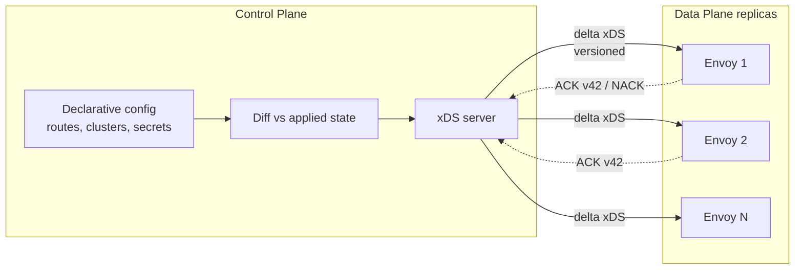
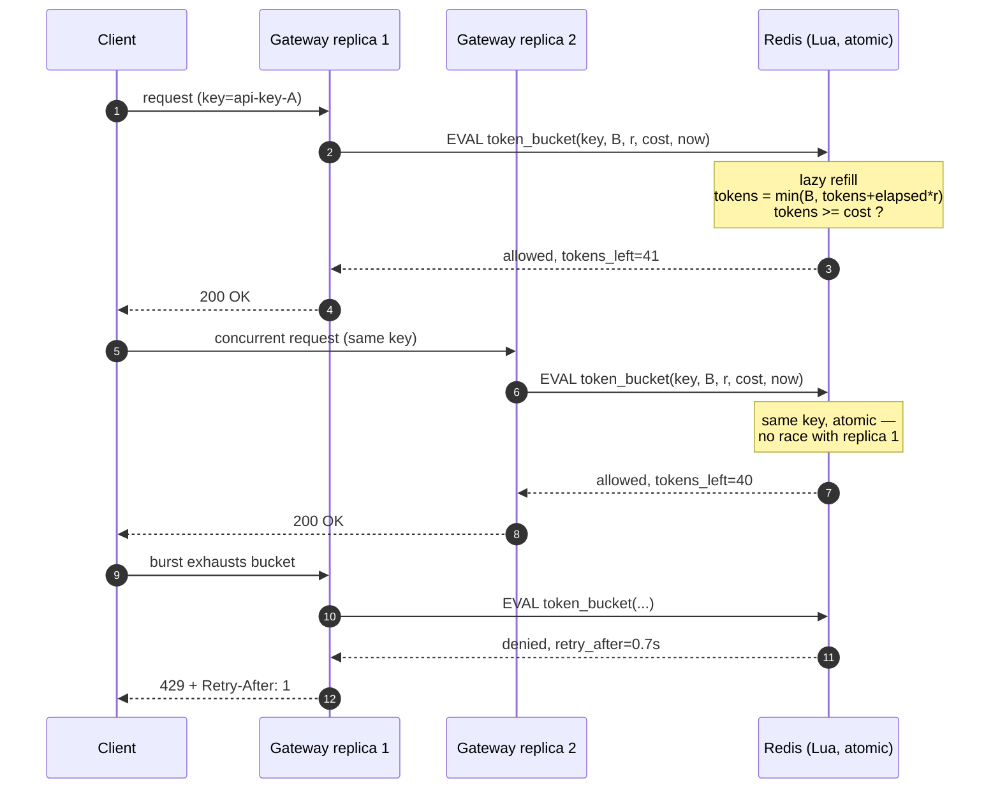

# API Gateway — Professional

<!-- level-focus -->
At professional level, focus on this question:

> How should teams adopt and operate **API Gateway** with measurable outcomes and limited coordination?

Use the smallest realistic scenario that exposes the decision and its failure behavior.
---

## 1. Data plane vs control plane

A production gateway is two systems glued together.

- **Data plane** — the process(es) that actually terminate connections and forward bytes. This is the hot path: it must be fast, stateless where possible, and never block on a slow control operation. Envoy, NGINX workers, and Kong's proxy are data planes.
- **Control plane** — the component that decides *configuration*: which routes exist, which upstreams are healthy, what the rate limits are, which certificates to serve. It computes config and pushes it to the data plane. Istiod, Kong's control node, and AWS API Gateway's management API are control planes.

The separation matters because **config changes must not drop in-flight traffic**. Two disciplines make that possible:

- **Declarative config** — you describe the desired end state (routes, upstreams, plugins), not imperative mutations. The control plane diffs current vs desired and applies the delta. Kong's `deck` and Envoy's bootstrap both work this way.
- **Hot reload** — the data plane swaps to new config without dropping established connections. NGINX forks new workers on the new config and drains old ones; Envoy applies deltas in place without a restart.

Envoy's control-plane protocol is **xDS** — a family of gRPC/REST discovery services (LDS listeners, RDS routes, CDS clusters, EDS endpoints, SDS secrets). The data plane subscribes; the control plane streams updates. Two delivery modes exist:

- **State-of-the-World (SotW)** — every update sends the full resource set. Simple, but expensive at scale.
- **Delta/incremental xDS** — only changed resources are sent, with explicit add/remove. Essential when you have thousands of clusters and endpoints churning. See the xDS protocol reference at [www.envoyproxy.io](https://www.envoyproxy.io/docs/envoy/latest/api-docs/xds_protocol).

The load-bearing property is **eventual consistency with per-resource versioning**: the data plane ACKs the version it applied and NACKs config it can't accept (bad config is rejected, not applied half-way), so a broken push degrades to "stale but working" rather than "broken and serving errors".



---

## 2. Distributed rate limiting: where the counter lives

A single gateway replica can count requests in local memory trivially. The problem is that at scale you run **N replicas behind a load balancer**, and a "1000 req/s per API key" limit must hold across all of them — not 1000 per replica.

Two architectures, and the trade is always **accuracy vs latency/availability**:

**Local counters (per-replica).** Each replica enforces `limit / N` locally. No network hop, sub-microsecond decision, no shared dependency to fail.
- *Cheap and fast*, but wrong when traffic is skewed: if a client's connections hash to one replica, it gets `limit/N` instead of `limit`. Rebalancing (autoscaling changing N) silently changes each replica's share.

**Global counters (shared store).** All replicas increment a counter in a shared datastore (Redis, or a dedicated rate-limit service like Envoy's `ratelimit` service backed by Redis/Memcached — see [www.envoyproxy.io](https://www.envoyproxy.io/docs/envoy/latest/intro/arch_overview/other_features/global_rate_limiting)).
- *Accurate*, but every request pays a network round-trip on the hot path, and the store is now a shared dependency: if Redis is slow, your gateway is slow; if it's down, you must **fail open** (allow) or **fail closed** (reject) — a policy decision.

**Hybrid (local token bucket + async global reconciliation).** Each replica keeps a local bucket and periodically syncs its consumption with the global store. This is how most high-throughput systems square the circle: the hot path stays local (fast), and a background loop trades a small, bounded over-admission for the ability to survive store latency and outages. The tunable is **sync interval**: shorter = more accurate, more store load; longer = cheaper, more over-admission during a burst.

| Property | Local counters | Global counters | Hybrid (local + async sync) |
|---|---|---|---|
| Hot-path latency | ~0 (in-memory) | +1 RTT to store | ~0 (in-memory) |
| Accuracy across replicas | Poor (skew, N drift) | Exact | Bounded over-admission |
| Shared-dependency risk | None | Store is on hot path | Store off hot path |
| Behaviour if store down | N/A | Must fail open/closed | Degrades to local limits |
| Best for | Coarse per-replica caps | Strict billing/quota limits | High QPS, tolerant of slight overshoot |

---

## 3. Rate-limit algorithms compared

The *counting* algorithm is orthogonal to *where the counter lives*. Four dominate:

- **Fixed window** — count requests in the current wall-clock window (e.g. per minute); reset at the boundary. One integer per key. Its flaw is the **boundary burst**: a client can send `limit` requests at 00:59.9 and another `limit` at 01:00.1, i.e. `2×limit` in a 200 ms span.
- **Sliding window log** — store the timestamp of every request; on each request, drop timestamps older than the window and count what remains. Exact, no boundary artifact, but memory is O(requests in window) per key — expensive under load.
- **Sliding window counter** — approximate the sliding window using the current and previous fixed-window counts, weighted by how far into the current window you are. Two integers per key, no boundary burst, small bounded error. The pragmatic default.
- **Token bucket** — a bucket of capacity `B` refills at rate `r` tokens/sec; each request costs a token. Naturally supports **bursts up to B** while enforcing a steady-state rate `r`. State is two numbers (token count, last-refill timestamp).

| Algorithm | State per key | Burst behaviour | Accuracy | Cost |
|---|---|---|---|---|
| Fixed window | 1 counter | Allows 2× at boundary | Coarse | Cheapest |
| Sliding window log | O(N) timestamps | None | Exact | Expensive (memory) |
| Sliding window counter | 2 counters | None | ~Exact (bounded error) | Cheap |
| Token bucket | count + timestamp | Burst up to bucket size | Rate-exact over time | Cheap |

Token bucket and sliding-window-counter are the two you reach for in practice: token bucket when you want to *permit* controlled bursts (API quotas), sliding-window-counter when you want a *smooth* rate with no boundary abuse (abuse prevention).

---

## 4. Redis-backed token bucket (staged)

The canonical distributed implementation puts the bucket state in Redis and mutates it with a **Lua script**, which Redis executes atomically. Atomicity is the whole point: read-modify-write across the network would race between replicas; a Lua script collapses "read tokens, compute refill, decrement, write" into one indivisible operation, so two replicas hitting the same key can't both spend the last token.

The script computes lazy refill: `tokens = min(B, tokens + (now - last_refill) * r)`, then, if `tokens >= cost`, decrements and returns *allowed*, else returns *denied* with a retry-after.



Operational notes that separate a toy from production:

- **Set a TTL on the key** equal to the refill-to-full time, so idle keys evict themselves and Redis memory doesn't grow with your key cardinality (per-user keys can be millions).
- **Return `Retry-After` / `RateLimit-*` headers** so well-behaved clients back off instead of hammering.
- **Decide the Redis-down policy explicitly.** Fail-open protects availability but removes the limit (dangerous for abuse/DoS limits); fail-closed protects the backend but turns a cache blip into a total outage. Many gateways fail open for quota limits and fail closed for security limits.
- **Shard hot keys.** A single celebrity key serialised through one Redis slot becomes a hot spot; splitting into `key:{shard}` and summing is a known escape hatch.

Kong's `rate-limiting` and `rate-limiting-advanced` plugins implement exactly this pattern (local, cluster, or Redis policy); see [docs.konghq.com](https://docs.konghq.com/hub/kong-inc/rate-limiting/).

---

## 5. Connection handling: keep-alive, pooling, HTTP/2

The gateway sits between two connection lifecycles — client-side and upstream-side — and manages them independently.

**Keep-alive pooling (upstream).** Opening a TCP connection plus a TLS handshake to an upstream costs one to two round trips *per request* if you don't reuse connections. The gateway maintains a **pool of persistent keep-alive connections** to each upstream and hands requests to idle ones. The knobs:

- **Pool size / max connections per upstream host** — too small and requests queue for a free connection under load; too large and you exhaust upstream file descriptors. Size it to `peak concurrency = QPS × mean upstream latency` (Little's Law).
- **Idle timeout** — must be *shorter* than the upstream's own idle timeout, or the upstream closes a connection the gateway still thinks is usable, producing sporadic reset errors on the next request.
- **Max requests per connection** — recycle connections periodically to avoid pinning to a stale endpoint after upstream scaling.

**HTTP/2 multiplexing.** A single HTTP/2 connection carries many concurrent **streams**, so the gateway can serve hundreds of concurrent client requests over one connection — no per-request handshake, no pool exhaustion from connection count. The trade: HTTP/2 multiplexing suffers **TCP head-of-line blocking** (a lost TCP segment stalls all streams on that connection), which is exactly what HTTP/3 over QUIC removes.

**h2c to upstream.** When the upstream is inside a trusted network (a service mesh, a Kubernetes cluster), you can speak **HTTP/2 cleartext (h2c)** upstream — HTTP/2 without TLS — to keep multiplexing benefits while skipping the encryption cost you don't need behind the mesh boundary. Envoy configures this per-cluster via the HTTP/2 protocol options; it's the standard pattern for gateway-to-mesh hops where mTLS is handled by the sidecar rather than the transport.

**Downstream vs upstream protocol translation.** A gateway commonly terminates HTTP/2 (or HTTP/3) from clients and speaks HTTP/1.1 keep-alive to legacy upstreams — decoupling the fast, multiplexed edge from what the backend can actually parse.

---

## 6. Auth on the hot path: JWT/JWKS, mTLS, introspection

Authentication runs on *every* request, so its cost and failure behaviour dominate gateway design.

**JWT validation with JWKS caching.** A JWT is verified by checking its signature against the issuer's public key. The issuer publishes keys at a **JWKS endpoint** (a set of keys, each with a `kid`). The naive implementation fetches JWKS per request — a network hop to the identity provider on every call, which is both slow and a hard dependency. The correct implementation:

1. **Cache the JWKS** in the gateway keyed by `kid`, with a TTL.
2. On a token whose `kid` is **not** in cache (a sign the issuer rotated keys), **refetch JWKS once**, then validate. This handles **rotation** gracefully: issuers publish the new key before signing with it, so the old key stays cached and valid during overlap while the new key is fetched lazily on first sighting.
3. **Never fetch on the hot path per request**; only on cache miss / TTL expiry, and rate-limit the refetch so a flood of bad `kid`s can't DoS your JWKS endpoint.

```mermaid
sequenceDiagram
  autonumber
  participant C as Client
  participant G as Gateway
  participant J as JWKS endpoint (IdP)
  C->>G: request + Bearer JWT (kid=K2)
  alt kid in cache
    Note over G: verify signature with cached key — no network hop
    G-->>C: proceed
  else kid missing (rotation)
    G->>J: GET /.well-known/jwks.json
    J-->>G: keys [K1, K2]
    Note over G: cache K1,K2 (TTL); verify with K2
    G-->>C: proceed
  end
  Note over G,J: refetch is rate-limited so bad kids can't DoS the IdP
```

**mTLS.** For service-to-service traffic the gateway can require a **client certificate** and validate it against a trusted CA — mutual TLS. This authenticates the *caller's identity* at the transport layer (no bearer token to steal or replay) and is the standard for zero-trust internal meshes. The gateway typically terminates client mTLS at the edge and may re-originate mTLS to upstreams.

**OAuth2 token introspection.** Opaque (non-JWT) tokens carry no verifiable payload — the gateway must ask the authorization server "is this token valid, and what are its scopes?" via the **introspection endpoint** (RFC 7662, [www.rfc-editor.org](https://www.rfc-editor.org/rfc/rfc7662)). That's a network hop per token, so gateways **cache introspection results** keyed by token hash for a short TTL — trading a small window of "revoked but still cached" against removing the AS from the hot path.

| Mechanism | Verifiable offline? | Hot-path cost | Revocation | Use when |
|---|---|---|---|---|
| JWT + cached JWKS | Yes (signature) | ~0 after cache warm | Weak (wait for expiry) | Stateless, high QPS |
| mTLS | Yes (cert chain) | TLS handshake (pooled) | Cert revocation / short-lived certs | Service-to-service, zero-trust |
| OAuth2 introspection | No (opaque) | +1 RTT, cacheable | Immediate (if uncached) | Opaque tokens, strict revocation |

The core tension: **JWTs are fast and offline-verifiable but hard to revoke** (they're valid until expiry); **introspection revokes instantly but costs a round trip**. Short JWT lifetimes plus refresh tokens is the usual compromise.

---

## 7. Response caching and cache keys

A gateway can cache upstream responses and serve them directly, absorbing read load before it reaches the backend. Correctness lives entirely in the **cache key** — it must encode every input that changes the response, or you leak one user's data to another.

- **Base key** = method + host + path + query string. Never cache non-idempotent methods (`POST`/`PATCH`/`DELETE`).
- **Vary on the right headers.** Honour the `Vary` response header — if the upstream varies on `Accept-Encoding` or `Accept-Language`, the key must include those request headers, or gzip content gets served to a client that asked for identity.
- **Never key personalised responses by URL alone.** A response that depends on the `Authorization` header must either not be cached or be keyed *including* an identity component — otherwise the first user's response is served to the next. This is the classic cache-poisoning-by-omission bug.
- **TTL from `Cache-Control`.** Respect `max-age`, `no-store`, `private` from the upstream; `private` means "do not store in a shared cache" and a gateway is a shared cache.
- **Stale-while-revalidate.** Serve a slightly stale response instantly while refreshing in the background — smooths latency and shields the upstream from a thundering herd when a popular key expires.

---

## 8. Circuit breaking, retries, hedging

The gateway is the natural place to enforce resilience because it sees all traffic to an upstream and can act globally.

**Circuit breaking.** Envoy's model is threshold-based: cap **max connections, max pending requests, max concurrent requests, and max active retries** per upstream cluster. When a limit trips, new requests **fast-fail** (503) instead of piling onto an already-saturated backend. This is a *bulkhead*, not just a switch: it stops one slow upstream from consuming all the gateway's connection budget and cascading into unrelated routes. See [www.envoyproxy.io](https://www.envoyproxy.io/docs/envoy/latest/intro/arch_overview/upstream/circuit_breaking).

**Retries — and their danger.** A retry on a transient failure is cheap insurance, but naive retries **amplify load exactly when the system is struggling** (a retry storm). Disciplines that make retries safe:

- **Only retry idempotent requests** (GET, or requests carrying an idempotency key). Retrying a non-idempotent `POST` can double-charge a card.
- **Exponential backoff with jitter** so retries from many clients don't synchronise into a thundering herd.
- **Bound the retry budget** — Envoy caps concurrent retries as a fraction of active requests, so retries can never exceed, say, 20% of live traffic. Without a budget, retries are the outage.

**Hedging.** For latency-sensitive reads, send a second (hedged) request to another upstream if the first hasn't responded by the **p95 latency**, and take whichever returns first. This trims tail latency at the cost of extra load — so it's gated (hedge only a small fraction, only for idempotent requests, and cancel the loser). Envoy supports **per-try timeouts** and hedging on those timeouts, which is the mechanism that makes this bounded rather than a load multiplier.

---

## 9. Failure modes and defaults

- **Rate-limit store outage** → decide fail-open (availability) vs fail-closed (protection) *per limit type*, and test it. Untested, this default surfaces during the exact incident you can't afford it.
- **JWKS/introspection endpoint down** → serve from cache past TTL for a grace period rather than rejecting all traffic; a stale-but-valid key beats a total auth outage.
- **Upstream idle-timeout mismatch** → intermittent connection resets; always set the gateway's upstream idle timeout below the upstream's.
- **Unbounded retries** → retry storm turns a blip into a meltdown; a retry budget is not optional.
- **Cache key omits an identity/`Vary` input** → data leak across users; the most dangerous bug in this list because it fails silently and correctly-looking.
- **Config push with no NACK** → a bad control-plane push blanks the data plane; require versioned, rejectable config so bad config degrades to stale, not broken.

---

## Apply it

1. Define the user or business outcome that **API Gateway** should improve.
2. Assign one owner for code, contracts, operations, and incidents.
3. Split delivery into reversible increments that produce evidence early.
4. Publish responsibilities, escalation paths, and compatibility windows.
5. Stop or expand only when the agreed measures support that decision.

## Verify your work

- Each increment has an owner, rollback path, and observable exit condition.
- Adoption, reliability, delivery time, and coordination cost are measured.
- Incident and migration exercises prove that responsibility is executable.
- The old path is removed only after telemetry proves it is unused.

## Review questions

- Which measurable outcome justifies investing in API Gateway?
- Which team owns the full lifecycle and incident response?
- What reversible increment produces the earliest useful evidence?
- Which exit condition proves that migration or adoption is complete?
