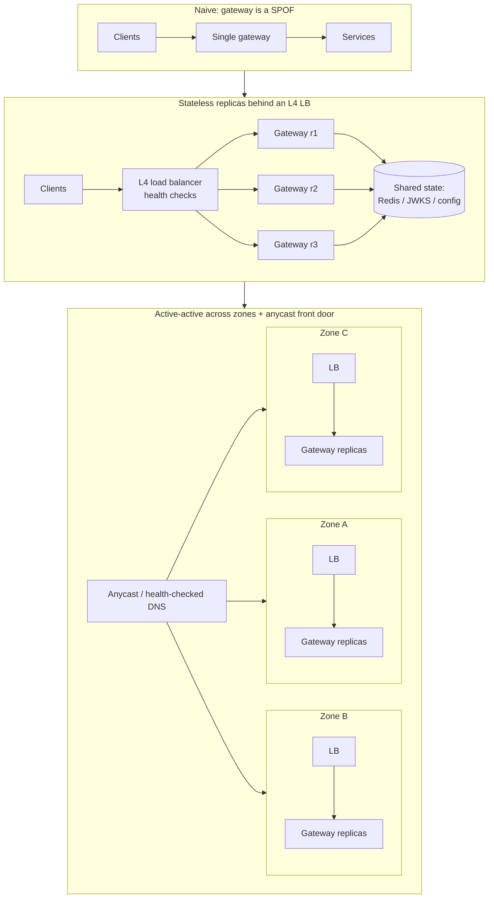
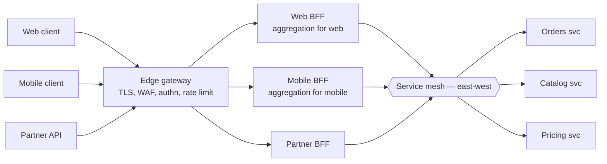
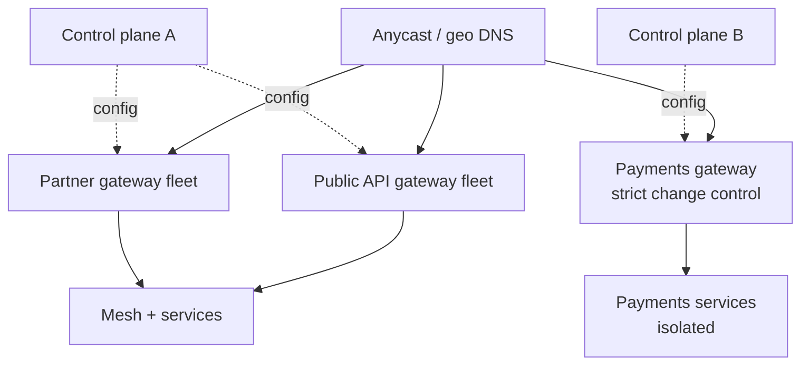

# API Gateway — Senior

<!-- level-focus -->
At senior level, focus on this question:

> Which system invariant is affected by **API Gateway** under failure, load, and change?

Use the smallest realistic scenario that exposes the decision and its failure behavior.
## 1. The gateway as SPOF, and how to remove the "single"

Every external request transits the gateway, so a naive single-instance deployment makes the gateway a textbook SPOF: when it dies, 100% of traffic dies with it. The discipline of scaling a gateway is the discipline of keeping it *stateless* so that any replica can serve any request, and then running enough replicas across enough failure domains that no single failure takes down the fleet.

**Statelessness is the enabler.** A gateway that stores per-request state in local memory (session affinity, in-process rate-limit counters, cached auth decisions) cannot be freely load-balanced or restarted. Push that state outward:

- Rate-limit counters → a shared store (Redis) or a coordinated token-bucket protocol, not per-instance memory.
- Auth/session → stateless tokens (validate a JWT signature against a cached JWKS) so no instance needs to "own" a session.
- Config/routes → distributed from a control plane, so every data-plane replica is interchangeable.

Once the data plane is stateless, HA becomes a capacity-and-placement problem:

- **Stateless replicas behind an L4 load balancer.** The gateway itself is fronted by something dumber and more reliable — a cloud L4 LB or anycast — that spreads traffic across N replicas and health-checks them out on failure.
- **Active-active across zones (and ideally regions).** Run replicas in ≥3 availability zones so the loss of a zone removes ~1/3 of capacity, not the service. Provision for N+1 (or N+2) so a zone loss doesn't tip the survivors into overload. Active-active also means no failover delay — traffic is already flowing everywhere.
- **DNS / anycast for the layer above the LB.** The LB is now the outermost SPOF candidate; use a managed, multi-AZ LB and health-checked DNS failover (or anycast) so even the front door has no single instance.

**Don't forget the control plane.** In Kong (with a database), Envoy (xDS), or Apigee, the *data plane* forwarding requests and the *control plane* distributing config are separable. A well-designed gateway keeps serving traffic on last-known-good config even when the control plane is down — the control plane is not on the request path. Verify this property explicitly: a control-plane outage should degrade *config changes*, never *live traffic*.

---

## 2. Gateway vs service mesh vs load balancer

These three are constantly confused because they all "route traffic," but they occupy different planes and solve different problems. The clarifying axis is **north-south vs east-west**.

- **North-south** = traffic crossing the trust boundary: client → your system. This is where the *API gateway* lives. Its concerns are edge concerns: authn/authz, rate limiting, request shaping, API composition, protocol translation, WAF.
- **East-west** = traffic between your own services, inside the trust boundary. This is where the *service mesh* lives. Its concerns are inter-service concerns: mTLS between pods, retries/timeouts/circuit-breaking, load balancing across service instances, and fine-grained telemetry — applied uniformly via sidecars without touching app code.
- A **load balancer** is the lower-level primitive both build on. An L4 LB distributes connections; an L7 LB understands HTTP and can route on paths/headers. A gateway is essentially an L7 LB *plus* a policy engine and API-management features; a mesh sidecar is an L7 proxy applied per-service.

| Axis | Load balancer (L4/L7) | API gateway | Service mesh | BFF |
|---|---|---|---|---|
| Traffic direction | Either | North-south (edge) | East-west (internal) | North-south (per-client) |
| Primary job | Distribute connections/requests | Edge policy + API management | Inter-service reliability & security | Client-shaped API aggregation |
| Terminates TLS from client | L7 LBs often | Yes | No (mTLS between services) | Sometimes (behind gateway) |
| AuthN/AuthZ of end users | No | Yes | Service identity (mTLS), not user | Delegates to gateway |
| Retries / circuit breaking | Basic (L7) | Coarse, at edge | Fine-grained, per-service | No |
| Rate limiting | Limited | Yes (core feature) | Rarely | No |
| Aggregation / composition | No | Sometimes | No | Yes (its whole point) |
| Deployment unit | Cluster/appliance | Edge cluster | Sidecar per pod | Service per frontend |
| Typical tech | NLB/ALB, HAProxy, NGINX | Kong, AWS API GW, Apigee, Envoy | Istio, Linkerd (Envoy data plane) | Custom service |

**They compose; they are not alternatives.** A mature topology runs *all three*: an L4 LB in front of an edge API gateway (north-south), and a service mesh handling east-west inside the cluster. Note that Envoy is the shared data-plane engine under many gateways *and* under Istio/Consul meshes — same proxy, different control planes and different placement. The mistake to avoid is using the mesh to solve edge problems (it has no notion of your end users) or using the gateway to solve east-west reliability (it's not on every internal hop).

---

## 3. Edge gateway vs BFF vs internal gateway

"API gateway" is often three distinct roles collapsed into one word. Separating them prevents a lot of scaling and ownership pain.

- **Edge gateway.** The outermost, cross-cutting layer. TLS termination, WAF, coarse rate limiting, authn (validate the token), bot/DDoS mitigation, global routing. It is *generic* — it should know almost nothing about individual product features. Owned by a platform/infra team.
- **BFF (Backend-for-Frontend).** A *per-client* gateway that shapes and aggregates responses for one consumer type — web BFF, iOS BFF, partner BFF. It exists because a mobile client and a web client want different payloads, different chattiness, and different composition of the same downstream services. A BFF *contains* client-specific presentation logic and is owned by the team that owns that frontend. Crucially, a BFF is *not* the God gateway: its logic is presentation/aggregation for one client, not shared business rules.
- **Internal gateway.** An east-west or per-domain entry point in front of a bounded context or a group of microservices, providing internal routing, internal rate limits, and a stable internal contract. Often this role is subsumed by the service mesh; sometimes a distinct domain gateway is warranted for a large sub-organization.

The layered picture answers a common design question: *"where do I put response aggregation?"* Not in the edge gateway (it stays generic and shared) — in a BFF, close to the client whose shape you're serving. And *"where do I put per-service retries?"* — in the mesh, not the edge.

---

## 4. The "God gateway" anti-pattern

The gateway's position on the critical path makes it a magnet for logic. Someone needs to enrich a response, join two services, apply a discount rule "just here," or special-case a customer — and the gateway is right there. Do this a few dozen times and you have a **God gateway**: a monolith of business logic wearing an infrastructure costume.

Why it's dangerous:

- **It re-centralizes what microservices decentralized.** Business rules now live in a component owned by no product team, deployed on a shared cadence, and changed only through a coupling bottleneck.
- **It couples deployments.** Every team's logic ships when the gateway ships. The gateway becomes the slowest, most fearful deploy in the org.
- **It maximizes blast radius.** A bug in one team's gateway plugin can take down *everyone's* traffic, because it all runs in the same process on the same critical path.
- **It's hard to test and reason about.** Cross-cutting policy config becomes a tangle of route-specific special cases.

Where the line is:

| Belongs in the gateway (cross-cutting, policy) | Does *not* belong (business logic) |
|---|---|
| TLS termination, protocol translation | Domain rules ("gold customers get free shipping") |
| AuthN (token validation), coarse authZ | Per-entity authorization decisions (ownership checks) |
| Rate limiting, quotas, throttling | Data enrichment / DB lookups for business fields |
| Request/response header shaping | Response aggregation across services (→ BFF) |
| Routing, canary/traffic splitting | Workflow orchestration / sagas |
| Observability, WAF, request validation | Feature-specific branching and pricing logic |

Guardrails: keep the edge gateway *declarative* (config, not code); push aggregation into BFFs owned by client teams; push domain logic into services; and treat any request for a bespoke gateway plugin as a design smell to be justified, not a default. The gateway should be boring.

---

## 5. The latency budget of an extra hop

Every gateway is an extra network hop and an extra process on the critical path. The senior instinct is to *quantify* that cost against the latency budget rather than wave it away.

What the hop actually adds:

- **Network round-trip** between client-facing LB and gateway, and gateway and upstream — typically sub-millisecond to low single-digit ms within a region, but non-zero and dependent on placement (co-locate the gateway with upstreams).
- **TLS handshake cost** if the gateway re-terminates and re-originates TLS. Amortize with connection pooling/keep-alive to upstreams and session resumption; a gateway that opens a fresh TLS connection per request is a latency and CPU disaster.
- **Policy processing**: token validation (cheap if JWKS is cached; expensive if it calls an introspection endpoint per request), rate-limit lookups, WAF inspection. Watch for *synchronous* remote calls hidden in "middleware."
- **Tail latency, not just the mean.** The gateway multiplies your request volume, so its p99/p999 and its behavior under GC pauses or config reloads matter more than its median. A 2 ms median with a 200 ms p999 under load is a bad gateway.

Budgeting rules of thumb:

- Set an explicit SLO for gateway-added latency (e.g. "< 5 ms p99 overhead") and monitor overhead as a first-class metric, separate from upstream latency.
- Prefer *one* well-placed hop. Each additional layer (edge → BFF → mesh sidecar → service) adds a hop; the layers earn their cost only when each does a distinct job. Chaining three gateways because the org chart has three teams is how you spend your budget on nothing.
- Fail *fast and cheap*. A gateway that adds latency by retrying a dead upstream is worse than one that circuit-breaks and returns immediately.

The extra hop is almost always worth it for the security, rate-limiting, and routing centralization it buys — but "worth it" is a measured statement, not an assumption.

---

## 6. Managed vs self-hosted

The build-vs-operate decision. Managed services (AWS API Gateway, Google Apigee, Azure API Management) trade money and flexibility for operational load; self-hosted (Kong, Envoy, NGINX, Tyk) trade operational load for control and cost predictability at scale.

| Dimension | Managed (AWS API GW, Apigee) | Self-hosted (Kong, Envoy, NGINX) |
|---|---|---|
| Operational burden | Provider runs HA, patching, scaling | You run it: replicas, upgrades, capacity |
| Time to first value | Minutes | Days–weeks (build the platform) |
| Cost model | Per-request / per-call — cheap at low volume, punishing at very high volume | Infra + engineering — high fixed cost, better unit economics at scale |
| Customization | Bounded by the provider's feature set | Full: custom plugins, filters, Lua/Wasm |
| Latency control | Provider-defined; some cold-start / per-request overhead | You tune it end-to-end |
| Lock-in | High (config format, integrations) | Portable (open-source cores; Envoy is a standard) |
| Multi-cloud / on-prem | Usually cloud-bound | Runs anywhere |
| Compliance / data residency | Provider-dependent | You control fully |

Decision heuristics:

- **Start managed** if you're early, low-to-moderate volume, already deep in one cloud, and want to spend engineering effort on product, not platform. AWS API Gateway in front of Lambda is a legitimately great low-ops choice.
- **Move to (or start) self-hosted** when volume makes per-request pricing dominate the bill, when you need custom edge behavior the provider won't give you, when you need multi-cloud/on-prem, or when latency/tail control matters enough to own the data plane. Kong and Envoy are the common landing spots; Envoy specifically because it's the same engine as your mesh.
- **Hybrid is common and fine.** Managed at the very edge (DDoS, global anycast, cheap ops) with a self-hosted internal gateway/mesh behind it. Match each layer's build/buy decision to that layer's actual requirements.

The trap is choosing on ideology. Managed isn't "not serious"; self-hosted isn't "always cheaper." Compute your unit economics at *projected* scale and your engineering opportunity cost, then decide.

---

## 7. Multi-gateway topologies, failure isolation, and blast radius

At scale, one gateway fleet serving everything is a blast-radius problem: a bad config, a runaway plugin, or a poison-pill traffic pattern from one product can degrade all of them. Senior topology design is largely about *partitioning* the gateway so failures stay local.

Strategies for isolation:

- **Partition by consumer or product surface.** Separate gateway fleets (or at least separate route groups with independent resource pools) for public API vs partner API vs internal admin. A DDoS or bug on the public surface then doesn't starve partner traffic.
- **Separate critical from non-critical.** Payments and login on their own gateway path with their own capacity and stricter change control; best-effort features elsewhere. This caps the blast radius of a routine deploy.
- **Bulkhead resources.** Even within one fleet, isolate per-tenant/per-route resource pools (connection limits, concurrency, rate-limit buckets) so one noisy tenant can't consume the whole gateway's capacity.
- **Cell-based / regional topology.** Run independent gateway cells per region or per shard of users; a cell failure removes a slice of users, not the population. Route users to their cell at the DNS/anycast layer.
- **Independent control planes per critical path** so a control-plane fault (bad config push) can't fan out to every fleet simultaneously. Roll config out progressively (canary the config, not just the code).

The cost of partitioning is more fleets to operate and more capacity headroom (each partition needs its own N+1). That cost is deliberate: you are buying failure isolation. Size the partitions by *criticality and independence*, not by convenience — the goal is that any single failure — a bad deploy, a zone loss, a hostile tenant — degrades a bounded, known slice of the product.

---

## 8. Decision framework

A compressed checklist for the common design questions:

- **North-south edge concern (users, tokens, rate limits, WAF)?** → API gateway.
- **East-west reliability/security between your services?** → Service mesh.
- **Just distributing connections?** → Load balancer (and it fronts the gateway anyway).
- **Client-specific aggregation/shaping?** → BFF, per client, owned by the client team.
- **Tempted to add business logic to the gateway?** → Stop. It goes in a service or a BFF.
- **Early / low volume / single cloud?** → Managed gateway; revisit on cost at scale.
- **High volume / custom edge / multi-cloud / tail-latency-sensitive?** → Self-hosted (Envoy/Kong).
- **Worried about blast radius?** → Partition fleets by criticality and consumer; cell per region; canary config; N+1 per partition.
- **Adding a hop?** → Budget it explicitly, measure overhead as its own SLO, and make sure the layer does a distinct job.

---

## 9. Senior takeaways

- A gateway is a SPOF *by default*; you remove the "single" with stateless replicas, active-active across zones, an L4 LB / anycast front door, and a control plane that isn't on the request path.
- Gateway (north-south), mesh (east-west), and load balancer (primitive) **compose** — they are layers, not competitors. Don't solve edge problems with a mesh or east-west problems at the edge.
- Separate the three gateway roles: generic **edge** gateway, per-client **BFF**, per-domain **internal** gateway. Aggregation lives in the BFF; reliability lives in the mesh; the edge stays boring.
- The **God gateway** is the failure mode to fear most: keep business logic out, keep the edge declarative, and treat every custom plugin request as a design smell to justify.
- Every gateway is a hop — quantify its latency budget, monitor overhead as a first-class SLO, and only pay for hops that do distinct work.
- Choose managed vs self-hosted on **unit economics at projected scale and engineering opportunity cost**, not ideology; hybrid is normal.
- Design topology for **blast radius**: partition by criticality and consumer, use cells per region, canary config, and give each partition its own capacity headroom.

*Next step:* [API Gateway — Professional](professional.md)

---

## Apply it

1. State the system invariant that **API Gateway** must protect.
2. Mark ownership, state, and failure propagation at each boundary.
3. Compare two designs under load, dependency failure, and future change.
4. Define recovery and compatibility behavior before implementation.
5. Test the riskiest assumption with a focused experiment.

## Verify your work

- The experiment supports the design with evidence, not preference.
- Failure injection shows the blast radius and recovery path.
- Compatibility checks cover old and new callers or data.
- Operational signals reveal invariant violations and recovery progress.

## Review questions

- Which invariant must remain true when API Gateway fails?
- Where should recovery responsibility live, and why?
- Which assumption deserves an experiment before implementation?
- How can the design evolve without changing every consumer at once?
