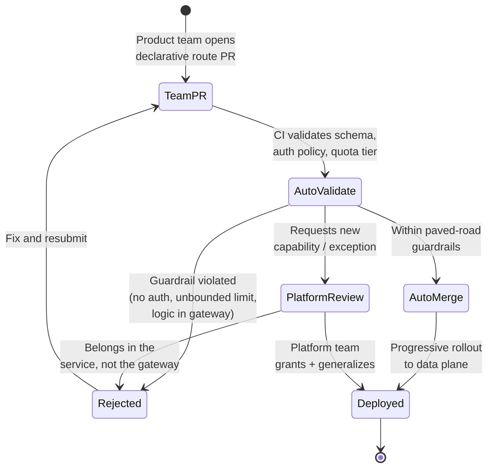

# API Gateway — Staff

The staff-level concern is not *how* an API gateway routes a request. It is *who owns the chokepoint*, *what governance flows through it*, and *what it costs the organization to run one — forever*. A gateway is the one piece of infrastructure that every product team is forced to depend on. That makes it simultaneously the highest-leverage governance surface you have and the most tempting place for organizational sludge to accumulate. Your job is to keep it a clean, well-owned control plane rather than a shared mutable dumping ground.

## Table of Contents

1. [The gateway is an org-design decision, not a component](#1-the-gateway-is-an-org-design-decision-not-a-component)
2. [Ownership: the API-platform team as a product](#2-ownership-the-api-platform-team-as-a-product)
3. [The gateway as a governance chokepoint](#3-the-gateway-as-a-governance-chokepoint)
4. [Preventing business-logic creep across teams](#4-preventing-business-logic-creep-across-teams)
5. [Buy vs build vs managed at org scale](#5-buy-vs-build-vs-managed-at-org-scale)
6. [Migration from no-gateway / legacy](#6-migration-from-no-gateway--legacy)
7. [Blast radius, SPOF, and standing operational cost](#7-blast-radius-spof-and-standing-operational-cost)
8. [Multi-tenant and partner API management](#8-multi-tenant-and-partner-api-management)
9. [Framing to leadership](#9-framing-to-leadership)
10. [Staff signals and anti-patterns](#10-staff-signals-and-anti-patterns)

---

## 1. The gateway is an org-design decision, not a component

At small scale a gateway is a routing convenience. At org scale it becomes the boundary that decides *who is allowed to talk to whom, on what terms*. Every choice you make about it is really a Conway's-law choice: the shape of the gateway and its policy surface will mirror — and then reinforce — the shape of your teams.

Three questions determine whether the gateway helps or hurts the organization, and none of them are technical:

- **Who is accountable when it is down at 3 a.m.?** If the answer is "everyone and no one," you have built a shared SPOF with no owner.
- **What is a team allowed to change without a review?** If the answer is "anything in the gateway config," you have built a global mutable variable that N teams can edit.
- **What must go *through* the gateway vs. what merely *may*?** The mandatory set is your governance; the optional set is your feature surface. Confusing the two produces both under-governance (auth bypasses) and over-centralization (routing logic owned by a bottleneck team).

Staff engineers answer these deliberately. Everyone else discovers the answers by incident.

---

## 2. Ownership: the API-platform team as a product

The gateway must have a single owning team, and that team must treat the gateway as a **product with internal customers**, not as a ticket queue.

**What "as a product" means concretely:**

- **Self-service by default.** Onboarding a new upstream service, claiming a route prefix, or requesting a rate-limit tier should be a pull request against a declarative config (GitOps) that the platform team's automation validates — not a Slack message that a platform engineer manually applies. If every change requires a human on the platform team, the platform team *is* the bottleneck and the gateway becomes the slowest part of every launch.
- **Paved road, not a gate.** The platform team owns the *mechanism* (auth enforcement, rate-limit primitives, observability, the schema of what a route may declare). Product teams own the *policy values* for their own routes within guardrails. The platform team says "here is how you declare a rate limit"; the product team says "my limit is 1000 rps."
- **A published contract.** SLOs for the data plane (p99 added latency, availability), a deprecation policy for gateway features, and a changelog. Internal customers should be able to reason about the gateway the way they reason about any dependency.

**Ownership boundary in one line:** *the platform team owns the shape of the config; product teams own the contents of their slice of it.*

The staff insight in that diagram: the **exception path feeds back into the paved road**. When a team needs something the guardrails do not allow, the platform team's job is not just to say yes or no — it is to decide whether the need is general (make it a first-class, self-serve feature) or specific (push it back into the service). A platform team that only ever grants one-off exceptions is accumulating the very sludge it was created to prevent.

---

## 3. The gateway as a governance chokepoint

The reason the gateway is worth centralizing at all is that a single chokepoint lets you enforce organization-wide policy *once* instead of trusting N teams to each implement it correctly. The high-value governance concerns:

- **Authentication and identity.** The gateway is where you guarantee that *no unauthenticated request reaches an internal service*. This is the single strongest argument for a mandatory gateway: auth is a property you cannot afford to have implemented inconsistently across 200 services.
- **Rate-limit tiers and quotas.** Named tiers (free / standard / premium / partner) enforced centrally, so a team cannot accidentally expose an unbounded endpoint that becomes a DoS vector.
- **API catalog and onboarding.** The gateway config is the source of truth for "what APIs exist." Coupled with a catalog, it answers *what endpoints do we have, who owns them, what is their SLA, are they deprecated* — questions that are otherwise unanswerable at scale.
- **Quota and monetization.** For external/partner APIs, the gateway meters usage and enforces plan limits. This is where the gateway stops being cost and starts being revenue infrastructure.
- **Cross-cutting policy.** TLS termination standards, mTLS to upstreams, audit logging, PII redaction at the edge, deprecation headers, and consistent error envelopes.

The governance value is real, but it comes with a governance *cost*: the more you centralize, the more the gateway becomes a coordination point. The discipline is to centralize only what genuinely benefits from being enforced once, and to make even that self-serve.

**Centralize vs. leave to teams:**

| Signal favoring centralized governance | Signal favoring team autonomy |
|---|---|
| Property must be *universally true* (auth, TLS, audit) | Behavior is specific to one service's domain |
| Inconsistency is a security or compliance risk | Inconsistency is merely a stylistic difference |
| Cross-team abuse is possible (noisy neighbor, DoS) | Blast radius is contained to the owning team |
| Regulator / auditor asks "prove this holds everywhere" | No external accountability |
| The primitive is stable and rarely changes | The logic changes with every product iteration |
| One correct implementation is hard; many are error-prone | Each team's need is genuinely different |

When a requirement sits clearly in the left column, put it in the gateway and make it non-optional. When it sits in the right column, keep it out — even if the gateway *could* technically do it. Most damaging gateway decisions come from putting right-column concerns in the left column "because it was easy to add there."

---

## 4. Preventing business-logic creep into the gateway

This is the failure mode that quietly kills gateways, and preventing it is a distinctly staff-level responsibility because no single team feels the cost until it is systemic.

**How creep happens:** a gateway supports request transformation, header manipulation, custom plugins, scripting (Lua, WASM, JS). One team, under launch pressure, encodes a piece of domain logic — a coupon-eligibility check, a field rename to shim a mismatched client, a special-case route rewrite — into the gateway config instead of into their service. It works. It ships. Now the gateway holds a fragment of that team's business logic.

Repeat across dozens of teams over two years, and the gateway becomes an unversioned, untested, multi-owner monolith where changing one team's transformation risks another team's traffic, no team fully understands the config, and the platform team is on the hook for logic they never wrote.

**Why it is worse than ordinary tech debt:** logic in the gateway has *no clear owner*, is *hard to test* (it lives in config, not code with a test suite), and sits *on the critical path of everyone's traffic*. A bug in a service degrades one service. A bug in gateway logic can degrade the whole edge.

**The rule that holds the line:** the gateway may make decisions based on *request metadata* (path, method, headers, token claims, source, rate) but must not make decisions based on *business state*. Auth, routing, and rate limiting are metadata decisions. "Is this user eligible for the promotion" is a business decision and belongs in a service.

**Enforcement mechanisms, in order of strength:**

1. **Schema constraints.** The declarative config a team can submit should not *have* a field for arbitrary logic. If there is no `custom_script` field, no one can add a script. Remove the footgun rather than policing it.
2. **Policy-as-code review.** For capabilities that must exist (some transformation is legitimate), gate them behind automated checks and a platform-team review that asks "why is this not in your service?"
3. **A published boundary doctrine.** Write down, once, what the gateway is and is not for, with examples. Make it the reference every reviewer points to, so the answer is "the doctrine says no," not "I personally disagree."
4. **Periodic audits.** Grep the config for accumulated transformations and drive them back into services as debt-paydown.

If your gateway platform makes arbitrary logic *possible*, your governance has to make it *unattractive and reviewed*. The strongest position is a config surface where the wrong thing is simply not expressible.

---

## 5. Buy vs build vs managed at org scale

There are three postures, and the honest comparison is about **total cost of ownership and control**, not feature checklists.

| Dimension | Managed (Apigee, AWS API Gateway) | Self-run OSS (Kong, Envoy, NGINX) | Build in-house |
|---|---|---|---|
| Upfront cost | Low | Medium | High |
| Standing ops / on-call | Vendor-absorbed | **Yours — a real team** | Yours, plus the code itself |
| Per-request / per-call cost | Can dominate at high volume | Infra + team only | Infra + team only |
| Control & customization | Limited to vendor's model | High | Total |
| Time to first value | Fastest | Medium | Slowest |
| Lock-in | High (config, monetization, identity) | Low–medium | None (you own it) |
| Best fit | Partner/monetized APIs, small platform team, spiky volume | Large steady volume, need for deep customization, existing platform team | Requirements no product meets (rare) |

**The decisions that actually matter:**

- **Managed gateways win on the "we don't want to run this" axis and lose on the per-call cost axis.** AWS API Gateway's per-request pricing is trivial at low volume and can become a line item leadership notices at billions of calls/month. Apigee is compelling precisely when you need its monetization, developer portal, and analytics — i.e. for *external* APIs — and overkill for purely internal east-west traffic.
- **Self-run OSS (Kong, Envoy) trades a vendor bill for a *team*.** The license is free; the on-call rotation, upgrade treadmill, capacity planning, and expertise are not. Self-hosting only pencils out when you have — or will fund — a platform team that can own it. "We'll save money with open source" is false if the hidden cost is three engineers you didn't budget for.
- **Build is almost never right.** The bar is: no managed or OSS product can meet a requirement that is core to your business, *and* you can sustain the maintenance forever. Most "we need to build it" instincts are really "we haven't read Envoy's config model closely enough."
- **The split posture is often correct.** Managed/portal product for external + partner + monetized APIs (buy the monetization and developer experience); self-run Envoy/Kong for internal high-volume service-to-service (avoid per-call fees on traffic you fully control). Naming this split explicitly is a strong staff move — it optimizes each axis instead of forcing one tool to do both jobs.

The number to put in front of leadership is not the license fee. It is **fully-loaded TCO over three years**: license/usage + platform headcount + on-call load + migration cost + the opportunity cost of lock-in.

---

## 6. Migration from no-gateway / legacy

Introducing a gateway where none existed — or replacing a legacy one — is a migration you cannot do as a big-bang cutover, because the gateway is on the critical path of every request.

**The safe pattern is strangler-fig at the edge:**

1. **Put the new gateway in front, passing through.** Route all traffic through it with policy in *observe / log-only* mode. It does nothing but forward and record. This proves it can carry production load before it enforces anything.
2. **Enable governance one policy at a time, per route.** Turn on auth enforcement for one low-risk service, watch, expand. Then rate limiting. Then the next service. Each step is reversible.
3. **Onboard teams incrementally onto self-serve config**, oldest-and-riskiest last. Do not require every team to migrate on day one; require every *new* endpoint to go through the gateway from day one, so the problem stops growing while you drain the backlog.
4. **Keep the old path alive until the new one is proven**, with the ability to shift traffic back at the load balancer.

**Political reality of the migration:** teams that currently implement their own auth/rate-limiting will experience the gateway as *taking away control* and *adding a dependency*. The migration succeeds or fails on whether they perceive net value. Lead with the things it gives them — free observability, one-line rate limiting, no more bespoke auth code to maintain — before the things it takes. A gateway rollout framed as "compliance is making you" gets slow-walked; framed as "here is toil we are deleting for you" gets pulled.

---

## 7. Blast radius, SPOF, and standing operational cost

Centralizing everything through one component means that component's failure is *everyone's* failure. This is the price of the governance chokepoint, and it must be governed as deliberately as the policy it enforces.

- **Blast radius is now maximal by construction.** A bad gateway config push, a memory leak, or a cert expiry takes down the edge for all products at once. This raises the bar on change safety: gateway config changes need progressive rollout (canary → percentage → full), automatic rollback on error-rate regression, and the same review rigor as production code — because they *are* production changes affecting everyone.
- **No single point of *failure* even though it is a single point of *control*.** The control plane may be centralized; the data plane must be redundant — multiple instances, multi-AZ, health-checked, with the load balancer in front. The gateway can be a logical chokepoint without being a physical SPOF.
- **Blast-radius partitioning.** Consider separate gateway fleets (or at least separate config domains) for tiers that must not take each other down: internal vs. external, or per-business-unit for very large orgs. This trades some economy of scale for containment. Whether it is worth it is a judgment call about how coupled you can afford the org to be.
- **Standing operational cost is permanent and must be staffed.** A production gateway means: an on-call rotation, an upgrade cadence (CVEs in Envoy/Kong/NGINX are your emergency patches now), capacity planning against org-wide traffic growth, and ownership of a component whose downtime is a company-wide incident. This cost does not go away and does not shrink. Under-staffing it is the most common way a well-intentioned gateway becomes a liability: the SPOF exists, but the team that would keep it healthy does not.

The staff framing: *the gateway concentrates both leverage and risk. You are trading distributed, inconsistent risk (every team's own auth) for concentrated, well-governed risk (one team's hardened edge). That trade is usually correct — but only if you actually fund the "well-governed" part.*

---

## 8. Multi-tenant and partner API management

When the gateway fronts APIs consumed by *external* tenants or partners, its role shifts from internal traffic cop to **the commercial surface of the product**.

- **Tenant isolation and fairness.** Per-tenant rate limits and quotas so one partner cannot starve another (noisy-neighbor protection). This is a hard requirement, not a nice-to-have — a single partner's runaway integration must not become an outage for the rest.
- **Onboarding as a product experience.** A developer portal, self-serve API-key issuance, documentation, sandbox keys, and usage dashboards. For partner APIs, onboarding friction directly costs revenue; the gateway's onboarding flow *is* part of the sales funnel.
- **Quota and monetization.** Metered usage tied to plans, overage handling, and billing integration. This is where a managed product like Apigee earns its price — building metering-and-billing correctly in-house is a large, ongoing commitment that is rarely core to the business.
- **Versioning and deprecation, contractually.** External consumers cannot be force-migrated. The gateway is where you run multiple API versions concurrently, inject deprecation headers, and enforce sunset timelines — with a communication process, because breaking a partner's integration is a commercial incident.
- **Contractual SLAs.** Internal SLOs are aspirations; partner SLAs are *contracts with penalties*. The gateway's availability and latency for partner traffic may carry financial consequences, which further justifies fleet separation between internal and external planes.

The judgment: internal API management is an *engineering efficiency* problem; partner API management is a *product and revenue* problem. The same word — "gateway" — hides two different mandates, and conflating them (running your partner monetization on the same fleet and team as your internal service mesh, with the same SLA) is a recurring staff-level mistake.

---

## 9. Framing to leadership

Leadership does not fund "an API gateway." They fund outcomes and de-risking. Translate:

- **Frame it as risk consolidation, not new infrastructure.** "Today, auth is implemented 200 times with 200 chances to get it wrong. We are moving it to one hardened, audited place." Security and compliance leaders understand this instantly.
- **Frame the platform team as a force multiplier.** "Every product launch currently re-solves rate limiting, auth, and observability. This team solves it once so 40 product teams stop re-solving it." The ROI is other teams' velocity, not the gateway team's output.
- **Put TCO honestly on the table.** Do not sell self-hosted as "free." Present three-year fully-loaded cost for each posture, including the headcount and on-call for self-run options, so the buy-vs-build decision is made with real numbers and cannot be reopened later as "why is this so expensive."
- **Name the blast-radius trade explicitly.** Leadership must consciously accept that centralization creates a company-wide failure surface *and* that the mitigation (redundancy, a staffed on-call team, change-safety tooling) is part of the cost. A gateway proposed without its operational cost is a proposal that will be under-funded and then blamed.
- **For partner/external APIs, frame it as revenue infrastructure**, not a cost center — metering, monetization, and partner onboarding are how the API makes money, which reframes the entire budget conversation.

The one-sentence version for an exec: *"A gateway lets us enforce security and reliability policy once instead of trusting every team to get it right, and — for external APIs — it's how we meter and monetize; the cost is a small platform team and a failure surface we deliberately harden."*

---

## 10. Staff signals and anti-patterns

**Signals of staff-level judgment:**

- Treats the gateway as an owned product with self-serve config, not a shared ticket queue.
- Draws and defends the ownership boundary: platform owns the config *shape*, teams own their *slice's contents*.
- Actively prevents business-logic creep — and prefers removing the footgun (no arbitrary-script field) over policing it.
- Separates internal from external/partner gateways in team, SLA, and often fleet.
- Presents buy-vs-build as three-year fully-loaded TCO, never as license price.
- Makes the blast-radius / SPOF trade explicit and funds its mitigation.
- Runs gateway migrations as strangler-fig with reversible, per-policy steps and a "new endpoints go through it from day one" rule.

**Anti-patterns:**

- Adopting a gateway with no single owning team — a shared SPOF nobody keeps healthy.
- Letting the config become a multi-owner monolith of transformations and scripts.
- "Open source is free" — self-hosting a gateway without funding the platform team that runs it.
- Running partner monetization on the same fleet, team, and SLA as internal east-west traffic.
- Big-bang cutover onto a new gateway, or enforcing all policies at once during migration.
- A platform team that grants endless one-off exceptions instead of generalizing them into the paved road or pushing them back into services.
- Pitching the gateway to leadership without its standing operational cost, guaranteeing it gets under-funded and later resented.

---

*Next step:* [API Gateway — Interview](interview.md)
