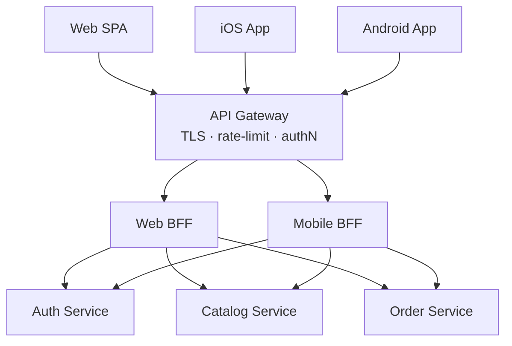

# Backends for Frontend — Interview

A tiered Q&A bank, from fundamentals to staff-level judgment. Each answer is written to be spoken aloud in roughly a minute.

1. What is a BFF and what problem does it solve?
2. Why one BFF per client type?
3. What does a BFF actually do?
4. BFF vs API gateway?
5. BFF vs GraphQL (and federation)?
6. How do you handle fan-out tail latency and partial failures?
7. What is the BFF-for-SPA-auth pattern?
8. How do you deal with duplication across BFFs?
9. Isn't the BFF just a single point of failure and an extra hop?
10. Who owns the BFF?
11. How do you govern BFF proliferation at scale? (staff)
12. When is a BFF overkill?
13. How do you version and evolve a BFF?
14. How do you test a BFF?

---

## Q1: What is a BFF and what problem does it solve?

A Backend for Frontend is a server-side API dedicated to a single frontend experience — the web app, iOS, Android — rather than a general-purpose API shared by all of them. It exists because different clients have genuinely different needs. A mobile screen on a metered radio wants one compact payload with exactly the fields it renders; a desktop web view can afford a richer, chattier shape. When a single general-purpose API tries to serve every client, you get one of two failure modes: **over-fetching**, where the mobile client downloads a fat resource and discards 80% of it, or **chatty round-trips**, where the client fires five sequential requests and stitches the results together over a slow, high-latency link. The BFF collapses that into a single tailored endpoint: the client asks one question, the BFF fans out to the downstream services, aggregates and trims, and returns precisely the view-model the UI needs. The problem it solves is fundamentally an **impedance mismatch** between how services are decomposed on the backend and how experiences are composed on the frontend.

## Q2: Why one BFF per client type?

Because the whole value proposition is *tailoring*, and you can only tailor to one consumer at a time. The moment a single BFF serves both web and mobile, you're back to negotiating a compromise payload — adding conditional fields, `if platform == ios` branches, and query flags — which is exactly the coupling a BFF was meant to eliminate. Separate BFFs let each frontend team shape their contract, cadence, and payload independently: the iOS BFF can ship a breaking change the day iOS ships it, without a coordination meeting with the web team. The boundary is drawn by **user experience**, not by device — so you might split by web vs mobile, or by public-app vs internal-admin, wherever the divergence in needs is real. The caution is not to over-shard: one BFF per *screen* or per *microfrontend* is usually too fine and just multiplies operational cost. The right granularity is one BFF per team-owned experience with materially different requirements.

## Q3: What does a BFF actually do?

Four things, mostly.

- **Aggregation / orchestration** — fan out to several downstream services in parallel, join the results, and assemble a single view-model. This is where the client's round-trips disappear.
- **Protocol and format translation** — the backend may speak gRPC, internal message formats, or paginated REST; the BFF exposes clean JSON (or GraphQL) shaped for the UI. It's the seam where internal protocols stay internal.
- **Trimming and reshaping** — drop fields the client doesn't render, rename to the UI's vocabulary, flatten nested structures, precompute derived values (a formatted price, a "days until due"). The client receives a payload it can bind to directly.
- **Client-facing auth and session concerns** — terminate the client's session, validate tokens, and inject internal service credentials on the outbound calls. The SPA-auth pattern (Q7) lives here.

Crucially, a BFF is a *presentation-adaptation* layer, not a place for core business logic. Domain rules belong in the downstream services; the BFF only decides how to present them to one specific frontend.

## Q4: BFF vs API gateway?

They're often confused because both sit in front of services and both can aggregate — but their intent is different. An **API gateway** is a single, general-purpose edge for *all* traffic: it centralizes cross-cutting concerns like routing, TLS termination, rate limiting, authentication, and observability. It's client-agnostic on purpose. A **BFF** is client-*specific* by design: its job is to shape a bespoke API for one experience. In practice they compose rather than compete — the gateway handles the horizontal edge concerns for everyone, and behind it sit per-client BFFs that own the tailoring. A useful heuristic: if the logic is "the same for every consumer" (auth, throttling, WAF), it belongs in the gateway; if it's "specific to how *this* UI wants its data," it belongs in a BFF. Trying to push per-client shaping into a shared gateway is how gateways turn into unmaintainable monoliths.

## Q5: BFF vs GraphQL (and federation)?

They attack the same over-fetch / round-trip problem from opposite directions. A **BFF** puts the shaping on the *server*: the backend team decides the exact response, so the contract is explicit and the client stays thin. **GraphQL** puts the shaping in the *client's query*: the client asks for exactly the fields it wants against a single schema, so a lot of the per-client tailoring that would live in a BFF becomes unnecessary — the query *is* the tailoring. In many organizations a well-designed GraphQL layer replaces a whole family of BFFs. **Federation** (Apollo Federation and similar) then lets multiple teams each own a subgraph while clients see one unified graph — which addresses the aggregation-across-services role a BFF played, at the schema level. The trade-off: GraphQL gives clients flexibility but shifts complexity into resolvers, N+1 control, query-cost limiting, and caching (which is harder than with plain HTTP). A REST BFF is more rigid but simpler to reason about, cache, and secure. They also coexist — a common pattern is a GraphQL BFF: GraphQL *is* the query interface, but it's still deployed as a client-tailored, team-owned backend.

| Dimension | Shared general-purpose API | API Gateway | BFF | GraphQL / Federation |
|---|---|---|---|---|
| Primary purpose | Serve all clients uniformly | Centralize edge cross-cutting concerns | Tailor one API per experience | Let client select fields via query |
| Who shapes the payload | Backend, one-size-fits-all | Nobody (pass-through) | Backend, per client | Client (via the query) |
| Client coupling | High (compromise payload) | None (agnostic) | Low per client, isolated | Low (schema-driven) |
| Aggregation | Client does it | Optional, generic | Core responsibility | Resolvers / subgraphs |
| Caching | Simple (HTTP) | Simple (HTTP) | Simple (HTTP) | Harder (per-query) |
| Best when | Few, similar clients | You need a uniform edge | Divergent clients, team ownership | Many field-selection needs, evolving graph |

## Q6: How do you handle fan-out tail latency and partial failures?

This is the hardest part of running a BFF, because aggregation makes you a fan-out node, and a fan-out node's latency is governed by its *slowest* dependency. If a BFF calls five services in parallel and each has a p99 of 100 ms, the *combined* p99 can be far worse than 100 ms — the more calls you make, the more likely at least one lands in its own tail. So the disciplines are: **call downstreams in parallel**, never sequentially, whenever there's no data dependency; **set aggressive per-call timeouts** that are tighter than the client's overall budget, so one slow service can't hold the whole response hostage; and **wrap each dependency in a circuit breaker** so a failing service fails fast instead of consuming your threads. For **partial failure**, decide per-field whether a dependency is *critical* or *optional*. If the reviews service is down, the product-detail BFF should still return the product with an empty-reviews placeholder — **graceful degradation** — rather than 500 the whole screen. Add hedging or retries with jitter only where they're safe (idempotent reads), and shed the non-essential calls first under load. The mental model: the BFF owns the client's latency budget and is responsible for spending it well.

## Q7: What is the BFF-for-SPA-auth pattern?

It's the modern, recommended way to do OAuth/OIDC for browser single-page apps. The old approach kept access and refresh tokens in the browser (localStorage or JS-readable memory), which is exposed to any XSS on the page — a token in JavaScript is a token an attacker's injected script can exfiltrate. The BFF pattern moves the tokens **server-side**: the browser holds only a hardened, `HttpOnly`, `Secure`, `SameSite` session cookie, and the BFF holds the actual OAuth tokens. The browser calls its own BFF; the BFF validates the session cookie, attaches the real access token, and proxies the call to the downstream API. Tokens never touch JavaScript, so XSS can no longer steal them, and the refresh flow happens entirely on the server. This is sometimes called the "token-mediating backend." The cost is that you now need CSRF protection (you're back to cookies) and a stateful session store, but for confidentiality of tokens it's a strong, widely endorsed default for browser apps.

## Q8: How do you deal with duplication across BFFs?

Duplication is the classic BFF failure mode: three BFFs each re-implement the same auth handling, the same downstream client, the same resilience config, the same logging — and now a security fix has to be made in three places. The fix is **not** to merge the BFFs back into one (that recreates the compromise payload); it's to **extract the commonality into a shared library or framework**, while keeping the *shaping* logic — the part that's genuinely per-client — separate. Downstream service clients, retry/circuit-breaker policies, auth middleware, tracing, and serialization all belong in a shared internal SDK that every BFF depends on. What must stay unique is the aggregation and view-model composition, because that's the reason the BFF exists. Sam Newman frames it well: share code that has no per-client variation, but resist the urge to share the presentation logic, or you'll re-couple the very teams you decoupled. Judgment call: a little duplication is cheaper than the wrong abstraction, so extract only once the pattern is stable and repeated.

## Q9: Isn't the BFF just a single point of failure and an extra hop?

Both concerns are real and neither is disqualifying. On the **extra hop**: yes, you've added a network round-trip between the gateway and the services, which costs some latency — but the BFF usually *reduces* end-to-end latency for the client, because it replaces several high-latency client-to-cloud round-trips (over mobile radio or the public internet) with one client call plus fast, parallel in-datacenter fan-out. You're trading a cheap internal hop for expensive external ones. On the **SPOF**: a BFF is a critical-path component, so treat it like one — run multiple stateless instances behind a load balancer, autoscale it, and keep it stateless so any instance can serve any request. The blast radius is also *contained* by the per-client design: if the mobile BFF falls over, web is unaffected, because they're separate deployables. The failure isolation cuts both ways — it's an argument *for* separate BFFs, not against them.

## Q10: Who owns the BFF?

The frontend team that consumes it. This is the pattern's most important organizational point and a direct application of **Conway's Law**: a BFF is an extension of the frontend, so the same team that builds the UI should own the API that feeds it. When the frontend and its BFF live in one team, adding a field is a single-team, same-sprint change — no ticket to a separate backend team, no cross-team coordination for a UI tweak. This is what makes the BFF fast to evolve. It does require the frontend team to have (or grow) backend competence, and it shifts some operational responsibility onto them, which is a real cost. But the alternative — a shared backend team owning every client's tailoring — reintroduces the coordination bottleneck the BFF was supposed to remove. The BFF is where you deliberately align the org boundary with the experience boundary.

## Q11: How do you govern BFF proliferation at scale? (staff)

At scale the risk inverts: the pattern is so cheap to adopt that teams spin up a BFF per screen, per experiment, per microfrontend, and you end up with dozens of thinly-differentiated backends — each one a deployable, a pipeline, an on-call rotation, a set of dashboards, and a security surface. Governance is about keeping the count justified. Concretely, as a staff engineer I'd: **define the granularity rule** — a BFF is warranted only where a distinct, team-owned experience has materially different needs, not per screen; **provide a paved road** — a shared BFF framework/template with auth, resilience, tracing, and downstream clients built in, so a new BFF is consistent and cheap to operate but still isolated (this is the Q8 fix at platform scale); **track and review** the BFF inventory the way you'd track any service sprawl, and periodically consolidate ones that no longer diverge; and **watch for the anti-pattern** where a BFF grows business logic and quietly becomes a distributed monolith. The strategic question to keep asking is whether GraphQL/federation would let you retire a whole class of BFFs — sometimes the best governance is a single well-run graph instead of fifteen bespoke backends.

## Q12: When is a BFF overkill?

When the clients aren't actually divergent, or when there aren't enough teams to justify the operational overhead. If you have a single web frontend and a fairly compatible mobile app, a well-designed REST or GraphQL API — or a general-purpose API with sensible field selection — may serve both fine, and a BFF just adds a deployable to run, secure, and page on. Early-stage products in particular should not front-load BFFs; the coordination cost a BFF removes doesn't exist yet when one team owns everything. The signals that make a BFF *worth it* are: multiple client types with genuinely different payload/latency needs, multiple teams whose release cadences you want to decouple, and real pain from over-fetching or chatty round-trips today. Absent those, a BFF is architecture for a problem you don't have — and every layer you add is latency, cost, and surface area you now own.

## Q13: How do you version and evolve a BFF?

The elegant part of the BFF pattern is that versioning gets *easier*, because a BFF has exactly one consumer. Since the frontend team owns both the client and its BFF, they can evolve the contract in lockstep — often without formal versioning at all, because you can ship the client change and the BFF change together. That's a big reduction in the API-versioning ceremony you'd need for a public, many-consumer API. Where you *do* need care is on the BFF's *downstream* dependencies: the BFF must tolerate the services it calls changing underneath it, so it should be defensive about downstream schema drift and shouldn't blindly pass raw downstream shapes through to the client (which would leak versioning problems straight to the UI). If a BFF ever does end up with more than one consumer, treat that as a smell — either split it or apply real versioning, because you've lost the single-consumer property that made evolution cheap.

## Q14: How do you test a BFF?

Because the BFF is mostly orchestration and shaping, testing centers on those two concerns. Use **contract tests** against downstream services (consumer-driven, e.g. Pact) so the BFF's assumptions about each dependency are verified and you find out at CI time — not in production — when a service changes its shape. **Unit-test the aggregation and view-model mapping** with the downstream calls mocked, asserting the trimming, renaming, and derived fields are correct. Critically, **test the failure paths**: simulate a slow or dead dependency and assert the timeout fires, the circuit breaker trips, and the BFF degrades gracefully (returns the partial view-model rather than a 500) — this is the behavior that actually protects the user and is the easiest to leave untested. Add a thin layer of **integration tests** against the client-facing contract so the shape the frontend binds to is guaranteed. And since the frontend team owns the BFF, the same team writes these tests, which keeps the contract and its verification honest.

*Next step:* [Relational Databases (RDBMS) — Junior](../../12-databases/01-relational-rdbms/junior.md)
