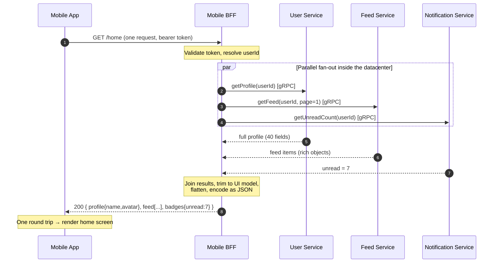

# Backends for Frontend — Middle

<!-- level-focus -->
At middle level, focus on this question:

> Where does **Backends for Frontend** belong in a maintainable component, and which trade-off selects the design?

Use the smallest realistic scenario that exposes the decision and its failure behavior.
## 1. What a BFF actually does

A BFF is not a generic proxy. On every request it performs a fixed set of jobs on behalf of one client. Everything below is the same pattern: **collapse many backend concerns into one client-friendly response.**

| Job | What it means mechanically |
|-----|----------------------------|
| Aggregation / composition | Fan out to N services in parallel, join their results, shape one object per screen |
| Protocol translation | Speak the client's protocol (JSON/REST, GraphQL) outward; speak the internal protocol (gRPC, Thrift, internal REST) inward |
| Auth / session at the edge | Validate the client's token, resolve the user, attach internal credentials to downstream calls |
| Response trimming | Drop fields the client never renders; rename/flatten to match the UI model |
| Per-client caching | Cache composed responses keyed by *this* client's needs (e.g. mobile home payload) |
| Graceful degradation | If one downstream fails, still return a usable partial payload |

Because each of these is tuned to a single client, a mobile BFF and a web BFF make different choices even when they call the same services.

---

## 2. Tracing a mobile home-screen request

The canonical example: a mobile app opening its home screen. Without a BFF the app would make 4+ round trips over a slow radio link and stitch the data itself. With a BFF it makes **one** call; the BFF does the fan-out server-side inside the datacenter where hops are cheap.



Key mechanics in that trace:

- Steps 3–5 run **in parallel**. Total latency is roughly the *slowest* downstream call, not the sum.
- The token is validated once (step 2), at the edge, before any fan-out.
- The BFF trims the 40-field profile down to `{name, avatar}` — the only fields the mobile home screen shows.
- The client sees one endpoint (`/home`) and one payload; it has no idea three services were involved.

---

## 3. Aggregation and composition

Aggregation is the BFF's core loop:

1. **Fan out.** Issue N downstream requests concurrently (async/await, goroutines, a thread pool — the runtime doesn't matter, the concurrency does).
2. **Wait with limits.** Apply a per-call timeout so a slow service can't stall the whole page. On timeout, either use a fallback value or omit that section.
3. **Join.** Correlate the responses in memory — e.g. attach `unreadCount` to the profile object, embed feed items under `feed`.
4. **Shape.** Build the exact object the client's view model expects: nesting, field names, and ordering all match the UI, not the services.

The important discipline: aggregation logic lives in the BFF, **not** in the services and **not** in the client. Services stay generic and reusable; the client stays thin. The BFF absorbs the "which calls, in what order, joined how" complexity for one screen.

---

## 4. Protocol translation

Internal services often speak efficient binary protocols (gRPC, Thrift) that browsers and mobile SDKs handle poorly or not at all. The BFF is the translation boundary:

- **Inward:** it calls services over gRPC/HTTP2 with protobuf, using service discovery and internal mTLS.
- **Outward:** it exposes plain JSON over HTTPS (or GraphQL) that any client can parse natively.

This translation is also a *versioning shock absorber*. When an internal service migrates a gRPC field or bumps a proto version, the BFF adapts inside its mapping code and the client contract stays stable. The mobile app on a user's phone — which you cannot force to update — keeps calling the same `/home` shape.

---

## 5. Auth and session at the edge

The BFF is the first authenticated hop for its client, so edge auth belongs here:

- **Verify the client credential** — validate the JWT signature/expiry, or resolve the session cookie, and reject early if invalid.
- **Resolve identity** — turn the token into a `userId`/tenant/scope set used for every downstream call.
- **Attach internal credentials** — services trust the BFF, not the raw client token. The BFF forwards a service-to-service identity (mTLS, internal token) plus the resolved user context.

Because different clients authenticate differently — a web BFF may use `httpOnly` cookies plus CSRF protection, a mobile BFF may use bearer tokens with refresh — putting auth in the BFF lets each client experience use the session model that fits it, without leaking that choice into the services.

---

## 6. Response trimming and per-client caching

**Trimming.** Services return complete domain objects; a given screen renders a fraction of them. The BFF projects the response down to what the client draws — dropping fields, flattening nested structures, and renaming to the client's vocabulary. Over a mobile network this directly cuts payload size and parse time.

**Per-client caching.** The BFF can cache the *composed* result, keyed to this client's request. A mobile `/home` payload and a web `/dashboard` payload are cached independently, with TTLs chosen per client. Because the BFF owns the shape, it also owns the invalidation rules for that shape — the client and the services don't have to reason about it.

---

## 7. One BFF per client experience

The defining rule: **one BFF per distinct frontend experience**, not one shared BFF for all clients.

```
mobile-bff   → serves the iOS/Android apps        (small trimmed payloads, batches for slow links)
web-bff      → serves the desktop web SPA         (richer payloads, cookie sessions)
partner-bff  → serves an external partner portal  (stricter scoping, different rate limits)
```

Each of these calls the same underlying User/Feed/Notification services but composes and trims differently. Collapsing them into one API forces compromises: the mobile client drags fields it doesn't need, or the web client can't get the richer view. Separate BFFs let each experience evolve on its own cadence without a shared contract holding both back. (The trade-off — code duplication across BFFs — is a Senior topic.)

---

## 8. Where the BFF sits, and gateway vs BFF

The BFF lives at the edge of the internal network, typically **behind the API gateway** and **in front of the services**:

```
Client ──▶ API Gateway ──▶ BFF ──▶ [ Service A ]
        (cross-cutting)  (client-  ──▶ [ Service B ]
                          specific) ──▶ [ Service C ]
```

The gateway and the BFF are complementary, not competing. The gateway handles concerns that are the same for *every* client; the BFF handles concerns specific to *one* client.

| Concern | API Gateway | BFF |
|---------|-------------|-----|
| Scope | Cross-cutting, all clients | One client experience |
| TLS termination, routing | Yes | No |
| Global rate limiting, WAF | Yes | No (may add client-specific limits) |
| Coarse authentication | Often here | Fine-grained session/identity |
| Fan-out to N services | No | Yes |
| Join / compose responses | No | Yes |
| Protocol translation | Basic | UI-shaped, per client |
| Response trimming to a screen | No | Yes |
| Owned by | Platform / infra team | Frontend team |

A useful test: if the logic is "the same regardless of which app is calling," it belongs in the gateway; if it is "shaped by what this app renders," it belongs in the BFF.

---

## 9. Ownership

A BFF is owned by the **frontend team that consumes it**, not by a central platform team. This is what makes the pattern work:

- The team that knows the screens controls the payload shape and can change it in the same PR as the UI change.
- No cross-team ticket is needed to add a field to the home screen — the frontend team edits both the view and its BFF.
- The BFF's contract is an internal detail between one client and its backend, so it can change fast without a formal API deprecation cycle.

That alignment — same team owns the client and its dedicated backend — is the reason a BFF can iterate at UI speed while the shared services underneath stay stable and generic.

---

*Next step:* [Backends for Frontend — Senior](senior.md)

---

## Apply it

1. Find a real component where **Backends for Frontend** affects an interface or dependency.
2. Write two plausible choices and the constraint that favors each one.
3. Make the smallest reversible change at that boundary.
4. Exercise the component alone, then exercise the integrated flow.
5. Keep the decision note with the evidence that selected the option.

## Verify your work

- A focused check proves the local behavior.
- An integrated check proves callers and dependencies still agree.
- Logs, traces, compiler output, or benchmarks expose the boundary.
- Reverting the change restores the previous behavior without unrelated edits.

## Review questions

- Which boundary is most affected by Backends for Frontend?
- What constraint would make you choose the alternative design?
- How would you isolate a local defect from an integration defect?
- What evidence shows that the change remains maintainable?
