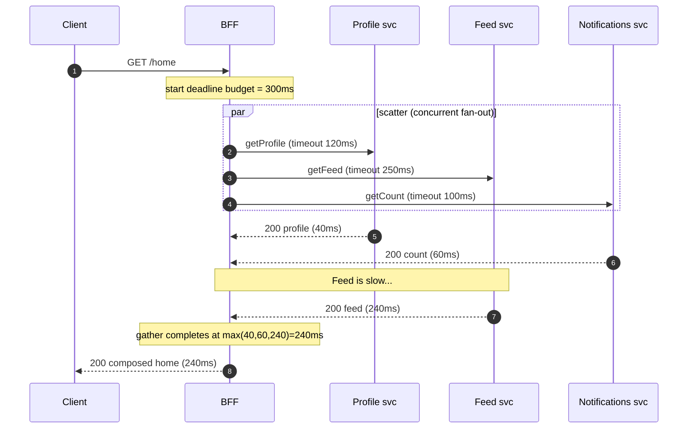
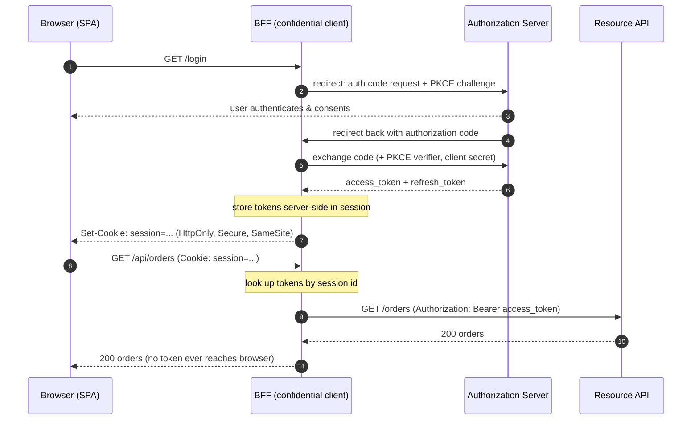

# Backends for Frontend — Professional

<!-- level-focus -->
At professional level, focus on this question:

> How should teams adopt and operate **Backends for Frontend** with measurable outcomes and limited coordination?

Use the smallest realistic scenario that exposes the decision and its failure behavior.
## 1. Why the BFF is where aggregation math lives

A client screen almost never maps to a single microservice. A mobile "home" screen might need the user profile, a feed, unread-notification counts, feature flags, and a cart badge — five services, five different teams, five different latency profiles. Without a BFF the client issues five round trips over a high-latency, high-jitter mobile network and stitches the results in JavaScript or Swift. With a BFF the client issues one request to a server that sits inside the low-latency datacenter fabric and does the fan-out there.

Moving the fan-out server-side is the whole point, and it is also what makes the BFF the concentration point for the concerns below. Every dependency call is now *your* latency budget, *your* failure to contain, *your* timeout to set. The client sees one number — the BFF's response time — and that number is a function of the arithmetic in the next sections.

---

## 2. Scatter-gather: latency is max, not sum

The naive way to aggregate is sequentially: call A, await, call B, await, call C. That makes the BFF's latency the *sum* of the dependency latencies — the worst possible outcome. The correct pattern is **scatter-gather** (also called fan-out/fan-in): dispatch all independent calls concurrently, then join. When calls run in parallel and are independent, the aggregate latency is the **maximum** of the individual latencies, not the sum:

```
sequential:  L_total = L_A + L_B + L_C
parallel:    L_total = max(L_A, L_B, L_C)   (+ small join overhead)
```

The staged diagram below shows the fan-out, per-dependency timeouts, one slow dependency, and the gather that returns as soon as the slowest *successful* branch (or its timeout) resolves.



Only genuinely independent calls can be parallelized. If `getFeed` needs the user's cohort from `getProfile` first, that edge is sequential and its cost is additive. Real aggregation graphs are a mix: model them as a DAG and the critical-path length is the sum of the maxes along each parallel stage. A frequent professional mistake is leaving accidental sequencing in the code (e.g. `await` inside a loop) that serializes calls the DAG says are parallel.

---

## 3. Tail-latency amplification: the p99 problem

Parallel fan-out fixes the *mean*, but it makes the *tail* worse — and clients feel the tail. Intuition: with parallel fan-out you wait for the slowest branch, so the more branches you have, the higher the chance that *at least one* of them lands in its slow tail on any given request.

Make it precise. Suppose each dependency independently has probability `p` of exceeding some latency threshold `t` (its per-call "slow" probability). The probability that a request fanning out to `n` such dependencies has *no* slow branch is `(1-p)^n`, so the probability that the aggregate is slow is:

```
P(aggregate slow) = 1 - (1 - p)^n
```

With a per-dependency slow probability of only `p = 0.01` (a clean p99 per service):

| Fan-out `n` | `P(aggregate exceeds t)` | Effective aggregate percentile |
|-------------|--------------------------|--------------------------------|
| 1           | 1.0%                     | ~p99                           |
| 5           | 4.9%                     | ~p95                           |
| 10          | 9.6%                     | ~p90                           |
| 20          | 18.2%                    | ~p82                           |
| 100         | 63.4%                    | worse than p37                 |

A dependency's p99 becomes the aggregate's *median-ish* problem once you fan out to ~70 of them. This is why Dean & Barroso's "The Tail at Scale" argues that in fan-out systems you must engineer the tail directly rather than trusting good averages. For a BFF the practical consequences are:

- Keep fan-out width bounded; do not let one endpoint call 40 services.
- The slowest dependency dominates — invest tail work where it counts.
- Use the mitigations below (timeouts, hedging, partial responses) precisely because the tail is not going to fix itself.

---

## 4. Deadline budgets and per-dependency timeouts

Two distinct notions, often conflated:

- **Per-dependency timeout** — the maximum time you will wait for one downstream call in isolation. It caps *that* branch.
- **Deadline (budget)** — an absolute wall-clock deadline for the whole request, propagated down the call chain. Each hop subtracts elapsed time and passes the *remaining* budget onward. When the budget is exhausted, in-flight work is cancelled rather than left running.

Deadline propagation is what prevents a slow BFF request from holding downstream resources long after the client has given up. A concrete rule set:

- Set the top-level deadline from the client contract (e.g. the mobile client aborts at 300 ms, so the BFF budget is ~280 ms leaving margin for the response trip).
- Each per-dependency timeout must be `<=` remaining budget; never let a single branch's timeout exceed the whole request's deadline.
- Propagate the *remaining* deadline, not a fixed timeout, so a call made late in the request gets less time than one made early. gRPC deadlines and HTTP `Deadline`/context propagation implement exactly this.
- On deadline expiry, cancel outstanding calls (context cancellation / request abort) to release connections and threads. An uncancelled fan-out is a resource leak under load.

Static per-call timeouts with no budget are a classic failure: three 250 ms timeouts stacked on a sequential path silently permit a 750 ms request even though the client left at 300 ms.

---

## 5. Hedged requests

Hedging trades a little extra load for a much tighter tail. The idea: issue the request; if a response has not arrived by a threshold (say the dependency's p95), issue a **second** copy to another replica; take whichever returns first and cancel the other. Because the slow tail of one replica is usually uncorrelated with the slow tail of another, the probability that *both* copies are slow is roughly the product of the individual slow probabilities — a dramatic tail reduction for a small increase in total requests.

Key design points:

- **Fire the hedge at a high percentile**, not immediately. Hedging at p95 adds only ~5% extra requests but cuts the tail; hedging at p50 doubles your load.
- **Cancel the loser** as soon as one wins, or you pay full duplicated cost.
- **Only hedge idempotent, safe reads.** Never hedge a non-idempotent write (double charge, double post). Aggregation reads inside a BFF are usually safe candidates; mutations are not.
- Hedging composes with circuit breakers and bulkheads (next section) so a hedged storm cannot itself become the overload.

Hedging attacks tail *variance*; timeouts attack tail *ceiling*; partial responses attack tail *impact*. Use all three.

---

## 6. Partial-response degradation

Because §3 makes it likely that *some* branch is slow or failing on any wide fan-out, a BFF must be able to return a *useful partial* rather than failing the whole screen when one non-critical dependency misses its deadline. This requires classifying each dependency:

- **Critical** — the response is meaningless without it (e.g. the feed on a feed screen). Its failure fails the request.
- **Optional / best-effort** — enriches the response but is not load-bearing (e.g. the unread-count badge, personalized ordering). Its failure yields a degraded-but-valid response.

Implementation shape: the gather step collects `Result<T>` per branch, substitutes a sensible default (empty list, stale-cached value, omitted field) for failed optional branches, and includes a machine-readable degradation signal so the client can render "count unavailable" instead of a spinner. Crucially the response should carry which parts are degraded (a `partial: true` flag or per-section status), so the client and observability stack both know the response is incomplete rather than authoritative.

Partial responses are only correct if the *client contract* allows optional fields — which is one more reason the BFF is client-owned: the same team designs the schema and the degradation policy together.

---

## 7. Resilience patterns at the BFF

The BFF is a fan-out hub, so a downstream failure can amplify: retries pile up, threads block on a dead dependency, and one sick service drags down every screen that touches it. The standard resilience trio contains this.

**Circuit breaker.** Track failure/latency of each downstream. On crossing a threshold, *open* the circuit and fail fast (serve fallback) instead of piling requests onto a failing service; periodically *half-open* to probe recovery. This converts slow cascading timeouts into instant, cheap fallbacks and gives the downstream room to recover.

**Bulkhead.** Isolate resources per dependency — a separate connection pool / concurrency-limited semaphore for each downstream. If the notifications service goes slow and saturates its bulkhead, requests to it queue or shed, but the profile and feed pools are untouched, so the rest of the screen still composes. Without bulkheads, one slow dependency exhausts a shared thread/connection pool and takes down everything.

**Fallbacks and stale cache.** When a dependency is open/timed-out, serve a fallback: a default value, an omitted optional field (§6), or the last known-good value from cache served *stale*. Serving slightly stale data beats serving an error or a spinner for most read screens; pair it with a soft-TTL so stale-while-revalidate refreshes it in the background.

These compose in a fixed order per dependency call: bulkhead admission → circuit-breaker check → timeout/deadline → (optional) hedge → on failure, fallback/stale. Get the order right and a single sick backend degrades one badge, not the whole product.

---

## 8. The OAuth2 BFF pattern for SPA auth

Browser SPAs face a hard token-storage problem: any place a JavaScript SPA can store an access/refresh token (localStorage, sessionStorage, memory, or even non-HttpOnly cookies) is reachable by injected script, so a single XSS turns into token exfiltration and a portable bearer credential the attacker can replay from anywhere. The **BFF authentication pattern** removes tokens from the browser entirely.

Mechanics: the BFF is a confidential OAuth2 client. It runs the **authorization code flow (with PKCE)** server-side, exchanges the code for tokens, and stores the access and refresh tokens **server-side** (in the session store, keyed by a session id). The browser receives only a **`HttpOnly`, `Secure`, `SameSite` cookie** — a session handle, not a token. On each API call the browser sends the cookie; the BFF looks up the real tokens, attaches the access token to the upstream call, and proxies the response. The browser never sees a token.



Because the credential leaving the BFF is now a cookie, the BFF must add **CSRF defenses** (SameSite plus a synchronizer/double-submit token) that a bearer-token SPA did not need — you trade the XSS-exfiltration surface for a CSRF surface, and CSRF is the easier problem to fully close. This pattern is specified in the IETF draft *OAuth 2.0 for Browser-Based Applications* at datatracker.ietf.org, which recommends the BFF (token-mediating/handling backend) approach over storing tokens in the SPA.

| Aspect | SPA holds token | BFF holds token |
|--------|-----------------|-----------------|
| Token storage | Browser (localStorage / memory) | Server-side session |
| What the browser holds | Access/refresh token (bearer) | `HttpOnly` session cookie |
| XSS impact | Token exfiltrated → replayable anywhere | Script can call API *while page open* but cannot steal a portable token |
| Refresh token exposure | In browser (high risk) | Never in browser |
| Primary attack surface | XSS token theft | CSRF (mitigable via SameSite + token) |
| Token refresh / rotation | Client-managed, fragile | Server-managed, centralized |
| Client complexity | Higher (token lifecycle in JS) | Lower (just cookies) |

The residual XSS risk with a BFF is a *session-riding* attack — script can make authenticated calls while the victim's page is open — but it cannot walk away with a durable token, and the session can be revoked server-side instantly. That is a strictly better position than a stolen refresh token.

---

## 9. Caching layers: per-client and edge

Because the BFF is client-specific, its cache is naturally **per-client**: the mobile BFF caches the mobile-shaped composed response, the web BFF caches the web-shaped one, and the two never collide on cache keys. Three layers matter:

- **Downstream/dependency cache.** Cache individual dependency responses inside the BFF (short TTL, keyed by dependency + params). This directly shrinks fan-out cost and, served stale, backs the fallback path in §7.
- **Composed-response cache.** Cache the fully aggregated, client-shaped payload for cacheable, non-personalized (or coarse-personalized) screens. Use stale-while-revalidate so a cache miss never blocks on the full fan-out.
- **Edge cache / CDN.** For public or lightly personalized BFF responses, cache at the edge (CDN or edge worker) close to the user, cutting the network RTT that motivated the BFF in the first place. Personalized responses either bypass the edge or use edge-side keying on a coarse segment.

Cache-key discipline is the trap: the key must include everything that varies the output — client type, locale, auth segment, feature-flag cohort, API version — or you will serve one user's composed screen to another. Vary deliberately and keep personalized data out of shared edge caches.

---

## 10. GraphQL, edge-compute, and streaming variants

The BFF is a *role*, not a single technology; three common variants realize it differently.

**GraphQL as a BFF.** A GraphQL gateway is a natural BFF: the client declares exactly the fields it wants, and the server fans out to resolvers. It formalizes client-driven shaping and per-field partial results, but the aggregation math is unchanged — resolvers still fan out, still have tails, and the N+1 resolver problem is exactly §2's accidental-sequencing trap. You still need dataloader batching, per-resolver timeouts, and a query-cost limiter so a client cannot request a pathological fan-out.

**Edge-compute BFF.** Running the BFF on edge workers (V8-isolate or similar) puts aggregation physically near the user, shrinking the client↔BFF RTT to near zero. The tradeoff: the edge worker is now *far* from the origin services, so its fan-out crosses the wide-area link, and constraints on CPU time, connection reuse, and long-lived state at the edge shape what aggregation is feasible there. Often the edge does light composition and caching while a regional BFF does the heavy fan-out.

**Streaming / SSR data needs.** For server-side rendering and progressive UIs, the BFF should not block on the whole fan-out before sending anything. Stream the composed response as branches complete — HTTP chunked/streamed responses, Server-Sent Events for incremental updates, or streamed SSR (send the shell, then flush sections as dependencies resolve). This turns §3's tail problem from "the whole screen waits for the slowest branch" into "the fast sections paint immediately and the slow one fills in," which is the single biggest perceived-latency win a BFF can deliver.

---

## Apply it

1. Define the user or business outcome that **Backends for Frontend** should improve.
2. Assign one owner for code, contracts, operations, and incidents.
3. Split delivery into reversible increments that produce evidence early.
4. Publish responsibilities, escalation paths, and compatibility windows.
5. Stop or expand only when the agreed measures support that decision.

## Verify your work

- Each increment has an owner, rollback path, and observable exit condition.
- Adoption, reliability, delivery time, and coordination cost are measured.
- Incident and migration exercises prove that responsibility is executable.
- The old path is removed only after telemetry proves it is unused.

## Review questions

- Which measurable outcome justifies investing in Backends for Frontend?
- Which team owns the full lifecycle and incident response?
- What reversible increment produces the earliest useful evidence?
- Which exit condition proves that migration or adoption is complete?
