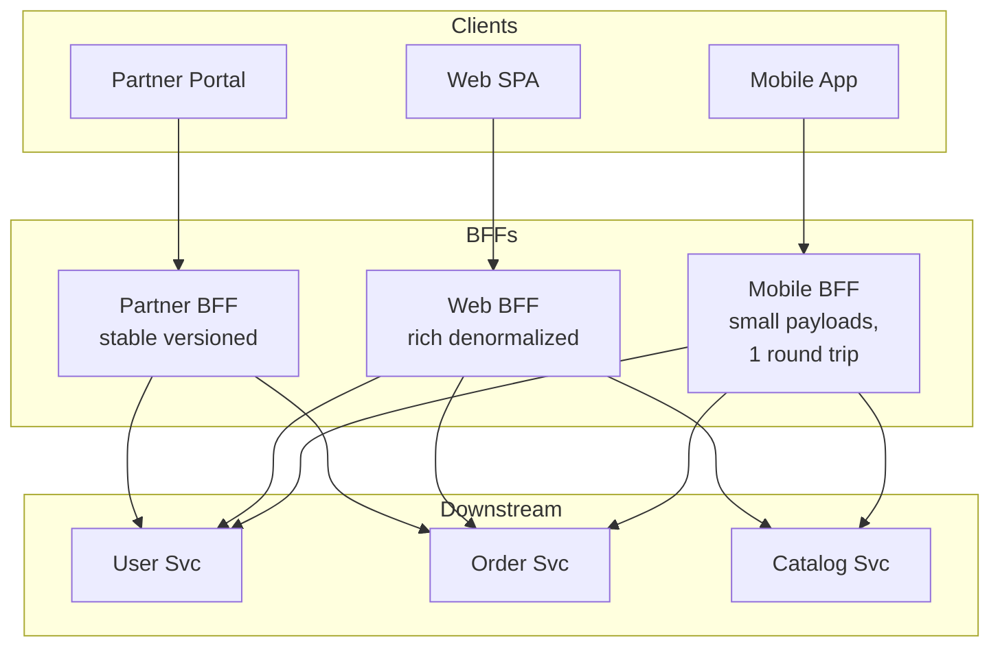
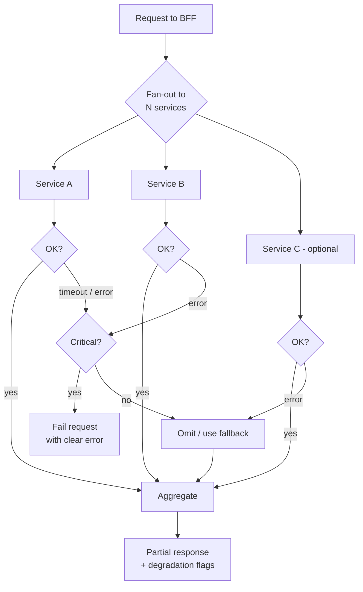

# Backends for Frontend — Senior

<!-- level-focus -->
At senior level, focus on this question:

> Which system invariant is affected by **Backends for Frontend** under failure, load, and change?

Use the smallest realistic scenario that exposes the decision and its failure behavior.
## 1. The problem BFF solves

Start with the anti-pattern BFF replaces: a single shared API that every client calls. Over time that API accretes contradictory requirements. The web app wants rich, denormalized payloads it can render in one shot. The mobile app wants small payloads because bytes cost money and radios cost battery. A partner integration wants stable, versioned, narrow contracts. When one API tries to serve all three, you get query parameters like `?view=mobile&fields=id,name,thumb&expand=author`, conditional serialization branches, and a contract nobody can evolve without risking three teams at once.

A BFF cuts the knot by giving each frontend its own backend. The mobile BFF returns exactly the shape the mobile screen needs, aggregating three downstream microservices into one response so the phone makes one round trip instead of five. The web BFF returns a different shape, tuned for a desktop layout. Each is small, each is owned by the team that consumes it, and each can change at the speed of its own client.

The key mental model: a BFF is presentation logic that happens to run on a server. It belongs to the experience, not to the domain.

---

## 2. When a BFF pays off — and when it's overhead

BFF is a pattern with a real cost — another deployable, another on-call rotation, another hop. It pays off only when the forces are strong enough to justify that cost.

**Signals that a BFF pays off:**

- **Multiple divergent clients.** Two or more frontends with genuinely different data shapes, not just different CSS. If mobile and web want the same JSON, you don't need two backends.
- **Heavy aggregation.** A screen needs data from four services. Doing that fan-out on the server — close to the services, on a fast network — beats doing it on a phone over a lossy 4G link.
- **Mobile bandwidth and round-trip pressure.** Every round trip on mobile can cost hundreds of milliseconds. Collapsing N calls into 1 and trimming payloads is a direct, measurable UX win.
- **Client-specific protocols or formats.** One client wants Protobuf, another wants JSON; one wants server-driven UI, another wants raw resources. A BFF absorbs that divergence.
- **Independent release cadence.** The mobile team wants to ship API changes without coordinating with the web team. Separate BFFs decouple their release trains.

**Signals that a BFF is overhead:**

- **A single client.** One web app talking to one service does not need a BFF — the service *is* the backend. Adding a BFF is a hop and a codebase for nothing.
- **A thin, pass-through API.** If the BFF just forwards requests to one downstream service without aggregating or reshaping, it earns its keep only as an auth boundary, not as a BFF.
- **Clients that already agree.** If all your frontends want the same shape today and there's no divergence on the roadmap, a shared API is simpler and you can split later.

| Signal | Favors BFF | Favors shared API |
|---|---|---|
| Number of divergent clients | 2+ | 1 |
| Aggregation across services | Heavy | Little / none |
| Mobile / low-bandwidth client | Yes | No |
| Payload shape divergence | High | Low |
| Team release independence needed | Yes | No |
| Team size / ownership | Dedicated frontend team | Shared / small team |

The honest default: start with a shared API. Introduce a BFF when the pain of divergence is real, not speculative. Splitting a shared API into BFFs later is straightforward; unwinding three premature BFFs back into one is not.

---

## 3. Code duplication and shared-logic creep

The most common way BFFs go wrong is that they stop being thin. A screen needs a bit of business logic — a discount calculation, a permission check, a currency conversion — and someone implements it in the mobile BFF. A month later the same logic appears, subtly different, in the web BFF. Now you have two copies of a business rule drifting apart, and a bug fixed in one is still live in the other.

This is the central tension of the pattern. BFFs *should* contain presentation and aggregation logic. They should *not* contain domain business logic — that belongs downstream, in the services that own the data. When domain logic creeps into the BFF layer, you get:

- **Duplication across BFFs** — the same rule reimplemented per client.
- **Inconsistency** — the mobile app and web app compute different totals.
- **Ownership confusion** — is the discount rule the frontend team's or the pricing team's?

The fixes, in order of preference:

1. **Push domain logic down.** If two BFFs need the same discount calculation, that calculation belongs in the pricing service, exposed as an endpoint. The BFFs just call it. This is the correct fix and eliminates the duplication at the source.
2. **Extract shared libraries for cross-cutting concerns.** Auth token parsing, request tracing, error mapping, retry/circuit-breaker config, downstream client SDKs — these are legitimately shared and belong in a library each BFF imports. This keeps genuinely common plumbing DRY without coupling the BFFs' presentation logic.
3. **Keep BFFs deliberately thin.** Treat any non-trivial logic in a BFF as a code smell to investigate. The rule of thumb: a BFF *shapes and aggregates*, it does not *decide*.

The trap with shared libraries is over-sharing. If a "shared BFF library" grows to contain presentation logic, you've recreated the shared-API coupling you split up to avoid — now with extra hops. Shared libs are for infrastructure and downstream clients, not for the response shapes that make each BFF distinct.

---

## 4. BFF vs GraphQL

GraphQL is the most direct alternative to a hand-rolled BFF, and the comparison is worth understanding precisely because they solve overlapping problems in opposite ways.

A hand-rolled BFF is **imperative and server-defined**: the server decides what shape each screen gets, and the client takes it. GraphQL is **declarative and client-defined**: the client sends a query listing exactly the fields it wants, and one endpoint returns exactly that. GraphQL is, in a sense, a generic BFF where the "per-client tailoring" moves from server code into the client's query.

**When a hand-rolled BFF wins:**

- You want the shaping logic and aggregation policy under server control — caching, rate limits per screen, backend-for-backend orchestration, non-trivial transformations that don't map cleanly to a graph.
- Clients are few and stable; the flexibility of arbitrary queries buys you little.
- You need protocols GraphQL doesn't naturally do (binary formats, streaming to constrained clients) or want to avoid GraphQL's operational surface (query cost analysis, N+1 resolver problems, persisted-query management).

**When GraphQL wins:**

- Many clients with fast-changing, unpredictable field needs. Instead of the frontend team asking the BFF team to add a field, the client just requests it.
- You'd otherwise build and maintain a proliferating set of near-identical BFF endpoints; GraphQL's single flexible endpoint collapses them.
- Over-fetching and under-fetching are your dominant pain, and letting the client pick fields solves it directly.

The catch: GraphQL doesn't delete BFF concerns, it relocates them. You still need aggregation (resolvers), auth, caching, and — critically — protection against expensive client queries. A GraphQL server sitting in front of your services *is* a BFF; it just uses a query language instead of bespoke endpoints. Many teams run both: a GraphQL BFF per client experience.

---

## 5. Ownership: the frontend team owns it

The defining organizational property of a BFF is that **the frontend team owns it**. That is not incidental — it is the entire point. A BFF exists so the team building the experience can change the experience's backend without filing a ticket with another team. If a separate backend team owns the mobile BFF, you've reintroduced the cross-team coordination cost that motivated the split, plus a hop.

This ownership model has a natural fault line: **cross-cutting concerns**. Auth, observability, rate limiting, mutual TLS, service discovery, and secure downstream connectivity are not the frontend team's expertise and shouldn't be reimplemented per BFF. This is where a platform team earns its place — not by owning the BFFs, but by providing:

- A **BFF framework or template** with cross-cutting concerns wired in by default.
- **Shared client SDKs** for downstream services with resilience baked in.
- **Golden paths** for deploy, secrets, and observability so a BFF is cheap to stand up correctly.

The healthy division: the frontend team owns the *what* (response shapes, aggregation, screen logic); the platform team owns the *how* (the runtime, the plumbing, the guardrails). The tension is real and never fully resolved — expect ongoing negotiation over where a given concern lives. The failure modes are a platform team that over-reaches into presentation logic (recreating a shared API) and a frontend team that reimplements security primitives badly (per-BFF auth bugs). Draw the line at "does this differ per experience?" — if yes, frontend owns it; if no, platform provides it.

---

## 6. The new SPOF: latency hop and fan-out failure

A BFF is a new node on the critical path. Every request now passes through it, which means it is a new single point of failure and a new source of latency. This is the price of the pattern and must be engineered for, not assumed away.

**Latency.** The BFF adds a hop, but it usually *reduces* total latency for the client by fanning out to downstream services in parallel over a fast internal network instead of forcing the client to make serial calls over the internet. The win is real only if the BFF fans out concurrently and its own overhead stays small. A BFF that calls services serially throws away most of its value.

**Fan-out failure.** When a BFF aggregates five services into one response, the naive implementation fails the whole response if any one service fails — a 99.9%-available downstream, called five times, drops the composite to ~99.5%. This is unacceptable, and the fix is to treat partial failure as normal:

Concretely, a resilient BFF applies:

- **Per-call timeouts** shorter than the client's overall deadline, so one slow service can't hold the whole response hostage.
- **Circuit breakers** on each downstream, so a failing service is skipped fast instead of retried into the ground.
- **Partial responses** for non-critical data — render the product page even if the "recommendations" service is down, and flag the gap so the client degrades gracefully.
- **A distinction between critical and optional dependencies.** Only critical-dependency failures should fail the request; optional ones degrade.
- **Bulkheading** — separate connection pools per downstream so one saturated dependency can't exhaust the resources needed to call the others.

The BFF being a SPOF is mitigated the usual way: run multiple stateless instances behind a load balancer. Keep it stateless precisely so it scales horizontally and any instance can serve any request.

---

## 7. Auth and token handling at the BFF

The BFF is the ideal place to handle authentication for browser-based clients, and this has become the recommended pattern for SPA security. The problem it solves: a single-page app that holds access and refresh tokens in JavaScript-reachable storage (localStorage, or even JS-readable memory) is exposed — any XSS vulnerability lets an attacker exfiltrate those tokens.

The **BFF security pattern** moves the tokens server-side:

1. The SPA authenticates through its BFF; the OAuth/OIDC flow completes on the server.
2. The access and refresh tokens are stored **at the BFF**, never sent to the browser.
3. The browser holds only a **secure, HttpOnly, SameSite session cookie** tied to the BFF session. JavaScript can't read it, so XSS can't steal it.
4. On each request the BFF validates the cookie, looks up the session, attaches the real bearer token, and calls downstream services.
5. The BFF handles token refresh transparently — the browser never sees or manages a token.

This turns the BFF into a confidential OAuth client and a token-handling boundary. The benefits: tokens never touch the browser, refresh logic lives in one server-side place, and you get a natural spot to enforce CSRF protection (the cookie needs anti-CSRF measures precisely because it's now the auth credential). The cost: the BFF becomes stateful with respect to sessions (or must validate self-contained cookies), and it's now security-critical code — a bug here is an auth bypass. For mobile BFFs the calculus differs, since native apps have more secure storage than a browser, but the aggregation and token-exchange roles still commonly live at the BFF.

---

## 8. Proliferation risk

The pattern's greatest strength — one backend per experience — is also its failure mode at scale. Left unchecked, BFFs multiply: one per platform, then one per major feature, then one per team, until you have dozens of thin, near-identical backends, each with its own deploy pipeline, on-call rotation, dependency graph, and drift.

Symptoms of unhealthy proliferation:

- BFFs that differ only trivially, kept separate out of org politics rather than genuine divergence.
- Cross-cutting fixes (a security patch, a downstream client upgrade) that must be applied N times across N BFFs.
- More time spent maintaining BFF infrastructure than building experiences.

Controls that keep proliferation in check:

- **One BFF per user-experience, not per team or per feature.** The right granularity is usually per *client type* (web, iOS, Android, partner), sometimes per major distinct product area — not finer.
- **A shared framework/template** so each BFF is cheap to run and cross-cutting changes propagate through a library bump rather than N rewrites.
- **Consider GraphQL federation** when the BFF count is genuinely driven by field-shape divergence rather than logic divergence — it can collapse many endpoints into one flexible graph (see §9).
- **Periodic consolidation reviews.** If two BFFs have converged in shape, merge them. Divergence justified the split; convergence should reverse it.

The discipline is the same as with microservices: the pattern gives you autonomy, and autonomy without governance becomes sprawl.

---

## 9. The decision: BFF vs gateway vs GraphQL federation

These three are often conflated but sit at different layers and solve different problems. A mature system frequently uses more than one.

| Dimension | API Gateway | BFF | GraphQL Federation |
|---|---|---|---|
| Primary purpose | Cross-cutting edge concerns (auth, rate limit, routing, TLS) | Experience-specific shaping & aggregation | Unified graph over many services, client picks fields |
| Aggregation | Minimal / routing only | Heavy, per-experience | Yes, via subgraphs + gateway |
| Response shaping | Generic | Tailored per client | Client-driven via query |
| Owned by | Platform team | Frontend team (per client) | Shared graph team + service teams |
| Client flexibility | Low | Medium (server-defined per client) | High (query-defined) |
| Best when | You need one edge for all traffic | Clients diverge in shape & round-trip needs | Many clients, unpredictable field needs, many services |
| Main risk | Becomes a fat monolith if it aggregates | Proliferation, logic creep | Query cost, resolver N+1, operational complexity |

How to reason about the choice:

- **Gateway and BFF are complementary, not alternatives.** The gateway handles edge cross-cutting concerns for *all* traffic (TLS termination, coarse rate limiting, routing, WAF). The BFF handles experience-specific aggregation for *one* client. A common topology is client → gateway → BFF → services. Don't push per-experience aggregation into the gateway — that recreates a shared-API bottleneck at the edge.
- **BFF vs GraphQL federation is the real fork.** Both aggregate; the question is whether the aggregation shape is *server-decided per experience* (BFF) or *client-decided via query* (GraphQL). Choose federation when you have many services, many clients, and field-level divergence that would otherwise spawn a proliferation of BFF endpoints. Choose hand-rolled BFFs when the shaping is complex, orchestration-heavy, or protocol-specific in ways a graph doesn't model cleanly, and when you want tight server-side control over cost and caching.
- **The hybrid is common and legitimate.** Gateway at the edge; a GraphQL BFF for the flexible web client; hand-rolled BFFs for constrained mobile or partner clients that benefit from bespoke shaping. The patterns compose; treating them as mutually exclusive is the mistake.

The decision should follow the forces from §2 — number and divergence of clients, aggregation weight, ownership boundaries — not fashion. If you can't articulate which force a proposed BFF or federation layer answers, you probably don't need it yet.

---

## 10. Takeaways

- A BFF is presentation and aggregation logic on a server, owned by the frontend team; it exists to serve one experience and should stay thin.
- Introduce a BFF when clients genuinely diverge, aggregation is heavy, or mobile round-trips hurt — not for a single thin client. Start shared, split on real pain.
- Keep domain logic downstream; push shared rules into the owning service, and share only cross-cutting plumbing via libraries. Logic creep is the pattern's most common decay.
- GraphQL is a client-defined BFF; it relocates BFF concerns rather than deleting them. Federation collapses proliferation when the divergence is field-shape, not logic.
- A BFF is a new SPOF and hop — engineer fan-out with timeouts, circuit breakers, partial responses, and a critical-vs-optional dependency split; run it stateless and horizontally scaled.
- Use the BFF as a token-handling boundary so SPA tokens stay server-side behind an HttpOnly cookie.
- Gateway (edge cross-cutting) + BFF (per-experience shaping) + GraphQL federation (client-picked fields) compose; pick by the forces at play, and govern proliferation deliberately.

*Next step:* [Backends for Frontend — Professional](professional.md)

---

## Apply it

1. State the system invariant that **Backends for Frontend** must protect.
2. Mark ownership, state, and failure propagation at each boundary.
3. Compare two designs under load, dependency failure, and future change.
4. Define recovery and compatibility behavior before implementation.
5. Test the riskiest assumption with a focused experiment.

## Verify your work

- The experiment supports the design with evidence, not preference.
- Failure injection shows the blast radius and recovery path.
- Compatibility checks cover old and new callers or data.
- Operational signals reveal invariant violations and recovery progress.

## Review questions

- Which invariant must remain true when Backends for Frontend fails?
- Where should recovery responsibility live, and why?
- Which assumption deserves an experiment before implementation?
- How can the design evolve without changing every consumer at once?
