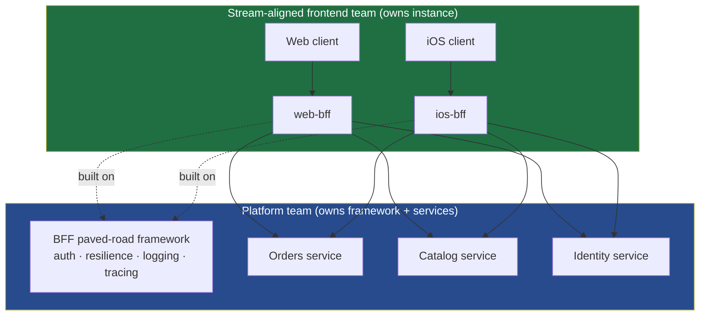
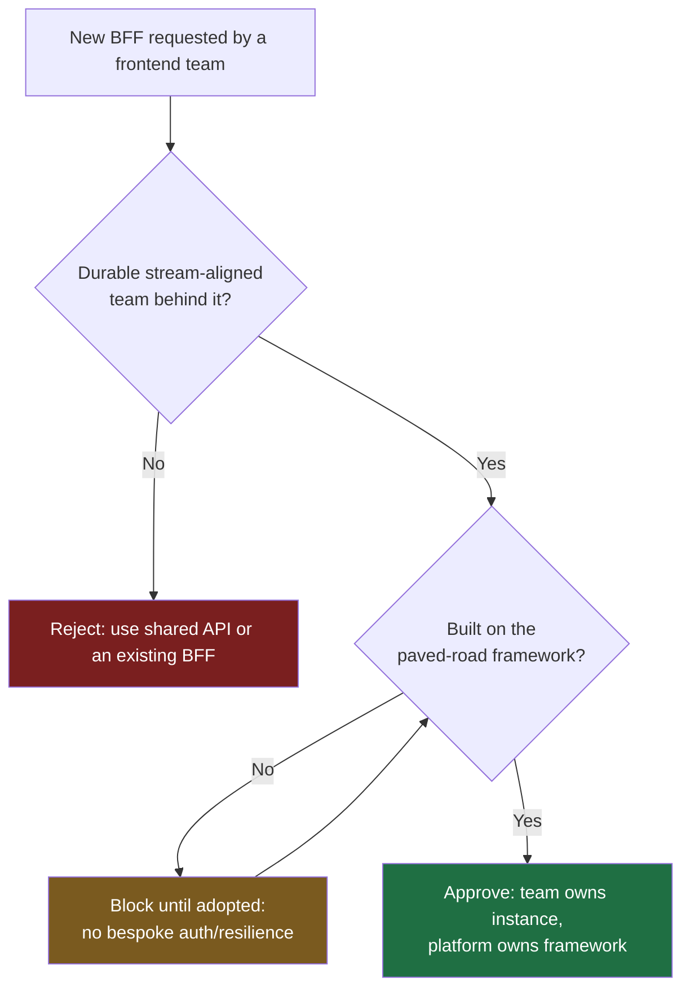

# Backends for Frontend — Staff

At staff level, Backends for Frontend (BFF) is not primarily a technical pattern — it is an **organizational one**. The decision to give each frontend its own backend is a decision about who can ship without asking permission. That reframing changes every question: not "does this reduce over-fetching?" but "does this let the web team deploy on Friday without coordinating with the iOS team, the platform team, and the payments team?" This file is about governing that trade — capturing the autonomy while paying down the sprawl it invites.

## Table of Contents

1. [BFF as a Conway's-Law artifact](#1-bff-as-a-conways-law-artifact)
2. [Ownership boundaries: who owns what](#2-ownership-boundaries-who-owns-what)
3. [The proliferation problem and paved-road governance](#3-the-proliferation-problem-and-paved-road-governance)
4. [Keeping business logic out of the BFF](#4-keeping-business-logic-out-of-the-bff)
5. [When to consolidate or switch to federation](#5-when-to-consolidate-or-switch-to-federation)
6. [The cost ledger: another deployable, another on-call](#6-the-cost-ledger-another-deployable-another-on-call)
7. [Framing the trade to leadership](#7-framing-the-trade-to-leadership)
8. [Staff takeaways](#8-staff-takeaways)

---

## 1. BFF as a Conway's-Law artifact

Conway's Law observes that systems mirror the communication structure of the organizations that build them. The BFF pattern is Conway's Law applied deliberately rather than accidentally. A single shared API forces every frontend team through one backend team's roadmap, one deploy cadence, one set of priorities. That shared surface becomes a coordination bottleneck: the mobile team needs a field the web team doesn't, the web team needs a payload shape mobile doesn't, and both wait in the same queue.

A BFF cuts the queue. When the web team owns a `web-bff`, it can add an endpoint, reshape a response, or ship an experiment without filing a ticket against another team. **The org benefit is autonomy, not bytes on the wire.** Over-fetching and chatty round-trips are real BFF wins, but they are the small prize. The large prize is that a stream-aligned team owns its full path to production — from React component down to the aggregating backend it controls.

This is the lens that separates a staff-level BFF decision from a mid-level one. A mid-level engineer asks whether a BFF makes the client simpler. A staff engineer asks whether the team boundary the BFF encodes is the boundary the org actually wants to keep. If the answer is yes — a durable, long-lived frontend team that ships independently — the BFF is a good investment. If the "team" is two contractors on a six-week project, a BFF is org theater: infrastructure encoding a boundary that will dissolve before it pays back.

> Reference: the pattern is described in Sam Newman's writing (martinfowler.com/articles/micro-frontends and Newman's *Building Microservices*), and the team-shape reasoning aligns with Team Topologies (teamtopologies.com).

---

## 2. Ownership boundaries: who owns what

The most common BFF failure is not technical — it is a fuzzy ownership line. A BFF sits between a frontend team and a set of platform-owned services, and it is tempting for both sides to disclaim it. The frontend team says "it's backend, not ours"; the platform team says "it's client-specific, not ours." That gap is where BFFs rot.

The staff-level rule is a clean three-way split:

| Concern | Owner | Rationale |
|---|---|---|
| The BFF instance (`web-bff`, `ios-bff`) — its endpoints, its deploy | The stream-aligned frontend team | It exists to serve *their* client; they must ship it at their cadence |
| The BFF *framework* / paved road (auth, resilience, logging, tracing scaffolding) | The platform team | Cross-cutting, must not be reimplemented N times |
| The downstream domain services the BFF calls | The platform / domain teams | Business capabilities are shared org assets, not per-client |

The frontend team owns the *what* — which aggregations, which shapes, which experiments. The platform team owns the *how* — the runtime, the guardrails, the security defaults. Neither owns the other's half. When this line is clear, the BFF is a well-defined product with a named on-call rotation. When it is fuzzy, the BFF becomes an orphan: everyone depends on it, no one improves it, and it silently accumulates the very cross-team coupling it was meant to remove.

---

## 3. The proliferation problem and paved-road governance

The autonomy that makes BFFs valuable is exactly what makes them proliferate. Five frontend teams get five BFFs, and — left ungoverned — five independent reimplementations of token validation, retry-and-timeout logic, circuit breaking, structured logging, correlation-ID propagation, and metrics. Now a JWT-validation bug has to be fixed in five places by five teams on five schedules, and one of them will miss it. The sprawl doesn't just cost duplicated effort; it costs a **fragmented security and reliability surface**.

The wrong reaction is to ban BFFs and force everyone back onto a shared API — that throws away the autonomy for which BFFs existed. The right reaction is to **mandate a shared framework, not a shared backend**. Provide a paved road: a blessed BFF template or library, maintained by platform, where auth, resilience, and observability come pre-wired and correct. Teams still own their instance and still ship independently — they just don't get to reinvent the cross-cutting plumbing.

Governance here is a lightweight gate, not a committee. Two questions decide it: *is there a real, durable team to own this?* and *is it built on the paved road?* If both are yes, get out of the way. The paved road is what converts BFF proliferation from a liability into a non-event — ten BFFs on one hardened framework is fine; three BFFs each hand-rolling auth is not.

---

## 4. Keeping business logic out of the BFF

A BFF should **orchestrate, not own domain rules**. Its legitimate job is presentation-layer work: call several downstream services, aggregate and reshape their responses for one specific client, handle client-specific auth token exchange, and degrade gracefully when a dependency is slow. It is the *adapter* between a domain and a UI, and it should stay thin.

The failure mode is business-logic leakage. Pricing rules, eligibility checks, tax calculation, inventory reservation, discount stacking — these are domain concepts. When they migrate into a BFF because "it was faster to put it there," two bad things happen. First, the logic now lives in a client-specific place, so the *same rule diverges* across web-bff and ios-bff and they compute different prices. Second, the domain team can no longer reason about or change the rule, because part of it escaped into a frontend team's codebase. The BFF has quietly become a second, shadow domain service — the exact coupling the architecture was meant to prevent.

| Belongs in the BFF (orchestration) | Does NOT belong in the BFF (domain) |
|---|---|
| Aggregating N service calls into one client payload | Pricing, tax, discount, or fee calculation |
| Reshaping/renaming fields for one specific UI | Eligibility, authorization, or business-rule decisions |
| Client-specific auth token exchange | Writing authoritative domain state (place order, adjust inventory) |
| Response caching tuned to one client's usage | Cross-entity invariants and consistency rules |
| Graceful degradation / fallback payloads | Anything a second BFF would need to duplicate to stay correct |

The staff heuristic: **if two BFFs would have to implement the same rule to stay consistent, that rule belongs downstream, not in either BFF.** When a domain rule shows up in a BFF pull request, the review action is to push it into a shared service, not to approve it and add a "TODO: move later" that never happens.

---

## 5. When to consolidate or switch to federation

BFF-per-team is the right default when frontend teams are durable, distinct, and shipping at different rhythms. But the pattern has failure conditions where the honest staff move is to consolidate BFFs or replace them with GraphQL federation. Read the signals rather than the ideology.

| Keep BFF-per-team (autonomy wins) | Consolidate or move to federation (sprawl wins) |
|---|---|
| Each frontend has a distinct, durable owning team | Several "BFFs" are maintained by the same team — no real boundary |
| Client payload needs genuinely diverge (web vs native vs TV) | BFFs are near-identical, differing by a few fields |
| Teams ship on independent cadences and value it | Every change already requires cross-BFF coordination anyway |
| Aggregation logic is simple and stable | The core need is flexible client-driven field selection at scale |
| A handful of clients | Many clients each wanting a different slice of the same graph |

Two consolidation paths matter. **Merging BFFs** is right when the boundary they encode has evaporated — a reorg collapsed three frontend teams into one, and now one team maintains three deployables for no autonomy benefit. **GraphQL federation** is right when the real requirement has shifted from "each client needs a different orchestration" to "each client needs a different *projection of a shared graph*." Federation lets each domain team own its slice of a unified schema while clients query exactly the fields they need — replacing hand-written per-client aggregation with a queryable graph. It is not automatically better; it trades bespoke BFF code for a federation gateway that platform must now own and operate. Choose it when field-selection flexibility across many clients is the dominant force, not when you simply have BFF fatigue.

The anti-pattern to name explicitly: adopting federation as a *technical* fix for what is an *organizational* problem. If BFFs proliferated because ownership was fuzzy, federation will proliferate subgraphs with the same fuzzy ownership. Fix the boundary first; the technology choice is downstream of it.

---

## 6. The cost ledger: another deployable, another on-call

Every BFF is a running service, and staff engineers are the ones accountable for the total-cost-of-ownership arithmetic that mid-level advocates often skip. A BFF is:

- **Another deployable** — its own pipeline, environments, config, secrets, and release process.
- **Another on-call surface** — pages when it falls over at 3 a.m., and a rotation that must exist to answer them.
- **Another dependency hop** — added latency and one more thing between the client and the data that can fail.
- **Another security boundary** — it holds tokens and calls internal services; it must be patched and audited like any edge service.

None of this is a reason to avoid BFFs. It is a reason to **count the BFFs**. The autonomy dividend is real when a durable team reaps it repeatedly over years; the operational tax is also real and is paid every single day whether or not the dividend materializes. A BFF owned by a team that isn't staffed to run it on-call is not autonomy — it is a latent incident. The paved road (section 3) is what keeps this tax bounded: shared framework means one place to patch, one observability standard, one hardened runtime, so the marginal operational cost of the tenth BFF is far lower than the first.

The number to watch is BFFs-per-owning-team. One team, one BFF: healthy. One team, four BFFs: you are paying four operational taxes for one team's autonomy — consolidate.

---

## 7. Framing the trade to leadership

Leadership does not fund "backends for frontend." It funds *outcomes* and worries about *sprawl*. The staff job is to translate the pattern into that vocabulary honestly, without overselling.

**Frame the upside as delivery speed and team autonomy, not architecture elegance.** The sentence that lands is: "Each product team can ship its own experience end-to-end without waiting in another team's queue — that removes the coordination tax that's slowing releases." Tie it to a concrete pain leadership already feels (a delayed launch that stalled on cross-team dependencies), not to abstract cleanliness.

**Name the cost in the same breath.** Credibility comes from volunteering the downside: "Each BFF is another service to run and be on-call for. Left ungoverned, five teams build five copies of auth and resilience — that's duplicated cost and five places a security bug can hide." Then present the control: "We contain that with a shared paved-road framework the platform team owns, so teams get autonomy without reinventing the plumbing."

**Present it as a governed trade, not a blank check.** The leadership-grade framing is *autonomy vs sprawl*, with a stated policy that keeps sprawl bounded: BFFs are allowed only for durable stream-aligned teams, only on the paved road, and we track BFFs-per-team and consolidate when a boundary disappears. This turns a potentially unbounded proliferation risk into a governed program — which is what makes leadership comfortable funding it.

---

## 8. Staff takeaways

- A BFF is an **organizational artifact** — deliberate Conway's Law. Its primary value is a stream-aligned team's autonomy to ship end-to-end, not saving bytes on the wire.
- Draw a **clean three-way ownership line**: frontend team owns the instance, platform owns the framework/paved road, domain teams own the downstream services. Fuzzy ownership is the top BFF failure mode.
- The proliferation risk is real. The fix is **a shared framework, not a shared backend** — mandate the paved road; don't ban BFFs.
- Keep the BFF **thin: it orchestrates, it does not own domain rules.** If two BFFs would need the same rule to stay correct, that rule belongs downstream.
- **Consolidate or federate on signals, not ideology** — same team maintaining many near-identical BFFs, or a shifted need toward flexible field selection across many clients.
- Every BFF is **another deployable and another on-call**. Count BFFs-per-owning-team; more than one is usually a consolidation signal.
- To leadership, frame it as **autonomy vs sprawl with a stated governance policy** — volunteer the cost, present the paved-road control, and it becomes fundable.

*Next step:* [Backends for Frontend — Interview](interview.md)
