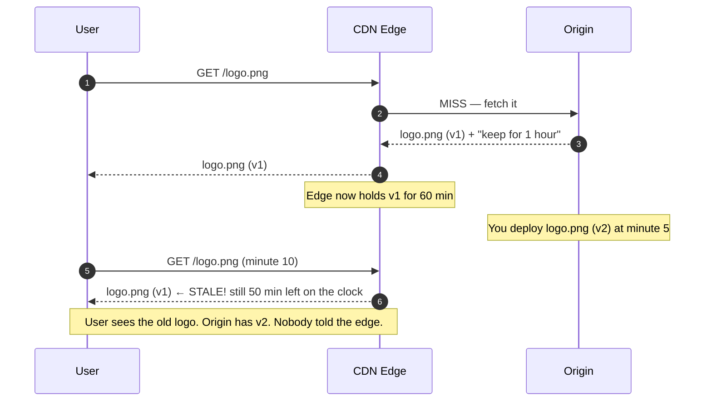
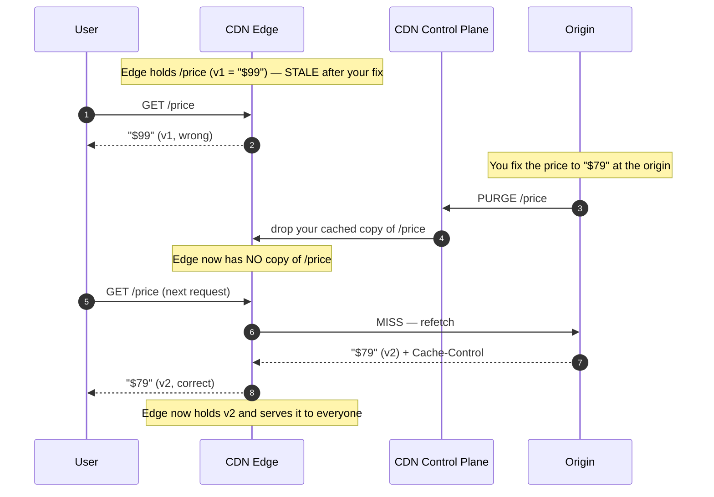

# Cache Invalidation — Junior

<!-- level-focus -->
At junior level, focus on this question:

> How can I apply **Cache Invalidation** in one small example and prove the result?

Use the smallest realistic scenario that exposes the decision and its failure behavior.
## 1. What "Invalidation" Actually Means

A CDN is a network of servers ("edge nodes") spread around the world. When a user
requests `logo.png`, the nearest edge node serves it. If the edge has a saved copy,
it answers instantly without ever talking to your origin server. That saved copy is
a **cache entry**.

**Invalidation** is the act of making a cache entry stop being used — so that the
next request fetches a fresh copy instead of the old saved one. You are not
"deleting a file." You are telling the cache: *"the copy you are holding is no longer
trustworthy; get a new one."*

The subtlety that trips up every junior engineer: **you deployed a new version, but
users still see the old one.** Your origin is correct. Your code is correct. The edge
node between you and the user is confidently handing out a copy it saved an hour ago.
Fixing that is cache invalidation.

---

## 2. Why Cached Copies Go Stale (First Principles)

Caching is a bet. The CDN bets that the copy it saved a moment ago is still the same
as what your origin would return right now. That bet pays off almost always — which is
exactly why caching makes the web fast. But it is still a bet, and sometimes it loses.

A cached copy goes **stale** when the origin's version changes but the cached version
does not. The cache has no magical way to know your origin changed. From the edge
node's point of view, nothing happened — it is just sitting on bytes it saved earlier.



The core reason staleness exists: **the cache and the origin are two different
computers that update at different times, and the cache decides on its own how long
to trust its copy.** Everything below is a strategy for closing that gap.

---

## 3. The Three Basic Ways to Update a Cached Copy

There are exactly three fundamental moves. Everything fancier is a refinement of one
of these.

1. **Wait for TTL expiry** — do nothing; let the copy's built-in timer run out. The
   cache re-checks with the origin on its own schedule.
2. **Purge** — actively tell the CDN "throw away your copy of X, now." The next
   request is forced to refetch.
3. **Change the URL** — publish the new content under a *different* address (e.g.
   `logo.v2.png` or `logo.png?v=2`). The old URL keeps its old cached copy forever,
   but nobody asks for it anymore because your HTML now points at the new URL.

The mental trick: the first two say *"make the cache forget this thing."* The third
says *"don't fight the cache — just rename the thing so the old cache entry becomes
irrelevant."* That third framing is why cache-busting is so reliable.

---

## 4. Way 1 — Wait for TTL Expiry

**TTL** = Time To Live. When the origin serves a file, it attaches a header saying how
long the copy may be reused, most commonly `Cache-Control: max-age=3600` (reuse for
3600 seconds = 1 hour). The CDN starts a countdown. While the countdown runs, the edge
serves its saved copy. When it hits zero, the entry is considered stale and the CDN
**revalidates** — it asks the origin "is this still current?" — before serving again.

**Concrete example.** Your origin serves the daily weather widget with
`Cache-Control: max-age=300` (5 minutes). You update the widget at 10:02. Edges that
cached it at 10:00 will keep serving the 10:00 data until 10:05, then refetch and pick
up your change. No action needed from you — the staleness window is *at most* 5
minutes, which for weather is fine.

The essential trade-off lives entirely in the TTL number:

- **Long TTL** (e.g. a day): great performance, fewer origin hits — but changes take
  up to a day to appear.
- **Short TTL** (e.g. 10 seconds): changes appear fast — but the CDN keeps bothering
  your origin, eroding the whole benefit of having a CDN.

TTL is the *passive* strategy. You accept a bounded window of staleness in exchange
for zero operational effort. Perfect for content that changes on a predictable schedule
or where "a few minutes old" is harmless.

> A useful refinement you'll meet later: `stale-while-revalidate` lets the edge serve
> the slightly-old copy *instantly* while it refetches in the background, so users never
> wait. It is still fundamentally the TTL strategy — just gentler on latency.

---

## 5. Way 2 — Explicit Purge

Sometimes you cannot wait for a timer. You published a legal correction, or a wrong
price, or a broken image. You want it gone from every edge **now**. A **purge** (also
called *invalidate* or *ban*) is an explicit command you send to the CDN — usually via
its API or dashboard — naming the URL(s) whose cached copies must be discarded.

**Concrete example.** You run an online store. A product's price was cached with a
1-hour TTL, and it is wrong. You cannot let it show a wrong price for up to an hour, so
you call the CDN's purge API for `/product/42`. Within seconds the edges drop their
saved copy; the next shopper triggers a refetch and sees the corrected price.

Two flavors you should know the *names* of (details come in `middle.md`):

- **Purge by URL** — "drop exactly `/product/42`." Precise, but you must know every URL
  that changed.
- **Purge everything** — "drop the whole cache." A blunt hammer. It works, but every
  edge is suddenly empty, so the next wave of requests all miss and slam your origin
  (a *thundering herd*). Reach for it rarely.

Purge is the *active* strategy: fast, targeted, but it costs an API call and only helps
if you know *which* URLs to name. Its weakness is bookkeeping — if one page bundles ten
images and you forget one, that one stays stale.

---

## 6. Way 3 — Change the URL (Cache-Busting / Versioning)

This is the cleverest of the three, and the one most senior systems lean on for static
assets. Instead of updating the file *at the same address*, you publish the new content
at a **new address** and update your HTML to point there.

Since a cache is keyed by URL, `logo.abc123.png` and `logo.def456.png` are, as far as
the cache is concerned, two completely unrelated objects. The old one can stay cached
forever — harmlessly — because after the deploy nothing links to it anymore.

**Concrete example.** A build tool renames your stylesheet based on its contents:

```
Before deploy:  <link href="/styles.a1b2c3.css">   ← cached with max-age=1 year
After deploy:   <link href="/styles.f9e8d7.css">   ← brand-new URL, guaranteed fresh
```

The old `styles.a1b2c3.css` is still sitting in caches worldwide, but no HTML page
references it, so no one requests it. The new `styles.f9e8d7.css` has never been cached
by anyone, so the very first request fetches your fresh version. You get to set an
absurdly long TTL (a year) *and* get instant updates — the two things that fight each
other under Ways 1 and 2 stop fighting here.

Common ways to change the URL:

- **Content hash in the filename** — `app.f9e8d7.js` (the hash changes only when the
  file's bytes change). This is the gold standard.
- **Version in the path** — `/v2/app.js`.
- **Query string** — `app.js?v=42` (works, though some older caches treat query-string
  URLs inconsistently — a hashed filename is safer).

The catch, and why it isn't the answer to *everything*: it only works when *you*
control the URL and can update every reference to it. It is perfect for CSS, JS, and
images you ship in a build. It cannot help with a URL that must stay stable — like
`/`, `/api/products`, or a permalink someone bookmarked. For those, you are back to TTL
or purge.

---

## 7. Side-by-Side Comparison

| | TTL Expiry | Explicit Purge | Versioned / Cache-Busted URL |
|---|---|---|---|
| **What you do** | Set `max-age`, then nothing | Call the CDN's purge API | Publish content at a new URL |
| **How fast updates appear** | After the TTL runs out (seconds–days) | Seconds (near-instant) | Instantly, on next page load |
| **Effort per update** | None (passive) | One API call + know the URLs | Handled by your build tool |
| **Can you use a very long TTL?** | Only if slow updates are OK | Yes, purge overrides it | **Yes** — long TTL is the point |
| **Origin load** | Periodic re-checks | Spike right after purge | Very low; old URLs never re-fetched |
| **Needs you to control the URL?** | No | No | **Yes** |
| **Main weakness** | Staleness window; wrong TTL is costly | Must know exactly what changed | Only works for URLs you can rename |
| **Best for** | Content that ages predictably (feeds, weather) | Corrections, urgent fixes on stable URLs | Static assets from a build (JS/CSS/images) |

The healthiest real-world setup uses **all three together**: version your build assets
(Way 3) so they can have year-long TTLs, set sensible TTLs on your HTML and API
responses (Way 1), and keep purge (Way 2) in your back pocket for emergencies.

---

## 8. A Staged Walkthrough: Old → Purge → Refetch → New

Follow the lifecycle of a single correction pushed via purge. This is the mental movie
to keep in your head.



Read it as four beats: **(1) the edge is serving the old copy → (2) you purge it, so the
edge is now empty → (3) the next request is a miss, forcing a refetch from origin → (4)
the fresh copy is served and re-cached.** That empty-then-refetch step is the whole
mechanism. TTL expiry follows the same beats, except the "purge" step happens
automatically when the timer hits zero instead of because you sent a command.

---

## 9. Why This Is Genuinely Hard

The Karlton quote isn't a joke about typing effort. Cache invalidation is hard for
reasons that are easy to feel once you've been burned:

- **The cache and the truth drift apart silently.** Nothing errors out. The system is
  "working" — it's just serving a confident, wrong answer. Bugs you can't see coming
  are the worst kind.
- **You have to name every stale thing.** A single page can pull HTML, three
  stylesheets, ten images, and two API calls — each cached separately. Purge the page
  but forget one image and users see a half-updated Frankenstein.
- **There are many caches, not one.** The browser caches. The CDN edge caches. There
  may be a mid-tier cache. Invalidating one doesn't touch the others. "It's fixed on my
  machine" often means "my browser cache happened to expire."
- **Timing is a race.** Between "I deployed v2" and "I purged v1" there's a window where
  users can be served either. Get the order wrong (purge, *then* deploy) and you cache
  v1 all over again.

The reason Way 3 (versioned URLs) is so beloved: it sidesteps most of this. If the new
content lives at a new URL, there is no stale entry to hunt down, no race, and no cache
to coordinate — the old entry simply becomes an orphan nobody asks for.

---

## 10. Common Mistakes at This Level

1. **Setting a long TTL on content that changes, with no purge plan.** You cache the
   homepage for a day, update it, and it's frozen for a day. Long TTL is safe *only*
   when paired with versioning or purge.
2. **Editing a file in place and expecting instant global updates.** Same URL + long
   TTL = old copy lingers. Change the URL, or purge, or shorten the TTL.
3. **Confusing your browser cache with the CDN cache.** A hard-refresh clears *your*
   browser but does nothing to the edge node serving everyone else. Test in a private
   window or check response headers, not just your own reload.
4. **"Purge everything" as a reflex.** It empties every edge at once; the next traffic
   wave all misses and hammers your origin. Purge the specific URLs instead.
5. **Purging before deploying.** You purge, the edge refetches — but your new content
   isn't live yet, so it re-caches the *old* version. Deploy first, then purge.
6. **Cache-busting with a query string on a picky old cache.** Some caches ignore or
   mishandle query strings; a hashed filename (`app.f9e8d7.js`) is the robust choice.

---

## 11. Hands-On Exercise

You maintain a small marketing site behind a CDN. Three things need updating today:

1. **The company logo** (an image shipped with your build).
2. **The homepage `/`** (a stable URL, must keep its address).
3. **A blog post `/blog/launch`** with a typo in the third paragraph.

For each, on paper:

- Pick which of the three strategies (TTL / purge / versioned URL) you'd use, and say
  why in one sentence.
- State what the user sees *immediately after your change* and *after any cache clears*.
- For the logo, write what its filename looks like before and after the change.

Then answer: which of these three could you set a **one-year TTL** on with zero
downside, and what property makes that safe? (Hint: it's the one whose URL you control
and can rename.)

---

## 12. Key Terms

| Term | Definition |
|------|-----------|
| Cache entry | A saved copy of a response held at an edge node, keyed by its URL |
| Stale | A cached copy whose origin version has since changed |
| TTL (`max-age`) | How long, in seconds, a copy may be reused before re-checking with origin |
| Revalidate | The cache asking the origin "is my copy still current?" when TTL expires |
| Purge / Invalidate | An explicit command telling the CDN to discard a cached copy now |
| Cache-busting | Publishing new content at a new URL so old cache entries become irrelevant |
| Content hash | A fingerprint of a file's bytes, put in its filename so the URL changes only when the content does |
| Thundering herd | A flood of simultaneous origin requests after many edges miss at once |

---

*See it animated:* [How CDNs work — Cloudflare Learning](https://www.cloudflare.com/learning/cdn/what-is-a-cdn/) · [`Cache-Control` on MDN](https://developer.mozilla.org/en-US/docs/Web/HTTP/Headers/Cache-Control)

*Next step:* [Cache Invalidation — Middle](middle.md)

---

## Apply it

1. Choose one small, known input for **Cache Invalidation**.
2. Predict the output or observable behavior.
3. Run the smallest example or probe that exercises the concept.
4. Change one input to trigger a failure or boundary case.
5. Explain the evidence using the guide's vocabulary.

## Verify your work

- Record the exact input, command or code path, and output.
- Repeat the probe and confirm the result is consistent.
- Show one expected success and one expected failure.
- Resolve any difference between the prediction and the evidence.

## Review questions

- What problem does Cache Invalidation solve in the example?
- Which input changes the observed result, and why?
- What is the smallest useful success check?
- Which beginner mistake would your evidence catch?
