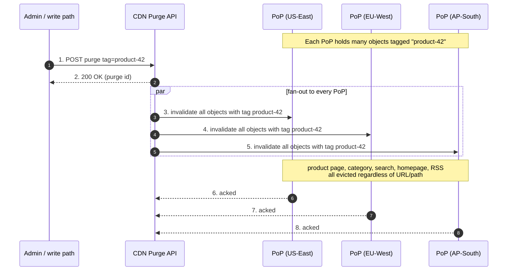
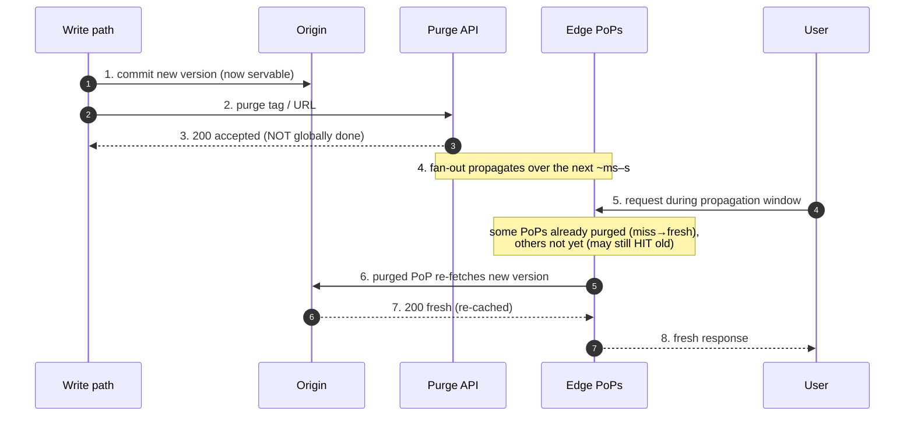
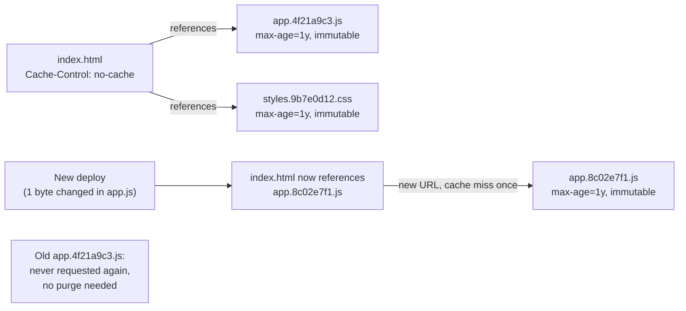

# Cache Invalidation — Middle

<!-- level-focus -->
At middle level, focus on this question:

> Where does **Cache Invalidation** belong in a maintainable component, and which trade-off selects the design?

Use the smallest realistic scenario that exposes the decision and its failure behavior.
---

## 2. The Invalidation Problem, Precisely Stated

TTL alone answers "how long may this object be stale *at most*?" It cannot answer "the price just
changed — make every edge stop serving the old price *within seconds*." That second requirement is
what a purge API exists for.

Two forces pull in opposite directions:

- **Long TTLs** maximize hit ratio and offload origin, but widen the staleness window.
- **Short TTLs** shrink staleness but hammer the origin with revalidations and lower hit ratio.

The mature pattern breaks this tension: **cache "forever" (long TTL), and purge on change.** This
gives you both a high hit ratio *and* near-immediate correctness — but only if your purge is fast,
targeted, and cheap to trigger from the write path that owns the data.

The central design question for this file: **when a fact changes, how do I name the set of cached
objects affected by that change, and how fast can I evict exactly that set?**

---

## 3. Purge Scope: URL vs Prefix/Wildcard vs Everything

CDNs expose purge at three granularities. Choosing the wrong one is the most common invalidation
mistake — too narrow and you miss objects; too broad and you cause an origin stampede.

### 3.1 Purge by exact URL (single object)

You know the precise object that changed. This is the cheapest, safest, most surgical purge.

```text
# Fastly — purge one object by URL
PURGE https://www.example.com/products/42.json

# Fastly — purge by URL via API (no wildcard match, exact key)
POST /purge/https://www.example.com/products/42.json
Host: api.fastly.com
Fastly-Key: <token>
```

Note that a "URL" is often only *part* of the cache key. If the CDN varies on query string,
`Accept-Encoding`, or a device group, then `/img/hero.jpg` and `/img/hero.jpg?w=800` are *distinct*
cached objects. Purging one does **not** purge the other — a frequent source of "I purged it but
it's still stale."

### 3.2 Purge by prefix / wildcard (a path subtree)

You changed a whole directory or a templated family of URLs (e.g., all thumbnail sizes of one
image, or every page under `/blog/2026/`). Not every provider supports true wildcards; some only
support **directory/prefix** purge.

```text
# Prefix purge — everything under a path
POST /purge
{ "purge": "prefix", "path": "/blog/2026/" }
```

Wildcard/prefix purge is powerful and dangerous: `/img/*` can evict millions of objects at once,
and the *next* request for each will miss and hit origin. If the subtree is large and hot, you have
just built a **thundering herd** at the origin. Prefer tag-based purge (§4) over broad wildcards
whenever the affected set is defined by *meaning* ("all objects showing product 42") rather than by
*path shape*.

### 3.3 Purge everything (whole service)

The nuclear option: invalidate the entire cache for a service. Legitimate uses are narrow —
a botched deploy poisoned the cache, a config error made every object wrong, or you rotated a
signing key. It is almost never the right answer to a data change.

```text
# Fastly — purge all
POST /service/<service_id>/purge_all
Host: api.fastly.com
Fastly-Key: <token>
```

After a purge-all, hit ratio drops to ~0% and *every* subsequent request is a miss until the cache
refills. On a high-traffic property this can overwhelm the origin. If you must purge-all, do it
during low traffic and ensure the origin (or an origin shield / mid-tier cache) can absorb the
refill.

### 3.4 Scope comparison

| Scope | Selects | Origin refill risk | Typical use | Wildcards? |
|-------|---------|--------------------|-------------|------------|
| **Exact URL** | one cached object (per cache-key variant) | minimal | a single asset/page changed | n/a |
| **Prefix / wildcard** | a path subtree | high if subtree is large & hot | a directory or templated URL family changed | provider-dependent |
| **Tag / surrogate key** | every object sharing a logical key, regardless of path | scoped to the tag's fan-out | a *fact* changed (a product, a user, a category) | n/a — set defined by meaning |
| **Purge everything** | the entire service cache | catastrophic (full refill) | poisoned cache, bad deploy, key rotation | n/a |

---

## 4. Surrogate Keys / Cache Tags: Tag-Based Purge

Path-based purge fails when one fact appears on many unrelated URLs. Product 42 shows up on the
product page, the category listing, the search results, the homepage carousel, and an RSS feed —
five different paths, no common prefix. Tag-based purge solves this by letting the **origin label
each response** with one or more logical keys at cache-store time, then purging by that key.

The mechanism has two halves:

1. **On the response**, the origin emits a header listing the tags for that object. Fastly calls
   this `Surrogate-Key`; several others (Cloudflare Enterprise, Akamai) call it `Cache-Tag`. The
   CDN strips this header before sending to the client and records the object under each tag.
2. **On change**, the origin (or an admin action) calls the purge API with the tag. The CDN evicts
   *every* object tagged with that key, across all PoPs.

```text
# Origin response — one object, multiple surrogate keys (space-separated for Fastly)
HTTP/1.1 200 OK
Cache-Control: max-age=31536000, s-maxage=31536000
Surrogate-Key: product-42 category-shoes homepage
Content-Type: application/json

# Origin response — Cache-Tag variant (comma-separated)
HTTP/1.1 200 OK
Cache-Control: public, max-age=31536000
Cache-Tag: product-42,category-shoes,homepage
```

```text
# Purge everything tagged product-42, everywhere, in one call
POST /service/<service_id>/purge/product-42
Host: api.fastly.com
Fastly-Key: <token>
Surrogate-Key: product-42

# Cloudflare — purge by cache tag (Enterprise)
POST /client/v4/zones/<zone_id>/purge_cache
Authorization: Bearer <token>
{ "tags": ["product-42"] }
```

The killer property: the write path only needs to know **the identity of the thing that changed**
(`product-42`), not the set of URLs that display it. The mapping from fact → URLs is captured
implicitly by whatever tags the origin stamped at render time. Add a new page that shows product 42
tomorrow — tag it `product-42` and it is automatically covered by the same purge with no code
change to the purge caller.

### 4.1 Tag-based purge, staged



### 4.2 Tag design rules of thumb

- **Tag by entity identity**, not by page. `product-42`, `user-1001`, `order-9`, `category-shoes`.
- **Emit multiple tags per response** for every entity the response depends on. A category page
  that lists 30 products should carry all 30 product tags *plus* its own category tag, so editing
  any one product correctly evicts the listing.
- **Keep tag cardinality sane.** One tag per entity is fine; a unique tag per *request* is useless
  (you can never purge a set). Providers cap tags per object (e.g., Fastly's `Surrogate-Key` header
  has a practical length limit) — batch or hash if a response depends on hundreds of entities.
- **Namespace tags** to avoid collisions across content types: `prod-42` vs `cat-42`.

---

## 5. Soft Purge vs Hard Purge

A **hard purge** deletes the object from the edge. The very next request is a guaranteed **miss**
that must go to origin — correct, but it removes the safety net of having a copy on hand.

A **soft purge** does not delete the object; it **marks it stale**. The edge keeps the bytes and,
on the next request, serves the stale copy immediately while revalidating in the background — but
only if the object's caching directives permit stale serving (i.e., it was cached with
`stale-while-revalidate` and/or `stale-if-error`). Soft purge turns an invalidation into a
"refresh soon," not a "delete now."

```text
# Fastly — soft purge by surrogate key (adds the soft flag)
POST /service/<service_id>/purge/product-42
Fastly-Key: <token>
Fastly-Soft-Purge: 1
```

### 5.1 Why soft purge matters

Consider purging `homepage`, tagged on your busiest object, at peak traffic:

- **Hard purge:** the object vanishes. Thousands of concurrent requests all miss simultaneously and
  race to the origin — a stampede. Users may see elevated latency; the origin may buckle.
- **Soft purge:** the object is marked stale. The *first* request after the purge is served the
  (slightly) stale copy instantly and triggers *one* background revalidation; once the fresh copy
  lands, everyone gets it. No stampede, no user-visible latency spike, at the cost of a brief window
  where a few responses are stale.

Soft purge deliberately trades a small, bounded staleness window for stampede protection and
smooth latency. It requires that serving-stale be *acceptable* for that content — never soft-purge
data that must be correct on the very next read (e.g., a "you are now banned" flag, a price used at
checkout, or a legally-required takedown).

### 5.2 Soft vs hard purge

| Dimension | Hard purge | Soft purge |
|-----------|------------|------------|
| Effect on edge object | deleted | marked stale, bytes retained |
| Next request | guaranteed miss → origin | stale served instantly + background revalidate* |
| Origin load spike | high — potential stampede on hot objects | low — collapses to ~one revalidation |
| User-visible latency after purge | first request pays full origin RTT | first request served immediately |
| Staleness window | none (object gone) | brief, bounded by revalidation time |
| Requires `stale-while-revalidate`? | no | yes, to serve stale during refresh |
| Use when | correctness must be immediate; takedowns; small/cold objects | hot objects; smooth latency preferred; brief staleness tolerable |

\* *Stale-serving on soft purge depends on the object having been stored with `stale-while-revalidate`
(and/or `stale-if-error`); without it, a soft purge behaves closer to a plain revalidation.*

---

## 6. Purge Latency and Propagation Across PoPs

A purge is not instantaneous everywhere. The API returns quickly (it accepts the request and begins
a fan-out), but the *effect* — every PoP having evicted or marked the object — completes over some
propagation interval. You must design for this window.

Key realities:

- **The API ack ≠ global completion.** A `200 OK` from the purge endpoint typically means "accepted
  and dispatched," not "every edge on Earth has already dropped it." Fast providers reach global
  effect in seconds (Fastly advertises purges completing in roughly ~150 ms for URL purges on their
  network; measure, don't assume); others take longer, especially for tag or wildcard purges that
  must expand into large object sets at each node.
- **Propagation is per-PoP and often per-cache-node.** A single PoP has many cache servers; the
  purge must reach all of them. Larger fan-out (tag/wildcard) = more work per node = longer tail.
- **Ordering with the origin write matters.** If you purge *before* the origin serves the new
  version, a concurrent miss can re-populate the edge with the *old* content (a race that
  re-poisons the cache). The safe order is: **write to origin so the new version is servable →
  then purge.** For read-through consistency, some teams purge, then issue a warming request that
  forces the fresh fetch.



Practical guidance for the propagation window:

- Treat purge as **eventually consistent**. If a change must be atomic and globally visible in the
  same instant, purge is the wrong tool — use versioned URLs (§7) so old and new never share a key.
- For correctness-critical purges, verify: after purging, poll a representative object through the
  CDN (bypassing your local cache) until it reflects the new content, and only then declare the
  change live.
- Batch related purges into a single tag when possible; N separate URL purges = N fan-outs and N
  chances for a straggler PoP.

---

## 7. Cache-Busting: Fingerprinted Filenames + `immutable`

The cheapest invalidation is **no invalidation at all.** If a new version of an asset gets a *new
URL*, there is nothing to purge — the old URL keeps its old bytes (harmlessly, since nothing
references it anymore) and the new URL is a fresh cache key that misses once and then caches
"forever." This is the standard approach for static build assets (JS/CSS bundles, images).

The technique: embed a **content hash (fingerprint)** in the filename.

```text
# Before build:  app.js, styles.css
# After build (hash of file contents in the name):
app.4f21a9c3.js
styles.9b7e0d12.css
```

The HTML (which is *not* fingerprinted and is served with a short TTL or `no-cache`) references the
hashed names. Change one byte of `app.js` → its hash changes → the reference in the HTML changes →
clients and edges request a brand-new URL. The old `app.4f21a9c3.js` is simply never requested
again.

Because a fingerprinted URL's content can **never** change (a different content = a different URL),
you can cache it maximally aggressively and tell browsers not to even bother revalidating:

```text
# The fingerprinted asset — cache for a year, never revalidate
Cache-Control: public, max-age=31536000, immutable

# The HTML that references it — must stay fresh so new hashes are picked up
Cache-Control: no-cache
```

`immutable` (RFC 8246) tells the browser: *do not send a conditional request to revalidate this,
even on reload.* Without it, a user hitting refresh triggers `If-None-Match` requests for every
asset (getting `304`s that cost a round trip each); with it, the browser serves from local cache
outright. It is safe *only* because the URL is content-addressed — the value can never differ for
that URL.



### 7.1 Fingerprinting vs purge

| Aspect | Fingerprinted URLs (`immutable`) | Purge-based invalidation |
|--------|----------------------------------|--------------------------|
| Invalidation cost | zero (new URL, nothing to evict) | API call + fan-out per change |
| Atomicity | perfect — old and new never share a key | eventually consistent window |
| Client revalidation traffic | none (`immutable`) | possible `304`s |
| Works for | build/static assets referenced by an index | dynamic content (API JSON, HTML pages) with stable URLs |
| Requires | build step that rewrites references | origin tagging + purge integration |
| Stale risk | only if HTML/index itself is over-cached | during propagation window |

The two are complementary: fingerprint everything with a stable build output and a referencing
index (JS/CSS/images), and reserve tag/URL purge for content whose URL must stay constant (a
canonical page URL, an API resource) but whose *body* changes.

The classic trap: fingerprint the assets, then accidentally cache the referencing **HTML** with a
long TTL. Now the edge serves old HTML that points at the old hashes, and the new assets are never
requested. Rule: **fingerprinted assets = long TTL + `immutable`; the entry-point HTML = `no-cache`
or a very short TTL.**

---

## 8. Choosing a Strategy: A Decision Table

| Situation | Strategy | Why |
|-----------|----------|-----|
| Static JS/CSS/image bundle from a build | Fingerprinted filename + `max-age=1y, immutable` | zero purge cost, perfect atomicity |
| A single API resource / page body changed | Hard purge by exact URL | surgical, minimal origin refill |
| One entity appears on many unrelated URLs | Tag / surrogate-key purge | evict by meaning, not path |
| A whole path subtree regenerated | Prefix/wildcard purge (watch stampede) | matches the path shape |
| Hot object changed at peak traffic | **Soft** purge (+ `stale-while-revalidate`) | avoids stampede, smooth latency |
| Legal takedown / must be gone now | **Hard** purge (URL or tag) | no stale-serving allowed |
| Poisoned cache / bad deploy | Purge everything (off-peak, with shield) | only justification for the nuclear option |
| Change must be globally atomic | Version the URL (fingerprint) instead of purging | purge is eventually consistent |

---

## 9. Middle Checklist

- [ ] Every cacheable dynamic response is stamped with entity **surrogate keys / cache tags** at
      the origin (`Surrogate-Key` / `Cache-Tag`), covering *all* entities it depends on.
- [ ] The write path purges by **tag/entity identity**, not by enumerating URLs.
- [ ] Purge **scope** is the narrowest that covers the change; wildcard/purge-all are exceptions
      with a documented stampede mitigation (shield, off-peak, warming).
- [ ] **Soft purge** is used for hot objects and paired with `stale-while-revalidate`; **hard
      purge** is reserved for takedowns and correctness-critical changes.
- [ ] Purge order is **origin-write-then-purge**; correctness-critical changes are verified through
      the CDN after purge, accounting for the propagation window.
- [ ] Build assets use **fingerprinted filenames + `immutable`**; the referencing HTML/index is
      `no-cache` or short-TTL so new hashes are always picked up.
- [ ] Cache-key variants (query string, `Vary`, device group) are understood so a purge actually
      covers every variant of the object.

*Next step:* [Cache Invalidation — Senior](senior.md)

---

## Apply it

1. Find a real component where **Cache Invalidation** affects an interface or dependency.
2. Write two plausible choices and the constraint that favors each one.
3. Make the smallest reversible change at that boundary.
4. Exercise the component alone, then exercise the integrated flow.
5. Keep the decision note with the evidence that selected the option.

## Verify your work

- A focused check proves the local behavior.
- An integrated check proves callers and dependencies still agree.
- Logs, traces, compiler output, or benchmarks expose the boundary.
- Reverting the change restores the previous behavior without unrelated edits.

## Review questions

- Which boundary is most affected by Cache Invalidation?
- What constraint would make you choose the alternative design?
- How would you isolate a local defect from an integration defect?
- What evidence shows that the change remains maintainable?
