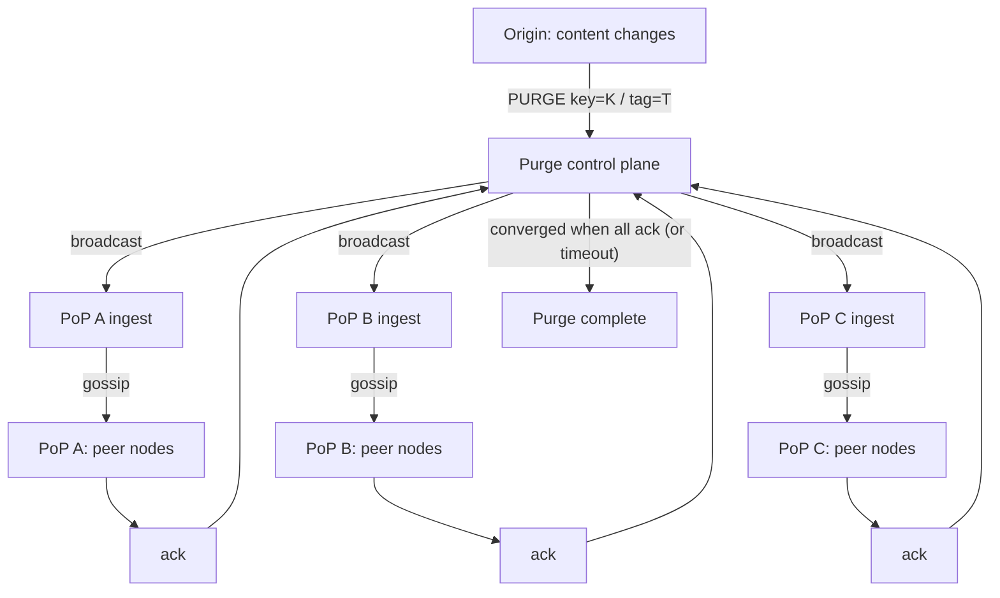
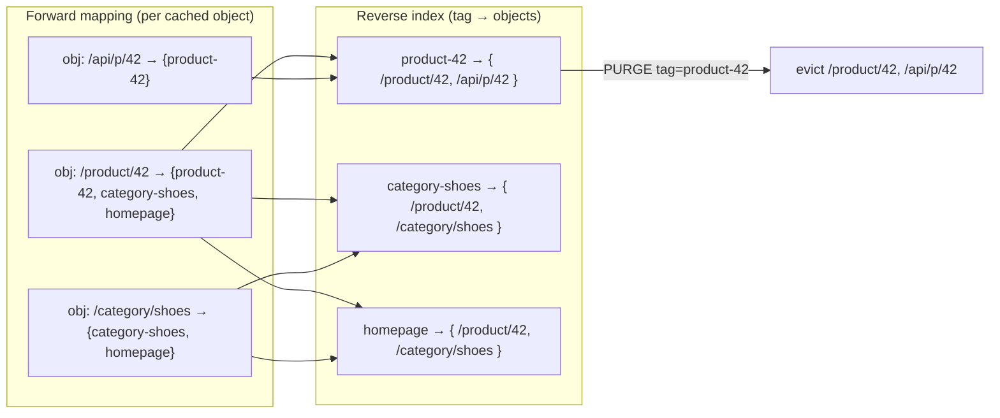

# Cache Invalidation — Professional

<!-- level-focus -->
At professional level, focus on this question:

> How should teams adopt and operate **Cache Invalidation** with measurable outcomes and limited coordination?

Use the smallest realistic scenario that exposes the decision and its failure behavior.
---

## 1. Invalidation vs. Revalidation: Two Different Mechanisms

The vocabulary is routinely conflated, and the conflation causes real design errors. They are distinct operations with distinct triggers, costs, and consistency properties.

**Invalidation (eviction)** removes an entry from the cache — or marks it stale-and-unusable — so that the next request is forced to the origin (or to a parent tier). It is a *push*: the origin actively signals the CDN that a stored representation must no longer be served. The object is *gone* from the serving path until refetched.

**Revalidation (conditional refresh)** keeps the stored representation but asks the origin "is this still fresh?" using a conditional request — `If-None-Match: <etag>` or `If-Modified-Since: <date>`. RFC 9111 §4.3 defines this: when a stored response becomes stale, the cache MAY reuse it after successful validation. A `304 Not Modified` refreshes the freshness lifetime *without* transferring the body; a `200 OK` replaces it. Revalidation is a *pull*, triggered lazily by a client request against a stale-but-present entry.

The critical asymmetry: **invalidation changes cache membership; revalidation changes freshness.** Invalidation is origin-initiated and eager. Revalidation is edge-initiated and lazy.

| Dimension | Invalidation (Purge / Evict) | Revalidation (Conditional Refresh) |
|---|---|---|
| Trigger | Origin push (content changed) | Edge pull (entry became stale, client requests it) |
| Mechanism | `PURGE` / soft-purge / tag purge | `GET` with `If-None-Match` / `If-Modified-Since` |
| Effect on entry | Removed or made unusable | Retained; freshness lifetime extended |
| Body transfer on refresh | Full body on next miss | None on `304`; full only on `200` |
| Latency to correctness | Bounded by propagation time | Immediate for the requesting client |
| Origin load pattern | Thundering herd risk on hot keys | Cheap `304`s dominate |
| RFC 9111 basis | §4.4 (invalidation on unsafe methods) | §4.3 (validation) |
| Consistency it buys | Removes stale data everywhere | Guarantees *this* response is current |

**Soft-purge** blurs the line productively: instead of deleting, it marks the entry `stale` (age forced past its freshness lifetime). The entry stays resident, so the *next* request triggers a **revalidation** rather than a cold miss. This is the recommended default for high-traffic keys — it converts a potential stampede of full-body origin fetches into cheap conditional `304`s, and it enables `stale-while-revalidate` (RFC 5861) so the client is served the old copy instantly while the refresh happens out-of-band. Hard-purge (delete) is correct only when the old representation is *unsafe* to serve for even one more request (e.g., leaked-secret revocation).

---

## 2. Purge Propagation as a Distributed-Systems Problem

A CDN's cache is a replicated data structure with no single writer and no global transaction. A purge is a *delete* that must reach every replica that might hold the key. There are two structural approaches to distributing that delete.

**Broadcast (fan-out from a control plane).** A central purge service holds (or discovers) the set of PoPs and pushes the purge to each. This gives a tight, predictable convergence bound but concentrates load and a failure domain in the control plane; the control plane must itself be replicated and must track per-PoP acknowledgements to claim completion.

**Gossip (epidemic propagation).** Each node forwards the purge to a few peers; the message spreads epidemically. No node needs the global membership list, and the system tolerates partial failure gracefully, but convergence time is now a *probability distribution* with a long tail — the last replica may learn late.



Most large CDNs use a **hybrid**: broadcast from a replicated control plane to one ingest node per PoP, then intra-PoP gossip (or a local pub/sub bus) to reach every cache node in that PoP. This bounds the wide-area hop count to one while keeping the intra-PoP fan-out cheap and failure-tolerant.

**Convergence time** is the metric that matters. Define it as the interval from purge submission to the moment the *last* replica has applied the delete. For a broadcast tier with wide-area propagation delay `d_wan` and intra-PoP gossip that converges in `d_pop`, convergence is roughly `d_wan + d_pop` for the tail node. This number is the *staleness window*: for that window, some fraction of edges may still serve the old object. You cannot make it zero; you can only bound it and measure it (p50/p99 convergence are the SLOs a serious CDN publishes internally).

**Ordering hazard.** A purge for key `K` can race an in-flight *fill* (an origin fetch that repopulates `K`). If the fill lands *after* the purge is applied at a node, that node re-caches the stale body and the purge is effectively lost. Correct designs attach a monotonic version/timestamp to both purge and fill, so a node only accepts a fill whose version is newer than the last purge it saw for that key (a form of last-writer-wins with logical time). Without this, at-least-once purge delivery still does not guarantee eventual eviction.

---

## 3. Surrogate-Key Indexing and Reverse-Index Cost

Purging by URL does not scale to real content models: a single database row (a product, an article) may appear in hundreds of cached pages — the product page, category listings, the homepage, an API response, an RSS feed. **Surrogate keys** (a.k.a. cache tags) solve this. The origin attaches a header — `Surrogate-Key: product-42 category-shoes homepage` — to each response. The CDN records, for every cached object, the set of tags it carries. To invalidate everything touching product 42, the origin issues a *single* tag purge `product-42`, and the CDN evicts every object indexed under that tag.

The data structure that makes this possible is a **reverse index**: `tag → set(object keys)`. Building and maintaining it is the real cost.



**Cost dimensions of the reverse index:**

- **Space.** Every (object, tag) membership is an index entry. With `N` cached objects each carrying `t` tags on average, the index holds `N·t` entries. On a large PoP with tens of millions of objects and a handful of tags each, this is hundreds of millions of entries — it must live in RAM for purge to be fast, so it competes with cache storage itself. This is why CDNs cap tags-per-response (commonly a few dozen) and cap total tag cardinality.
- **Write amplification.** Every cache fill must update `t` index entries; every eviction (including LRU-driven ones) must remove them, or the index leaks and grows unbounded. Lazy cleanup (tombstones swept later) trades space for write cost.
- **Lookup cost at purge.** A tag purge is `O(|set|)` — proportional to the number of objects under that tag. A tag on the homepage may index a large fraction of the cache; purging it is an expensive scan-and-evict. This is why "broad" tags are dangerous: they turn a routine content update into a near-cache-flush.
- **Distribution.** The reverse index is itself per-node (or per-PoP) state. It must be rebuilt or repopulated when a node cold-starts, and it must stay consistent with the actual resident set — a purge that consults a stale index either misses objects (correctness bug) or evicts already-gone entries (wasted work).

The engineering discipline is **tag hygiene**: tags should be as narrow as the invalidation you actually need. `product-42` is good; `all-products` is a footgun. Bloom filters are sometimes used to answer "could this object carry this tag?" cheaply before doing the exact set lookup, trading a small false-positive eviction rate for a much smaller index.

---

## 4. The Math of Purge Fan-Out

Treat a purge as a fan-out job and the capacity questions become arithmetic. Let:

- `k` = number of PoPs (say **80**)
- `m` = cache nodes per PoP (say **20**) → total replicas `R = k·m = 1600`
- `o` = objects evicted per node for this tag (surrogate-key set size at a node), say **500**
- `d_wan` = one-way wide-area propagation to the farthest PoP ≈ **60 ms**
- `d_pop` = intra-PoP gossip convergence ≈ **15 ms**
- `r` = purge request rate the origin issues, say **200 tag-purges/sec** during a large content push

**Message fan-out.** A broadcast-to-ingest, gossip-within-PoP design sends `k` wide-area messages (one per PoP ingest = **80**) plus intra-PoP propagation. If intra-PoP gossip has fan-out `f=3`, reaching `m=20` nodes takes ⌈log₃ 20⌉ = **3 rounds**. The control plane's wide-area message count per purge is `k = 80`; the *total* messages including intra-PoP are on the order of `k·m = 1600`. At `r = 200` purges/sec, the control plane emits `200·80 = 16,000` wide-area messages/sec and the system as a whole moves `200·1600 = 320,000` purge messages/sec — this is the number that sizes your purge bus.

**Eviction work.** Each purge evicts `o` objects per node. Per node, that is `o = 500` index-lookups-and-deletes. Across the fleet per purge: `R·o = 1600·500 = 800,000` evictions. At `r = 200` purges/sec: `200·800,000 = 1.6×10⁸` evictions/sec fleet-wide — spread over 1600 nodes, that is `1.6×10⁸ / 1600 = 100,000` evictions/sec/node, which each node's index must sustain. This is the calculation that tells you whether a bulk content migration will melt the purge path.

**Convergence (staleness window).** For the hybrid design the tail node applies the purge at approximately:

```
T_converge ≈ d_wan + (rounds × per_round_gossip) + processing_jitter
           ≈ 60 ms + (3 × 15 ms) + jitter
           ≈ 105 ms + jitter
```

So the *bounded staleness window* is on the order of **~100–150 ms at p99** for this topology. During that window, a request hitting a not-yet-purged replica may serve the old object. You quote this window to product teams as the invalidation SLA — never "instant."

**Origin protection check.** After eviction, the *next* request to each purged key is a miss. If a hot tag was purged and there are `k=80` PoPs, up to `80` simultaneous origin fills can occur (one per PoP, assuming intra-PoP request collapsing). With naive per-node behavior it would be `R=1600`. This is why **request collapsing / coalescing** at each tier is mandatory: it caps origin fan-in from `R` to `k` (or to 1 if you add a shielding parent tier). Soft-purge further softens this: the fills become conditional `304`s instead of full transfers.

---

## 5. Consistency Guarantees and Why Linearizable Invalidation Is Impractical

Rank the guarantees a CDN can realistically offer for "the content changed" → "no edge serves the old version":

| Consistency level | Definition for cache invalidation | Achievable on a CDN? | Cost / mechanism |
|---|---|---|---|
| **Linearizable** | The instant the origin commits a change, *no* replica anywhere can serve the old value | No — impractical | Would require a global lock / consensus on every read-serve |
| **Sequential** | All replicas apply purges in the same order, but not necessarily real-time | Partially | Total-order broadcast on the purge bus; still no read-time guarantee |
| **Bounded staleness** | No replica serves data older than `Δ` after the change (e.g., `Δ = 150 ms`) | Yes — this is the target | Bounded convergence + measured p99; soft-purge |
| **Eventual** | Every replica *eventually* stops serving the old value; no time bound | Yes — the floor | At-least-once purge delivery; the weakest useful promise |

**Why linearizable invalidation is impractical.** Linearizability requires that a read observe the effect of every write that completed before it began, in real time, across all replicas. For a CDN that means: before *any* of the 1600 edge nodes serves object `K`, it must confirm — synchronously, per request — that no newer version exists at the origin. That is a coordination round-trip on *every cache hit*, which annihilates the entire value proposition of a cache (serve from RAM at the edge with zero origin contact). You would be reintroducing origin latency on every request and coupling availability to the origin's — a CAP-theorem-shaped trap: to be linearizable across a partition you must sacrifice availability, and edge availability is precisely what a CDN exists to provide. The moment you accept edge nodes serving without per-request coordination, you have accepted staleness; the only remaining question is whether it is *bounded* (good) or merely *eventual* (weaker).

**The practical target is bounded staleness.** You engineer the convergence time (§4), measure it, alarm on p99, and expose it as the invalidation SLA. Content that genuinely cannot tolerate any staleness window (banking balances, live inventory at zero stock) must not be cached with a purge model — it should be `no-store`, or protected with mandatory revalidation (`must-revalidate` + short/zero freshness), which converts every serve into a conditional origin check (RFC 9111 §5.2.2.2). That is linearizable-ish, but you have paid for it by removing the cache's benefit — which is exactly the trade the taxonomy above makes explicit.

---

## 6. Delivery Semantics: At-Least-Once, Idempotency, and Convergence

A purge bus that guarantees **exactly-once** delivery across 1600 nodes and multiple PoPs would itself require distributed consensus and would inherit its latency and availability limits. CDNs instead choose the pragmatic pairing: **at-least-once delivery + idempotent application**.

- **At-least-once** means the purge may be delivered zero-or-more... no — *one-or-more* times; the bus retries until acknowledged, so a purge is never silently dropped, but it may arrive twice.
- **Idempotency** makes duplicate delivery harmless: applying "evict `K`" twice is identical to applying it once (the second is a no-op — `K` is already gone). Eviction is naturally idempotent, which is *why* at-least-once is the right choice: the failure mode of at-least-once (duplicates) costs nothing, while the failure mode of at-most-once (lost purges = permanent staleness) is a correctness bug.

The remaining hazard is the **purge/fill race** from §2. At-least-once eviction plus a concurrent fill can still resurrect stale data if the fill is accepted after the purge. The fix is **logical versioning**: stamp each object and each purge with a monotonically increasing version (or the origin's `Last-Modified`/`ETag` generation). A node accepts a fill only if its version exceeds the highest purge version seen for that key. This makes the *combined* system converge: regardless of message ordering or duplication, every node ends in the same state — the latest version, or evicted — which is the definition of eventual consistency achieved through commutative, idempotent operations.

```mermaid
sequenceDiagram
    participant Origin
    participant Bus as Purge bus (at-least-once)
    participant Node as Edge node
    Origin->>Bus: PURGE K (version v7)
    Bus->>Node: deliver PURGE K v7
    Node->>Node: record max_purge[K] = v7; evict K
    Bus->>Node: re-deliver PURGE K v7 (retry)
    Node->>Node: v7 not > v7 → idempotent no-op
    Note over Node: concurrent fill arrives
    Node->>Node: fill K version v6 → v6 < v7 → REJECT (stale)
    Origin->>Node: fill K version v8 → v8 > v7 → ACCEPT
```

---

## 7. Putting It Together: A Purge Data-Path

Synthesizing the tier into one coherent path from content change to global convergence:

1. **Content changes** at the origin; the write commits and produces a new logical version `v`.
2. The origin issues a **tag purge** (`Surrogate-Key: product-42`) rather than per-URL purges, letting the CDN's reverse index (§3) expand the tag into the concrete object set at each node.
3. The **control plane** accepts the purge, assigns/propagates version `v`, and **broadcasts** it wide-area to one ingest node per PoP (§2), bounding wide-area hops to one.
4. Each PoP **gossips** the purge to its `m` cache nodes; each node consults its reverse index and **evicts** (hard) or **marks stale** (soft) the `o` matching objects (§4), recording `max_purge[K]=v` to defend against the fill race (§6).
5. Delivery is **at-least-once**; duplicate purges are idempotent no-ops; **convergence** completes when the last replica applies the delete (or a timeout is hit and the control plane surfaces the un-acked PoP).
6. The **staleness window** — the interval in which some replica may still serve the old object — is `~d_wan + intra-PoP convergence`, quoted as a **bounded-staleness** SLA (§5), never as linearizable.
7. For hot keys, **soft-purge + `stale-while-revalidate`** (RFC 5861) converts the next-request stampede into cheap conditional revalidations (`If-None-Match` → `304`, RFC 9111 §4.3), and **request collapsing** caps origin fan-in from `R` replicas to `k` PoPs (or to 1 with a shield tier).

The unifying idea: invalidation correctness is a *convergence* property, not an *instant* one. You cannot buy linearizability without discarding the cache; you can — and must — buy a *measured, bounded* staleness window with idempotent at-least-once purges, versioned fills, a lean reverse index, and disciplined tag cardinality.


---

## Apply it

1. Define the user or business outcome that **Cache Invalidation** should improve.
2. Assign one owner for code, contracts, operations, and incidents.
3. Split delivery into reversible increments that produce evidence early.
4. Publish responsibilities, escalation paths, and compatibility windows.
5. Stop or expand only when the agreed measures support that decision.

## Verify your work

- Each increment has an owner, rollback path, and observable exit condition.
- Adoption, reliability, delivery time, and coordination cost are measured.
- Incident and migration exercises prove that responsibility is executable.
- The old path is removed only after telemetry proves it is unused.

## Review questions

- Which measurable outcome justifies investing in Cache Invalidation?
- Which team owns the full lifecycle and incident response?
- What reversible increment produces the earliest useful evidence?
- Which exit condition proves that migration or adoption is complete?
