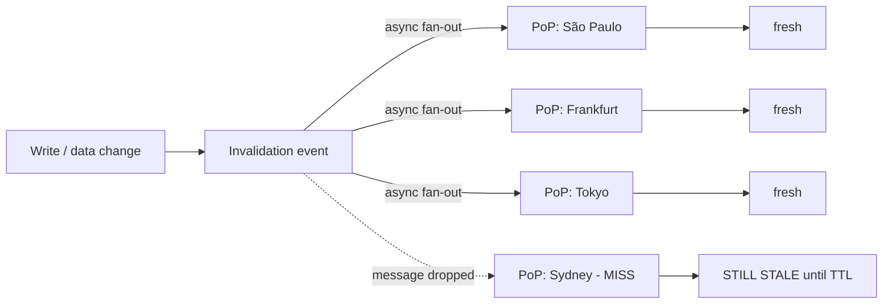
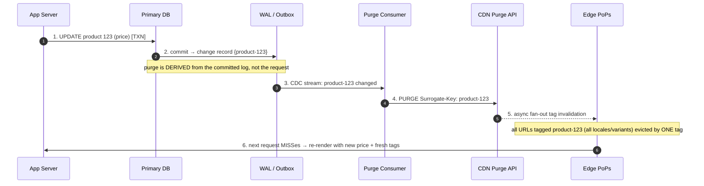

# Cache Invalidation — Senior

<!-- level-focus -->
At senior level, focus on this question:

> Which system invariant is affected by **Cache Invalidation** under failure, load, and change?

Use the smallest realistic scenario that exposes the decision and its failure behavior.
## 1. Responsibilities at This Level

- Own the **freshness SLO** for CDN-served content: define the maximum acceptable staleness
  per content class (e.g., "product price ≤ 60 s stale", "avatar ≤ 5 min", "hashed JS bundle =
  never stale by construction") and hold the design to it.
- Choose the **invalidation model** per content class — immutable-versioned, TTL-only, or
  active purge — with a written justification, not a reflex to "just purge it."
- Guarantee that a purge **failure is bounded and observable**: a dropped purge must degrade to
  "content is stale for at most TTL seconds," never "content is stale forever" or "origin melts."
- Design the **origin's survival** during mass invalidation — request coalescing, SWR, and
  shielding — so that flushing the edge does not become a self-inflicted origin DDoS.
- Lead the review that catches the two classic senior-level mistakes: (1) treating `PURGE` as if
  it were a synchronous, strongly-consistent, cluster-wide transaction, and (2) reaching for a
  wildcard purge to "be safe" and taking down cache-hit-rate globally.

---

## 2. Why Invalidation Is Hard at Scale

> *"There are only two hard things in Computer Science: cache invalidation and naming things."*
> — Phil Karlton. The first half is hard for concrete, mechanical reasons.

A CDN is a **geo-distributed cache with hundreds of PoPs and thousands of cache servers**, each
holding an independent copy of your objects. Invalidation means changing the state of *every*
copy. That collides with physics and with the CAP theorem:

- **No strong consistency across the fleet.** A `PURGE` is a message that must fan out to every
  edge server that might hold the object. It propagates asynchronously over the CDN's internal
  network. There is a real, measurable **propagation window** (typically tens of milliseconds to
  a few seconds; historically longer for full-catalog invalidations) during which some PoPs
  serve the new object and some serve the old one. You cannot make this window zero — that would
  require a distributed lock across the planet on every read.

- **Purge is best-effort / eventually consistent.** The invalidation is a *notification*, not a
  *transaction*. Individual edge nodes can miss the message (node was rebooting, network blip,
  message-bus backpressure). Most CDNs give you no per-node acknowledgment that the purge landed
  — you get "accepted," not "applied everywhere." So you must design assuming **some fraction of
  purges silently fail on some nodes**.

- **Fan-out amplification.** One logical event ("price changed") can map to thousands of cached
  URLs (every locale, every device variant, every query-string permutation). The invalidation
  system must expand that event into the correct URL/tag set — get the expansion wrong and you
  either miss URLs (stale content) or purge too many (cache-hit collapse).

- **The read path never blocks on the write path.** Edge reads are the whole point of a CDN;
  they must stay fast. So invalidation is inherently a *side channel* racing against a firehose
  of reads. During the race, staleness is not a bug — it is the defined behavior.



The design consequence is stark: **if correctness depends on a purge reaching 100% of nodes
instantly, your design is already broken.** Everything below is about not depending on that.

---

## 3. The Central Reframe: Design So You Never Invalidate

The senior move is to eliminate the invalidation *class of problem* wherever possible, then apply
active purge only to the residue that genuinely needs it. Three complementary tactics:

1. **Immutable, content-addressed URLs** — the object's URL changes whenever its bytes change,
   so the old URL is never wrong and simply falls out of cache by disuse. You never invalidate;
   you *stop referencing*. (Section 4.)
2. **Versioned deploys** — flip a single pointer (a version prefix, a manifest) so the whole app
   atomically references a new immutable asset set. (Section 5.)
3. **Event-driven tag purges from the data layer** — for content that *is* mutated in place and
   cannot be content-addressed (an HTML page, an API JSON response), attach **surrogate/cache
   tags** at origin and purge by tag on the exact DB write that changed the underlying data,
   with TTL + SWR as the safety net when the purge is missed. (Sections 6, 8.)

The hierarchy of preference:

| Rank | Strategy | Correctness under purge failure | When it applies |
|------|----------|--------------------------------|-----------------|
| 1 | Immutable content-addressed URL | **Always correct** — old URL can't be wrong | Static assets, media, any byte-stable artifact |
| 2 | Versioned deploy (pointer flip) | Correct — atomic reference swap | Coordinated releases of an immutable asset set |
| 3 | Event-driven tag purge + short TTL + SWR | Bounded staleness (≤ TTL) even if purge lost | In-place-mutated dynamic content |
| 4 | Wildcard / full purge | Correct but catastrophic hit-rate loss | Emergency only, never routine |

**Push work up this table.** Every content class you move from rank 3/4 to rank 1/2 removes a
whole category of "we served stale prices for 40 minutes" incidents.

---

## 4. Immutable Content-Addressed URLs vs Purge

The most powerful invalidation strategy is to **make invalidation unnecessary**. If the URL of an
object is a function of its content — `app.9f3c2a.js`, `/images/logo-v3-a1b2c3.png`,
`/media/HLS/seg_00042.ts` — then:

- The mapping URL → bytes is **immutable**. A given URL *always* returns the same bytes.
- You can cache it with `Cache-Control: public, max-age=31536000, immutable` — one year, and the
  browser/CDN never even revalidates.
- When the content changes, the *build produces a new hash*, hence a **new URL**. Referrers (HTML,
  a JSON manifest) point at the new URL. The old URL is now simply unreferenced and ages out of
  cache naturally by LRU. **There is nothing to invalidate.**

This is why a hashed-bundle web app has *zero* cache-invalidation risk on its JS/CSS/media and can
run a year-long edge TTL: correctness is structural, not operational.

### Content-addressing vs active purge, head to head

| Dimension | Immutable content-addressed URL | Active purge (`PURGE` / tag / URL) |
|-----------|-------------------------------|-----------------------------------|
| Consistency model | **Structurally correct** — old URL never wrong | Eventually consistent, best-effort |
| Latency to "new content visible" | Zero (new URL is live the instant it's referenced) | Purge propagation window (ms → s) |
| Failure mode | None — a lost purge is not even a concept | Partial purge → indefinite staleness on some PoPs |
| Cache-hit impact | None — old and new coexist, both cacheable forever | Purged objects re-fetch from origin (miss storm) |
| Rollback | Trivial — re-reference the old (still-cached) URL | Must re-purge and re-warm |
| Cost | Extra storage for old versions; build-time hashing | Purge API calls; origin re-fetch traffic |
| Where it fails | Can't use for a URL that *must* stay stable (a permalink, an API endpoint) | The general fallback for exactly those cases |

**The catch:** content-addressing only works when the *reference to* the object can change. A
canonical page URL (`/product/123`), an API endpoint (`/v1/user/42`), or an RSS feed URL must
stay stable — you can't rename them on every edit. For those, you fall back to tag purge + SWR
(Sections 6–8). The senior skill is recognizing which category each asset is in and pushing as
much as possible into the content-addressed bucket.

---

## 5. Versioned Deploys and Atomic Cutover

Content-addressing solves the *per-object* problem. Versioned deploys solve the *coordinated set*
problem: you want the whole application to switch from asset set N to N+1 **atomically**, so a
user never loads new HTML that references old (already-evicted) JS, or vice-versa.

Two robust patterns:

- **Versioned path prefix.** Publish the entire build under an immutable, unique prefix:
  `/static/2026.07.01-9f3c2a/…`. The HTML entrypoint is the *only* mutable reference, and it is
  served short-TTL. Deploy = publish the new prefix (fully immutable, cache-forever), then update
  the entrypoint. Old prefix stays live for in-flight sessions; nothing is ever purged.

- **Manifest / pointer flip.** A tiny, short-TTL (or no-store) manifest maps logical names to
  hashed URLs. The app reads the manifest, then loads content-addressed assets. Deploy = write
  the new manifest atomically. Rollback = write the old manifest back. Only *one small object*
  ever needs invalidating, which shrinks the blast radius of purge-consistency problems to a
  single key you can afford to serve `no-cache` or with a 5–10 s TTL.

```mermaid
sequenceDiagram
    autonumber
    participant Build as CI Build
    participant Store as Object Store / Origin
    participant Man as Manifest (short TTL)
    participant Edge as CDN Edge
    participant User

    Build->>Store: 1. Upload assets under hash names (immutable, 1y TTL)
    Note over Store: app.9f3c2a.js, style.7b1e4d.css — cache forever
    Build->>Man: 2. Write NEW manifest {app -> 9f3c2a, style -> 7b1e4d}
    Note over Man: only THIS object flips; everything else is content-addressed
    User->>Edge: 3. GET /index + manifest
    Edge->>Man: 4. revalidate manifest (short TTL)
    Man-->>Edge: 5. new manifest
    Edge-->>User: 6. references NEW hashed assets
    Note over User,Edge: hashed assets already cached at edge → instant, no purge, no miss storm
```

The payoff: you have reduced a whole-app invalidation to flipping **one** short-TTL object. The
consistency risk that would have spanned thousands of asset URLs is now confined to a single key —
and even that key is a two-way door (write the old manifest to roll back).

---

## 6. Event-Driven Tag Purge From the Data Layer

For content that is genuinely mutated in place under a stable URL (a rendered product page, an
API response), the correct architecture is **surrogate-key / cache-tag purge driven by the write
event in the data layer** — not a TTL guessed by a developer, and not a manual purge.

The pattern:

1. At **origin response time**, emit a `Surrogate-Key` (Fastly) / `Cache-Tag` (Cloudflare, Akamai)
   header listing every logical entity that composes the response: e.g. a product page tags
   itself `product-123 category-9 price-list-eu review-123`.
2. Persist the data change through a normal DB transaction.
3. On **commit**, publish a change event (CDC via the transaction log / outbox pattern) naming the
   entities that changed: `product-123 updated`.
4. A consumer translates the entity change into a **purge-by-tag** call: `PURGE Surrogate-Key:
   product-123`. Every cached URL carrying that tag — across all locales and variants — is
   invalidated by *one* tag, without you enumerating the URLs.

Use the **transactional outbox / CDC**, not a fire-and-forget purge inside the request handler.
If you purge before the transaction commits, you can invalidate on a change that then rolls back
(now the fresh cache is repopulated from an origin that never had the change). If you purge in the
handler *after* commit but the process crashes between commit and purge, the purge is lost and the
content is stale forever. Deriving the purge from the **committed log** makes it durable and
exactly-tied to what actually persisted, at the cost of the CDC pipeline's own latency.



**Why the data layer, not the app layer:** the DB commit is the single source of truth for "did
this actually change." Any purge triggered earlier races the transaction; any purge triggered from
a side effect can drift out of sync with what was persisted. Binding purge to the commit log makes
invalidation *exactly-once with the mutation* (modulo the CDC's own at-least-once redelivery,
which is harmless because purge is idempotent).

---

## 7. The Post-Purge Stampede and How to Absorb It

Invalidation and load are in tension. The instant you purge a hot object (or a hot tag covering
thousands of objects), every edge that held it now **MISSes**, and the read firehose that was
being absorbed at the edge slams into the origin simultaneously. This is a **cache stampede /
thundering herd**, and a broad purge is the most common trigger of one.

Concretely: a homepage cached at 200 PoPs serving 500 k req/s at the edge. You purge it. For the
brief window before it repopulates, a large share of those requests become origin fetches. If the
origin was sized for the *residual* miss rate (say 1%), a purge can multiply origin load by 50–100×
in one second — often enough to knock the origin over, which then means *nothing* repopulates and
the outage cascades.

Two mechanisms absorb this, and a senior design uses both:

- **Request coalescing (single-flight / origin shield).** When many concurrent requests for the
  same freshly-missed key arrive at a node, only **one** goes to origin; the rest wait for that
  in-flight fetch and share its result. Combined with an **origin shield** (a designated PoP that
  all other PoPs fetch through), fan-in collapses thousands of concurrent misses across the fleet
  into effectively one origin request per object. This is the single most important defense
  against purge-induced stampedes.

- **Stale-while-revalidate** (Section 8) — keep serving the stale copy while a *single* background
  request refreshes it, so a purge/expiry causes **zero** synchronous origin load spikes.

```mermaid
sequenceDiagram
    autonumber
    participant Users as N concurrent users
    participant Edge as Edge node (freshly purged key)
    participant Shield as Origin Shield PoP
    participant Origin

    Users->>Edge: 1. burst of GET /home (all MISS after purge)
    Note over Edge: single-flight: only the FIRST miss proceeds
    Edge->>Shield: 2. ONE coalesced fetch
    Note over Shield: shield also coalesces across all PoPs
    Shield->>Origin: 3. ONE request reaches origin
    Origin-->>Shield: 4. fresh /home
    Shield-->>Edge: 5. fill
    Edge-->>Users: 6. all queued users served from the single fill
    Note over Users,Edge: N-fold fan-in → 1 origin hit; origin never sees the herd
```

**Anti-pattern to catch in review:** a "safe" deploy step that purges the whole site and *then*
relies on the origin to handle warm-up. Without coalescing/SWR, that is a scheduled self-DDoS.
The mitigation is architectural (shield + single-flight), optionally combined with **staged
purging** (invalidate PoPs in waves, or pre-warm before flipping) for the very hottest objects.

---

## 8. Stale-While-Revalidate: Hiding Purge Latency

Because purge propagation and origin re-fetch both take time, the honest question is not "how do I
make content fresh instantly?" (you can't) but "how do I keep serving *something* while it becomes
fresh?" That is **`stale-while-revalidate`**, standardized in **RFC 5861** (HTTP Cache-Control
extensions).

```
Cache-Control: max-age=60, stale-while-revalidate=300, stale-if-error=86400
```

Semantics:

- For 0–60 s: serve from cache, fresh. Normal hit.
- For 60–360 s (the `stale-while-revalidate` window): the object is stale, but the cache **serves
  the stale copy immediately to the user** and kicks off **one asynchronous revalidation** to the
  origin. The user never waits on origin; the next request gets the refreshed copy.
- `stale-if-error` (also RFC 5861): if the origin is *down* during revalidation, keep serving the
  stale copy for up to 24 h instead of returning an error — turning an origin outage into stale
  content instead of a user-facing 5xx.

Why this matters for invalidation specifically:

- It **decouples the user-facing latency from purge/refresh latency.** A purge or TTL expiry no
  longer produces a latency cliff or a miss storm; it produces at most one background fetch per
  object per revalidation window.
- It gives you a **freshness knob independent of availability.** You can run a *tight* `max-age`
  (aggressive freshness) with a *generous* `stale-while-revalidate` (protection against stampede
  and origin blips) — best of both.
- It makes **partial purge failure survivable and self-healing**: even if a purge message is
  dropped on some PoP, the short `max-age` means that PoP will revalidate on its own shortly,
  serving stale-but-usable content in the meantime and converging without any operator action.

The trade-off: with SWR, users in the revalidation window *do* see stale content by design. You
must confirm this is acceptable per content class (fine for an article body or product
description; **not** fine for an account balance or an inventory "in stock" flag that must be
strongly consistent — those bypass the CDN or use `no-store` / `private`).

---

## 9. Correctness vs Freshness: The Trade-off Space

Every caching decision is a point on a spectrum between **correctness** (never serve stale) and
**performance/availability** (serve fast from the edge, survive origin failure). There is no free
lunch; the senior job is to place each content class deliberately.

| Strategy | Max staleness | Origin load protection | Correctness under purge failure | Best for |
|----------|--------------|------------------------|--------------------------------|----------|
| `no-store` (bypass CDN) | 0 (always fresh) | **None** — every request hits origin | N/A (nothing cached) | Balances, secrets, per-user sensitive data |
| Content-addressed + `immutable` | 0 by construction | Full (year-long cache) | **Always correct** | Hashed static assets, media |
| Short `max-age`, active tag purge | ≤ TTL if purge lost; ~0 if purge lands | Weak during miss storms unless coalesced | Bounded by TTL | Dynamic pages with CDC purge |
| `max-age` + `stale-while-revalidate` | up to `max-age + swr` window | **Strong** (async single revalidate) | Bounded + self-healing | Read-heavy semi-dynamic content |
| `stale-if-error` layered on above | up to `stale-if-error` on outage | Strong (survives origin down) | Bounded; degrades to stale not error | Anything where stale ≫ error |
| Long TTL, no purge | ≤ TTL | Full | Content simply expires | Content where lag is inherently fine |

Guidance a senior enforces:

- **Default to bounded staleness, not perfection.** Aiming for "always instantly fresh globally"
  means either `no-store` (kills the CDN's value) or trusting purge to be perfect (it isn't).
  Pick the largest staleness the product can tolerate and cache accordingly — that budget is what
  buys you hit-rate and origin protection.
- **Reserve strong consistency for the few fields that truly need it**, and serve *those* off the
  CDN (or `private`/`no-store`), rather than trying to make the whole CDN strongly consistent.
- **Make staleness observable.** Emit `Age` and a version/ETag; log served-version vs current-
  version so you can measure your actual staleness distribution against the SLO, not assume it.

---

## 10. Failure Modes: Partial Purge, Purge Storms, Wildcard Blast Radius

These are the failures a senior is expected to anticipate, bound, and instrument.

### 10.1 Partial purge (the purge that half-landed)

Because purge is best-effort fan-out (Section 2), a purge can land on most PoPs but **miss some**.
Symptom: content looks updated for most users but a subset (whoever hits the missed PoP) sees the
old version — often for a long time if the TTL was long, and infuriatingly hard to reproduce
because it's PoP-specific.

- **Bound it:** never rely on purge alone. Pair every purge with a **short-enough `max-age` + SWR**
  so a missed purge self-heals within the TTL. The purge is an *optimization* that makes freshness
  fast in the common case; the TTL is the *guarantee* that caps worst-case staleness.
- **Detect it:** sample content across PoPs (synthetic checks from multiple regions) comparing the
  served version to the expected version after a purge; alert on divergence beyond the SLO.

### 10.2 Purge storms (the invalidation firehose)

A bug or a bulk operation (re-import the whole catalog, a migration touching every row) can emit
**millions of purge events**. This overwhelms the purge pipeline (queue backlog → purges apply
minutes late) *and* triggers a fleet-wide miss storm hammering the origin.

- **Bound it:** rate-limit and **batch/coalesce purges by tag** (purging tag `category-9` once
  beats purging its 10 k member URLs individually). De-duplicate events in the CDC consumer so a
  row touched 50× in a batch yields one purge. Back-pressure the pipeline instead of unbounded fan-out.
- **Protect the origin:** coalescing + shield + SWR (Sections 7–8) are what keep a purge storm
  from becoming an origin outage.

### 10.3 Over-broad wildcard purges (the blast radius)

The most dangerous "safe" instinct is `PURGE /*` or a wildcard tag to "make sure it's fresh." A
wildcard purge evicts the **entire cached working set**, dropping global cache-hit rate from ~95%
to ~0% and sending the *whole* read firehose to origin at once — the worst possible stampede,
usually self-inflicted during an incident when the origin is already stressed.

- **Bound it:** treat wildcard/full purges as a **break-glass** operation — gated behind approval,
  never wired into a routine deploy or a hot code path. Design tags to be *precise* (per-entity)
  so you rarely need broad ones. If a full purge is truly required, **stage it** (region by region,
  with warm-up) rather than flushing globally in one shot.
- **Review rule:** any PR that introduces a wildcard purge, or a purge inside a request handler,
  or a purge not derived from a committed change event, is a design smell to challenge.

---

## 11. Senior Checklist

- [ ] Every content class is classified: immutable-content-addressed, versioned-deploy, tag-purge,
      or no-store — with a written reason, and as much as possible pushed toward content-addressing.
- [ ] Static/media assets are content-addressed with `immutable`, one-year TTL, and **zero** purge
      dependency; deploys flip a single manifest/prefix pointer, not thousands of URLs.
- [ ] Active purges are **derived from the committed data change** (CDC/outbox), purge **by tag**,
      and are idempotent — never fired from inside the request handler before commit.
- [ ] A short `max-age` + `stale-while-revalidate` (RFC 5861) backs every active purge, so a lost
      or partial purge self-heals within the TTL rather than staying stale indefinitely.
- [ ] Origin is protected against post-purge stampedes by **request coalescing + origin shield**;
      no deploy step relies on the origin absorbing an un-coalesced warm-up herd.
- [ ] `stale-if-error` is set where stale-beats-error, converting origin outages into stale content
      instead of user-facing 5xx.
- [ ] Wildcard / full purges are break-glass only — gated, staged, and never on a routine path.
- [ ] Purge pipeline has rate-limiting, event de-duplication, and backpressure to survive purge storms.
- [ ] Staleness is observable: `Age`/version headers logged, multi-region synthetic freshness checks,
      and an alert when served staleness exceeds the freshness SLO.

*Next step:* [Cache Invalidation — Professional](professional.md)

---

## Apply it

1. State the system invariant that **Cache Invalidation** must protect.
2. Mark ownership, state, and failure propagation at each boundary.
3. Compare two designs under load, dependency failure, and future change.
4. Define recovery and compatibility behavior before implementation.
5. Test the riskiest assumption with a focused experiment.

## Verify your work

- The experiment supports the design with evidence, not preference.
- Failure injection shows the blast radius and recovery path.
- Compatibility checks cover old and new callers or data.
- Operational signals reveal invariant violations and recovery progress.

## Review questions

- Which invariant must remain true when Cache Invalidation fails?
- Where should recovery responsibility live, and why?
- Which assumption deserves an experiment before implementation?
- How can the design evolve without changing every consumer at once?
