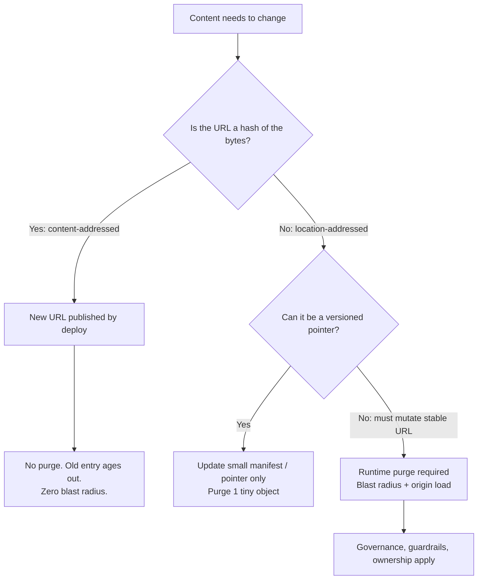
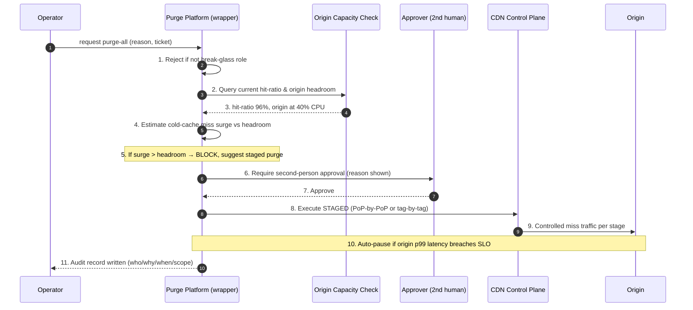
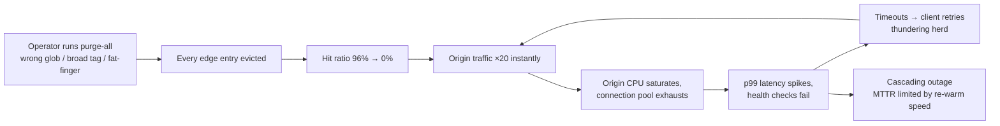

# Cache Invalidation — Staff

> **Axis:** organizational scope & judgment — NOT deeper protocol theory (that is `professional.md`).
> This file answers a single question: how does a Staff/Principal engineer make cache
> invalidation *stop being a recurring incident* across dozens of teams and years of scale?
> The strongest answer is usually **structural** — make invalidation rare by policy — not
> operational (build a better purge button). Purge tooling is the fallback, not the strategy.

---

## Table of Contents

1. [The Staff Thesis: Invalidation Is a Design Smell](#1-the-staff-thesis-invalidation-is-a-design-smell)
2. [Policy Lever #1 — Mandate Fingerprinted Immutable Assets](#2-policy-lever-1--mandate-fingerprinted-immutable-assets)
3. [Immutable Versioning vs Runtime Purge — the Governance Table](#3-immutable-versioning-vs-runtime-purge--the-governance-table)
4. [When Tag-Based Purge Actually Pays](#4-when-tag-based-purge-actually-pays)
5. [Ownership: Who Can Trigger a Purge, and Blast Radius](#5-ownership-who-can-trigger-a-purge-and-blast-radius)
6. [The Purge-All Guardrail Flow](#6-the-purge-all-guardrail-flow)
7. [Incident Pattern: The Accidental Purge-Everything](#7-incident-pattern-the-accidental-purge-everything)
8. [Coupling Content Changes to Deploys vs Runtime Purges](#8-coupling-content-changes-to-deploys-vs-runtime-purges)
9. [The Cost of Purge at Scale](#9-the-cost-of-purge-at-scale)
10. [Cross-Team Cache-Key & Tag Conventions](#10-cross-team-cache-key--tag-conventions)
11. [Second-Order Consequences & the Metric to Watch](#11-second-order-consequences--the-metric-to-watch)
12. [Staff Checklist](#12-staff-checklist)

---

## 1. The Staff Thesis: Invalidation Is a Design Smell

Phil Karlton's line — "there are only two hard things in computer science: cache
invalidation and naming things" — is quoted as a lament. The Staff move is to reframe it
as a *design constraint*: **an architecture that needs to invalidate a lot is telling you
its cache keys are wrong.** The correct response to "invalidation is hard" is rarely
"invest in better invalidation." It is "restructure so you almost never invalidate."

Two identities of a cached object exist:

- **Content-addressed** — the URL *is* a hash of the bytes (`app.4f8b2c.js`). New bytes ⇒
  new URL. The old URL is never re-pointed, so there is nothing to invalidate. The cache
  entry simply ages out unused.
- **Location-addressed** — the URL is a stable name (`/api/products/42`, `/logo.png`) whose
  *contents change over time*. Every change is an invalidation event.

Nearly every catastrophic CDN incident (origin overload, stale-content lawsuits, mass
purge storms) traces to over-reliance on location-addressed caching where content-addressing
would have removed the problem entirely. The Staff engineer's job is to push the
organization's default toward content-addressing and to *fence off* the location-addressed
cases so they never become a shared foot-gun.

The diagram is a triage tree. The Staff goal is to keep the left/middle branches wide and
the right branch narrow — because the right branch is the only one that generates incidents.

---

## 2. Policy Lever #1 — Mandate Fingerprinted Immutable Assets

The single highest-leverage decision is a build-system mandate, enforced in CI, not a plea
in a wiki:

1. **All static build artifacts carry a content hash in the filename.** Bundlers
   (webpack, Vite, esbuild, Rollup) emit `[name].[contenthash].[ext]` by default; the
   policy is to *forbid non-fingerprinted asset names* in the deployable output.
2. **Fingerprinted assets are served with `Cache-Control: public, max-age=31536000, immutable`.**
   The `immutable` directive (RFC 8246) tells the browser never to revalidate even on
   reload. Combined with a long TTL, the object is cached at the edge and in the browser
   effectively forever — correctly, because the URL can never mean anything else.
3. **The entry point is the *only* short-TTL, location-addressed object.** `index.html`
   (or a small `manifest.json`) is served `Cache-Control: no-cache` (or a short TTL) and
   references the fingerprinted assets. A deploy changes the manifest; every downstream asset
   URL changes with it. The manifest is the one thing you ever purge, and it is tiny.

This converts "invalidate 40,000 JS/CSS/image objects across 300 edge PoPs" into "revalidate
one 4 KB HTML file." It is the difference between a purge that can overload your origin and a
purge that is a rounding error. **A Staff engineer treats getting this policy adopted org-wide
as more valuable than any purge tooling improvement.** It removes the incident class.

> Watch for the *false-immutable* trap: an object served `immutable` at a stable URL whose
> bytes then change (a hand-edited `main.js` with no hash). The browser and edge will honor
> the year-long TTL and serve stale content that *cannot be corrected without renaming*. CI
> must reject `immutable` on any non-fingerprinted path.

---

## 3. Immutable Versioning vs Runtime Purge — the Governance Table

These are not two implementations of the same thing; they are two *operating models* with
different risk, cost, and ownership profiles. Choosing the model per content class is the
core Staff decision.

| Dimension | Immutable Versioning (fingerprint + new URL) | Runtime Purge (mutate stable URL) |
|---|---|---|
| **Correctness mechanism** | New URL ⇒ old cache logically cannot be stale | Explicit purge must reach every edge before stale window closes |
| **Blast radius of a mistake** | ~Zero — worst case is an unused old asset lingering | High — a bad purge can cold-cache a large key space and stampede origin |
| **Propagation latency** | Instant (the reference changed) | Seconds to minutes across all PoPs; eventual, best-effort |
| **Origin load on change** | None beyond normal deploy fetch of new assets | Spikes: purged keys become misses; can overload origin if hot |
| **Rollback** | Trivial — repoint manifest to previous hashes | Hard — you must re-warm or wait; damage may already be done |
| **Who can trigger** | Anyone who can deploy (already governed by CI/CD) | Restricted; broad purges need approval + guardrails |
| **Cost model** | Storage of extra versions (cheap); no per-op fee | Per-purge or per-tag API cost; broad purges are expensive at scale |
| **Auditability** | Deploy log = change log; git-traceable | Needs separate purge audit log (who/what/why/when) |
| **Failure mode** | Manifest deploy fails ⇒ atomic, users see old *consistent* version | Partial purge ⇒ split-brain: some PoPs stale, some fresh |
| **Best for** | JS/CSS/images/fonts/versioned APIs — the 95% case | Emergency correctness (leaked/illegal content), rare mutable resources |

The governance rule that falls out of this table: **runtime purge is a privileged emergency
operation, not a routine content-update mechanism.** If teams are purging on every deploy,
that is a signal the versioning policy has not been adopted, and the fix is upstream in the
build system, not more purge capacity.

---

## 4. When Tag-Based Purge Actually Pays

Most CDNs (Fastly surrogate keys, Cloudflare cache tags/Enterprise, Akamai Cache Tag /
CCU) support tagging objects at cache time and purging by tag. Tag-based purge is genuinely
powerful — and genuinely over-adopted. The Staff judgment is knowing when it earns its
operational complexity.

**Tag-based purge pays when *all* of these hold:**

- The resource is **fundamentally location-addressed** (a canonical URL like a product page,
  an article, a user profile) — versioning the URL would break inbound links, SEO, and
  bookmarks.
- **One source change fans out to many cached URLs.** A price update on product 42 must
  invalidate the product page, the category listings it appears on, the search results, and
  the API responses that embed it. Tagging all of those with `product-42` lets one purge
  hit them atomically. Doing this by URL enumeration is brittle and incomplete.
- The **fan-out set is not statically knowable** at change time (you don't have the list of
  every listing page that includes product 42), so you cannot just purge N known URLs.
- Change frequency is high enough that the tagging overhead amortizes.

**Just version it (skip tags) when:**

- The asset can carry a content hash (all build output — never tag these).
- The fan-out is trivial or statically known (purge the one or two exact URLs).
- The content is behind a short TTL where waiting out staleness is acceptable — a 30-second
  TTL on a leaderboard is simpler and cheaper than tag infrastructure.

The anti-pattern is **tag sprawl**: teams tagging every object with a dozen tags "just in
case," which (a) inflates the tag index the CDN maintains, (b) makes purge-by-tag semantics
unpredictable across teams, and (c) creates broad tags (`site`, `all`, `v1`) that become
purge-all in disguise. A Staff engineer governs the *tag vocabulary* the way an API team
governs endpoints (see §10).

---

## 5. Ownership: Who Can Trigger a Purge, and Blast Radius

Blast radius is the number of cache entries a single operation can invalidate. It is the
correct axis for access control — not seniority, not team.

| Operation | Blast radius | Who may trigger | Control required |
|---|---|---|---|
| Purge single URL | 1 object × N PoPs | Owning team's service account / on-call | Rate-limited API token |
| Purge by narrow tag (`product-42`) | Bounded fan-out | Owning team (tag namespaced to team) | Tag ownership check |
| Purge by broad tag (`catalog`, `homepage`) | Large, shared | On-call lead + peer ack | Two-person rule, audit log |
| Purge-by-prefix / path glob | Potentially huge | Restricted group | Approval workflow + dry-run |
| **Purge-all / purge-everything** | The entire cache | **Break-glass only** | Multi-party approval, origin-capacity precheck, staged rollout |

Three ownership principles:

1. **Purge tooling is a platform product with an owner.** Someone (a CDN/edge platform team)
   owns the purge API wrapper, the audit log, the guardrails, and the on-call for purge
   incidents. If purge is "whatever the CDN dashboard exposes," every engineer with dashboard
   access is one misclick from a company-wide outage.
2. **Tags are namespaced to teams.** `payments:invoice-*`, `catalog:product-*`. A team can
   purge its own namespace freely; cross-namespace and global purges route through the
   guardrail flow. This prevents one team's routine purge from evicting another team's cache.
3. **Purge-all is not a feature, it is a break-glass procedure.** It should be *hard* to run,
   logged loudly, and require confirmation that the origin can survive a cold cache (see §7).
   The default UI should not have a big "Purge Everything" button that sits next to "Purge URL."

---

## 6. The Purge-All Guardrail Flow

The point of the guardrail is not bureaucracy; it is to insert a *forcing function* that
makes the operator confront blast radius and origin capacity before, not after, the purge.

Key design decisions encoded in this flow:

- **Step 4–5 (capacity precheck):** the wrapper computes the expected miss surge from the
  current hit ratio and refuses if the origin lacks headroom. This is the single control that
  prevents §7's outage. Purging is only safe if the origin can absorb the resulting misses.
- **Step 8 (staged execution):** never purge all PoPs simultaneously. Stage by region or by
  tag so the origin sees a ramp, not a wall. A global synchronous purge-all is the worst
  possible traffic shape.
- **Step 10 (auto-pause):** the purge is a controlled operation with an SLO-based kill switch,
  the same way a progressive deployment auto-rolls-back.
- **Step 11 (audit):** every broad purge is attributable. "Who purged the cache at 3am?" must
  have an answer without archaeology.

---

## 7. Incident Pattern: The Accidental Purge-Everything

This is the canonical CDN outage and every Staff engineer should be able to narrate it cold.

**The mechanism.** A CDN serving 95%+ of traffic from the edge is, by construction, sitting
in front of an origin sized for ~5% of load. A purge-all instantly converts every request
into a miss. The origin is suddenly asked to serve 20× its provisioned capacity. It
saturates, latencies climb, health checks fail, autoscaling cannot spin up capacity fast
enough (and its own artifact fetches now compete for the saturated origin), and the site
goes down — *harder* than if the CDN had never existed, because the thundering herd of
retries piles on.

Note the feedback loop D→G→D: retries amplify the miss surge, so the system does not simply
degrade — it collapses. Recovery is bounded by how fast the cache re-warms under load, which
is itself throttled by the saturated origin. MTTR is often long.

**Real-world texture:** broad-tag and glob purges are the usual trigger, not literally the
"purge everything" button — someone purges `tag:v1` not realizing it's on every object, or
runs a path glob `/*` in a hurry during an incident, or a script loops purge over a list that
was accidentally the full URL corpus.

**Staff-level defenses (in priority order):**

1. **Make it structurally unlikely** — the §2 versioning policy means most content never needs
   purging, so the purge-all pathway is rarely exercised and easy to gate.
2. **Capacity precheck + staged purge** (§6) — refuse or ramp based on origin headroom.
3. **Origin shielding / tiered cache** — a mid-tier cache absorbs regional misses so a purge
   doesn't reach the true origin at full fan-out.
4. **Serve-stale-on-error** (`stale-if-error`, RFC 5861) — configure the edge to serve the
   stale copy if the origin errors, so an origin overload degrades to stale-but-up rather than
   down. This is the seatbelt: even a botched purge shouldn't take the site fully offline.
5. **Blast-radius-scoped access control** (§5) so a routine actor cannot reach purge-all at all.

---

## 8. Coupling Content Changes to Deploys vs Runtime Purges

A recurring architectural fork: when content changes, do you ship it through the **deploy
pipeline** (immutable, versioned, CI-gated) or through a **runtime purge** (out-of-band,
imperative)?

| Aspect | Change-via-Deploy | Change-via-Runtime-Purge |
|---|---|---|
| Change traceability | Git commit + deploy log | Purge audit log (separate, weaker) |
| Rollback | Redeploy previous artifacts | Re-warm / hope; no clean revert |
| Consistency | Atomic — new manifest flips all references together | Eventual, per-PoP; split states during propagation |
| Blast radius | Bounded by the deploy | Bounded by purge scope (can be huge) |
| Speed for hotfix | Pipeline latency (minutes) | Seconds |
| Right for | App assets, config-as-code, templated pages, versioned APIs | Emergency correctness, editorially-driven mutable content |

The guidance: **content that is a build artifact belongs in the deploy path.** Config,
feature flags, and templates should be versioned and shipped, gaining atomicity, rollback,
and audit for free. Reserve runtime purge for content whose change is *editorial and urgent*
(a news correction, a leaked document takedown) or genuinely mutable business data whose fan-out
justifies tags (§4). When a team reaches for runtime purge to update something that a deploy
could have versioned, that is the smell to correct — you are trading atomic, reversible change
for eventual, irreversible change to save minutes you usually don't need.

---

## 9. The Cost of Purge at Scale

Purge is not free, and at scale the costs are non-obvious. A Staff engineer models all three.

- **Direct API cost.** CDNs meter purges. Tag/soft purges are often cheap or free; broad
  "hard" purges and high-volume purge APIs can be metered or rate-limited. A service that
  purges on every write at high write volume can generate a surprising line item and hit
  provider rate limits, causing purges to queue and staleness windows to widen.
- **Origin compute cost.** Every purged hot key becomes a miss ⇒ an origin request ⇒ compute +
  DB load. The "cost of a purge" is really the cost of *re-generating and re-serving*
  everything it evicted. Purging a hot tag can cost far more in origin compute than the purge
  API call itself. This is the cost the naive model misses.
- **Availability cost.** The tail risk from §7: a bad broad purge can cost an outage. That
  expected cost (probability × impact) is what justifies the guardrail investment.

The economic argument for the §2 policy writes itself: **immutable versioning has ~zero
marginal invalidation cost** (extra object storage is pennies), whereas a purge-heavy
operating model pays on every change across all three axes and carries outage tail risk. When
someone proposes building richer purge tooling, the Staff counter is often "what would it cost
to eliminate the need instead?"

---

## 10. Cross-Team Cache-Key & Tag Conventions

At org scale, the cache is a shared namespace, and shared namespaces need conventions the way
APIs need style guides. Without them you get key collisions, un-purgeable objects, and broad
tags that behave like landmines.

**Cache-key conventions:**

- **Include only semantically meaningful variance in the key.** The cache key should vary on
  exactly what changes the response — path, meaningful query params, and a curated `Vary`
  set (e.g., `Accept-Encoding`, a device-class header). Varying on volatile or unbounded
  inputs (full `User-Agent`, tracking query params, `Cookie`) shatters the key space, collapses
  hit ratio, and makes targeted invalidation impossible.
- **Normalize before keying.** Strip/allowlist query params, lowercase hosts, canonicalize
  trailing slashes — org-wide, at the edge — so the same logical resource is one key, not
  hundreds. Fragmented keys are the silent killer of both hit ratio and invalidation precision.

**Tag/surrogate-key conventions:**

- **Namespace tags by owning team/domain:** `catalog:product:42`, `payments:invoice:99`. A
  team purges its own namespace; cross-namespace purge is governed.
- **Ban unscoped broad tags.** `all`, `site`, `v1` are purge-all wearing a costume. Any tag
  that lands on a large fraction of objects must be treated as a §6 break-glass operation, not
  a routine one.
- **Tag by *entity that changes*, not by page.** Tag with the data identity (`product:42`) so
  any surface embedding that entity is invalidated by one change — this is exactly the fan-out
  case where tags earn their keep (§4).
- **Publish the vocabulary and enforce it.** The edge platform team owns the tag schema, a
  linter validates tags at the CDN config / build layer, and new tag classes go through review.
  Treat the tag namespace as a governed interface between teams.

The Conway's-Law reality: cache keys and tags are a *coordination surface* between teams that
often don't talk. If team A varies its key on a header team B strips, or team B's "clear cache"
purges team A's namespace, you get cross-team incidents with no clear owner. Making the key/tag
schema an explicit, owned contract is a Staff responsibility precisely because it spans org
boundaries that no single team controls.

---

## 11. Second-Order Consequences & the Metric to Watch

- **The versioning mandate reshapes the build system**, not just the CDN. Teams must adopt
  fingerprinting bundlers and manifest-driven references; legacy hand-authored asset paths
  become the migration backlog. Budget for that migration; don't assume the policy is free to
  adopt.
- **Guardrails create friction that people route around.** If the purge-all flow is too slow
  during a real incident, on-call engineers will keep raw CDN credentials "for emergencies,"
  defeating the control. The guardrail must be *fast enough to use under pressure* — a
  well-designed staged purge with capacity precheck is faster and safer than a panicked manual
  one, and that has to be true in practice, not just on paper.
- **Serve-stale defenses can mask origin rot.** If `stale-if-error` reliably papers over origin
  failures, the origin's true reliability degrades unnoticed until a purge (or a TTL expiry
  wave) removes the cushion. Monitor origin health independently of edge-served success.

**The one metric to watch:** the **cache hit ratio (edge-offload ratio), tracked against
origin capacity headroom.** A healthy, versioned system sits at a high, *stable* hit ratio.
The warning signs the strategy is failing:

- Hit ratio trending down over quarters ⇒ key fragmentation or purge-happy teams (§10).
- Frequent sharp hit-ratio *dips* ⇒ broad purges are routine, and each dip is a near-miss of
  §7. Every dip is the origin briefly being asked to do more than usual.
- Purge API call volume climbing ⇒ the versioning policy is losing ground; investigate which
  team reverted to runtime-purge-as-update (§8).

If hit ratio is high and flat and purge volume is low, cache invalidation has been engineered
into a non-problem — which is the entire point of operating at this level.

---

## 12. Staff Checklist

- [ ] **Fingerprinted-immutable-assets policy** is mandated and CI-enforced; non-fingerprinted
      build output is rejected; `immutable` is banned on non-hashed paths.
- [ ] The **entry manifest/HTML is the only short-TTL object**; a deploy repoints references
      instead of purging asset URLs.
- [ ] **Runtime purge is classified as privileged/emergency**, not a content-update mechanism;
      routine purging is treated as a policy-adoption failure to fix upstream.
- [ ] **Tag-based purge is adopted only where fan-out is high and non-enumerable** (§4); tag
      sprawl and unscoped broad tags are linted out.
- [ ] **Purge access is scoped by blast radius** (§5); tags are team-namespaced; purge-all is
      break-glass with multi-party approval.
- [ ] The **purge-all guardrail flow** exists: role check, origin-capacity precheck, staged
      execution, SLO auto-pause, and an audit record (§6).
- [ ] **Origin can survive a cold cache** — shielding/tiered cache, autoscaling headroom, and
      `stale-if-error` are configured so a botched purge degrades to stale-but-up (§7).
- [ ] **Cache-key and tag conventions are a governed, owned contract** across teams; keys vary
      only on meaningful inputs; normalization is enforced org-wide (§10).
- [ ] **Cost of purge is modeled on all three axes** (API, origin re-generation, availability
      tail risk) and compared against the near-zero cost of versioning (§9).
- [ ] **Edge hit ratio vs origin headroom is the watched metric**; downward trends and sharp
      dips are treated as leading indicators of a purge incident (§11).

*Next step:* [Cache Invalidation — Interview](interview.md)
