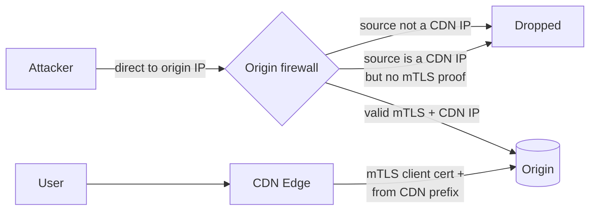

# CDN Security — Interview

A CDN is not only a performance layer; it is the security perimeter that every request crosses before it reaches your origin. These questions probe whether you understand *what* protection each CDN feature buys, *where* it sits in the request path, and the trade-offs a staff engineer must weigh — TLS custody, DDoS layering, signed access, origin lockdown, cache-layer attacks, and the concentration risk of putting one vendor in front of everything.

## Table of Contents

1. [Q1: How does putting a CDN in front of your origin improve security?](#q1)
2. [Q2: Distinguish L3/4 from L7 DDoS mitigation on a CDN.](#q2)
3. [Q3: Why can a CDN absorb a volumetric attack your origin can't?](#q3)
4. [Q4: How do signed URLs / signed cookies work, and what do they protect?](#q4)
5. [Q5: What must a signed-URL scheme get right to be secure?](#q5)
6. [Q6: What is hotlink protection and how is it enforced?](#q6)
7. [Q7: An attacker found your origin's real IP and bypasses the CDN. How do you stop this?](#q7)
8. [Q8: What is the trust trade-off of terminating TLS at the CDN?](#q8)
9. [Q9: What is web cache poisoning and how do you prevent it?](#q9)
10. [Q10: What is web cache deception, and how does it differ from poisoning?](#q10)
11. [Q11: What is a WAF, and what's the operational risk of turning it on?](#q11)
12. [Q12: Why is a CDN a single point of failure, and how do you manage that?](#q12)
13. [Q13: Scenario — secure a public API and media assets behind a CDN.](#q13)
14. [Q14: Rapid-fire — terms and one-liners.](#q14)

---

## Q1: How does putting a CDN in front of your origin improve security? {#q1}

The CDN becomes a **reverse-proxy perimeter**: every client connects to the edge, never directly to the origin. That position lets it add four independent layers:

1. **TLS termination** — encryption is enforced at the edge, with modern ciphers, OCSP stapling, and HSTS applied uniformly regardless of what the origin supports.
2. **DDoS absorption** — attack traffic is spread across the CDN's globally distributed anycast capacity (Tbps-scale) instead of hitting one origin link.
3. **WAF / bot management** — malicious requests (SQLi, XSS, path traversal, credential stuffing) are inspected and blocked before reaching application code.
4. **Origin concealment** — the origin IP is hidden behind edge IPs, so attackers can't target it directly (provided origin lockdown is enforced — see [Q7](#q7)).

The mental model: the origin stops being internet-facing and becomes a backend that only the CDN is allowed to talk to.

## Q2: Distinguish L3/4 from L7 DDoS mitigation on a CDN. {#q2}

They defend different layers of the stack and use different techniques:

| Dimension | **L3/4 (volumetric / protocol)** | **L7 (application)** |
|---|---|---|
| Attack examples | UDP/ICMP floods, SYN floods, amplification (DNS/NTP/memcached) | HTTP floods, slowloris, cache-busting query floods, credential stuffing |
| Metric of the attack | Bits/sec, packets/sec | Requests/sec, concurrent connections |
| Where it's dropped | Network edge / scrubbing, anycast dispersion, SYN cookies | Reverse proxy: rate limiting, JS/CAPTCHA challenge, WAF rules, bot scoring |
| What it needs to inspect | Packet headers only | Full HTTP semantics (method, path, headers, cookies) |
| Cost to defend | Cheap once capacity exists | Expensive — each request needs application-aware evaluation |

A real attack often combines both, so mitigation is layered: absorb the volume at L3/4, then apply per-request logic at L7.

## Q3: Why can a CDN absorb a volumetric attack your origin can't? {#q3}

Two reasons: **capacity** and **dispersion**.

- **Anycast** advertises the same IP from every PoP, so a globally-sourced attack is automatically split across dozens of PoPs by BGP — no single PoP sees the whole flood. A botnet in 50 countries hits 50 different edges.
- The CDN's aggregate network capacity is measured in **tens of Tbps**, orders of magnitude beyond a single origin's uplink. Traffic that would saturate your 10 Gbps link is a rounding error across the CDN backbone.

Your origin, by contrast, sits behind one (or a few) links in one region; there is no way to disperse the load, so the pipe fills and legitimate traffic is starved.

```mermaid
sequenceDiagram
    autonumber
    participant BN as Botnet (global)
    participant AC as Anycast Edge (many PoPs)
    participant WAF as L7 Filter
    participant OR as Origin (locked down)
    Note over BN,AC: L3/4 volumetric flood
    BN->>AC: Millions of packets from 50 regions
    Note over AC: BGP disperses to nearest PoP;<br/>SYN cookies, rate caps drop junk
    AC-->>BN: Bogus/unroutable traffic dropped at edge
    Note over AC,WAF: Surviving HTTP requests inspected
    AC->>WAF: Well-formed requests only
    WAF->>WAF: Rate limit + bot score + challenge
    WAF->>OR: Small trickle of legitimate traffic
    Note over OR: Origin sees normal load, never the flood
```

## Q4: How do signed URLs / signed cookies work, and what do they protect? {#q4}

They provide **time-limited, tamper-proof authorization at the edge** without a round trip to your auth server. The origin (or a signing service) computes an HMAC over a canonical string — typically `path + expiry + optional policy (IP, method)` — using a shared secret, and appends it to the URL (or a cookie):

```
https://cdn.example.com/video/123.mp4?Expires=1720000000&Signature=<HMAC>&Key-Pair-Id=k1
```

The edge recomputes the HMAC with the same key and rejects the request if it doesn't match or the expiry has passed. Signed **URLs** authorize a single object (good for a one-off download link); signed **cookies** authorize many objects under a path prefix (good for a whole streaming session or gallery). Neither requires the CDN to call back to your origin per request — the key is pre-shared, so verification is local and fast.

## Q5: What must a signed-URL scheme get right to be secure? {#q5}

- **HMAC, not a bare hash.** Use HMAC (RFC 2104); a naked `SHA256(secret + message)` is vulnerable to length-extension.
- **Constant-time comparison** of signatures at the edge — a byte-by-byte early-exit compare leaks the signature via timing.
- **Short expiry windows.** The signature is a bearer token: anyone who captures the URL can replay it until `Expires`. Keep the window tight and, for sensitive content, bind to client IP or a session.
- **Key rotation** via a key identifier (`Key-Pair-Id`) so you can roll secrets without breaking live links.
- **Sign a canonical string.** Normalize path/query ordering so the same request always produces the same string-to-sign; otherwise an attacker finds an unsigned variant that still hits cache.

The residual limitation: signed URLs prove *authorization to fetch*, not *identity* — a leaked URL works for whoever holds it until it expires.

## Q6: What is hotlink protection and how is it enforced? {#q6}

Hotlinking is a third-party site embedding your assets (images, video) so you pay the bandwidth while they get the content. Enforcement options, weakest to strongest:

| Mechanism | How | Strength |
|---|---|---|
| `Referer` allowlist | Edge rule permits requests only when `Referer` matches your domains | Weak — `Referer` is client-controlled and often stripped |
| Token / signed URL | Assets require a valid short-lived signature ([Q4](#q4)) | Strong — cryptographic, but adds signing overhead |
| Origin `Cross-Origin-Resource-Policy` / CORS | Restrict cross-origin embedding for fetch-based use | Partial — doesn't stop ``/`<video>` tags |

`Referer` checks stop casual hotlinking cheaply; signed URLs are the real control when the bandwidth or content is valuable.

## Q7: An attacker found your origin's real IP and bypasses the CDN. How do you stop this? {#q7}

This is the classic **origin-exposure** failure: all the edge WAF/DDoS protection is worthless if requests can reach the origin directly. Defenses, layered:

1. **Firewall the origin to CDN IP ranges only** — reject any source not on the CDN's published prefix list.
2. **Authenticated origin pulls** — the CDN presents a client certificate (mTLS) or a shared secret header the origin verifies, so even a request from a CDN IP that lacks the proof is rejected.
3. **Rotate the origin IP** after it leaks, and scrub the leak vectors (DNS history, TLS cert transparency logs, misconfigured subdomains, email headers, error pages that reveal the backend).
4. **Private connectivity** — put the origin on a private network / cloud interconnect so it has no public IP at all.

Best practice combines (1) + (2): even if the IP leaks, requests without the mTLS proof are dropped.



## Q8: What is the trust trade-off of terminating TLS at the CDN? {#q8}

Terminating TLS at the edge means the CDN **decrypts your traffic in plaintext** to inspect, cache, and route it. That is what makes WAF and caching possible — but it also means:

- The CDN **holds (or generates) your private keys** and can see every request/response, including credentials and PII. That is a compliance and custody concern (PCI, HIPAA, data-residency).
- A CDN compromise or insider is a plaintext exposure of all your traffic.

Mitigations:

- **Keyless SSL** — the private key stays at your origin; the CDN performs the handshake by asking your key server to sign/decrypt the handshake secret, so the CDN never holds the key (though it still sees plaintext after the handshake).
- **Full (strict) TLS to origin** — re-encrypt edge→origin and validate the origin cert, so the hop behind the edge isn't cleartext.
- For end-to-end secrecy where the CDN must *not* see plaintext, you can't use an inspecting CDN for that path — you'd pass through at L4 only, losing WAF/caching.

The trade-off is fundamental: **inspection requires decryption**. You choose how much trust to place in the edge.

## Q9: What is web cache poisoning and how do you prevent it? {#q9}

Cache poisoning tricks a **shared** cache into storing an attacker-influenced response that is then served to other users. The mechanism: an **unkeyed input** (a header like `X-Forwarded-Host` that the cache ignores when building the cache key, but the *application* reflects into the response) lets the attacker change the cached body without changing the cache key.

Preconditions and defenses:

| Precondition for the attack | Defense |
|---|---|
| An input is **unkeyed** (not in the cache key) | Include security-relevant inputs in the cache key, or strip them at the edge |
| That input is **reflected/impactful** in the response | Don't reflect untrusted headers; validate `Host`/`X-Forwarded-*` |
| The poisoned response is **cacheable** | Set correct `Cache-Control`/`Vary`; don't cache responses that vary on untrusted headers |

The root fix is **request normalization**: strip or normalize headers the application shouldn't trust, and make the cache key reflect everything that changes the response (OWASP: Web Cache Poisoning).

## Q10: What is web cache deception, and how does it differ from poisoning? {#q10}

**Cache deception** tricks the cache into storing a *victim's private, authenticated response* at a URL the attacker can then read. Classic trick: request `https://site/account.php/nonexistent.css`. The origin routes on `account.php` and returns the victim's account page; the CDN, seeing a `.css` extension, treats it as a static asset and caches it. The attacker then fetches the same `.css` URL and gets the victim's cached private data.

- **Poisoning** = attacker controls the *content* served to others.
- **Deception** = attacker reads *another user's* private content that got cached by mistake.

Root cause is a **parser differential**: the cache and the origin disagree on whether the URL is static/cacheable. Defenses: cache by verified `Content-Type` (not just extension), don't cache authenticated responses, and normalize/validate paths so a trailing fake extension can't reclassify a dynamic URL.

## Q11: What is a WAF, and what's the operational risk of turning it on? {#q11}

A **Web Application Firewall** inspects L7 requests and blocks those matching malicious patterns (SQLi, XSS, RCE, path traversal), commonly via the OWASP Core Rule Set with anomaly scoring and tunable "paranoia levels."

The operational risk is **false positives**: an over-aggressive rule blocks legitimate users or breaks a feature (e.g. a rule flags a benign request body containing SQL-like text). A WAF false-positive rate is effectively an availability SLI. Therefore you roll out in stages:

1. **Detect / log-only** mode first — observe what *would* have been blocked.
2. Tune out false positives against real traffic.
3. **Enforce** only after the FP rate is acceptable, with fast rollback.

Turning a WAF straight to "block" on production is how you cause your own outage.

## Q12: Why is a CDN a single point of failure, and how do you manage that? {#q12}

Because *every* request crosses it, a CDN outage or misconfiguration takes down everything behind it — and history shows CDN control-plane bugs have caused broad internet outages. It's **concentration risk**: you've traded many small failure modes for one large one.

Management strategies:

- **Multi-CDN** with health-based DNS/steering failover — removes the single-vendor SPOF at the cost of complexity, fragmented cache hit-ratio, and the steering layer becoming a new dependency.
- **Origin-direct break-glass** — a tested, firewalled path to serve critical traffic directly if the CDN fails (accepting reduced protection temporarily).
- **Staged config rollout** — treat CDN config (WAF rules, routing, cache logic) like code: canary, monitor, roll back. Most "CDN outages" are self-inflicted config pushes, not vendor hardware.
- **Runbooks** for purge storms, cert expiry, and rule misfires.

The staff-level point: the CDN is a *critical dependency you don't operate*, so your resilience plan must account for its failure, not assume it away.

## Q13: Scenario — secure a public API and media assets behind a CDN. {#q13}

A layered answer:

**Perimeter & transport**
- Terminate TLS 1.3 at the edge (RFC 8446); enforce HSTS; re-encrypt to origin with full-strict validation.
- Lock the origin to CDN IPs + **authenticated origin pulls (mTLS)** so a leaked origin IP is useless ([Q7](#q7)).

**API path**
- WAF in detect→enforce rollout; per-client/IP **rate limiting** with `429 + Retry-After`; bot scoring on abusive endpoints (login, search).
- Don't cache authenticated responses; if you do cache, key on auth-relevant inputs and normalize headers to prevent poisoning/deception.

**Media path**
- **Signed URLs / cookies** for private or paid media with short expiry ([Q4](#q4)); `Referer`/token hotlink protection for cheap assets.
- Long-lived immutable caching for public assets; keep origin egress low.

**Resilience & governance**
- Multi-CDN or a tested origin-direct break-glass; staged config rollout; monitor WAF FP rate, hit ratio, and origin exposure (alert if origin sees non-CDN source IPs).

State the trade-off explicitly: TLS termination at the edge is what enables WAF and caching, and it means trusting the CDN with plaintext — acceptable here, mitigated with keyless SSL if compliance demands.

## Q14: Rapid-fire — terms and one-liners. {#q14}

| Term | One-liner |
|---|---|
| **Anycast** | One IP advertised from many PoPs; disperses volumetric attacks automatically. |
| **Authenticated origin pull** | Origin only accepts requests carrying the CDN's mTLS cert / secret — defeats IP-leak bypass. |
| **Keyless SSL** | CDN does the TLS handshake without ever holding your private key; key stays at origin. |
| **Unkeyed input** | A request field the cache ignores for the key but the app reflects — the poisoning vector. |
| **Cache deception** | Victim's private response cached at an attacker-readable URL via a parser differential. |
| **Paranoia level** | OWASP CRS aggressiveness dial — higher catches more attacks *and* more false positives. |
| **Scrubbing center** | Facility that filters attack traffic before forwarding clean traffic onward. |
| **Break-glass** | Pre-tested emergency path (e.g. origin-direct) used when the normal CDN path fails. |

*Next step:* [Load Balancer vs Reverse Proxy — Junior](../../load-balancers/lb-vs-reverse-proxy/junior.md)
