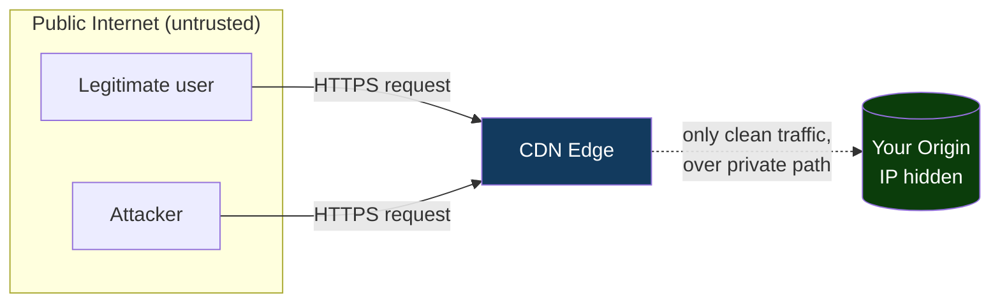
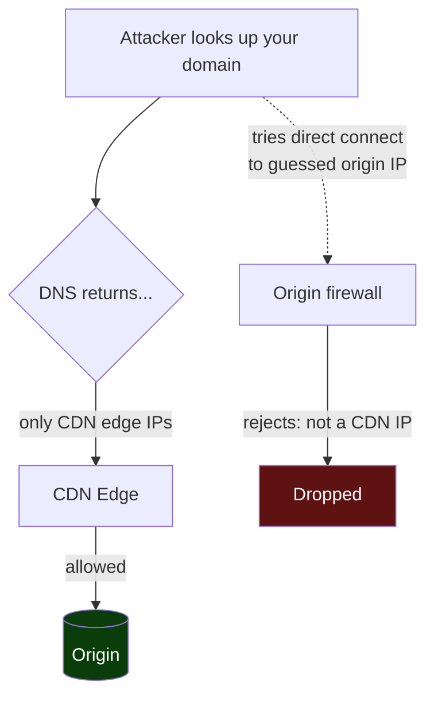
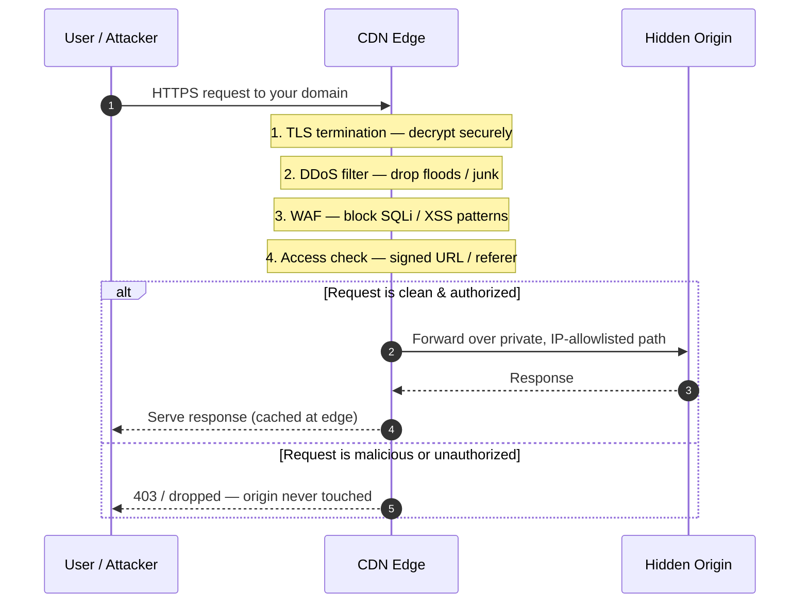

# CDN Security — Junior

<!-- level-focus -->
At junior level, focus on this question:

> How can I apply **CDN Security** in one small example and prove the result?

Use the smallest realistic scenario that exposes the decision and its failure behavior.
---

## 1. The One Idea: A Front Door You Don't Own the Building For

Imagine your web application is a shop. Without a CDN, customers walk straight up to your
shop's own door — and so does anyone else, including troublemakers. Your door, your locks,
your one security guard. If a hundred thousand people rush the door at once, the door jams
and real customers can't get in.

A CDN is like renting the entire ground floor of a giant shopping mall, all over the world,
and putting **your shop behind the mall's security**. Now customers reach you through the
mall. The mall has thousands of entrances (edge locations), its own guards at every door,
metal detectors, and a rule that nobody is told where your actual stockroom (your origin
server) is. Your shop is still your shop — but attackers can no longer reach it directly.

The whole of CDN security follows from this: **because every request must pass through the
CDN first, the CDN can inspect it, filter it, encrypt it, rate-limit it, or drop it — all
before your origin ever sees it.** Your origin only handles what the CDN lets through.

---

## 2. The Reverse-Proxy Position — Why It Enables Security

Technically, a CDN edge server is a **reverse proxy**: a machine that receives the client's
request, and then (only if needed) forwards it to your origin on the client's behalf. The
client talks to the edge; the edge talks to the origin. The client never talks to the origin
directly.



Three consequences fall out of this position, and every CDN security feature is one of them:

1. **The edge sees the raw request first.** So it can *read* it — check the TLS, inspect the
   URL and headers, decide if it looks malicious. (→ TLS, WAF)
2. **The edge is huge and distributed.** So it can *absorb* volume that would crush a single
   origin. (→ DDoS mitigation)
3. **The origin is only ever reached *through* the edge.** So the origin's real address can
   stay secret, and the edge can enforce rules about who gets a response. (→ origin hiding,
   signed URLs)

Keep those three ideas in mind. The next sections just make each one concrete.

---

## 3. Protection 1 — TLS Termination (Encrypt the Connection)

**The problem it solves.** Data traveling over the internet passes through routers, Wi-Fi
access points, and networks you don't control. Without encryption, anyone on that path can
*read* the traffic (passwords, session cookies) or *tamper* with it (inject ads, malware).
HTTPS — HTTP secured with **TLS** — encrypts the connection so eavesdroppers see only
scrambled bytes and any tampering is detected.

**How the CDN helps.** The CDN edge *terminates* TLS: it holds the certificate for your
domain, performs the encrypted handshake with the client, and decrypts the request. Because
the edge is physically close to the user, that handshake is fast. Beyond speed, the CDN adds
security value here in three ways:

- It runs **up-to-date, well-configured TLS** for you — modern protocol versions, strong
  cipher suites, and secure defaults — so you don't have to be a TLS expert on every server.
- It can issue and auto-renew certificates, so you never ship an expired certificate (a
  common, embarrassing outage).
- It can **redirect all HTTP to HTTPS** and set security headers (like HSTS) at the edge,
  forcing every visitor onto the encrypted path.

**Concrete example.** A user on airport Wi-Fi logs into your site. Without TLS, the person at
the next table running a packet sniffer reads their session cookie and hijacks the account.
With CDN TLS termination, that same traffic is encrypted end-to-end from the user's browser
to the nearby edge; the sniffer sees gibberish. The login cookie is safe.

> Note: after decrypting, the edge re-encrypts traffic to your origin (this is called
> "full" / end-to-end TLS). Learn that in `middle.md`; for now, the key idea is: **the edge
> is the point where strong, correct encryption is guaranteed for every user.**
>
> Reference: [Cloudflare — What is SSL/TLS?](https://www.cloudflare.com/learning/ssl/what-is-ssl/) ·
> [MDN — HTTPS](https://developer.mozilla.org/en-US/docs/Glossary/HTTPS)

---

## 4. Protection 2 — Absorbing DDoS (Soak Up the Flood)

**The problem it solves.** A **DDoS** (Distributed Denial of Service) attack sends a flood of
traffic from many machines at once, trying to overwhelm your server so real users can't get
through. A single origin server has a fixed capacity — a certain number of connections and a
certain amount of bandwidth. Point enough junk traffic at it and it falls over. Everyone is
locked out. This is the "hundred thousand people rushing the shop door" scenario.

**How the CDN helps.** A CDN is not one machine — it is a global network of hundreds of data
centers with enormous total bandwidth, far larger than any single origin. When an attack
arrives, it hits the *edge*, not your origin. Three things happen:

1. **Dilution.** The attack traffic is spread across the CDN's many edge locations
   (because of how the network routes users to the nearest edge — anycast). No single point
   takes the full flood.
2. **Absorption.** The CDN's combined capacity is measured in terabits per second — it can
   simply soak up volumes that would instantly kill a small origin.
3. **Filtering.** Obvious junk (malformed packets, known-bad sources, floods to endpoints
   that don't exist) is dropped at the edge. Only a trickle — if anything — is forwarded to
   the origin.

**Concrete example.** A botnet of 50,000 infected devices blasts 200 Gbps of garbage HTTP
requests at your site. Your origin server has a 1 Gbps link — it would be knocked offline in
seconds. But the traffic actually lands on the CDN's edge network, which is built for
hundreds of Gbps. The CDN's DDoS system recognizes the flood, drops it at the edge, and your
origin never even notices. Real users, routed to healthy edges, keep browsing normally.

```mermaid
sequenceDiagram
    autonumber
    participant Bot as Botnet (attack)
    participant Edge as CDN Edge Network
    participant Origin as Your Origin
    Bot->>Edge: 200 Gbps flood of junk requests
    Note over Edge: Distributed across many edges;<br/>total capacity in Tbps
    Edge->>Edge: Detect flood, drop junk at the edge
    Note over Origin: Origin sees ~none of it — stays up
    Edge-->>Bot: (attack absorbed / blocked)
```

> Reference: [Cloudflare — What is a DDoS attack?](https://www.cloudflare.com/learning/ddos/what-is-a-ddos-attack/)

---

## 5. Protection 3 — WAF (Block Bad Requests)

**The problem it solves.** Not every attack is about *volume*. Some are about *content*: a
single, cleverly crafted request that tries to trick your application into leaking data or
running unintended commands. Classic examples are **SQL injection** (smuggling database
commands into a form field) and **cross-site scripting / XSS** (smuggling malicious
JavaScript into a page). One well-aimed request can do the damage; you don't need a flood.

**How the CDN helps.** A **WAF** (Web Application Firewall) at the edge inspects the *content*
of each request — its URL, headers, and body — and compares it against rules that recognize
known attack patterns. Requests that match are blocked *before they reach your application*.
Because the WAF lives at the edge, it protects every one of your origin servers at once, and
you can update rules in one place. Providers ship **managed rule sets** that are kept current
against emerging threats, so you get protection against attacks you haven't personally heard
of yet.

**Concrete example.** An attacker submits a login form with a username of
`' OR '1'='1' --`. This is a textbook SQL-injection string designed to trick a naive database
query into logging in without a password. The edge WAF recognizes the pattern, returns a
`403 Forbidden`, and the malicious request never touches your database. Your application
code, and the users' data behind it, are never exposed to the attempt.

> A WAF is a strong *outer* layer, not a substitute for writing safe code (parameterized
> queries, output encoding). Think of it as defense-in-depth: the CDN blocks the obvious,
> your code stays correct anyway.
>
> Reference: [Cloudflare — What is a WAF?](https://www.cloudflare.com/learning/ddos/glossary/web-application-firewall-waf/) ·
> [OWASP Top Ten](https://owasp.org/www-project-top-ten/)

---

## 6. Protection 4 — Hiding the Origin (Keep the Real IP Secret)

**The problem it solves.** All the protections above run at the edge. But they are worthless
if an attacker can find your origin's real IP address and connect to it *directly*, bypassing
the CDN entirely — walking around the mall's security straight to your stockroom's back door.

**How the CDN helps.** When you put a domain behind a CDN, the public DNS record for your
site points at the **CDN's** addresses, not yours. Visitors — and attackers doing lookups —
only ever see the edge. Your origin's real address is not published anywhere public. To close
the back door completely, you also lock down the origin so it *only* accepts connections from
the CDN:

- **Firewall the origin** to allow inbound traffic only from the CDN's published IP ranges.
- Optionally require a **shared secret header** that only the CDN sends, so a stray direct
  connection is rejected even if someone guesses the IP.

Now the only path to your origin is *through* the edge — which means every request is forced
to pass TLS, the WAF, and DDoS filtering. There is no way around them.

**Concrete example.** An attacker who wants to DDoS you looks up your domain — but DNS returns
only CDN edge addresses. They dig through old DNS history and certificate logs and eventually
guess an IP they think is your origin, and fire traffic straight at it. Because your origin's
firewall only accepts connections from the CDN's IP ranges, the direct traffic is dropped at
the door. The attacker cannot bypass the CDN, so all their traffic is stuck hitting the edge,
where it gets absorbed.



> Reference: [Cloudflare — What is origin shielding / a hidden origin](https://www.cloudflare.com/learning/cdn/glossary/origin-server/)

---

## 7. Protection 5 — Signed URLs & Hotlink Protection (Control Who Gets the Bytes)

**The problem it solves.** Sometimes the request is perfectly well-formed and non-malicious —
it's just *not authorized*. Two everyday cases:

- **Hotlinking / bandwidth theft:** another website embeds ``
  directly on their pages. Their visitors load *your* image from *your* CDN, and you pay for
  the bandwidth while they get free content.
- **Access control on paid or private content:** a premium video, a private download, a
  time-limited report. Anyone who copies the link should *not* be able to share it forever.

**How the CDN helps.** The edge can enforce access rules on the content itself:

- **Hotlink protection** checks the request's `Referer` header — the page the request came
  from. If an image is being loaded from a domain that isn't yours, the edge refuses to serve
  it. Your images only load on your pages.
- **Signed URLs** attach a cryptographic signature and an expiry to the link, e.g.
  `.../video.mp4?expires=1700000000&signature=abc123`. The edge recomputes the signature
  using a secret key you share with the CDN. If the URL was tampered with, or the expiry has
  passed, the edge rejects it. So a link works only for the intended file, only until it
  expires, and can't be edited to point elsewhere.

**Concrete example.** You sell a training video. A subscriber gets a signed URL that is valid
for 30 minutes. They watch it — fine. Then they paste the link into a public forum for
everyone to grab for free. An hour later, someone clicks it: the edge checks the expiry,
sees it has passed, and returns `403 Forbidden`. The shared link is dead. Meanwhile another
site tries to hotlink your product photos; the edge sees the foreign `Referer` and serves
them nothing. Your bandwidth and your paid content are both protected — at the edge, before
the origin is involved.

> Reference: [Cloudflare — What is hotlinking?](https://www.cloudflare.com/learning/cdn/glossary/hotlink-protection/)

---

## 8. Putting It Together — One Diagram

Every request — friend or foe — arrives at the edge, and the edge applies the protections in
order. Only clean, authorized traffic reaches the hidden origin.



The origin never sees an unencrypted connection, a flood, an injection attempt, or an
unauthorized request. It does less work *and* is exposed to far less risk. That is the payoff
of the front-door position.

---

## 9. With vs Without a CDN — Comparison

| Concern | Without a CDN (origin exposed directly) | With a CDN in front |
|---|---|---|
| **Encryption (TLS)** | You configure/renew certs on every server; easy to misconfigure or let expire | Edge terminates TLS with modern, correct config; certs auto-managed |
| **DDoS floods** | Single origin, fixed bandwidth — knocked offline by a large flood | Global edge network dilutes and absorbs Tbps-scale attacks |
| **Malicious requests (SQLi, XSS)** | Only your app code stands between the attacker and your data | Managed WAF blocks known attack patterns at the edge first |
| **Origin address** | Public and reachable — attackers connect directly | Hidden behind edge IPs; origin firewalled to CDN-only |
| **Bandwidth theft / hotlinking** | Anyone can embed your assets and spend your bandwidth | Referer checks + signed URLs restrict who gets the bytes |
| **Blast radius of an attack** | Hits your live application and database directly | Contained at the edge; origin sees only filtered, clean traffic |
| **Where you patch a rule** | Server by server | Once, at the edge, for all origins at once |

The pattern in every row is the same: a protection that would be *your job, per server,* is
instead handled *once, at the edge, for everyone.*

---

## 10. Key Terms

| Term | Definition |
|------|-----------|
| Edge / edge server | A CDN machine near the user that receives requests first; a reverse proxy in front of your origin |
| Origin | Your actual application/server that holds the real content — the thing being protected |
| Reverse proxy | A server that receives client requests and forwards them to a backend on the client's behalf |
| TLS termination | The edge performs the HTTPS handshake and decrypts the request, so encryption is handled at the edge |
| DDoS | Distributed Denial of Service — a flood of traffic from many sources meant to overwhelm a target |
| WAF | Web Application Firewall — inspects request *content* and blocks known attack patterns (SQLi, XSS) |
| SQL injection | An attack that smuggles database commands into user input to manipulate the database |
| XSS | Cross-site scripting — smuggling malicious JavaScript so it runs in other users' browsers |
| Origin hiding | Keeping the origin's real IP off public DNS and firewalling it to accept only CDN traffic |
| Signed URL | A link with a cryptographic signature + expiry; the edge validates it before serving the content |
| Hotlink protection | Refusing to serve assets when the request comes from a foreign site (checks the Referer) |

---

## 11. Common Mistakes at This Level

1. **Thinking a CDN is only for speed.** The same front-door position that reduces latency is
   what makes TLS, DDoS mitigation, WAF, and access control possible. Speed and security are
   two faces of the same architecture.
2. **Leaving the origin reachable.** If you put a CDN in front but never firewall the origin
   to CDN-only, attackers can find the real IP and bypass *every* edge protection. Hiding the
   origin is what makes the other protections binding.
3. **Treating the WAF as a substitute for secure code.** A WAF blocks the obvious; it is a
   layer, not a fix. Still use parameterized queries and output encoding — defense in depth.
4. **Assuming "HTTPS at the edge" means "encrypted everywhere."** By default the edge-to-origin
   hop must also be secured; a padlock in the browser doesn't guarantee the back half is
   encrypted. (Covered in `middle.md`.)
5. **Confusing DDoS (volume) with injection (content).** They are different threats needing
   different tools — the DDoS system for floods, the WAF for crafted requests. A CDN gives you
   both, but knowing which is which matters.
6. **Forgetting expiry/scope on signed URLs.** A signed URL with no expiry, or one that isn't
   tied to a specific file, is barely better than a plain link once it leaks.

---

## 12. Hands-On Exercise

You run a small photo-sharing site: a web app plus an image store, all on one server whose IP
is `203.0.113.10`. You've been hit by a traffic flood and you're also noticing other blogs
embedding your images. On paper, redesign it with a CDN in front and answer:

1. **Front door.** Draw user → CDN edge → origin. What does the public DNS record now point
   to, and what does it *no longer* reveal?
2. **TLS.** Where does the HTTPS handshake happen, and why is that both faster and more
   secure than terminating it on your single origin?
3. **DDoS.** When the next flood arrives, what does it hit, and why does your origin stay up
   this time?
4. **Origin lockdown.** Write the one firewall rule (in plain English) that stops an attacker
   who has guessed `203.0.113.10` from connecting directly. Why does this rule make all the
   edge protections *unavoidable*?
5. **Hotlinking.** Which single request header does the edge check to stop other blogs from
   embedding your images, and what response does a foreign site get?
6. **Signed URLs.** For a private album shared by link, name the two pieces the edge validates
   before serving an image, and describe what happens 24 hours after the link is created.

You should be able to name, for each of the five protections in this file, *what problem it
solves* and *why the CDN's front-door position is what makes it possible.*

*Next step:* [CDN Security — Middle](middle.md)

---

## Apply it

1. Choose one small, known input for **CDN Security**.
2. Predict the output or observable behavior.
3. Run the smallest example or probe that exercises the concept.
4. Change one input to trigger a failure or boundary case.
5. Explain the evidence using the guide's vocabulary.

## Verify your work

- Record the exact input, command or code path, and output.
- Repeat the probe and confirm the result is consistent.
- Show one expected success and one expected failure.
- Resolve any difference between the prediction and the evidence.

## Review questions

- What problem does CDN Security solve in the example?
- Which input changes the observed result, and why?
- What is the smallest useful success check?
- Which beginner mistake would your evidence catch?
