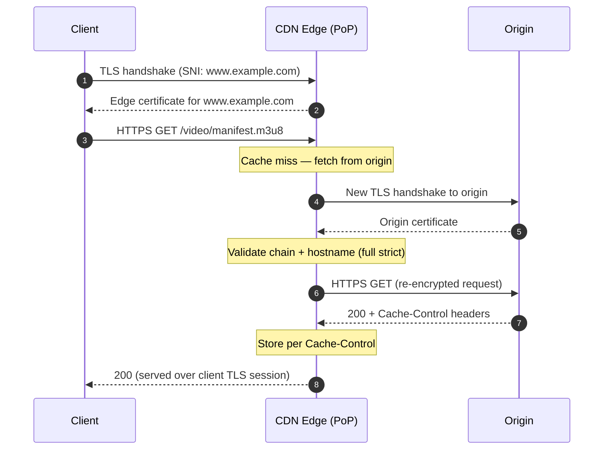
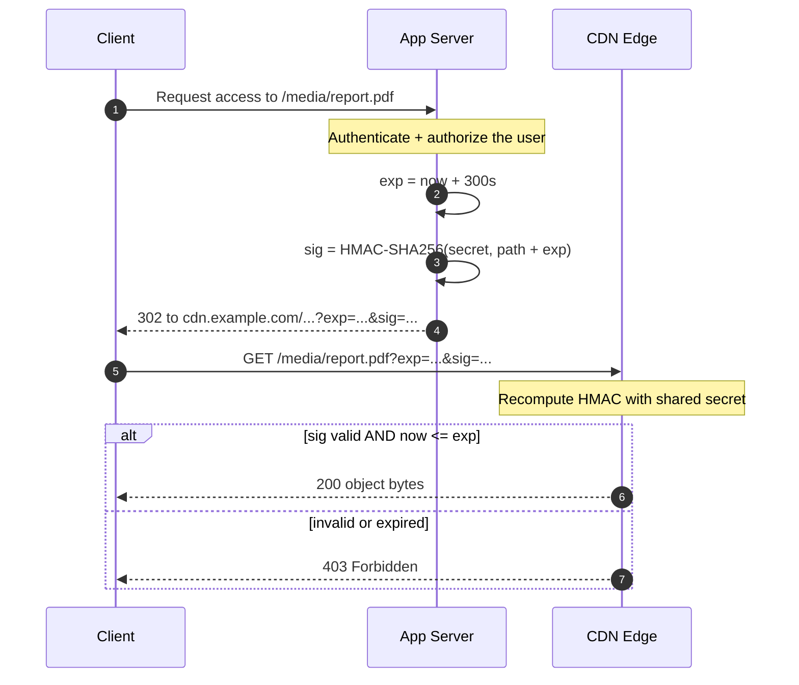

# CDN Security — Middle

<!-- level-focus -->
At middle level, focus on this question:

> Where does **CDN Security** belong in a maintainable component, and which trade-off selects the design?

Use the smallest realistic scenario that exposes the decision and its failure behavior.
## 1. The Edge Trust Boundary

A CDN inserts a controlled hop between the client and origin. Requests arriving at a PoP are *untrusted*: any header, cookie, query string, or body may be forged. The edge's job is to authenticate, sanitize, and rate-shape traffic so the origin sees only well-formed, authorized requests — and, ideally, only requests that originate from the CDN itself.

Three properties define this boundary:

- **Confidentiality** — TLS on the client leg (and, in a proper posture, on the origin leg too).
- **Authenticity of the request** — signed URLs, tokens, and referrer/IP checks answer "is this caller allowed to fetch this object right now?"
- **Authenticity of the origin fetch** — origin lockdown answers "is this back-end request really coming from *our* CDN and not a direct attacker?"

Get these three right and most volumetric and application-layer abuse is stopped before it costs you origin compute.

---

## 2. TLS Termination and Re-encryption to Origin

### 2.1 Termination at the edge

The CDN holds the certificate for your hostname and completes the TLS handshake at the PoP nearest the client. This shortens the RTT for the handshake (fewer round trips over long-haul links), lets the edge inspect and cache decrypted content, and offloads crypto from the origin. The edge presents a certificate for `www.example.com` — either one you upload or one the CDN provisions automatically (ACME/managed).

Terminating at the edge means the plaintext exists inside the CDN. That is unavoidable for caching and WAF inspection, and it is why choosing a reputable provider and correct origin-leg encryption both matter.

### 2.2 The origin leg — never leave it in the clear

After termination the edge must fetch cache misses from the origin. That second hop is a separate TLS session. The common modes:

| Origin TLS mode | Edge → origin encrypted? | Origin cert validated? | When to use |
|---|---|---|---|
| HTTP to origin (plaintext) | No | N/A | Never for real traffic; leaks data on the origin leg |
| TLS, no validation ("flexible"/"full") | Yes | No | Better than plaintext but vulnerable to MITM between edge and origin |
| TLS with full validation ("full strict") | Yes | Yes (chain + hostname) | Default target for any production site |
| mTLS / authenticated origin pull | Yes | Yes, **both** directions | Origin verifies the edge too (see §7) |

**Full strict** is the baseline: the edge opens a TLS connection to the origin and verifies the origin's certificate chain and hostname, exactly as a browser would. A "flexible" setup where the client sees HTTPS but the origin leg is plaintext is a frequent, dangerous misconfiguration — the padlock lies to the user.



Two sessions, two certificates, no plaintext on either leg.

---

## 3. Signed and Tokenized URLs

Public objects need no gate. But paid downloads, private media, and time-limited assets must not be freely shareable. A **signed URL** binds access to a secret the client never sees: the origin (or your app server) computes an HMAC over the path plus an expiry, and the edge validates it before serving. No valid signature, no bytes.

### 3.1 Anatomy of a signed URL

A typical scheme appends an expiry timestamp and a signature:

```
https://cdn.example.com/media/report.pdf?exp=1893456000&sig=9f3a...c1
```

The signature is computed as:

```
sig = HMAC-SHA256(secret, path + "?exp=" + exp)   # then hex/base64url encode
```

The edge recomputes the same HMAC using the shared secret and compares in constant time. If `now > exp`, it returns `403`. Because the secret is known only to your app and the CDN, a client cannot forge a longer expiry or a different path — any tampering changes the signature.

Additional fields tighten the grant:

- **IP binding** — include the client IP in the signed string so a leaked URL is useless from another address (breaks with CGNAT/mobile roaming, so use selectively).
- **Path prefix signing** — sign `/media/*` so one token unlocks a directory (useful for HLS/DASH segment lists).
- **Key rotation** — carry a key-id so you can roll the secret without invalidating all live URLs at once.

### 3.2 Signed cookies vs signed URLs

For a session that fetches many objects (a video with hundreds of segments), signing every URL is noisy. A **signed cookie** carries one signature that authorizes a path prefix; the browser sends it automatically with each segment request. Use signed URLs for single, shareable objects and signed cookies for multi-object sessions on the same host.



Keep expiries short (minutes for downloads, seconds-to-minutes for streaming manifests). The signature is not encryption — never put secrets in the query string; sign, don't hide.

---

## 4. Hotlink and Referrer Protection

Hotlinking is a third-party site embedding *your* asset (an image, a video, a font) so their users' browsers pull it from your CDN — you pay the bandwidth, they get the content. The cheap defense is checking the `Referer` header.

### 4.1 Referrer allowlist

Configure the edge to serve an asset only when the `Referer` matches your own domains (or is absent, for direct navigation you want to allow):

```nginx
# Origin/edge rule: allow only same-site referrers for hotlink-prone assets
location ~* \.(jpg|jpeg|png|gif|webp|mp4|woff2)$ {
    valid_referers none blocked server_names
                    example.com *.example.com;
    if ($invalid_referer) {
        return 403;
    }
}
```

- `none` — allow requests with no `Referer` (direct hits, some privacy modes).
- `blocked` — allow referrers stripped by a proxy/firewall (present but with no scheme).
- `server_names` and explicit domains — your own sites.

### 4.2 Limits and stronger options

The `Referer` header is client-controlled and trivially spoofed, and privacy features increasingly suppress it — so referrer checks stop lazy hotlinking and casual bandwidth theft, not a determined attacker. For real access control, use signed URLs (§3). A practical layering:

| Mechanism | Stops casual hotlinking | Stops determined theft | Cost / caveat |
|---|---|---|---|
| `Referer` allowlist | Yes | No (spoofable, often absent) | Cheap; may block legit no-referer clients |
| CORS (`Origin` for XHR/fetch) | Partial | No | Only governs cross-origin script access, not ``/`<video>` |
| Signed URLs / cookies | Yes | Yes | Requires token issuance; best for paid/private assets |
| Token + short TTL + IP bind | Yes | Yes (strongest) | Most operational overhead |

Use referrer protection as a free first filter and signed URLs where the content actually has value.

---

## 5. Rate Limiting at the Edge

The edge sees every request and is the cheapest place to shed abusive traffic before it reaches origin. Rate limiting protects login endpoints from credential stuffing, APIs from scraping, and origins from application-layer floods.

### 5.1 What to key on

- **Client IP** — simplest, but coarse under CGNAT/NAT and easy to distribute across a botnet.
- **API key / token** — precise per-tenant limits for authenticated APIs.
- **Header/fingerprint combinations** — IP + `User-Agent` + path, to isolate a single abusive pattern.

### 5.2 Algorithm and response

Most edges implement a **token bucket** or **sliding window**: N requests per interval, with a burst allowance. When exceeded, return `429 Too Many Requests` and include a `Retry-After` header so well-behaved clients back off:

```
HTTP/2 429
Retry-After: 30
```

A representative edge/origin config with nginx:

```nginx
# 10 req/s per client IP, allow short bursts of 20
limit_req_zone $binary_remote_addr zone=api:10m rate=10r/s;

location /api/ {
    limit_req zone=api burst=20 nodelay;
    limit_req_status 429;
}

# Tighter limit on the login path
location = /api/login {
    limit_req zone=api burst=5;
    limit_req_status 429;
}
```

Set stricter limits on sensitive endpoints (login, password reset, token issuance) than on read-only content. Prefer `429` with `Retry-After` over silently dropping — legitimate clients recover gracefully, and you get clean telemetry on who is hitting the ceiling.

---

## 6. WAF Rule Basics (OWASP CRS)

A Web Application Firewall inspects request method, headers, query string, and body against rules and blocks or logs matches. The de-facto open standard is the **OWASP Core Rule Set (CRS)** — a curated set of generic detections for SQL injection, cross-site scripting, path traversal, remote code execution, protocol violations, and known-bad scanners. Most managed CDNs ship CRS (or a derivative) as a one-click managed ruleset.

### 6.1 How CRS is tuned

CRS uses **anomaly scoring**: each rule that matches adds to a running score, and the request is blocked only when the total crosses a threshold. This reduces false positives from any single noisy rule. Two dials you will touch:

- **Paranoia level (PL1–PL4)** — higher levels enable stricter, more aggressive rules. PL1 is the safe default; raising it catches more attacks but generates more false positives that need tuning.
- **Anomaly threshold** — the score at which a request is blocked. Lower is stricter.

### 6.2 Deploy in detection mode first

Never turn a WAF straight to blocking on live traffic. Run it in **detection/log-only** mode, watch what it *would* have blocked, add exclusions for legitimate patterns (a rich-text field that legitimately contains HTML, an API that posts JSON with special characters), then flip to blocking.

| Rule category (CRS) | Example attack caught |
|---|---|
| SQL injection | `?id=1' OR '1'='1` |
| Cross-site scripting | `?q=<script>alert(1)</script>` |
| Path traversal / LFI | `?file=../../etc/passwd` |
| Remote code execution | shell metacharacters in params |
| Protocol / request anomaly | malformed headers, oversized bodies |
| Scanner / bad-bot signatures | known tool `User-Agent` strings |

A WAF is a mitigation layer, not a substitute for input validation and parameterized queries in the application. It buys time against zero-days and blocks the noise floor of automated attacks; it does not make insecure code secure.

---

## 7. Origin Lockdown

TLS and WAF at the edge are worthless if an attacker can reach the origin *directly*, bypassing the CDN entirely. If your origin answers requests from anyone, a scan that finds its real IP can hit it without any edge protection — no WAF, no rate limit, no signed-URL check. **Origin lockdown** forces all traffic through the CDN.

### 7.1 Options, weakest to strongest

| Method | How it works | Strength | Notes |
|---|---|---|---|
| IP allowlist | Origin firewall accepts only the CDN's published egress IP ranges | Moderate | CDN IP ranges change; automate updates. IPs can theoretically be spoofed at L3 without other controls |
| Shared secret header | Origin requires a secret header the edge injects (e.g. `X-Origin-Auth: <token>`) | Moderate | Simple; rotate the secret; useless if the origin leg is plaintext |
| Authenticated Origin Pull (mTLS) | Edge presents a client certificate; origin rejects any connection without it | Strong | The recommended posture; cryptographic, not IP-based |
| Private connectivity | Origin has no public IP; edge reaches it over a private link/tunnel | Strongest | Highest operational cost; no public attack surface at all |

### 7.2 Authenticated origin pull (mTLS)

With mutual TLS the origin becomes a two-way check: the edge validates the origin's certificate (§2), and the origin validates a client certificate the edge presents. An attacker who finds the origin IP cannot complete the handshake without that certificate, so direct hits are refused at the TLS layer.

An nginx origin requiring the CDN's client certificate:

```nginx
server {
    listen 443 ssl;
    ssl_certificate     /etc/ssl/origin.crt;
    ssl_certificate_key /etc/ssl/origin.key;

    # Require and verify the CDN's client certificate
    ssl_client_certificate /etc/ssl/cdn-ca.pem;
    ssl_verify_client on;

    location / {
        if ($ssl_client_verify != SUCCESS) { return 403; }
        proxy_pass http://app_backend;
    }
}
```

Combine defenses: mTLS *and* an IP allowlist *and* a secret header is defense in depth — each layer covers the others' failure modes (rotated IPs, leaked secret, cert issues). Lockdown is only complete when the origin genuinely refuses non-CDN traffic; verify by curling the origin IP directly and confirming a `403`/connection reset.

---

## 8. Secure Response Headers and HSTS

Once bytes leave the edge, response headers instruct the browser to enforce security policies. The edge is a convenient place to inject them consistently across every response.

### 8.1 HSTS — force HTTPS

**HTTP Strict Transport Security** (RFC 6797) tells the browser to only ever contact your host over HTTPS for a set duration, defeating SSL-stripping downgrade attacks and eliminating the insecure first request after a bookmark or typed URL.

```
Strict-Transport-Security: max-age=31536000; includeSubDomains; preload
```

- `max-age=31536000` — remember the HTTPS-only rule for one year (in seconds).
- `includeSubDomains` — apply to every subdomain (only enable when *all* subdomains truly serve HTTPS).
- `preload` — request inclusion in browsers' hardcoded HSTS preload list, so the very first visit is protected. This is a strong, hard-to-reverse commitment — enable it only when you are fully HTTPS and intend to stay so.

Ramp `max-age` up gradually (start low, verify no HTTP dependencies break, then extend) before adding `preload`.

### 8.2 The rest of the baseline set

| Header | Value (example) | Purpose |
|---|---|---|
| `Strict-Transport-Security` | `max-age=31536000; includeSubDomains` | Force HTTPS, block downgrade (RFC 6797) |
| `Content-Security-Policy` | `default-src 'self'` | Restrict which sources can load scripts/styles — primary XSS mitigation |
| `X-Content-Type-Options` | `nosniff` | Stop MIME-type sniffing that can turn an upload into executable script |
| `X-Frame-Options` | `DENY` | Block framing (clickjacking); superseded by CSP `frame-ancestors` |
| `Referrer-Policy` | `strict-origin-when-cross-origin` | Limit `Referer` leakage to third parties |

CSP is the most impactful and the fiddliest — deploy it in report-only mode (`Content-Security-Policy-Report-Only`) first, collect violation reports, then enforce. `nosniff` and `X-Frame-Options`/`frame-ancestors` are near-zero-risk to enable immediately. Refer to MDN's HTTP headers documentation and the OWASP Secure Headers Project for current recommended values.

---

## 9. Layering It All Together

No single control is sufficient; CDN security is defense in depth, applied in order of cost-to-attacker:

1. **TLS everywhere** — full-strict on both legs so no plaintext exists anywhere.
2. **Origin lockdown** — the origin answers *only* the CDN (mTLS + IP allowlist), so bypass is impossible.
3. **WAF (CRS)** — filters the automated attack floor, tuned from log-only to blocking.
4. **Rate limiting** — sheds volumetric and brute-force abuse at the edge with `429` + `Retry-After`.
5. **Signed URLs / referrer checks** — gate valuable content to authorized, time-limited access.
6. **Secure headers + HSTS** — enlist the browser to enforce HTTPS and mitigate XSS/clickjacking on every response.

Each layer assumes the others may fail. An attacker who forges a `Referer` still faces signed-URL validation; one who finds the origin IP still hits an mTLS wall; one who slips past the WAF still runs into the rate limiter. Configure them all, verify each independently (direct-origin curl, expired-token fetch, header scan), and the edge becomes a trust boundary worthy of the name.

*Next step:* [CDN Security — Senior](senior.md)

---

## Apply it

1. Find a real component where **CDN Security** affects an interface or dependency.
2. Write two plausible choices and the constraint that favors each one.
3. Make the smallest reversible change at that boundary.
4. Exercise the component alone, then exercise the integrated flow.
5. Keep the decision note with the evidence that selected the option.

## Verify your work

- A focused check proves the local behavior.
- An integrated check proves callers and dependencies still agree.
- Logs, traces, compiler output, or benchmarks expose the boundary.
- Reverting the change restores the previous behavior without unrelated edits.

## Review questions

- Which boundary is most affected by CDN Security?
- What constraint would make you choose the alternative design?
- How would you isolate a local defect from an integration defect?
- What evidence shows that the change remains maintainable?
