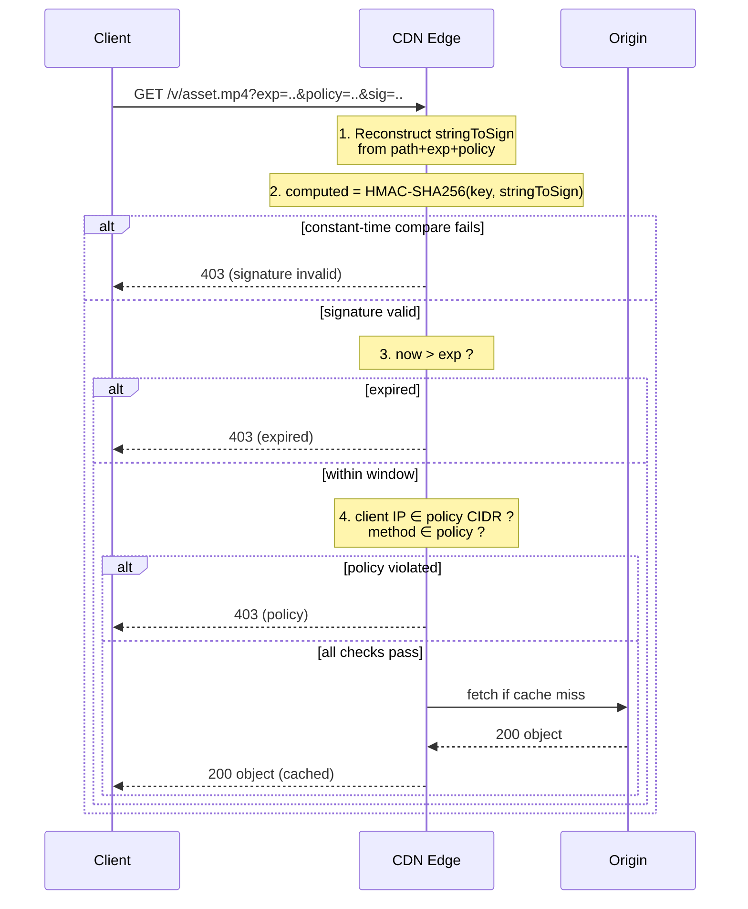
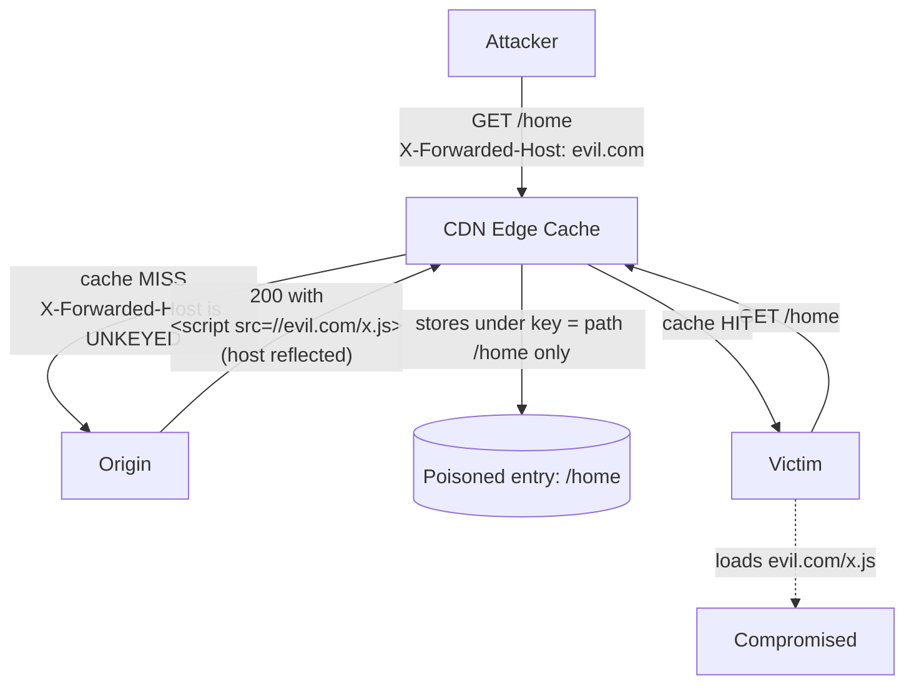

# CDN Security — Professional

<!-- level-focus -->
At professional level, focus on this question:

> How should teams adopt and operate **CDN Security** with measurable outcomes and limited coordination?

Use the smallest realistic scenario that exposes the decision and its failure behavior.
## 1. The edge trust boundary

A CDN edge server is a shared, multi-tenant reverse proxy that (a) authenticates and authorizes requests before they reach origin, (b) serves responses from a **shared cache** keyed by some subset of the request, and (c) terminates TLS on behalf of the origin. Each of these three roles carries a distinct failure mode:

- **Authorization** fails open when a token is forgeable, replayable, or long-lived.
- **Caching** fails when the cache key omits an input that changes the response — one user poisons the entry, all users receive it.
- **TLS termination** fails when key custody, SNI handling, or resumption tickets leak trust across tenants or domains.

The unifying principle: **every input that influences a response, or a security decision, must be either authenticated or part of the cache key.** Everything in this document is a corollary of that sentence.

---

## 2. Signed URLs and signed tokens: HMAC cryptography

A **signed URL** grants time-boxed access to an object without a per-request round trip to origin. The edge validates a signature it can compute locally from a shared secret, so authorization costs one HMAC, not one origin fetch.

### 2.1 What gets signed

The signature must cover **everything that scopes the grant**. Signing only the path lets an attacker extend the expiry; signing only the expiry lets them swap the path. The canonical string-to-sign concatenates, in a fixed, unambiguous order:

- the resource **path** (and optionally host) — binds the grant to one object;
- the **expiry** timestamp — bounds the validity window;
- an optional **policy** (allowed IP/CIDR, allowed HTTP method, start time, headers) — narrows the grant;
- optionally a **key identifier** so the verifier knows which secret to use.

### 2.2 HMAC, not a bare hash

Signatures use **HMAC** (RFC 2104), not `hash(secret || message)`. A bare-concatenation MAC over a Merkle–Damgård hash (MD5, SHA-1, SHA-256) is vulnerable to **length-extension**: an attacker who knows `hash(secret || m)` and `len(secret)` can compute `hash(secret || m || pad || m')` without the secret, forging a signature for an extended message. HMAC's nested construction — `H((K ⊕ opad) ∥ H((K ⊕ ipad) ∥ m))` — is not length-extendable. Use **HMAC-SHA-256**; prefer a KDF-derived per-purpose key over reusing one global secret.

```
stringToSign = method + "\n" + path + "\n" + expiry + "\n" + policyJSON
sig          = base64url( HMAC-SHA256(key, stringToSign) )
signedURL    = origin + path + "?exp=" + expiry + "&policy=" + b64(policyJSON) + "&sig=" + sig
```

### 2.3 Signed-URL field reference

| Field | Purpose | Failure if omitted / weak |
|-------|---------|---------------------------|
| `path` (canonicalized) | Binds grant to one object | Attacker reuses signature on a different path |
| `exp` (Unix seconds) | Bounds validity window | Grant is effectively permanent |
| `policy` (IP/CIDR, method, start) | Narrows to caller/action | Token usable from any IP, any method |
| `keyId` | Selects verification secret | Key rotation forces mass re-signing |
| `nbf` / start-time | Blocks early use | Pre-issued tokens active immediately |
| `sig` (HMAC-SHA256) | Integrity of all above | No integrity → forge anything |

A **signed token** (signed cookie, or a JWT-style bearer) is the same idea decoupled from the URL: the signature lives in a `Cookie` or `Authorization` header, so the URL stays cacheable while the credential travels separately. Signed cookies suit *session-scoped* access to many objects (an HLS manifest plus its segments); signed URLs suit *object-scoped*, shareable grants.

---

## 3. Verification at the edge: replay, expiry, and policy

Verification is a fixed sequence; short-circuit on the first failure and return a generic `403` (never leak *which* check failed).



**Constant-time comparison.** Compare the received signature to the computed one with a constant-time equality function (`hmac.Equal`, `crypto.timingSafeEqual`). A byte-by-byte early-exit comparison leaks how many leading bytes matched via timing, enabling incremental forgery.

**Expiry windows.** `exp` should be the *shortest* window that survives clock skew and legitimate retries — minutes for one-shot downloads, not days. Long windows widen the replay surface: a leaked URL (browser history, referrer header, proxy log, chat paste) is valid until it expires. Bind the token to the caller's IP/CIDR via `policy` to shrink the blast radius of a leak.

**Replay.** HMAC gives *integrity*, not *single-use*. A valid signed URL can be replayed by anyone who holds it, up to `exp`. To enforce true one-time use you need edge-side state (a nonce store / bloom filter of spent tokens) — expensive at CDN scale, so most designs accept replay-until-expiry and compensate with short windows plus IP binding.

**Key rotation.** Verify against a small set of live keys selected by `keyId`; overlap old and new keys during rotation so in-flight URLs stay valid. Never ship the signing secret to the browser or embed it in client code.

---

## 4. The cache key: keyed vs unkeyed inputs

A shared cache stores one response per **cache key** and serves it to every request that produces the same key. The key is normally `scheme + host + path + (selected) query params`. Inputs split into two classes:

- **Keyed inputs** are part of the cache key. Two requests differing only in a keyed input get *different* cache entries. Safe to let them influence the response.
- **Unkeyed inputs** are *not* part of the cache key but *may still reach origin*. Two requests differing only in an unkeyed input share *one* cache entry — so if an unkeyed input changes the response, the first request's version is served to everyone.

| Aspect | Keyed input | Unkeyed input |
|--------|-------------|---------------|
| In cache key? | Yes | No |
| Effect on entry selection | Distinct value → distinct entry | Ignored for entry selection |
| Reaches origin? | Yes | Often yes |
| Risk if it influences the response | None (isolated) | **Poisoning** — one value served to all |
| Typical members | path, host, whitelisted query params | most request headers, cookies, non-keyed params |

The danger zone is precisely: **an input that is unkeyed but reflected in the response.** That is the raw material of cache poisoning. The `Vary` response header is the standardized fix — it promotes a named request header into the cache key (`Vary: Accept-Encoding, X-Forwarded-Proto`) so the cache stores a separate variant per value.

---

## 5. Cache poisoning mechanics

**Web cache poisoning** (OWASP: *Web Cache Poisoning*) exploits an unkeyed input that changes the response. The attacker sends a request whose *keyed* part matches a popular resource but whose *unkeyed* part injects a payload; the poisoned response is cached and served to all subsequent victims sharing that key.



### 5.1 The classic vector: unkeyed reflected headers

The textbook example is an unkeyed `X-Forwarded-Host` (or `X-Host`, `X-Forwarded-Scheme`) that the origin reflects into an absolute URL — a canonical link, a resource `src`, a redirect `Location`. Because the header is unkeyed, the cache key is just `/home`; because the header is reflected, the response is now attacker-controlled; because the response is cached, every victim of `/home` gets the payload.

### 5.2 Requirements for a poisoning attack

1. An **unkeyed input** the attacker can set (a header, or a query param the CDN strips from the key).
2. That input **influences the response** (reflected in body/headers, or triggers a discrepancy).
3. The response is **cacheable** and shares a key with victim traffic.

### 5.3 Defenses

- **Do not reflect unkeyed inputs.** The origin should never trust `X-Forwarded-*` unless the edge sets them and strips client-supplied copies.
- **Key or `Vary` on any input you must honor.** If the response legitimately depends on a header, add that header to the cache key (or `Vary`) so variants stay isolated.
- **Strip unexpected inbound headers at the edge** before they reach origin.
- **Mark truly personalized responses `Cache-Control: private, no-store`** so they never enter the shared cache.
- **Fat GET / parameter cloaking:** a request smuggling a body or duplicate params into a GET can create a keyed/unkeyed discrepancy — reject or normalize these.

---

## 6. Cache-key confusion and web-cache deception

Two failure classes share a root cause — a **mismatch between how the cache computes the key and how the origin resolves the request.**

### 6.1 Cache-key confusion

The cache and origin disagree on what the "same" request is. Examples: the cache normalizes case or trailing slashes but the origin routes differently; the cache treats `?utm_*` as insignificant (stripped from the key) while the origin varies the response on it. When the cache thinks two requests are equivalent but the origin returns different bodies, one body leaks into the other's key.

### 6.2 Web cache deception (WCD)

**Web cache deception** (Omer Gil, 2017) tricks the cache into storing a *private, authenticated* response under a key it believes is a *static, cacheable* asset:

```
Victim (logged in) is lured to:
    GET /account/settings.css          ← attacker-crafted path

Cache rule:   "*.css is static → cache it"   (extension-based)
Origin rule:  ignores the ".css" suffix, routes to /account/settings,
              renders the VICTIM's private page (200, cacheable-looking)

Cache stores the victim's private HTML under /account/settings.css.
Attacker then fetches /account/settings.css → served the victim's data.
```

The mechanism: the cache decides cacheability from the **URL suffix** while the origin decides content from a **different parse** of the same URL. The extra path segment (`.css`) is meaningful to the cache and meaningless to the origin — a classic path-confusion parser differential (see Kettle/Gil research; no single RFC governs this, it is an implementation-agreement problem).

### 6.3 Defenses

- **Never cache on extension alone.** Cache only on explicit `Cache-Control`/`Content-Type` from origin — let the *response*, not the guessed URL, declare cacheability.
- **Canonicalize paths identically** at edge and origin (case, trailing slash, `..`, `%2e`, duplicate slashes) so both parse the same request the same way.
- **Origin must set `Cache-Control: no-store` on authenticated/personalized responses** and not rely on the edge to guess.
- **Reject path segments after a known route** (`/account/settings.css` should 404, not render `/account/settings`).

---

## 7. Request normalization for safe caching

Normalization is the deterministic transform applied *before* the cache key is computed and *before* the request reaches origin. Its job: collapse semantically identical requests to one key (for hit rate) while preventing the discrepancies that enable §5 and §6.

Normalize, at minimum:

- **Path:** percent-decode reserved characters consistently, resolve `.`/`..`, collapse duplicate slashes, apply a single case policy. Do this the *same way* the origin does.
- **Query string:** define an explicit **allowlist** of key-affecting params; strip or ignore the rest (`utm_*`, tracking, cache-busters you don't want in the key). Sort params so `?a=1&b=2` and `?b=2&a=1` share a key. Decide keyed vs unkeyed per-param deliberately.
- **Headers:** strip client-supplied `X-Forwarded-*`, `X-Real-IP`, `Forwarded`, and any hop-by-hop header; the edge re-adds authoritative values. `Vary`-list only the request headers the response genuinely depends on — a broad `Vary: User-Agent` shreds hit rate by fragmenting the cache per UA string.
- **Method/body:** reject GET/HEAD with bodies; never cache unsafe methods.

The rule of thumb: **a normalized request must map to exactly one origin response, and that response must be safe to serve to anyone who produces the same normalized key.** If either half is false, the input belongs in the key (or the response belongs out of the cache).

---

## 8. TLS termination at the edge

The edge terminates TLS so it can inspect, cache, and route the plaintext request. Three details dominate.

### 8.1 SNI

**Server Name Indication** carries the target hostname in the TLS `ClientHello`, letting one edge IP host thousands of certificates and pick the right one before the handshake completes. SNI is sent **in cleartext** in TLS 1.2 and (absent ECH) in TLS 1.3 — a network observer learns the hostname even though the payload is encrypted. **Encrypted Client Hello (ECH)** wraps the SNI (and the rest of the ClientHello) under a public key the CDN publishes via DNS, closing that leak; it is the modern successor to the earlier ESNI draft.

### 8.2 Session resumption

Full handshakes are expensive (a round trip plus asymmetric crypto). Resumption amortizes them:

- **Session IDs** (server-side state) — the server caches the session; poor fit for a large, load-balanced edge fleet.
- **Session tickets** (RFC 5077; TLS 1.3 uses PSK-based `NewSessionTicket`) — the server encrypts the session state under a **Session Ticket Encryption Key (STEK)** and hands it to the client, keeping the fleet stateless.

The STEK is a **shared secret across the edge fleet** and a real security asset: a leaked or never-rotated STEK breaks forward secrecy for every resumed session it can decrypt. Rotate STEKs frequently and distribute them narrowly. TLS 1.3 **0-RTT** resumption (early data) trades a round trip for **replayability** — 0-RTT early data can be replayed by an attacker, so it must be restricted to idempotent, non-state-changing requests.

### 8.3 Why TLS 1.3

TLS 1.3 (RFC 8446) removes the legacy foot-guns: it mandates AEAD ciphers, enforces forward secrecy (ephemeral key exchange only), drops RSA key transport, static DH, RC4, CBC-mode and renegotiation, and cuts the full handshake to 1-RTT. For a security-sensitive edge, TLS 1.3 is the floor.

---

## 9. Keyless SSL: terminating without the private key

Terminating TLS at the CDN normally means handing the CDN your certificate's **private key** — a hard sell for banks, governments, and anyone under regulation that forbids exporting private keys to a third party. **Keyless SSL** (Cloudflare's design; the pattern is provider-specific, not an RFC) resolves this: the CDN performs the handshake but the **private key never leaves the customer's infrastructure.**

The insight: in a TLS handshake, the private key is used exactly once — for a single signing (or, in legacy RSA key transport, decryption) operation. Everything else (certificate presentation, symmetric session setup, record encryption) needs only public material. So the CDN offloads *just that one operation* to a **key server** the customer runs:

```mermaid
sequenceDiagram
    participant C as Client
    participant E as CDN Edge (no private key)
    participant K as Customer Key Server (holds private key)
    C->>E: ClientHello (SNI)
    E->>C: ServerHello + Certificate (public)
    Note over E: needs one signature<br/>over handshake transcript
    E->>K: signing request (transcript hash)
    Note over K: private key stays here;<br/>signs the payload
    K-->>E: signature
    E->>C: CertificateVerify (TLS 1.3) + Finished
    Note over E,C: session keys derived;<br/>edge terminates TLS,<br/>serves & caches plaintext
```

**Trust properties.** The customer keeps custody of the private key; the CDN gets an *oracle* to it, not the key itself. Compromise the CDN edge and you can request signatures *while the connection to the key server holds*, but you cannot exfiltrate the key or forge signatures after being cut off — revoking the edge's access to the key server severs the capability. The key server is a high-value target and a latency-sensitive dependency: it must be hardened, rate-limited, and close (network-wise) to the edge, or the extra round trip per full handshake (mitigated by resumption) hurts.

Keyless termination is the reconciliation of two conflicting requirements — *let the CDN terminate TLS so it can cache and route*, and *never let the CDN hold my private key.* It buys custody at the cost of a synchronous dependency on customer-run infrastructure during full handshakes.

---


---

## Apply it

1. Define the user or business outcome that **CDN Security** should improve.
2. Assign one owner for code, contracts, operations, and incidents.
3. Split delivery into reversible increments that produce evidence early.
4. Publish responsibilities, escalation paths, and compatibility windows.
5. Stop or expand only when the agreed measures support that decision.

## Verify your work

- Each increment has an owner, rollback path, and observable exit condition.
- Adoption, reliability, delivery time, and coordination cost are measured.
- Incident and migration exercises prove that responsibility is executable.
- The old path is removed only after telemetry proves it is unused.

## Review questions

- Which measurable outcome justifies investing in CDN Security?
- Which team owns the full lifecycle and incident response?
- What reversible increment produces the earliest useful evidence?
- Which exit condition proves that migration or adoption is complete?
