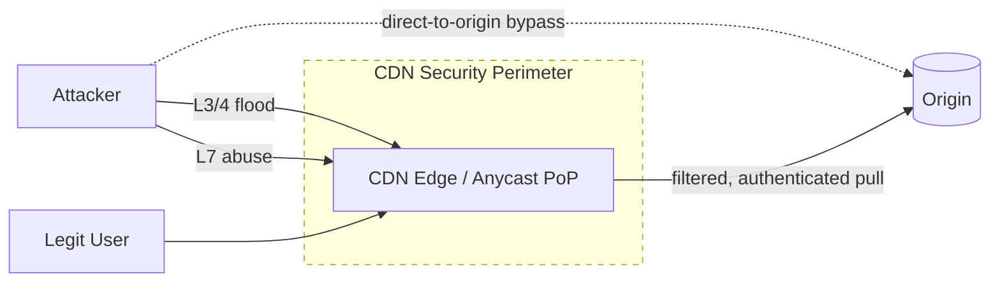
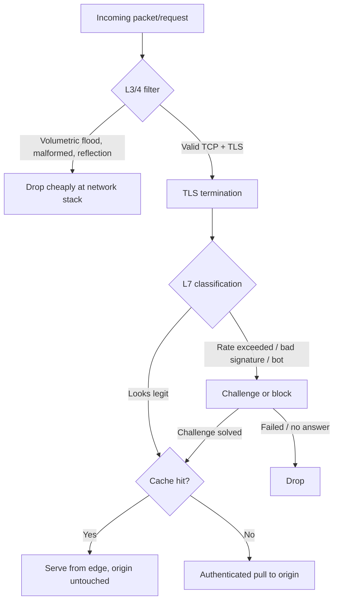
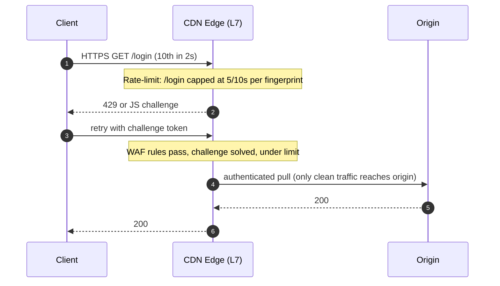
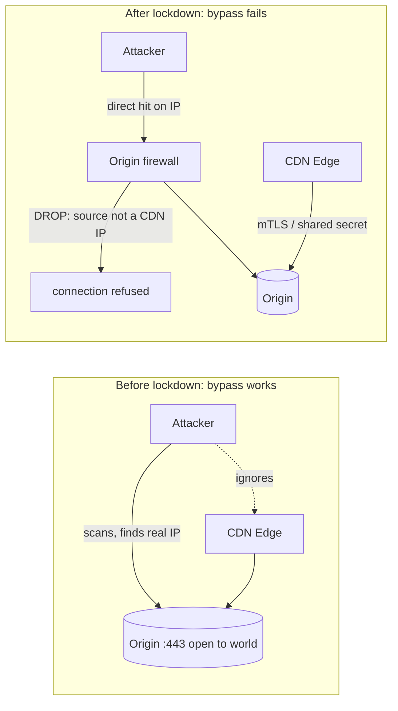
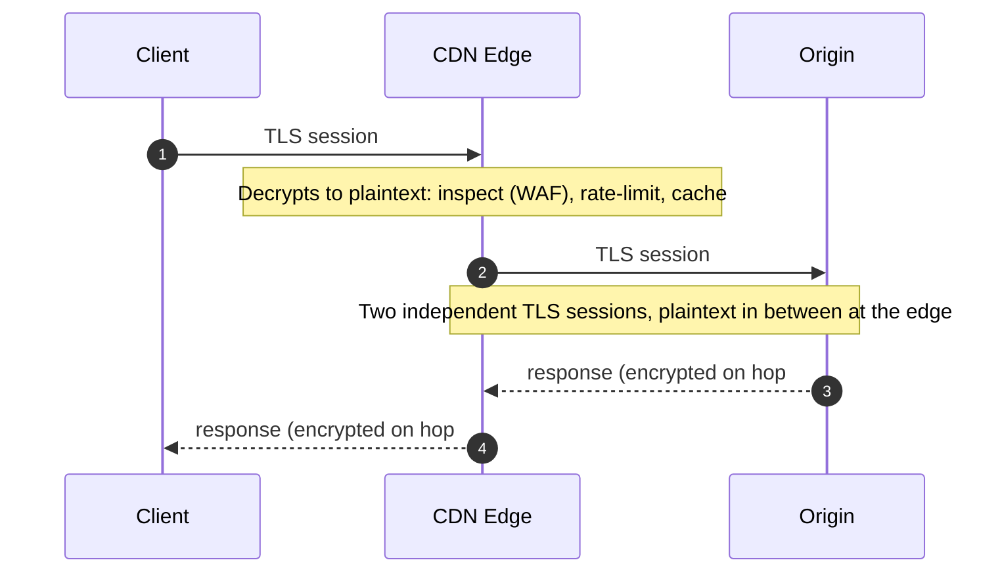

# CDN Security — Senior

<!-- level-focus -->
At senior level, focus on this question:

> Which system invariant is affected by **CDN Security** under failure, load, and change?

Use the smallest realistic scenario that exposes the decision and its failure behavior.
## 1. The Security Model of an Edge

When you put a CDN in front of an application, you deliberately insert a globally
distributed reverse proxy between every client and your origin. That single decision
reshapes your threat model:

- **The perimeter moves outward.** DDoS traffic, credential-stuffing, and scanner
  noise are now absorbed (or filtered) at hundreds of PoPs instead of hammering a
  handful of origin servers. This is the primary security *benefit*.
- **A new trusted third party appears.** The CDN terminates TLS, sees plaintext
  request/response bodies, holds (or generates) your certificate's private key, and
  decides what to cache. It is now inside your security boundary.
- **A bypass path may still exist.** If an attacker can reach your origin *directly*
  — over its raw IP, skipping the CDN — none of the edge defenses apply. The CDN is
  only a perimeter if there is no way around it (see §5–§6).

The senior mental model: **the CDN is a control plane for security, not a magic
shield.** Its value is proportional to how completely you route traffic through it,
how well you tune its policies, and how tightly you lock the door behind it.

The dashed bypass arrow is the failure the rest of this file is about: every edge
control is worthless if that arrow works.

---

## 2. Layered DDoS Defense: L3/4 Volumetric vs L7 Application

DDoS is not one problem. It splits cleanly by OSI layer, and the two halves are
defended by completely different mechanisms. Conflating them is the classic junior
mistake ("we have a WAF, we're protected from DDoS" — a WAF does nothing against a
300 Gbps UDP flood).

| Dimension | L3/4 — Volumetric / Protocol | L7 — Application-Layer |
|---|---|---|
| Target | Network bandwidth, packet-processing capacity, connection tables | Application CPU/memory, DB, expensive endpoints |
| Example attacks | UDP flood, SYN flood, DNS/NTP/memcached amplification/reflection, ACK flood | HTTP flood, cache-busting query strings, slowloris, credential stuffing, scraping |
| Metric of the attack | Bits per second (bps), packets per second (pps) | Requests per second (rps) at the app |
| Why it hurts | Saturates the pipe / kernel before the app is even reached | Each request looks legitimate but is expensive to serve |
| Primary defense | Anycast dispersion + scrubbing + SYN cookies; drop at the edge cheaply | WAF rules, rate-limiting, bot/JS challenges, request fingerprinting |
| Where it's dropped | Network stack of the edge PoP, before TLS | After TLS termination, at the HTTP layer |
| Decision needed | None per-request — filter by protocol/pattern | Per-request classification: human vs bot, legit vs abuse |

The key insight: **L3/4 is a capacity fight; L7 is a classification fight.** You beat
a volumetric attack by having more absorptive capacity than the attacker has
firepower (and by dropping junk packets cheaply). You beat an application-layer
attack by *distinguishing* the malicious request from the legitimate one — which is
hard precisely because a good L7 attack mimics real traffic.

A well-designed edge applies the cheapest filter first: drop garbage packets before
spending a single CPU cycle on TLS, then classify the survivors at L7.

---

## 3. Anycast as a Volumetric Absorption Mechanism

The reason a CDN can eat a multi-hundred-Gbps flood is **anycast**: the same IP prefix
is advertised via BGP from every PoP simultaneously. The internet's routing fabric
delivers each source's packets to the *topologically nearest* PoP. A botnet scattered
across the globe therefore has its flood **automatically sharded** across the CDN's
entire footprint — no single PoP absorbs the whole attack.

- **Load dispersion is free and structural.** A 400 Gbps attack from 100k bots hitting
  a 50-PoP anycast network is, roughly, 8 Gbps per PoP — a size any modern PoP shrugs
  off. The attacker cannot concentrate fire on one location because BGP won't let them.
- **The defender's job is aggregate capacity, not per-target capacity.** This is why
  CDN DDoS numbers are quoted in aggregate network capacity (tens of Tbps). It is a
  capacity arms race, and the CDN's whole business is having more.
- **Reflection/amplification is dropped at the edge.** Spoofed-source UDP reflection
  (DNS ANY, NTP monlist, memcached, chargen) is filtered by the PoP's network stack:
  the edge simply drops unsolicited/malformed responses cheaply, before they cost
  anything upstream. SYN floods are absorbed with **SYN cookies**, which let the edge
  respond without allocating connection state.

The trade-off and limit: anycast disperses *volumetric* load beautifully, but it does
nothing for an **L7 flood of well-formed, expensive requests** — those pass the network
filter, complete a real TCP+TLS handshake, and land as legitimate-looking HTTP. That is
why anycast (§3) and WAF/rate-limiting (§4) are *layers*, not alternatives.

---

## 4. L7 Defense: WAF, Rate-Limiting, and Challenges

Once a request survives the L3/4 filter and completes TLS, the edge must decide: is
this a human doing something reasonable, or abuse dressed up as a request? Three tools,
in increasing intrusiveness:

1. **WAF (Web Application Firewall).** Signature- and rule-based inspection of the HTTP
   request. Catches injection payloads (SQLi, XSS, path traversal), known-bad user
   agents, and protocol anomalies. The canonical open baseline is the **OWASP Core Rule
   Set (CRS)**. A WAF is pattern matching on request content — powerful for known attack
   *shapes*, blind to novel logic abuse.

2. **Rate-limiting.** Counts requests per identity (IP, ASN, API key, cookie, or a
   composite fingerprint) over a window and blocks or delays when a threshold is
   crossed. This is the primary defense against HTTP floods, brute-force login, and
   scraping. The hard part is the *identity*: a naïve per-IP limit is trivially defeated
   by a botnet (each bot stays under the limit) and punishes shared NATs (an entire
   office behind one IP). Senior designs key on richer signals — path-scoped limits
   (tighter on `/login` than on `/`), per-token limits behind auth, and reputation.

3. **Challenges.** When identity is uncertain, force the client to prove it is not a
   cheap bot: a **JS challenge** (execute JavaScript the CDN injects), a
   **managed/interactive challenge** (CAPTCHA-like or proof-of-work), or **mTLS/device
   attestation** for APIs. Challenges shift cost onto the client — trivial for a human,
   expensive at botnet scale — but they add latency and friction, so they are escalation
   tools, not defaults.

The design goal is a **funnel**: cheap filters reject the bulk of abuse early, and only
the ambiguous remainder pays the cost of a challenge. The origin should only ever see
traffic that has passed every layer.

---

## 5. The Origin-Exposure Problem: Bypassing the CDN

Here is the single most common way a CDN's protection is silently defeated: the
attacker never fights the edge at all. They **find the origin's real IP address** and
send traffic straight to it, skipping the CDN entirely. Every WAF rule, rate limit, and
anycast absorption becomes irrelevant, because the packets never traverse the perimeter.

How the real origin IP leaks — the senior must know all of these:

- **DNS history.** The A record pointed at the origin before the CDN was added; the old
  value is archived in passive-DNS databases forever.
- **Subdomains that skip the CDN.** `www` is behind the CDN, but `mail.`, `ftp.`,
  `dev.`, `origin.`, or `cpanel.` resolve straight to the origin. Attackers enumerate
  subdomains specifically to find one.
- **Outbound connections that reveal the IP.** SSRF-style features, webhooks, email
  headers (`Received:` chains), and error pages/stack traces that echo the server's own
  address.
- **TLS certificate transparency logs and SNI.** A cert issued directly on the origin,
  or a distinctive server banner, can be correlated across the entire IPv4 space by
  internet-wide scanners.
- **Same certificate / same content fingerprint.** Scanners that fetch every IP and hash
  the response can match the origin's unique page against its known CDN-fronted site.

The lesson: **a CDN is a perimeter only if the origin cannot be reached around it.**
Deploying a CDN without locking the origin is a security theater — the shield is up but
the back door is wide open.

---

## 6. Origin Lockdown: Authenticated Pulls and IP Allow-Lists

Closing the bypass is a defense-in-depth problem; no single control is sufficient,
because IPs leak and allow-lists drift. Layer these:

- **Firewall the origin to CDN egress IPs only.** The CDN publishes its egress ranges;
  the origin's firewall (security group / iptables / cloud NACL) drops all inbound
  :80/:443 that does not originate from those ranges. This is the coarse first line. Its
  weakness: the CDN's IP ranges are *shared across all its customers*, so another
  customer of the same CDN could, in principle, reach your origin through the CDN — which
  is why you also need authentication.
- **Authenticated origin pulls (mTLS).** The origin requires a client certificate that
  only *your* CDN account presents on the pull connection, and rejects any TLS handshake
  without it. This proves the request came from the CDN *and* from your configuration,
  not merely from the CDN's shared IP space. This is the strong control.
- **A shared secret header.** The CDN injects a secret header (e.g., a signed token) on
  every origin pull; the origin rejects requests lacking it. Weaker than mTLS (a leaked
  header value grants access, and it must be rotated), but a cheap additional check.
- **Rotate the origin IP after lockdown.** Locking the firewall does nothing if the *old*
  exposed IP is still live; move the origin to a fresh IP that was never publicly
  associated with the service.
- **Kill CDN-skipping subdomains and outbound leaks.** Route every subdomain through the
  CDN (or firewall it identically), strip internal IPs from error pages and email
  headers, and treat any feature that makes outbound requests as an SSRF surface.

The senior framing: **firewall answers "is this packet from the CDN's network?"; mTLS
answers "is this packet from *my* CDN configuration?"** You want both, because the first
is necessary but not sufficient on a shared CDN.

---

## 7. The TLS Trust Model with Edge Termination

To inspect requests (WAF), enforce rate limits, and cache responses, the CDN must see
**plaintext** — which means it terminates TLS at the edge. That has profound trust
implications a senior must be able to articulate in a security review.

Who holds the keys, and what the CDN can see:

- **The CDN terminates the client-facing TLS session**, so it holds (or generates on
  your behalf) the private key for your public certificate. There are three models:
  (a) you upload your own cert + key to the CDN; (b) the CDN provisions and manages a
  cert for you (e.g., via ACME/Let's Encrypt) and holds the key; (c) **keyless SSL**,
  where the private key stays on *your* infrastructure and the edge calls back to a key
  server for the signing operation, so the CDN never possesses the key. Keyless is the
  privacy-preserving option for organizations that cannot hand a third party their key.
- **Between edge and origin there is a *second, separate* TLS session.** The connection
  is "end-to-end encrypted" only in the sense that both hops are encrypted; it is
  **decrypted and re-encrypted at the edge**. In between, the CDN sees everything in
  cleartext: bodies, cookies, auth tokens, PII. This is the fundamental privacy cost of
  edge termination — you are trusting the CDN with all your users' data in the clear.

The senior trade-offs to weigh in a review:

- **Ensure the edge→origin hop is actually encrypted and authenticated.** A shockingly
  common misconfiguration is "flexible SSL": client→edge is HTTPS but edge→origin is
  plaintext HTTP, so the padlock in the browser is a *lie* and the second hop is fully
  exposed. Require full/strict TLS on the origin hop, validating the origin's cert.
- **Minimize what crosses the edge in cleartext.** For the most sensitive fields,
  consider end-to-end application-layer encryption so the CDN sees ciphertext even after
  TLS termination — at the cost of not being able to cache or WAF-inspect those fields.
- **Certificate authority for the origin hop matters.** The origin's cert should be
  validated by the edge (strict mode); "full (strict)" prevents an attacker who has
  hijacked routing to the origin from presenting a self-signed cert.
- **HSTS and cert transparency remain your responsibility.** Terminating at the edge does
  not remove your obligation to enforce HSTS and monitor CT logs for mis-issued certs.

---

## 8. Cache-Based Attacks: Poisoning and Deception

Caching — the CDN's whole purpose — creates two attack classes that have nothing to do
with volume and everything to do with the **cache key**: what the CDN uses to decide
that request A and request B are "the same" and may share a stored response.

**Cache poisoning.** The attacker crafts a request whose *unkeyed* input (a header the
origin reflects into the response but the CDN does *not* include in the cache key) makes
the origin emit a malicious response — which the CDN then caches and serves to *every*
subsequent victim under that key.

- Classic vector: an **unkeyed header** like `X-Forwarded-Host` that the origin
  reflects into an absolute URL (e.g., a `<script src>` or a redirect). The attacker
  sets it to their own host; the poisoned response caches; every later visitor loads the
  attacker's script.
- Root cause: **a mismatch between what the origin's response depends on and what the
  CDN keys on.** If the response varies on an input, that input *must* be in the cache
  key (or the response must be marked uncacheable).

**Cache deception.** The inverse. The attacker tricks the CDN into caching a *victim's
private, authenticated* response, then reads it from the cache themselves.

- Classic vector: the CDN caches by file extension ("always cache `*.css`"), so the
  attacker lures a logged-in victim to `https://site.com/account/settings.css`. The
  origin, ignoring the bogus suffix, serves the victim's real account page; the CDN sees
  `.css`, caches it publicly; the attacker fetches the same URL and reads the victim's
  private data from the shared cache.
- Root cause: **the CDN's cacheability decision disagrees with the origin's
  authorization decision** — the CDN thinks it's a public static file; the origin thinks
  it's a private dynamic page.

Attack → defense matrix:

| Attack | Mechanism | Primary defense |
|---|---|---|
| Cache poisoning (unkeyed header) | Origin reflects a header the CDN doesn't key on | Include reflected inputs in the cache key; strip/normalize dangerous headers at the edge; set `Vary` correctly |
| Cache poisoning (fat GET / param cloaking) | Ambiguous parsing of body/params between edge and origin | Normalize and reject ambiguous requests; align edge and origin parsers |
| Cache deception (extension confusion) | CDN caches by suffix; origin ignores suffix | Never cache authenticated responses; `Cache-Control: private/no-store` on user content; cache only by explicit allow-list of static paths |
| Cache deception (path confusion) | Edge and origin disagree on path normalization | Origin sends explicit cache directives; match normalization rules on both sides |

The unifying senior principle: **poisoning and deception are both cache-key
disagreements between the edge and the origin.** The origin, not the edge's heuristics,
must be the authority on cacheability — via explicit `Cache-Control` and correct `Vary`
— and any input the response depends on must be part of the key. Reference: OWASP's Web
Cache Poisoning and Web Cache Deception guidance, and RFC 9111 for HTTP caching semantics.

---

## 9. WAF False Positives: the Cost of Being Wrong

A WAF is a classifier, and every classifier has an error rate. The senior trade-off is
that the two error types have wildly asymmetric, both-bad costs:

- **False negatives (attack allowed).** A real attack slips through — the failure
  everyone fears and tunes against.
- **False positives (legitimate request blocked).** A real user's action is rejected as
  malicious. This is the *quieter, often more expensive* failure: a customer's checkout
  is blocked because their address contains an apostrophe that looks like SQLi, or a
  legitimate API payload trips a rule. Users don't file bug reports; they abandon and
  churn, and you never see the lost revenue in your WAF dashboard.

Cranking WAF sensitivity up to eliminate false negatives inevitably raises false
positives — you cannot maximize both. The mature operating discipline:

- **Deploy new rules in "detect/log-only" mode first.** Measure how much *real* traffic
  the rule would have blocked before enforcing it. The OWASP CRS ships with a **paranoia
  level** knob and an **anomaly-scoring** threshold precisely so you can tune the
  sensitivity/false-positive trade-off deliberately rather than binary on/off.
- **Tune the anomaly threshold, not individual rules blindly.** CRS scores each request
  and blocks above a threshold; raising the threshold reduces false positives at the cost
  of some sensitivity — an explicit, measurable dial.
- **Scope exceptions narrowly.** When a rule false-positives on a known-good endpoint,
  disable that specific rule for that specific path/parameter — never disable the rule
  globally or, worse, the whole WAF.
- **Own the metric.** Track the false-positive rate as an SLI. A WAF that silently blocks
  2% of checkouts is a revenue incident, and no one owns it unless a senior makes it a
  measured, alerted number.

The framing for a design review: **a WAF is a tunable trade-off, not a binary switch.**
The question is never "is the WAF on?" but "what is our false-positive budget, how do we
measure it, and who gets paged when a rule starts eating real users?"

---

## 10. Failure Modes

The characteristic ways CDN security designs fail in production, and the fix:

- **Origin reachable around the CDN.** The edge is fully configured but the origin IP
  is firewall-open to the world (§5). Attackers skip the perimeter entirely. *Fix:*
  IP allow-list + authenticated origin pulls (mTLS) + rotate the exposed IP (§6).
- **"Flexible SSL" — plaintext edge→origin hop.** Browser shows a padlock; the second
  hop is unencrypted HTTP. Anyone on the path between edge and origin reads everything.
  *Fix:* enforce full/strict TLS on the origin hop with cert validation (§7).
- **Cache poisoning via unkeyed input.** An attacker's crafted header caches a malicious
  response served to all victims. *Fix:* include reflected inputs in the cache key,
  strip dangerous headers at the edge, correct `Vary` (§8).
- **Cache deception on authenticated content.** Private user data cached publicly and
  read by an attacker. *Fix:* never cache authenticated responses; explicit
  `Cache-Control: private/no-store`; cache static content only by allow-list (§8).
- **WAF false-positive storm.** A tightened rule blocks a slice of legitimate traffic;
  because it's silent, it looks like a conversion dip, not a WAF incident. *Fix:*
  log-only rollout, anomaly-score tuning, false-positive SLI with alerting (§9).
- **CDN as a single point of failure / provider outage.** The perimeter *is* the CDN;
  if it has a global control-plane outage, your site is down and "fail open to origin"
  re-exposes the origin to the very attacks the CDN was filtering. *Fix:* have a
  documented, tested failover posture and decide deliberately whether to fail open
  (available but exposed) or fail closed (protected but down).
- **Compromised or over-trusted edge.** The CDN sees all plaintext; a CDN-side
  compromise or malicious config change exposes every user's data. *Fix:* minimize
  cleartext at the edge (keyless SSL, application-layer encryption for the most
  sensitive fields), and monitor CT logs for unexpected certs.
- **Stale IP allow-list.** The CDN adds new egress ranges; your origin firewall doesn't;
  legitimate pulls start failing (or, worse, you widen the list too far and re-open the
  origin). *Fix:* automate ingestion of the CDN's published egress ranges; prefer mTLS
  so correctness does not depend on an IP list at all.

---

## 11. Senior Checklist

- [ ] DDoS defense is explicitly **layered**: anycast/scrubbing for L3/4 volumetric, WAF
      + rate-limit + challenge for L7 — and the team knows a WAF does nothing for a
      volumetric flood (and vice versa).
- [ ] Rate-limiting keys on a richer identity than raw IP (fingerprint / token / ASN),
      is path-scoped, and doesn't punish shared-NAT users.
- [ ] The origin is **locked to the CDN**: firewall to CDN egress IPs *and* authenticated
      origin pulls (mTLS), with the previously exposed IP rotated.
- [ ] Every subdomain routes through (or is firewalled identically to) the CDN; error
      pages and email headers don't leak the origin IP.
- [ ] Edge→origin hop is **full/strict TLS** with cert validation — no "flexible SSL"
      plaintext hop anywhere.
- [ ] The TLS key-holding model is a conscious decision (uploaded / CDN-managed /
      keyless), and the privacy of terminating TLS at a third party is documented.
- [ ] Cache keys include every input the response varies on; `Vary` and
      `Cache-Control` are set by the *origin*, not inferred by edge heuristics.
- [ ] Authenticated/private responses are never cached (`private`/`no-store`); static
      caching is by explicit allow-list, closing cache-deception vectors.
- [ ] The WAF false-positive rate is a measured SLI; new rules ship in log-only mode and
      are tuned via anomaly scoring, with narrowly-scoped exceptions.
- [ ] The CDN-outage posture (fail open vs fail closed) is decided, documented, and
      game-day tested — not discovered during the incident.

*Next step:* [CDN Security — Professional](professional.md)

---

## Apply it

1. State the system invariant that **CDN Security** must protect.
2. Mark ownership, state, and failure propagation at each boundary.
3. Compare two designs under load, dependency failure, and future change.
4. Define recovery and compatibility behavior before implementation.
5. Test the riskiest assumption with a focused experiment.

## Verify your work

- The experiment supports the design with evidence, not preference.
- Failure injection shows the blast radius and recovery path.
- Compatibility checks cover old and new callers or data.
- Operational signals reveal invariant violations and recovery progress.

## Review questions

- Which invariant must remain true when CDN Security fails?
- Where should recovery responsibility live, and why?
- Which assumption deserves an experiment before implementation?
- How can the design evolve without changing every consumer at once?
