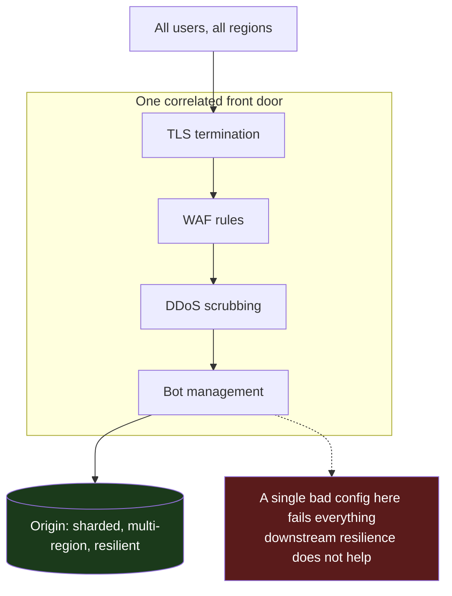
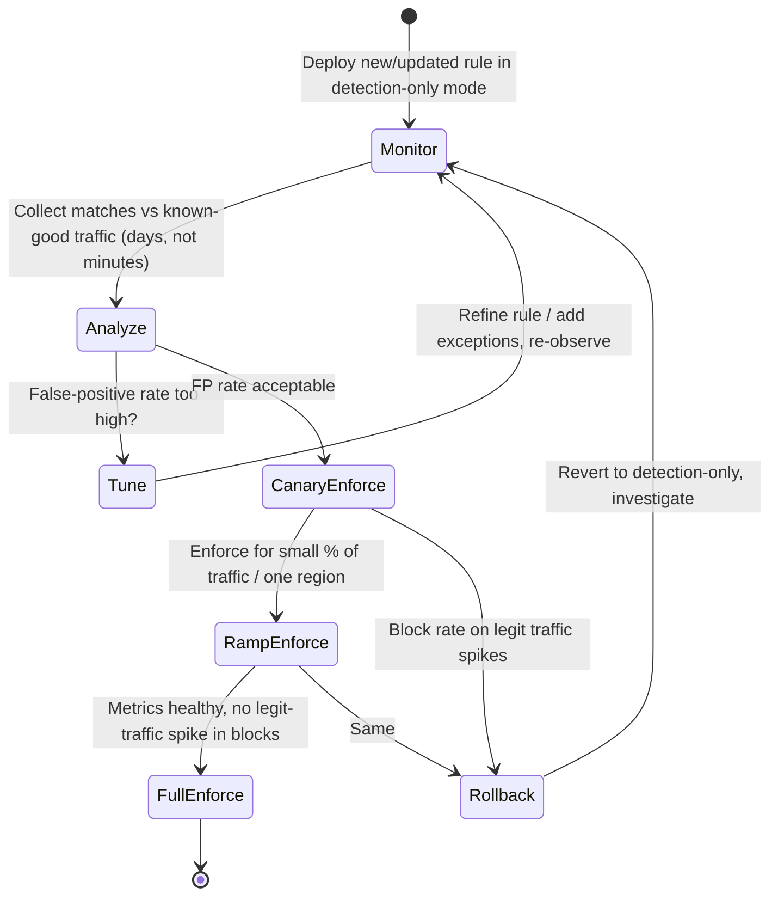

# CDN Security — Staff

> **Axis:** organizational scope & judgment — NOT deeper protocol theory (that is `professional.md`).
> This file answers a single question: how does a Staff/Principal engineer treat the CDN as a
> **critical security control that is also a single point of failure**, decide whether to hand a
> third party your TLS private keys, govern a WAF whose false positives block paying customers,
> run DDoS response across teams under pressure, and own the concentration and lock-in risk that
> comes with all of it — over years, across many teams, without direct authority?

The CDN is the strangest control in your stack: it is simultaneously your **outermost security
perimeter** (TLS termination, WAF, bot management, DDoS absorption) and your **largest correlated
failure domain** (every request in every region flows through it). A Staff engineer's job is to hold
both truths at once — lean on the CDN for protection you cannot build yourself, while refusing to let
it become an unmonitored, unrecoverable, un-exitable dependency.

---

## Table of Contents

1. [The Staff Framing: Control and SPOF in One Box](#1-the-staff-framing-control-and-spof-in-one-box)
2. [Concentration Risk: The CDN as Blast Radius](#2-concentration-risk-the-cdn-as-blast-radius)
3. [The Trust Decision: Terminating TLS at a Third Party](#3-the-trust-decision-terminating-tls-at-a-third-party)
4. [WAF Governance: Who Tunes the Rules, Who Eats the False Positives](#4-waf-governance-who-tunes-the-rules-who-eats-the-false-positives)
5. [DDoS: Always-On vs On-Demand, and the Runbook](#5-ddos-always-on-vs-on-demand-and-the-runbook)
6. [Build vs Buy vs Multi-CDN for Security](#6-build-vs-buy-vs-multi-cdn-for-security)
7. [Vendor Lock-In of Security Features](#7-vendor-lock-in-of-security-features)
8. [Risk Ownership and the RACI](#8-risk-ownership-and-the-raci)
9. [Cost, ROI, and the Security Budget Line](#9-cost-roi-and-the-security-budget-line)
10. [Second-Order Consequences and the Metrics That Warn You](#10-second-order-consequences-and-the-metrics-that-warn-you)
11. [When NOT to Lean on the CDN](#11-when-not-to-lean-on-the-cdn)
12. [Staff Checklist](#12-staff-checklist)

---

## 1. The Staff Framing: Control and SPOF in One Box

Junior and middle engineers see the CDN security features as a menu of switches: turn on TLS, turn on
WAF, turn on DDoS protection. Senior engineers own the SLOs of each. The **Staff** frame is different:
every one of those switches is a **trust delegation** to a third party sitting in the request path of
100% of your traffic, and the aggregate of those delegations is a single organizational bet.

Three uncomfortable properties define the Staff view:

- **The control and the failure domain are the same node.** You cannot get the WAF's protection
  without routing every request through the WAF's node. The thing protecting you is the thing that
  takes you down when it misfires. There is no "protection without exposure" configuration.
- **The blast radius is global and correlated.** A bad WAF rule, an expired certificate, a
  provider-side config push, or a provider outage does not degrade one shard or one region — it fails
  *everything*, everywhere, at once. Your carefully sharded, multi-AZ, multi-region backend shares one
  correlated front door.
- **The failure is often not yours to fix.** When the CDN's control plane is down, you cannot deploy a
  fix. You are waiting on a vendor's incident bridge. Your MTTR is bounded below by *their* MTTR, and
  you have no root access.

The Staff engineer's deliverable is not "we configured the CDN securely." It is a written,
socialized position on **how much of the perimeter we delegate, what we keep the ability to recover
ourselves, and what the exit looks like** — captured as an ADR (§35.1) that survives re-orgs.



The diagram's point: your backend can be beautifully resilient and it does not matter, because the
front door is a single logical control that everything traverses.

---

## 2. Concentration Risk: The CDN as Blast Radius

A CDN outage or misconfiguration is one of the most common causes of *total, global, cross-service*
downtime for internet-scale companies — precisely because so much converges on it. Notable public
examples of provider-side incidents taking down large fractions of the web include the
**Fastly 2021-06-08 global outage** (single customer config triggered a latent bug), the
**Cloudflare 2019-07-02 outage** (a single WAF regex caused CPU exhaustion across the fleet), and the
**Akamai 2021-07-22 DNS incident**. In each, downstream customers had no fix to deploy — they waited.

The Staff engineer must reason about concentration explicitly:

- **Correlated failure across your own services.** If ten product teams each independently onboarded
  the same CDN, you have ten teams sharing one failure domain and *no one* owns the aggregate risk.
  This is the classic "everyone's job is no one's job" trap. Name an owner.
- **Provider-side config as your change risk.** The provider pushes config to their global edge
  continuously. You did not review those changes, you cannot stage them, and they can break you. Your
  change-management rigor stops at their doorstep.
- **The DNS layer is part of the CDN.** Many CDNs also run your authoritative DNS or the CNAME that
  points at them. A DNS or control-plane failure is *worse* than a data-plane failure: you cannot even
  re-point traffic away, because the mechanism to re-point is also down.

**Blast-radius staging** — how a single bad control-plane push propagates:

```mermaid
sequenceDiagram
    autonumber
    participant Eng as Provider Engineer
    participant CP as CDN Control Plane
    participant Edge as Global Edge (thousands of PoPs)
    participant You as Your Users
    Eng->>CP: 1. Push config / rule change
    CP->>Edge: 2. Propagate globally in seconds
    Note over Edge: 3. Latent bug or bad regex triggers
    Edge--xYou: 4. 5xx / TLS errors EVERYWHERE at once
    Note over You,Edge: 5. You have no deploy that fixes this
    You->>Eng: 6. Open Sev-1; wait on vendor bridge (their MTTR = your MTTR floor)
```

The mitigation is **not** "avoid CDNs" — you cannot absorb a 2 Tbps DDoS yourself. It is: (a) keep a
**tested failover path** (secondary CDN or direct-to-origin) so you are not helpless, (b) demand
**decoupled DNS** so you retain the ability to re-point, and (c) **budget** for the reality that a
correlated provider outage is a *when*, not an *if*, in your availability math.

---

## 3. The Trust Decision: Terminating TLS at a Third Party

To inspect requests (WAF), cache HTTPS responses, and serve at the edge, the CDN must **terminate
TLS** — which means it holds a private key that can authenticate as *your* domain and can read every
byte of every request and response in plaintext at the edge, including auth tokens, PII, and payment
data. This is the single highest-trust delegation you make. Staff-level judgment is about **how** you
grant it, not whether.

Custody models, from most to least trust surrendered:

| Model | Who holds the private key | Who can decrypt traffic | Fits when |
|---|---|---|---|
| **CDN-managed cert** (provider generates key) | CDN generates and stores the private key | CDN | Fastest onboarding; commodity apps; you accept full delegation |
| **Bring-your-own-cert (uploaded)** | You generate; upload private key to CDN | CDN (holds a copy) | You want your own CA/cert but accept the CDN storing the key |
| **Keyless SSL** | You keep the private key on your own key server | CDN sees plaintext but *never holds the key* | Regulated key custody; key must never leave your HSM/boundary |
| **Encrypted origin / no edge termination** (pass-through TLS) | You | Only you (CDN cannot inspect) | You need end-to-end secrecy; you forgo WAF/caching of that traffic |

Key tensions a Staff engineer must resolve and write down:

- **Compliance and key custody.** PCI-DSS, HIPAA, and many data-residency regimes constrain who may
  hold key material and where plaintext PII may exist. If your obligations forbid a third party from
  holding the private key, **Keyless SSL** (the key stays in your HSM; the CDN calls back to you for
  the private-key signing operation during the TLS handshake) is the mechanism that squares "we want
  edge inspection" with "we cannot surrender the key." Understand its cost: the handshake now depends
  on your key server's availability and latency — you have added a dependency to *every new connection*.
- **The CDN can read everything.** Even with keyless SSL, the CDN sees plaintext at the edge (that is
  the point of a WAF). If a class of data legally cannot be visible to a third party, that traffic
  must **bypass edge termination** — and you lose WAF and caching for it. This is a real trade-off, not
  a checkbox.
- **Certificate lifecycle is now shared.** An expired or mis-issued cert on the CDN is a global
  outage. Ownership of renewal, monitoring of expiry, and the CAA/DNS records that authorize issuance
  must be explicitly assigned. Automated issuance (ACME) reduces expiry incidents but adds a control
  plane you must monitor.
- **Origin-side TLS still matters.** Terminating at the edge does *not* mean plaintext to origin. The
  edge-to-origin hop must itself be TLS (and ideally mTLS with origin authentication) or you have moved
  the plaintext problem, not solved it.

The decision to write down: *for each data classification, which custody model applies, and what we
give up (inspection/caching) to satisfy the compliance constraint.*

---

## 4. WAF Governance: Who Tunes the Rules, Who Eats the False Positives

A WAF is a **shared, high-blast-radius control** whose false positives block *real, paying users* and
whose false negatives let attacks through. The technical rules are the easy part; the Staff problem is
**governance**: who is allowed to change rules, how changes are rolled out, and who is accountable when
a rule blocks legitimate traffic.

The core asymmetry: a WAF rule tuned to catch more attacks (higher sensitivity) also blocks more
legitimate requests (higher false-positive rate). Someone must own where that dial sits, and that
someone must feel the pain of *both* sides — the security team feels the breach, the product team feels
the blocked checkout. If those are different teams with different incentives and no shared owner, the
WAF is either uselessly permissive or a customer-hostile brick.

**The non-negotiable rollout discipline: monitor first, enforce later.** New rules (and managed-rule
updates from the vendor) must run in **monitor / detection-only** mode long enough to measure their
real false-positive rate against production traffic *before* they block anything. Enforcing a fresh
rule blind is how you take down your own checkout on a Friday.



Governance rules a Staff engineer institutionalizes:

- **Change control on WAF rules equals change control on production code.** Rule changes are reviewed,
  version-controlled (rules-as-code / policy-as-code), staged in monitor mode, canaried, and
  reversible. A WAF console with god-mode "block now" buttons and no audit trail is an incident
  generator.
- **A break-glass path exists and is tested.** When a rule blocks a critical flow at 2 a.m., there
  must be a *fast, authorized* way to disable it — with an audit trail — that on-call can execute
  without waking a VP. Untested break-glass is the same as no break-glass.
- **Blocked-legitimate-traffic is a first-class SLI.** You cannot govern what you do not measure.
  Track the block rate on known-good traffic (logged-in users, successful-then-blocked sessions) and
  alert on spikes. A rule that suddenly blocks 5% of authenticated checkouts is an outage even though
  every dashboard is green.
- **Vendor managed-rule updates are still *changes*.** The vendor ships new managed rules
  automatically. Treat auto-updates like a third party pushing to prod: pin, stage, and review, or you
  inherit their false positives without warning.
- **Ownership is named.** Security defines the threat model and target coverage; the product/platform
  team owns the customer-impact budget for false positives; a joint owner arbitrates the dial. Write
  the RACI (§8) or it will be litigated during the incident.

---

## 5. DDoS: Always-On vs On-Demand, and the Runbook

DDoS protection is the clearest case of "you cannot build this yourself" — absorbing volumetric
attacks (hundreds of Gbps to Tbps) requires a globally distributed scrubbing capacity that only a
handful of providers possess. The Staff decisions are **posture** (always-on vs on-demand) and
**runbook readiness** (can your team actually execute under a live attack?).

| Dimension | Always-On Protection | On-Demand Protection |
|---|---|---|
| Traffic path | All traffic always flows through the scrubbing network | Normal traffic direct; rerouted to scrubbing *when an attack is detected* |
| Time-to-mitigate | Immediate (already inline) | Minutes — detection + BGP/DNS reroute + convergence |
| Latency in steady state | Small constant tax on every request | None until diverted |
| Cost model | Higher baseline; predictable | Lower baseline; can spike / burst-billed during attack |
| Failure mode | Scrubbing network is now a SPOF in your path | First minutes of an attack land on origin before diversion |
| Best fit | Public, high-value, frequently-targeted properties (auth, payments, APIs) | Lower-risk properties; cost-sensitive; attacks rare |

The Staff nuance: **the reroute in on-demand protection is not free and not instant.** BGP
re-advertisement or DNS changes take minutes to converge, and during those minutes the attack hits your
origin. For any property where minutes of downtime is unacceptable, always-on is the honest choice
despite its steady-state latency tax and its role as an inline SPOF.

**Layer 3/4 vs Layer 7.** Volumetric (L3/4) floods are absorbed by scrubbing capacity. Application-
layer (L7) attacks — expensive queries, cache-busting request patterns, credential-stuffing floods —
look like real traffic and must be handled by the WAF, rate-limiting, and bot management, not raw
bandwidth. A Staff runbook covers both; teams that only planned for volumetric attacks are blindsided
by a low-bandwidth L7 attack that pegs the database.

**The runbook is the deliverable, not the feature.** Buying DDoS protection and never running a drill
means that during a real attack, on-call is reading vendor docs live. A tested runbook specifies:

1. **Detection & declaration** — what metric crosses what threshold to declare a DDoS incident, and
   who declares it.
2. **Escalation** — the exact vendor contact / support tier / hotline, and *who is authorized* to
   engage emergency mitigation (and its cost).
3. **Actions** — enabling stricter WAF/rate-limit modes, "under attack" challenge modes, geo/ASN
   blocks, and their known collateral (challenge modes hurt legitimate users too — a conscious
   trade-off).
4. **Comms** — status page, support, and exec updates; who owns each.
5. **Cost awareness** — on-demand burst scrubbing can generate a large bill; someone with budget
   authority must be in the loop before emergency capacity is engaged.
6. **Post-incident** — capture the attack signature into standing rules so the next instance is
   absorbed automatically.

Drill it in a game day. An undrilled runbook is a document, not a capability.

---

## 6. Build vs Buy vs Multi-CDN for Security

| Option | When it wins | Hidden cost |
|---|---|---|
| **Buy (single CDN's security suite)** | You need WAF + DDoS + bot + TLS you cannot build; speed and coverage matter | Lock-in of rules/config; correlated SPOF; you inherit their outages and their managed-rule false positives |
| **Multi-CDN for resilience** | Availability of the perimeter is business-critical; you cannot accept one provider's outage | 2× config surface, rule parity is hard to maintain, security features differ per vendor, higher cost, harder debugging |
| **Build in-house (self-managed WAF/scrubbing at your edge)** | Extreme control/compliance needs; you have the scale and staff | You cannot match global scrubbing capacity; 24/7 security-ops staffing; you are now the SPOF you were avoiding |
| **Hybrid (CDN for L3/4 + DDoS, own WAF/logic at origin)** | You want inspection under your control but delegate raw absorption | Split-brain security posture; two places to tune; edge cannot pre-filter what origin inspects |

The honest reality: **almost no one should build volumetric DDoS protection or global TLS termination
in-house.** The capability is a natural oligopoly of a few providers with global capacity. The genuine
build-vs-buy questions are narrower: *do we self-manage WAF rules (portable) or use the vendor's
managed rules (locked-in)?* and *do we run multi-CDN to de-risk the perimeter SPOF?*

**Multi-CDN specifically for security** is where Staff judgment bites. It buys you availability of the
perimeter (provider A's outage does not take you down) but **doubles your security-config surface**:
you now maintain WAF rules, TLS configs, and DDoS postures in two dialects, and a rule present on A but
missing on B is a silent hole an attacker can find by choosing which CDN answers. Multi-CDN is a
resilience investment that *degrades* security consistency unless you invest heavily in config parity
(policy-as-code compiled to both vendors). Do not adopt it for security uniformity — adopt it for
availability, and pay the parity tax deliberately.

---

## 7. Vendor Lock-In of Security Features

Caching and routing are relatively portable; **security configuration is the stickiest part of a CDN
relationship.** This is where lock-in concentrates, and where a naive "we can switch providers anytime"
claim quietly becomes false.

Sources of security lock-in, roughly in order of severity:

- **WAF rules in a proprietary DSL.** Every CDN expresses rules differently (custom rule languages,
  managed rule sets, scoring models). Years of tuned exceptions and custom rules do not port. Migrating
  means re-deriving your false-positive tuning from scratch on a new engine — and re-running the
  monitor→enforce cycle for everything.
- **Managed-rule dependency.** If your protection *is* the vendor's continuously-updated managed rule
  set, you have outsourced your threat coverage. Leaving means rebuilding coverage you never authored.
- **Edge compute / edge logic.** Auth, request signing, header manipulation, and bot logic written for
  the vendor's edge runtime is vendor-specific code. The more security logic you push to the edge, the
  deeper the lock-in.
- **Bot-management and threat intelligence.** These are the vendor's proprietary models and data. There
  is no export. Switching means starting cold on a new vendor's model.
- **TLS/cert integration and keyless SSL wiring.** Cert automation, keyless key-server integration,
  and mTLS-to-origin configs are provider-specific plumbing.

Staff mitigations — **you cannot eliminate lock-in, so manage it:**

- **Keep security config as portable policy-as-code** where possible; treat the vendor's format as a
  *compile target*, not the source of truth.
- **Own your threat model and detection intent independently** of any one vendor's managed rules, so a
  migration is a re-implementation, not a re-invention.
- **Prefer standards at the boundary** (standard cert formats, ACME, OIDC/JWT at origin) over
  edge-proprietary equivalents when the capability is close to a commodity.
- **Record the exit cost in the ADR.** The decision to deepen CDN security integration is often a
  **one-way door**; name it as such so future teams do not assume reversibility that is not there.

---

## 8. Risk Ownership and the RACI

The recurring failure mode is **diffuse ownership**: security owns the threat model, platform owns the
CDN account, product owns the customer experience, and *no one* owns the aggregate risk of the CDN as a
control-and-SPOF. During an incident this ambiguity costs minutes you do not have.

| Concern | Responsible (does the work) | Accountable (one throat) | Consulted | Informed |
|---|---|---|---|---|
| TLS custody model per data class | Platform Security | Security lead | Legal/Compliance, Product | Eng org |
| Cert lifecycle & expiry monitoring | Platform | SRE lead | Security | On-call |
| WAF rule changes & rollout | Security Eng | Joint (Sec + Product) owner | Product on-call | Affected teams |
| WAF false-positive budget | Product/Platform | Product lead | Security | Support |
| DDoS posture (always-on vs on-demand) | SRE | SRE lead | Security, Finance | Execs |
| DDoS incident command | On-call IC | On-call IC | Vendor TAM, Comms | Execs, Support |
| Multi-CDN / exit strategy | Platform | Principal/Staff eng | Finance, Security | Eng org |
| Aggregate CDN concentration risk | — | **Named owner (Staff/Principal)** | All above | Leadership |

The last row is the whole point. If the "aggregate CDN concentration risk" cell is empty, that is the
gap a Staff engineer exists to close. Someone must own the sentence: *"if this provider has a global
outage or a bad push, here is what happens to us and here is what we do."* Assign it in writing.

---

## 9. Cost, ROI, and the Security Budget Line

Security features on a CDN are priced in ways that surprise finance and shape architecture:

- **DDoS pricing is often the hidden bomb.** Some plans meter clean traffic normally but bill scrubbed
  attack traffic — meaning an attack you successfully mitigated arrives as a large invoice. Understand
  whether your plan is flat-rate "unmetered mitigation" or usage-billed, because the latter turns a
  security event into a cost event. This drives the always-on vs on-demand decision as much as latency
  does.
- **WAF is typically priced per request and/or per rule.** High-volume APIs make per-request WAF a real
  line item; this can push teams to under-protect low-value-but-high-volume endpoints. Make that a
  conscious call, not an accident of billing.
- **TLS at scale and keyless SSL add cost and latency.** Keyless SSL puts your key server in the
  handshake path — capacity-plan it, because it is now a per-new-connection dependency.
- **Multi-CDN roughly doubles perimeter cost** and adds the ongoing labor of parity — budget the people,
  not just the bytes.

The ROI framing to bring to leadership is **avoided-loss, not feature count**: the value of the CDN
security layer is the expected cost of the outages, breaches, and DDoS downtime it prevents, minus its
run cost and minus the expected cost of the correlated outages it *causes*. That last term is real and
usually omitted. A Staff engineer puts it on the table.

---

## 10. Second-Order Consequences and the Metrics That Warn You

Delegating the perimeter to a CDN has downstream effects that surface months later:

- **Skill atrophy.** Teams that never operate their own WAF/DDoS lose the ability to reason about it,
  which makes them worse at governing the vendor and helpless if they ever must exit. Keep enough
  in-house literacy to be a demanding customer.
- **Alert blindness at the edge.** The most dangerous incidents are the *silent* ones: a WAF rule
  blocking legitimate users while every uptime check (which the WAF allow-lists) stays green. If your
  observability lives behind the CDN, a CDN-layer failure can hide itself.
- **Compliance drift.** A data-class or region added later may now be flowing plaintext through an
  edge that your original custody decision never contemplated. The TLS-custody decision needs periodic
  re-review, not one-time sign-off.
- **The "temporary" break-glass that never closes.** A WAF rule disabled during an incident and never
  re-enabled is a standing hole. Break-glass must expire automatically.

**The metrics a Staff engineer watches to know the decision is going wrong:**

- **Blocked-legitimate-traffic rate** (authenticated/known-good requests receiving WAF blocks) — the
  single best early warning that a rule is too aggressive.
- **Certificate expiry runway** — days-to-expiry on every edge cert; a global outage in slow motion.
- **Edge-to-origin auth/mTLS success rate** — proves you did not move the plaintext problem to the
  origin hop.
- **DDoS scrubbed-vs-clean traffic ratio and its cost** — both a security signal and a budget signal.
- **Time-to-mitigate in the last DDoS drill** — proves the runbook is a capability, not a PDF.
- **Config parity drift across CDNs** (if multi-CDN) — a rule on A missing on B is an exploitable hole.

---

## 11. When NOT to Lean on the CDN

Staff judgment includes knowing where the CDN is the *wrong* control:

- **Not for data that legally cannot be seen by a third party.** If a compliance regime forbids a
  provider from viewing plaintext PII, that traffic bypasses edge termination — accept the loss of WAF
  and caching for it rather than manufacturing a violation.
- **Not as your *only* line of defense.** A WAF is a perimeter filter, not a substitute for fixing the
  SQL injection or the auth flaw. Teams that treat "the WAF will catch it" as remediation ship
  vulnerable code and get breached the day a bypass is found. The WAF buys time; it does not fix bugs.
- **Not for internal/east-west traffic.** A CDN protects the north-south public edge. Service-to-service
  security (mTLS, service mesh, zero-trust) is a different control; do not conflate them.
- **Not on-demand DDoS for latency-critical, frequently-targeted properties.** The reroute delay makes
  on-demand the wrong posture where the first two minutes of downtime are unacceptable — pay for
  always-on.
- **Not multi-CDN "for security uniformity."** It de-risks availability but *fragments* security
  consistency; adopt it for the former with eyes open about the latter, or not at all.
- **Not without an exit plan.** If you cannot articulate how you would leave in a crisis, you have not
  bought a service — you have signed a dependency you cannot govern.

The trap a less experienced engineer falls into: treating each CDN security toggle as pure upside
("more protection, why not?") without pricing the correlated-failure, lock-in, and false-positive costs
that come attached. Every toggle is a trade.

---

## 12. Staff Checklist

- [ ] TLS-custody model chosen **per data classification** (CDN-managed / BYO-cert / keyless SSL /
      pass-through), with compliance sign-off and the inspection/caching trade-off written down.
- [ ] Certificate lifecycle owned and monitored; expiry runway alerted as a global-outage precursor.
- [ ] Edge-to-origin hop is itself TLS/mTLS — plaintext problem not merely relocated.
- [ ] WAF changes are policy-as-code, reviewed, and roll out **monitor → canary → enforce**; never
      enforce-blind.
- [ ] Blocked-legitimate-traffic is a tracked SLI with alerting; tested, auto-expiring break-glass exists.
- [ ] WAF false-positive budget and rule-tuning ownership assigned with a named arbiter (the RACI is written).
- [ ] DDoS posture (always-on vs on-demand) chosen with latency *and* cost trade-offs explicit; covers
      both L3/4 and L7.
- [ ] DDoS runbook exists, names the vendor escalation and the budget-authorized decision-maker, and has
      been **drilled** in a game day.
- [ ] Concentration/SPOF risk has a **single named owner**; a tested failover path (secondary CDN or
      direct-to-origin) and **decoupled DNS** preserve the ability to re-point.
- [ ] Security-feature lock-in and the **exit cost** captured in an ADR (§35.1); the one-way-door
      decisions are labeled as such.
- [ ] Cost model understood — especially usage-billed DDoS scrubbing and per-request WAF — and the ROI
      framed as avoided-loss net of provider-caused correlated outages.

*Next step:* [CDN Security — Interview](interview.md)
