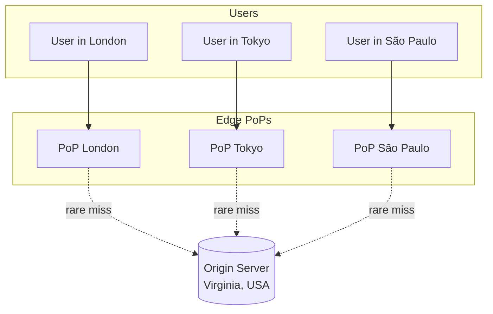
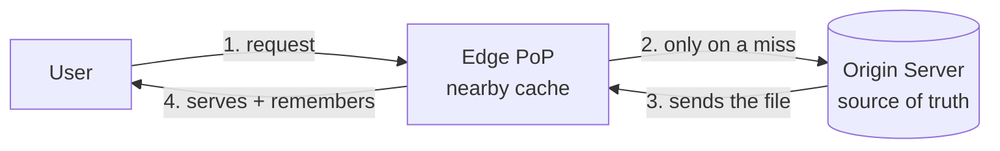
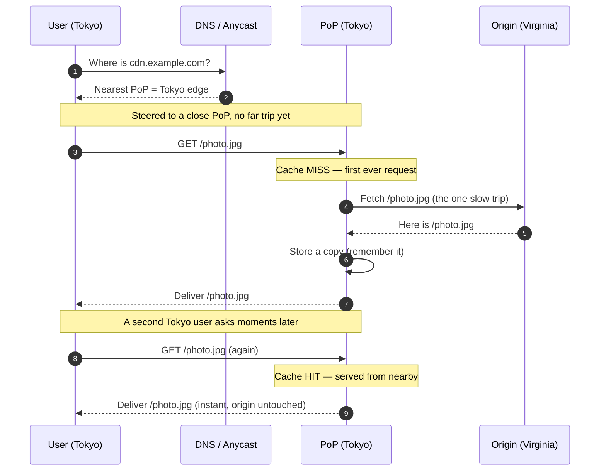

# Edge Locations — Junior

<!-- level-focus -->
At junior level, focus on this question:

> How can I apply **Edge Locations** in one small example and prove the result?

Use the smallest realistic scenario that exposes the decision and its failure behavior.
---

## 1. What Is an Edge Location (PoP)?

An **edge location** — also called a **Point of Presence (PoP)** — is a small
data center that a content-delivery network (CDN) places physically close to where
users live. Instead of running one giant set of servers in a single city, a CDN
operator (Cloudflare, Akamai, AWS CloudFront, Fastly) runs **hundreds of these
smaller sites** scattered across the globe: one near London, one near Tokyo, one
near São Paulo, one near Mumbai, and so on.

Each PoP holds **copies of your content** — images, videos, JavaScript, CSS, HTML.
When a user in Tokyo asks for a photo, the Tokyo PoP hands them the copy it already
has, instead of the request traveling all the way to your main servers in Virginia.

The word "edge" is the key idea. Picture the internet as a network. Your main
servers sit in the **center** (the *origin*). PoPs sit at the **edge**, right next
to the users — the last stop before the request would have to travel far.

> Think of a global bookstore chain. The **origin** is the central warehouse where
> every book is printed. A **PoP** is a local branch in your town that stocks the
> popular books. Most of the time you walk to the local branch (fast). Only for a
> rare title does the branch order it from the central warehouse (slow).



Solid arrows are the common, fast path (user to nearby PoP). The dotted arrows are
the rare, slow path (PoP to origin) that only happens when the PoP does not already
have a copy.

---

## 2. Why Distance Costs Time — the Speed-of-Light Intuition

Why does physical closeness matter at all? Computers are fast — surely a few
thousand extra kilometers is nothing? It turns out distance is one of the few
things you **cannot** engineer away, because it is limited by physics.

Data travels through fiber-optic cables as light. Light is fast, but not instant.
In a vacuum it goes about 300,000 km/s; inside glass fiber it is slower, roughly
**200,000 km/s** (about two-thirds of vacuum speed). That number is a hard floor —
no router upgrade, no faster CPU, no bigger budget can beat it.

Let's do the arithmetic. A **round trip** means the signal goes to the server *and*
the reply comes back — so you count the distance twice.

```text
Round-trip time (RTT) ≈ (2 × distance) / speed-in-fiber

London → New York (one way ≈ 5,600 km):
  RTT ≈ (2 × 5,600 km) / 200,000 km/s
      = 11,200 / 200,000 s
      = 0.056 s
      = 56 ms   (just for the light to travel — before ANY real work)

London → London PoP (one way ≈ 50 km):
  RTT ≈ (2 × 50 km) / 200,000 km/s
      = 100 / 200,000 s
      = 0.0005 s
      = 0.5 ms
```

So the pure travel time to a far server is **~56 ms**, versus **~0.5 ms** to a
nearby PoP — over **100× more** just from distance. And that is the *optimistic*
figure: real fiber is never a straight line, signals pass through many routers, and
each hop adds a little delay. Real-world London-to-New-York RTT is closer to
**70–80 ms**.

Now remember that loading a modern web page is not one round trip — it can be
**dozens**: DNS lookup, the TLS security handshake (multiple round trips), then the
HTML, then each image, script, and stylesheet. Every round trip pays the distance
tax. Shave the distance and you shave *every one of those trips* at once. That is
the entire reason CDNs plant PoPs near users.

> **Key intuition:** you can make servers faster, but you cannot make light faster.
> The only way to cut the distance tax is to move the content closer. That is what
> an edge location does.

---

## 3. Near vs Far: What the Numbers Look Like

Latency (delay) built from distance is not the only benefit of a nearby PoP, but it
is the most fundamental. Here is a side-by-side view.

| Aspect | Far origin (single distant data center) | Near PoP (edge location) |
|--------|------------------------------------------|--------------------------|
| One-way distance (typical) | 5,000–15,000 km | 20–500 km |
| Round-trip travel time (physics floor) | 50–150 ms | 0.5–5 ms |
| Realistic RTT (with routers/hops) | 70–250 ms | 2–20 ms |
| Round trips to load a page | Each one pays the full distance | Each one pays almost nothing |
| Load on your main servers | High (every user hits it) | Low (PoP absorbs most traffic) |
| Behavior during a traffic spike | Origin can be overwhelmed | Spread across many PoPs |

The pattern to memorize: **near is cheap, far is expensive**, and the cost is paid
*per round trip*. A rough intuition table for round-trip latency by distance:

| User → Server distance | Approx. round-trip time | Feels like |
|------------------------|--------------------------|------------|
| Same city (near PoP) | ~1–10 ms | Instant |
| Same country | ~10–40 ms | Snappy |
| Same continent | ~40–90 ms | Slight delay |
| Across an ocean | ~90–200 ms | Noticeable lag |
| Opposite side of Earth | ~200–350 ms | Sluggish |

For reference on how much each step of a distributed system costs, engineers keep a
"latency numbers" cheat sheet in their heads. A cross-continent round trip
(~150 ms) sits near the top — it dwarfs a memory read (nanoseconds) or a local disk
read (microseconds). That is exactly why we work so hard to avoid the far trip.

---

## 4. How a User Reaches the Nearest PoP

Here is a puzzle. Every PoP serves the *same* website — say `cdn.example.com`. When
a user in Tokyo types that address, how does their request magically land at the
**Tokyo** PoP instead of the London one? The user did nothing special; they just
opened the page. There are two common mechanisms, and CDNs often combine them.

### 4.1 GeoDNS (geography-aware DNS)

When your browser wants to visit `cdn.example.com`, it first asks DNS: "what is the
IP address for this name?" A normal DNS server always returns the same answer. A
**GeoDNS** server is smarter: it looks at *where the question is coming from* and
answers with the IP address of the **closest PoP**.

```text
User in Tokyo asks:      "IP for cdn.example.com?"
GeoDNS notices:          "This request comes from Japan."
GeoDNS answers:          "Use 203.0.113.10"  ← the Tokyo PoP

User in London asks:     "IP for cdn.example.com?"
GeoDNS notices:          "This request comes from the UK."
GeoDNS answers:          "Use 198.51.100.20" ← the London PoP
```

Same name, different answer depending on who is asking. The user is steered to a
nearby PoP without ever knowing it happened.

### 4.2 Anycast (one address, many locations)

The second trick is even cleverer. With **anycast**, *many* PoPs all announce the
**exact same IP address** to the internet. When a user sends a packet to that
address, the internet's routing system automatically delivers it to the
**nearest** PoP (in network terms) — the same way water flows to the nearest drain.

```text
Every PoP announces:  "You can reach 192.0.2.1 through me!"

A packet sent to 192.0.2.1 from Tokyo  → routers hand it to the Tokyo PoP.
A packet sent to 192.0.2.1 from Berlin → routers hand it to the Frankfurt PoP.

Same address. The network chooses the closest holder automatically.
```

The beauty of anycast is that it also handles failures gracefully: if the Tokyo PoP
goes offline, it simply stops announcing the address, and the internet re-routes
Tokyo's users to the next-nearest PoP — no configuration change needed.

### 4.3 Which is used?

You do not have to pick just one. Many large CDNs use **anycast** for its speed and
automatic failover, while others lean on **GeoDNS** for finer geographic control;
plenty use both together. As a junior, the takeaway is simply: **you don't manually
choose a PoP — DNS and/or anycast route you to a close one automatically.**

| Mechanism | How it steers you | Failover behavior |
|-----------|-------------------|-------------------|
| GeoDNS | Returns a different IP based on where you are | Slower (waits for DNS cache to expire) |
| Anycast | Same IP everywhere; the network picks the closest | Fast (routing re-converges automatically) |

---

## 5. Edge vs Origin: Who Does What

The whole system is a partnership between two roles. Understanding the split is the
heart of this topic.

- **Origin** — your **real, authoritative** servers. This is the source of truth.
  It holds the master copy of every file, runs your application logic, and talks to
  your database. There is usually one origin (or a small cluster in one or two
  regions). If content changes, it changes here first.

- **Edge (PoP)** — a **cache and front line** close to users. It keeps copies of
  content so it can answer most requests directly, without bothering the origin.
  There are many PoPs, all over the world.

The relationship is simple to state: **the edge serves what it can from its local
copy; whatever it lacks, it fetches from the origin — once — then remembers it for
the next user.**



| Question | Edge (PoP) | Origin |
|----------|------------|--------|
| How many are there? | Many (hundreds worldwide) | Few (often one region) |
| Distance from user | Close | Far |
| What it stores | Cached copies of popular content | The master, authoritative copy |
| What it runs | Fast delivery, caching, some light logic | Full application, database, business logic |
| Who talks to it | End users, directly | Mostly only the edge PoPs |
| What happens if it goes down | Users route to another PoP | Cache can serve stale copies for a while, but new/changed content can't load |

The two common outcomes when the edge receives a request:

- **Cache HIT** — the PoP already has the file. It serves it instantly from nearby.
  The origin is never contacted. This is the fast, common case.
- **Cache MISS** — the PoP does *not* have the file (first time anyone asked, or the
  copy expired). The PoP fetches it from the origin **once**, hands it to the user,
  and **stores it** so the *next* user gets a HIT. The distance tax is paid once,
  then avoided for everyone after.

This is why the very first visitor after a deploy might see a slightly slower load,
while everyone after them gets the instant version — the PoP "warmed up."

---

## 6. A Request's Journey, Step by Step

Let's trace one photo request from a user in Tokyo, from the moment they open the
page, following both a miss and the following hit.



Read the two halves:

- **Steps 4–8 (the miss):** the very first request pays the distance tax exactly
  once — the PoP has to reach back to Virginia. But it saves the file on the way
  back.
- **Steps 9–11 (the hit):** every following user in Tokyo gets the photo straight
  from the Tokyo PoP. No trip to Virginia. This is where the speed comes from — and
  because most content is requested many times, **most requests are hits.**

The origin's job shrinks to "answer the occasional miss and hold the truth,"
while the edges shoulder the flood of everyday traffic close to the users.

---

## 7. Key Terms

| Term | Plain-English definition |
|------|--------------------------|
| Edge location / PoP | A small data center placed near users that caches and serves content |
| Origin | Your authoritative servers — the source of truth for all content |
| Latency | The delay before data starts arriving; distance is a big part of it |
| Round-trip time (RTT) | Time for a request to reach a server and the reply to return |
| Cache HIT | The PoP already has the content and serves it directly (fast) |
| Cache MISS | The PoP lacks the content and must fetch it from the origin (slow, once) |
| GeoDNS | DNS that returns a nearby PoP's address based on where you are |
| Anycast | One IP address announced by many PoPs; the network routes you to the closest |
| CDN | Content Delivery Network — the whole system of PoPs plus the routing that connects users to them |

---

## 8. Common Misunderstandings at This Level

1. **"The CDN copies my whole website to every PoP in advance."** Usually no. Most
   CDNs are *pull-based*: a PoP fetches content from the origin only when a user
   first asks for it (on a miss), then caches it. It fills up on demand.

2. **"More PoPs always means faster, so more is strictly better."** Proximity helps,
   but a PoP only helps if it actually has your content cached. Rarely-requested
   content misses often and still pays the origin trip. Popularity and caching
   rules matter as much as raw PoP count.

3. **"The user or my app picks which PoP to use."** No — DNS and/or anycast do it
   automatically based on network geography. Neither the user nor your code chooses.

4. **"The edge is where my database and business logic live."** No. The edge caches
   and delivers; the **origin** runs the real application and owns the database. The
   edge is a fast front door, not the house.

5. **"Faster hardware could remove the distance delay."** No. The floor is the speed
   of light in fiber. The only cure for the distance tax is *less distance* — which
   is exactly what edge locations provide.

---

## 9. Hands-On Exercise

Pick a website you use daily (a news site, a shopping site, a streaming service).
Without writing code, sketch and answer:

1. **Draw the two-layer picture.** Put the user on the left, a nearby PoP in the
   middle, and the origin on the right. Label which arrow is fast and common (user
   to PoP) and which is slow and rare (PoP to origin).
2. **Estimate the distance tax.** Guess where the site's origin might be. Using
   `RTT ≈ (2 × distance) / 200,000 km/s`, estimate the round-trip time *without* a
   CDN, then estimate it *with* a PoP in your city. How many times faster is the
   nearby path?
3. **Split the content.** List five things the page loads (logo, product photos,
   the JavaScript bundle, your personal shopping cart, live stock prices). For each,
   decide: is it a good fit to cache at the *edge*, or must it come fresh from the
   *origin*? Explain why. (Hint: things that are the same for everyone cache well;
   things unique to *you* usually don't.)
4. **Trace a miss then a hit.** Describe, in your own words, what happens the very
   first time anyone in your city loads the logo, versus the second time — and why
   the second user has a faster experience.

If you can do all four, you have the junior mental model: content lives near users
at the edge, distance is the enemy, routing to a nearby PoP is automatic, and the
origin stays the quiet source of truth behind it all.

> 📚 **Canonical reading:** [What is a CDN edge server?](https://www.cloudflare.com/learning/cdn/glossary/edge-server/) ·
> [What is a CDN?](https://www.cloudflare.com/learning/cdn/what-is-a-cdn/) ·
> [What is Anycast?](https://www.cloudflare.com/learning/cdn/glossary/anycast-network/) (Cloudflare Learning)

---

*Next step:* [Edge Locations — Middle](middle.md)

---

## Apply it

1. Choose one small, known input for **Edge Locations**.
2. Predict the output or observable behavior.
3. Run the smallest example or probe that exercises the concept.
4. Change one input to trigger a failure or boundary case.
5. Explain the evidence using the guide's vocabulary.

## Verify your work

- Record the exact input, command or code path, and output.
- Repeat the probe and confirm the result is consistent.
- Show one expected success and one expected failure.
- Resolve any difference between the prediction and the evidence.

## Review questions

- What problem does Edge Locations solve in the example?
- Which input changes the observed result, and why?
- What is the smallest useful success check?
- Which beginner mistake would your evidence catch?
