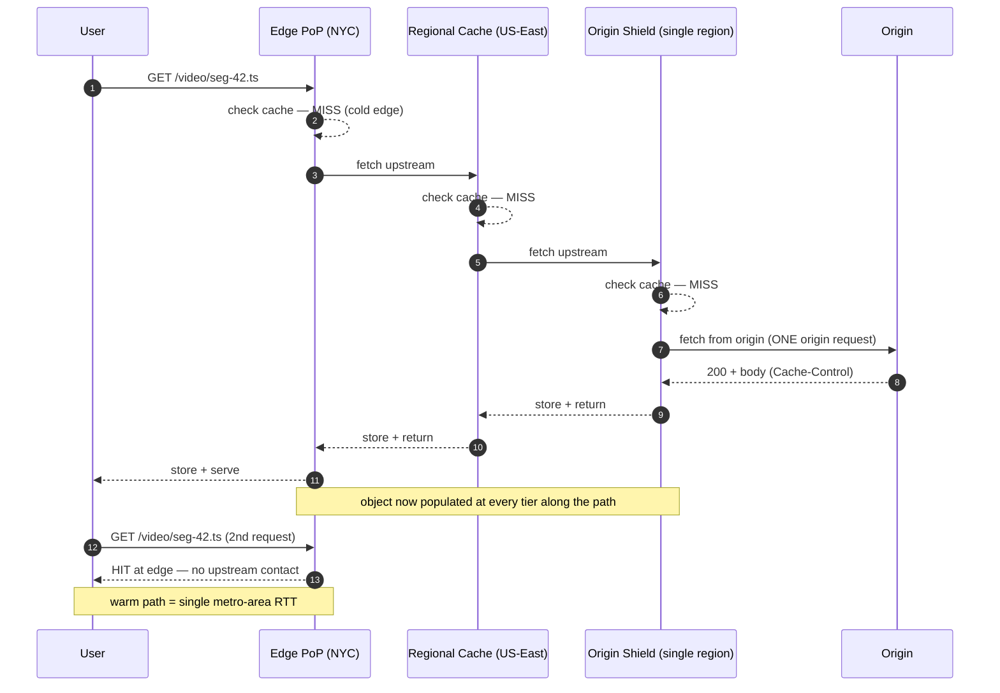
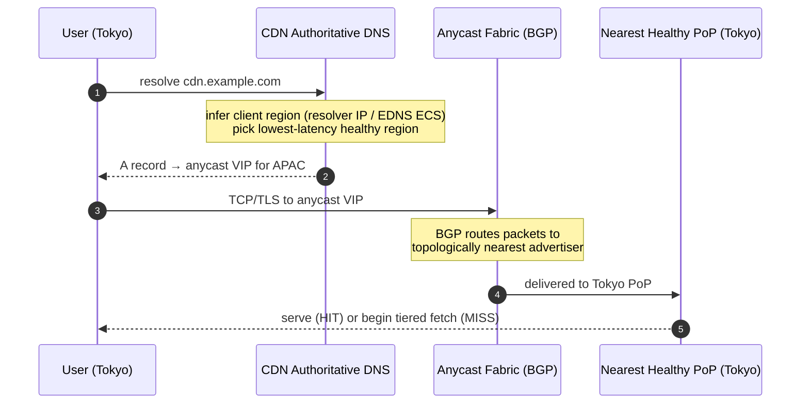
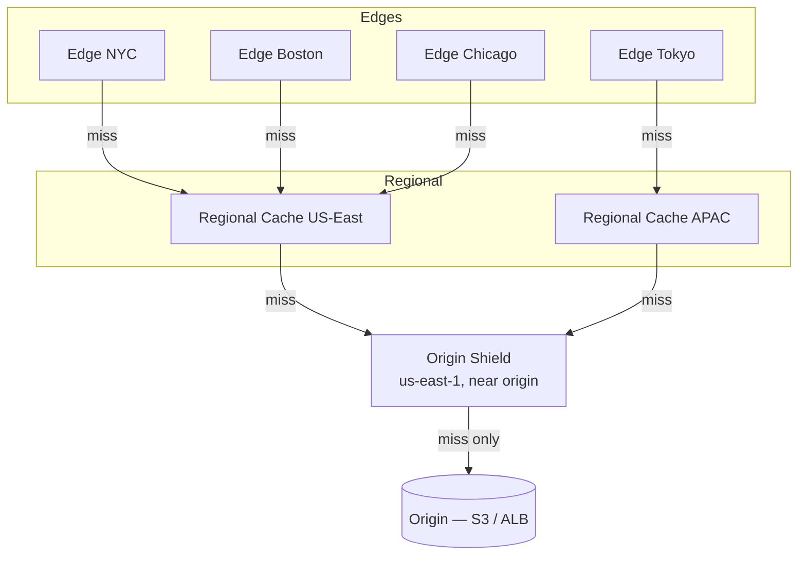
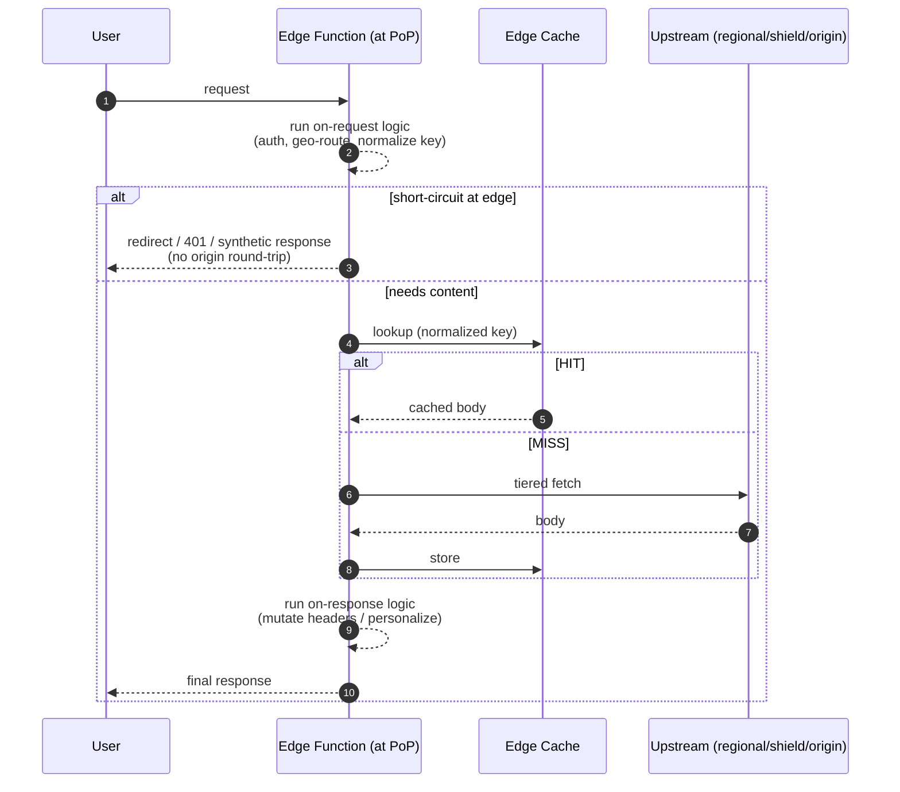

# Edge Locations — Middle

<!-- level-focus -->
At middle level, focus on this question:

> Where does **Edge Locations** belong in a maintainable component, and which trade-off selects the design?

Use the smallest realistic scenario that exposes the decision and its failure behavior.
---

## 1. What a PoP actually is, and why there are so many

A **Point of Presence** is a physical facility — a rack (or several) of cache servers, load balancers, and routers — placed inside or adjacent to a network exchange (IXP) or ISP data center, close to a population of users. A single large provider runs hundreds of PoPs across dozens of countries. Cloudflare, for example, publicly reports a presence in **300+ cities** (see cloudflare.com/network); Fastly and Amazon CloudFront (docs.aws.amazon.com/AmazonCloudFront) publish similar edge maps.

Why so many, and why so small each? Because the value of an edge is **proximity**, and proximity is bounded by physics:

- Light in fiber travels at ~200,000 km/s → ~5 µs per km of glass, and real paths are longer than the straight line.
- A New York user reaching a Frankfurt origin pays ~80–90 ms round-trip. The same user reaching a New York PoP pays ~2–5 ms. The edge exists to convert a cross-ocean RTT into a metro-area RTT.

But an edge PoP is deliberately **capacity-constrained relative to the catalog**. It holds a hot subset of objects, evicted by LRU-style policies. This creates the central tension of edge caching: the closer and more numerous your caches, the *lower* each one's individual hit ratio, because the same request volume is split across more, smaller caches — each sees fewer repeats of any given object. Tiering (§2) is the answer to that tension.

Two terms you will hear used loosely:

| Term | Precise meaning |
|------|-----------------|
| **Edge location / edge PoP** | The user-facing cache tier; smallest, most numerous, lowest latency to clients. |
| **Regional / parent cache** | A larger, less numerous cache that several edge PoPs share as their upstream. AWS calls these *Regional Edge Caches*. |
| **Origin shield** | A single chosen cache (usually one region) that ALL misses pass through before origin. |

---

## 2. The cache hierarchy: edge → regional → shield → origin

Without tiering, every edge PoP that misses goes **directly to your origin**. With 300 PoPs, a single popular-but-not-yet-cached object can generate 300 near-simultaneous origin fetches — a thundering herd. Tiered caching inserts intermediate caches so that an edge miss is *first* checked against a larger upstream cache; the origin is contacted only when the whole hierarchy misses.

The staged fetch on a full miss, then the cheap path once objects are warm:



The critical property: **origin sees exactly one request** for a cold object per shield, regardless of how many edges want it, because parallel edge misses collapse (coalesce) at the shared upstream. That collapsing — often called **request coalescing** or **collapsed forwarding** — is what makes tiering worth its extra hop.

Not every provider exposes all three explicit tiers, but the *shape* is universal:

- **2-tier (edge → origin):** the naive default; no shared upstream. Highest origin fan-out.
- **3-tier (edge → regional/parent → origin):** edges within a region share a parent. Cuts origin fan-out to roughly "one per region."
- **4-tier (edge → regional → shield → origin):** a single global funnel to origin. Origin fan-out approaches "one per object."

---

## 3. Origin shield: one funnel to protect the origin

An **origin shield** is a specific cache — you nominate its region — that becomes the *sole upstream* every other tier consults before touching origin. Its job is not primarily latency; it is **origin protection and cache consolidation**.

What the shield buys you:

1. **Maximal hit ratio at the origin boundary.** Every cache miss in the world converges on one shield. It therefore sees the union of all traffic, so its own hit ratio is the highest of any single cache. Only genuine, first-ever-globally requests reach origin.
2. **Request coalescing at global scale.** If 50 regional caches simultaneously miss on the same freshly-published object, they all ask the shield; the shield issues **one** origin fetch and fans the single response back to all 50. Your origin never sees the herd.
3. **Fewer origin connections.** Origin serves one steady, warm connection region instead of connections from hundreds of PoPs — simpler capacity planning, easier firewalling (you can allowlist the shield region's ranges), and lower TLS-handshake overhead.
4. **Better revalidation economics.** Conditional requests (`If-None-Modified` / `ETag`) also coalesce at the shield, so a `304` check hits origin once per object per TTL, not once per PoP.

The cost: an extra hop on the *first* miss for objects not yet in the shield, and one region of dependency (mitigated because CDNs fail the shield open — if it is unreachable, tiers fall back to going direct to origin). Placement matters: put the shield **close to your origin**, so the shield→origin leg is a short RTT. The long legs (user→edge→regional) stay on the CDN's fast backbone.

> 🎞️ **See it animated:** [AWS — Using Amazon CloudFront Origin Shield](https://docs.aws.amazon.com/AmazonCloudFront/latest/DeveloperGuide/origin-shield.html) · [Cloudflare — Tiered Cache](https://developers.cloudflare.com/cache/how-to/tiered-cache/)

---

## 4. Why tiering raises hit ratio (the math)

Consider a popular object requested `R` times globally over its TTL, spread across `N` edge PoPs. Assume uniform spread (`R/N` requests per edge).

**No tiering (edge → origin):** each edge's *first* request is a miss → origin. Origin sees up to `N` misses for this one object. Global hit ratio at origin boundary:

```
misses_to_origin = N          (one cold miss per edge)
hit_ratio_seen_by_origin = 1 - N/R
```

If `R = 1000` and `N = 300`, origin absorbs **300** requests — a 30% miss rate at the origin boundary. Painful.

**With a shield (edge → … → shield → origin):** every edge miss funnels to the shield. The shield's *first* request is the only true miss; all `N-1` other edge misses coalesce against it. Origin sees:

```
misses_to_origin = 1          (per object, per shield)
hit_ratio_seen_by_origin = 1 - 1/R = 99.9%
```

Origin absorbs **1** request instead of 300. The general rule:

- Adding a tier converts "one miss per downstream cache" into "one miss per *object* at that boundary."
- The benefit grows with `N` (number of edges) and with **object popularity concentration**: the more requests share a small hot set, the more coalescing wins.
- For a **long tail** of rarely-requested objects (each hit once ever), tiering adds latency without saving origin load — those go all the way to origin regardless. This is why you tune tiering to hot content (video segments, popular pages) and may bypass it for unique, personalized responses.

A back-of-envelope for a live event:

```
Live stream: 2M concurrent viewers, HLS 4s segments
New segment published every 4s → all viewers want it within ~1s
Spread across 300 edge PoPs.

No tiering:  ~300 origin fetches PER segment × (3600/4) segments/hour
           = 270,000 origin fetches/hour for cold segments alone.

With shield: 1 origin fetch per segment × 900 segments/hour
           = 900 origin fetches/hour.  ~300× reduction.
```

---

## 5. PoP selection: anycast + latency steering

How does the user's `GET` reach the *right* PoP? Two mechanisms dominate; most large CDNs combine them.

**1. Anycast (network-layer steering).** The CDN advertises the *same* IP address (or prefix) via BGP from *every* PoP. The Internet's routing fabric then delivers each user's packets to the **topologically nearest** advertiser — usually the closest PoP by network path. The client does nothing special; it connects to one IP and BGP picks the site.

- Pro: instant failover — if a PoP withdraws its BGP route (goes down), traffic re-converges to the next-nearest PoP within seconds, no DNS TTL to wait out.
- Pro: naturally load-shifts by network topology.
- Con: BGP optimizes for *AS-path length / policy*, not for *latency* — the topologically nearest PoP is not always the lowest-latency one. Mid-flow re-routing can (rarely) shift a TCP connection to a different PoP.

**2. DNS-based latency/geo steering (application-layer).** The CDN runs authoritative DNS that returns *different* PoP IPs depending on who is asking. It infers the client's location from the resolver's IP (or EDNS Client Subnet, RFC 7871) and returns the IP of the PoP with the best measured latency/health for that region.

- Pro: can steer on *real latency measurements* and current PoP health/load, not just BGP topology.
- Con: granularity is limited to the resolver's location unless ECS is supported; bounded by DNS TTL, so failover is slower than anycast.



The combination is powerful: DNS steering picks the right *region/VIP*; anycast picks the right *PoP within it* and provides sub-second failover. When a PoP saturates or fails, both layers react — DNS stops handing out its region, and BGP withdraws its route.

---

## 6. Edge vs regional vs shield vs origin: roles

Each tier plays a distinct role. Confusing them (e.g., expecting the edge to hold your whole catalog) is a common mistake.

| Property | Edge PoP | Regional / Parent | Origin Shield | Origin |
|----------|----------|-------------------|---------------|--------|
| **Count** | Hundreds | Tens | One (chosen region) | 1 logical (may be HA cluster) |
| **Distance to user** | Nearest (~2–10 ms) | Regional (~10–40 ms) | Wherever chosen | Far / central |
| **Cache size** | Small (hot subset) | Large | Large | N/A (source of truth) |
| **Per-cache hit ratio** | Lowest (traffic split) | Higher | Highest | N/A |
| **Primary job** | Terminate TLS, serve HITs, run edge compute | Consolidate a region's misses, request coalescing | Global funnel, protect origin, coalesce at scale | Hold source of truth, generate dynamic responses |
| **Who it talks to upstream** | Regional (or shield/origin) | Shield (or origin) | Origin only | — |
| **Failure behavior** | Fail to regional/origin | Fail to shield/origin | Fail open → direct to origin | Must be HA |

Reading this table as an operator:

- Put **latency-sensitive, high-repeat** work at the **edge**: TLS termination, static asset HITs, redirects, auth checks, A/B routing (edge compute, §8).
- Rely on **regional/shield** for **origin protection and hit-ratio maximization**, not for user latency — their value is upstream, not downstream.
- Keep the **origin** doing only what only it can: producing authoritative and dynamic (personalized, uncacheable) content, and being the durable source of truth.

---

## 7. Concrete tiered-cache topologies

**A. CloudFront-style (edge → Regional Edge Cache → optional Origin Shield → origin).** CloudFront automatically routes edge misses through a **Regional Edge Cache** (a fatter cache serving a group of edges); enabling **Origin Shield** adds the single global funnel.



Origin fan-out here approaches **one request per cold object**, because everything converges on the shield.

**B. Cloudflare Tiered Cache (Smart/Generic).** Edges are grouped so that each lower-tier PoP has a designated **upper-tier** data center as its parent; Argo Smart Tiered Cache picks the upper tier with the best connectivity to origin. Same shape: edge → upper-tier → origin, with coalescing at the upper tier.

**C. Multi-CDN with shielding.** Two CDNs each with their own shield, fronted by DNS steering. Each CDN's shield protects origin independently, so worst-case origin fan-out is "one per CDN per object" — still tiny.

The design lever in all three is the same: **decide how many misses your origin can tolerate for a single hot object**, then choose enough tiers (and a shield) to hit that number. A static-heavy site may be fine with 2 tiers; a live-video or flash-sale workload needs a shield.

---

## 8. Intro to edge compute: logic at the PoP

Historically the edge only *cached*. Modern PoPs also **run your code** — small, sandboxed functions that execute at the edge, next to the user, on every request or response. This is **edge compute**: Cloudflare Workers, AWS CloudFront Functions / Lambda@Edge, Fastly Compute, Akamai EdgeWorkers.

Why run logic at the edge instead of at origin?

- **Kill the origin round-trip for logic-only work.** Redirects, header rewrites, auth-token validation, A/B bucketing, geo-routing, request normalization — none of these need your origin. Doing them at the edge saves the full cross-region RTT.
- **Personalize without losing cacheability.** Fetch a cached base response, then mutate it at the edge per-user (e.g., inject a locale, stitch in a signed cookie) so the *cacheable* part stays shared while the *personal* part is computed locally.
- **Shape the cache key.** Edge code can normalize the request (strip tracking query params, sort them, collapse casing) *before* the cache lookup, dramatically raising hit ratio by preventing needless cache fragmentation.

Where edge code sits in the request path:



Constraints a middle engineer must respect at the edge (these define the model):

| Constraint | Why it exists | Consequence |
|------------|---------------|-------------|
| Tight CPU/time budget (often single-digit ms) | Shared multi-tenant PoPs; can't block others | No heavy computation; offload to origin/queue |
| Limited memory per invocation | Thousands of tenants per PoP | Keep state small; use edge KV, not in-RAM caches |
| No local durable state / eventual-consistency KV | Edges are ephemeral and numerous | Source of truth stays at origin; edge KV is a replicated cache |
| Cold-start / isolate model (V8 isolates or Wasm) | Fast startup at massive fan-out | Prefer isolate-based runtimes; avoid heavy deps |

The mental model: **edge compute is for cheap, latency-sensitive, per-request logic — not for your application core.** It complements caching; it does not replace the origin.

---

## 9. Operating tiered caching: what to watch

Turning on tiers/shield is one setting; operating them well means watching the right signals:

- **Origin request rate (offload).** The headline metric. After enabling a shield, origin fetches for hot objects should collapse toward "one per object per TTL." If origin traffic barely drops, your objects are likely uncacheable (bad `Cache-Control`) or your cache key is fragmented (query-param noise) — fix those first; tiering can't save an uncacheable response.
- **Edge hit ratio vs shield hit ratio.** Edge ratio will be lower than the aggregate — that's expected. The *shield* ratio near origin is the number that should be very high. A low shield ratio means content isn't cacheable or TTLs are too short.
- **First-byte latency on misses.** Each tier adds a hop on a cold miss. If p99 first-byte spikes on cold content, confirm the shield is placed near origin and that you aren't over-tiering low-popularity content.
- **Coalescing effectiveness during publishes.** Watch origin during a new-content publish or live segment: a spike of `N` simultaneous origin fetches for one object means coalescing isn't working (check that the object is actually cacheable and that tiered cache is enabled for that host/path).
- **Shield failover.** Verify (in a game day) that if the shield region is unreachable, tiers fall back to origin (fail-open) rather than erroring — and that your origin can briefly absorb the un-shielded fan-out.

Common mistakes at this level:

1. Enabling a shield but leaving responses `Cache-Control: private` / `no-store` — nothing caches, tiering does nothing.
2. Placing the shield far from origin, adding a long shield→origin RTT to every cold miss.
3. Not normalizing the cache key at the edge → each tracking-param variant is a separate object → hit ratio craters and coalescing can't help.
4. Pushing heavy application logic into edge functions, hitting CPU limits and adding latency instead of removing it.

---

## 10. Checklist

- [ ] Cacheable responses emit correct shared-cache directives (`Cache-Control: public, s-maxage=…`) so tiers actually store them.
- [ ] Tiered caching enabled; a shield region chosen and placed **close to origin**.
- [ ] Origin offload (request-rate reduction) measured before/after enabling the shield; hot-object fan-out confirmed near "one per object."
- [ ] Cache key normalized at the edge (sort/strip query params, collapse casing) to prevent fragmentation and enable coalescing.
- [ ] PoP steering understood for the provider (anycast vs DNS/latency) and failover behavior verified in a game day.
- [ ] Edge-vs-origin split deliberate: latency-sensitive, high-repeat logic at the edge; authoritative/dynamic work at origin.
- [ ] Shield fail-open behavior tested; origin can survive a brief un-shielded fan-out.

*Next step:* [Edge Locations — Senior](senior.md)

---

## Apply it

1. Find a real component where **Edge Locations** affects an interface or dependency.
2. Write two plausible choices and the constraint that favors each one.
3. Make the smallest reversible change at that boundary.
4. Exercise the component alone, then exercise the integrated flow.
5. Keep the decision note with the evidence that selected the option.

## Verify your work

- A focused check proves the local behavior.
- An integrated check proves callers and dependencies still agree.
- Logs, traces, compiler output, or benchmarks expose the boundary.
- Reverting the change restores the previous behavior without unrelated edits.

## Review questions

- Which boundary is most affected by Edge Locations?
- What constraint would make you choose the alternative design?
- How would you isolate a local defect from an integration defect?
- What evidence shows that the change remains maintainable?
