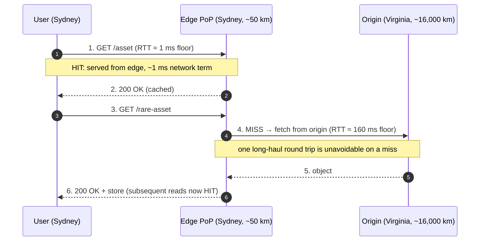
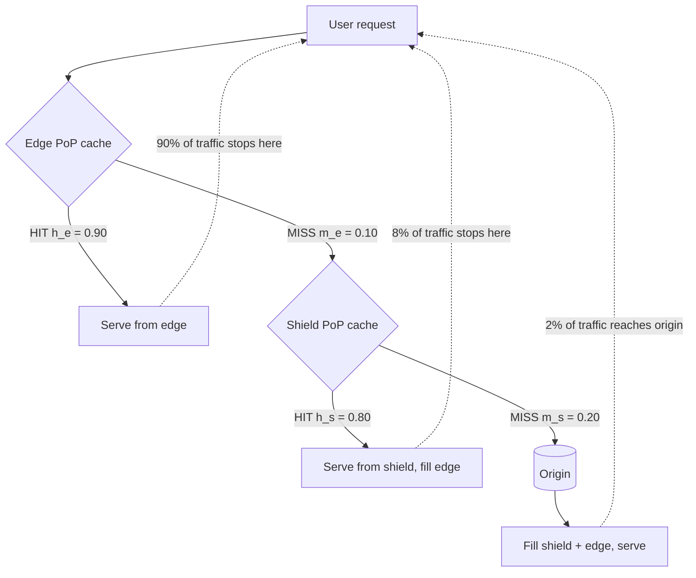
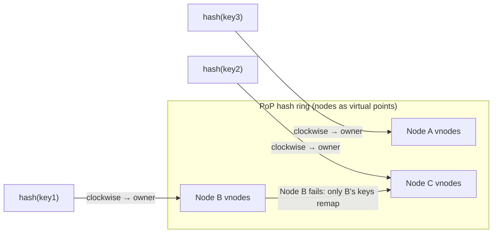

# Edge Locations — Professional

<!-- level-focus -->
At professional level, focus on this question:

> How should teams adopt and operate **Edge Locations** with measurable outcomes and limited coordination?

Use the smallest realistic scenario that exposes the decision and its failure behavior.
## 1. Why an edge location is a physics problem

A PoP is a rack (or several) of caching servers placed close to users so that the *first byte*
of a response travels a short distance. Three quantities govern whether a PoP is worth its cost:

- **Latency** to the user — bounded below by the speed of light in fiber, not by CPU.
- **Hit ratio** at that PoP — the fraction of requests served without touching the origin.
- **Origin offload** — the fraction of total request volume the origin never sees, which is an
  *amplified* function of hit ratio once you add a second (shield) tier.

The tension is structural: adding PoPs cuts distance (good for latency) but *splits the working
set* across more caches (bad for hit ratio). A professional reasons about both effects with
numbers before adding a PoP, not after. Sections 2–5 give the four models; section 6 covers the
intra-PoP routing that determines whether a PoP's aggregate cache is used efficiently at all.

---

## 2. RTT vs distance: the speed-of-light floor

Light in vacuum travels at `c = 299,792 km/s`. In optical fiber the signal propagates at roughly
`0.66 c` (the refractive index of glass is ~1.5, so `v ≈ c / 1.5 ≈ 0.66 c ≈ 200,000 km/s`).

**One-way propagation delay:**

```
t_oneway = distance / v = distance_km / 200,000 km/s
```

**Round-trip time (RTT)** is two propagation delays (request out, response back):

```
RTT = 2 × distance / v = 2 × distance_km / 200,000  seconds
    = distance_km / 100,000  seconds
    = distance_km / 100        milliseconds
```

This gives the field rule of thumb:

> **RTT ≈ distance_km / 100 (ms)**, and equivalently **one-way ≈ distance_km / 200 (ms)**.

Every 100 km of physical separation costs ~1 ms of RTT — *before* adding queueing, serialization,
router hops, and TLS handshakes. This floor is why edge placement exists: you cannot optimize
your way under it in software; you can only shorten the distance.

### Worked numbers

| Path | Distance (km) | Speed-of-light RTT floor | Typical measured RTT | Overhead factor |
|------|--------------:|-------------------------:|---------------------:|----------------:|
| Same metro (user → local PoP) | 50 | 0.5 ms | 2–5 ms | ~4–10× |
| New York → Chicago | 1,150 | 11.5 ms | ~20 ms | ~1.7× |
| New York → London | 5,600 | 56 ms | ~70–80 ms | ~1.3× |
| London → Sydney | 17,000 | 170 ms | ~250–290 ms | ~1.5× |

Measured RTT is always *above* the floor because real fiber is not laid great-circle-straight and
each router/switch adds store-and-forward delay. The overhead factor shrinks on long-haul routes
(propagation dominates) and balloons on short ones (fixed per-hop and handshake costs dominate).

**Why one PoP is not enough — worked example.** Serving global users from a single origin in
Virginia forces a Sydney user onto a ~230 ms RTT path (≈ 23,000 km round trip). A TLS 1.3
handshake (1-RTT) plus the request itself is already ~2 RTTs before the first content byte:
`2 × 230 = 460 ms` of pure network latency. Placing a PoP in Sydney (user ~50 km away) collapses
that to `2 × 0.5 = 1 ms` of propagation for a cache **hit** — a ~460× reduction on the network
term. That gap is the entire economic case for edge locations.

> 🎞️ **See it animated:** [Interactive latency numbers (Colin Scott)](https://colin-scott.github.io/personal_website/research/interactive_latency.html)

### Staged view: where the RTT floor bites



The diagram makes the lever explicit: a **hit** pays the short (edge) RTT; a **miss** pays the
short RTT *plus* the long (origin) RTT. Latency is therefore dominated by the *miss rate*, which
is what sections 3–5 quantify.

---

## 3. The single-tier hit-ratio model

Let a PoP have edge hit ratio `h_e` (fraction of requests served from the edge cache). Define:

- `m_e = 1 − h_e` — the edge **miss** ratio.
- `RTT_edge` — user↔PoP round trip.
- `RTT_origin` — PoP↔origin round trip.
- `T_serve` — fixed server processing/serialization time (assumed equal for hit and miss).

**Expected user-perceived latency** (single tier, origin behind the PoP):

```
E[latency] = T_serve + RTT_edge + m_e × RTT_origin
```

The `m_e × RTT_origin` term is the *penalty you pay for misses*. Origin offload is trivially:

```
origin_offload = h_e         (single tier)
origin_traffic_fraction = m_e = 1 − h_e
```

### Worked example

`h_e = 0.90`, `RTT_edge = 5 ms`, `RTT_origin = 80 ms`, `T_serve = 3 ms`.

```
E[latency] = 3 + 5 + 0.10 × 80 = 3 + 5 + 8 = 16 ms
origin_traffic_fraction = 0.10  → origin sees 10% of requests
```

Now raise the hit ratio to `h_e = 0.98`:

```
E[latency] = 3 + 5 + 0.02 × 80 = 9.6 ms
origin_traffic_fraction = 0.02  → origin sees 2% of requests
```

An 8-point improvement in hit ratio (90%→98%) cut the miss penalty by 5× (8 ms → 1.6 ms) and cut
origin traffic 5× (10% → 2%). **The last few points of hit ratio are the most valuable** — this
nonlinearity is exactly what tiered caching (section 4) exploits, because pushing edge hit ratio
past ~90% via bigger edge caches has sharply diminishing returns on the long tail.

---

## 4. Two-tier (shield) caching and the offload amplification formula

A **two-tier** topology inserts a small number of *shield* (a.k.a. origin-shield, mid-tier, or
parent) PoPs between the many edge PoPs and the origin. On an edge miss, the request goes to the
shield tier; only a shield **miss** reaches the origin. Because many edges share a few shields,
the shield tier collects the "second request" for any object regardless of which edge first
missed — it re-aggregates the working set that fragmentation (section 5) had scattered.

Let:

- `h_e` — edge-tier hit ratio, `m_e = 1 − h_e`.
- `h_s` — shield-tier hit ratio (conditional: hit ratio *on the traffic that reaches the shield*).
- `m_s = 1 − h_s`.

**Fraction of user requests that reach the origin (two tiers):**

```
origin_traffic_fraction = m_e × m_s = (1 − h_e) × (1 − h_s)
```

**Effective origin offload:**

```
origin_offload = 1 − (1 − h_e) × (1 − h_s)
```

**Amplification.** Compare origin traffic with and without the shield. Adding the shield
multiplies the surviving (miss) traffic by `m_s`, so it *divides* origin traffic by the
amplification factor:

```
amplification A = origin_traffic_single_tier / origin_traffic_two_tier
               = m_e / (m_e × m_s)
               = 1 / m_s = 1 / (1 − h_s)
```

The shield reduces origin load by the factor `1 / (1 − h_s)`, independent of `h_e`.

### Worked example

Edge `h_e = 0.90` (`m_e = 0.10`); shield `h_s = 0.80` (`m_s = 0.20`).

```
Single tier:  origin_traffic = m_e            = 0.10        (10% of requests)
Two tier:     origin_traffic = m_e × m_s       = 0.10 × 0.20 = 0.02  (2%)
origin_offload (two tier)    = 1 − 0.02        = 0.98        (98%)
amplification A              = 1 / (1 − 0.80)  = 5×
```

The shield cut origin traffic 5× (10% → 2%) — matching `A = 1/m_s = 5`. Note this *matches* the
offload we needed a 98% *edge* hit ratio to reach in section 3, but achieves it with a modest
90% edge hit ratio plus an 80% shield. That is the point: it is far cheaper to add a handful of
shield caches than to size every edge PoP to hold the entire long tail.

### Comparison: single-tier vs two-tier offload

| Metric | Single tier (`h_e = 0.90`) | Two tier (`h_e = 0.90`, `h_s = 0.80`) |
|--------|---------------------------:|--------------------------------------:|
| Origin traffic fraction | `1 − h_e` = **10%** | `(1−h_e)(1−h_s)` = **2%** |
| Effective origin offload | 90% | **98%** |
| Origin-load reduction vs single tier | 1× (baseline) | **5×** (`A = 1/m_s`) |
| Extra network hop on edge miss | none | +1 edge↔shield RTT on miss traffic only |
| Working-set re-aggregation | no | yes (shield re-collects scattered tail) |

### Staged view: two-tier hit-ratio pipeline



Reading the leaf percentages: of 100 requests, 90 stop at the edge, 8 stop at the shield
(`0.10 × 0.80 = 8`), and only 2 reach the origin (`0.10 × 0.20 = 2`). The miss penalty on the 8%
shield-served requests is one extra intra-CDN hop (edge↔shield, typically same-continent, tens of
ms), never a long-haul origin round trip.

**Caveat — the shield adds a hop on miss traffic.** Two-tier expected latency:

```
E[latency] = T_serve + RTT_edge
           + m_e × [RTT_edge_shield + h_s × T_serve + m_s × RTT_origin]
```

Because the extra `RTT_edge_shield` is multiplied by `m_e` (only misses pay it), and misses are
rare, the net latency effect is small while the offload effect is large — the shield trades a
tiny latency cost on 10% of traffic for a 5× origin-load reduction.

---

## 5. Cache fragmentation: the cost of many PoPs

More PoPs shorten distance but split a fixed global working set across more, *smaller* caches.
This raises the per-PoP miss rate — the fragmentation penalty. Two complementary models make it
precise.

### 5.1 Request-splitting model

Suppose global request volume `R` (req/s for a content class) is spread uniformly across `P`
PoPs. Each PoP sees `R/P` requests. A cache warms up (and stays warm) only for objects requested
often enough to survive eviction. Splitting traffic by `P` means each object is requested `P`×
less frequently *at any given PoP*, so:

- Rarely-requested (long-tail) objects that would stay cached in one big PoP now churn out of the
  small per-PoP caches before their next request — a **cold-miss inflation**.
- The effect is strongest for the long tail, which is exactly where hit ratio is hardest to buy.

### 5.2 Working-set / cache-size model

A standard model for hit ratio under an LRU-like cache is the **Che approximation** with a
Zipf-distributed popularity: hit ratio grows with the ratio of cache size to working-set size but
with *diminishing returns* (roughly logarithmic for Zipf exponents near 1). The key structural
fact for edge design:

```
Per-PoP cache holds a fixed size C.
Global working set of "worth-caching" objects has size W.
One big cache sees coverage ∝ C / W.
P fragmented caches each still hold C, but each sees only R/P of the requests,
  so each independently rebuilds coverage of the *popular head* while the shared
  tail (size ~ W − head) is duplicated P times or evicted.
```

Two consequences:

1. **Effective global cache is not `P × C`.** Because popular head objects are duplicated in
   every PoP (each must cache the head to serve its local users), the *unique* content cached
   globally is far less than `P × C`. Duplication of the head wastes aggregate capacity.
2. **Per-PoP tail hit ratio falls as `P` rises.** With less local request density, tail objects
   don't survive eviction, so per-PoP miss rate rises.

### 5.3 Worked example

Global content class: request-frequency for object `i` follows Zipf(1). Assume that in a
**single** large cache the hit ratio is `h_1 = 0.95`. We split traffic across `P = 8` PoPs, each
with the same cache size as before but now receiving `1/8` of the requests for each object.

A useful back-of-envelope: for Zipf(1), hit ratio scales roughly with `log(effective requests
seen)`. Cutting per-object request density by 8× shifts each PoP down the popularity-coverage
curve. Empirically, edge fragmentation of this magnitude typically costs a few points of hit
ratio on the head and much more on the tail. Take a representative degradation:

```
Single big cache:        h_1 = 0.95  → m_1 = 0.05
Fragmented over P = 8:    h_e = 0.90  → m_e = 0.10   (miss rate doubled)
```

The per-PoP miss rate **doubled** (5% → 10%) purely from splitting the working set — even though
total cache *hardware* went up 8×. This is the fragmentation penalty, and it is precisely why the
shield tier (section 4) is valuable: the shield sees the *aggregated* miss stream from all 8 PoPs,
so its request density for any object is `8 ×` that of a single edge, restoring the request
concentration that fragmentation destroyed. The shield's job is to *re-defragment* the working
set. Composing the two:

```
Fragmented edge alone:      origin_traffic = m_e         = 10%
Fragmented edge + shield:   origin_traffic = m_e × m_s    = 0.10 × 0.20 = 2%
```

The shield recovers, at the origin, better-than-single-cache offload (2% vs the un-fragmented
single cache's 5%) — because it aggregates *all* edges' second-requests, not just one region's.

### Comparison: fragmentation effect

| Topology | Per-PoP request density | Per-PoP miss rate | Origin traffic | Aggregate cache used efficiently? |
|----------|------------------------:|------------------:|---------------:|:---------------------------------:|
| 1 large PoP | `R` (full) | 5% | 5% | Yes — no head duplication |
| 8 edge PoPs, no shield | `R/8` | 10% | 10% | No — head duplicated 8× |
| 8 edge PoPs + 1 shield | `R/8` (edge), `~R` (shield) | edge 10%, shield 20% | **2%** | Yes — shield re-aggregates tail |

**Design rule.** The number of PoPs is a latency/offload trade-off, not a free win. Add PoPs to
cut *distance* for users; add shields to cut the *fragmentation penalty* those PoPs create.

---

## 6. Consistent hashing within a PoP cluster

A PoP is not one server — it is a cluster of `N` cache nodes. If a request for object `k` can
land on *any* node, then in the worst case every object gets cached on every node: the PoP's
effective cache is only `C` (one node's size), not `N × C`, and the fragmentation penalty of
section 5 recurs *inside the PoP*. To make the PoP's aggregate cache behave like one large cache,
requests for a given key must exhibit **cache affinity** — key `k` should always route to the
same node so it is cached exactly once.

**Consistent hashing** provides this. Place nodes and keys on a hash ring `[0, 2^m)`; key `k`
routes to the first node clockwise from `hash(k)`. Properties that matter here:

- **Affinity:** the same `k` maps to the same node → each object cached once per PoP → effective
  cache ≈ `N × C`.
- **Minimal disruption on membership change:** adding/removing one node remaps only ~`K/N` keys
  (`K` = keys, `N` = nodes), not all of them. A node failing or a deploy rolling one node does not
  cold-flush the whole PoP — critical, because a full flush would dump the entire PoP's miss
  stream onto the shield/origin at once.
- **Load smoothing via virtual nodes:** each physical node is placed at `V` points on the ring
  (`V` ~ 100–200) so key ownership is spread evenly; without vnodes, ring gaps cause up to ~2×
  load skew between the hottest and coldest node.

### Cache-affinity math inside the PoP

Let the PoP have `N` nodes, each holding `C` bytes. Under uniform any-node routing, the same hot
object is duplicated across all `N` nodes, so unique cached content ≈ `C`. Under consistent
hashing, each object lives on one node, so unique cached content ≈ `N × C`. The effective-cache
gain is up to `N×`, which directly improves the edge hit ratio `h_e` (section 3) — a larger
effective cache moves the PoP up the popularity-coverage curve.

**Membership-change disruption.** With `K` keys and `N` nodes, removing one node reassigns its
share of keys to its clockwise neighbor: `≈ K/N` keys must be re-fetched (they miss once on their
new owner). Modulo hashing (`node = hash(k) mod N`) would instead remap ~`K × (N−1)/N` keys — a
near-total flush. Worked: `K = 1,000,000` objects, `N = 10` nodes.

```
Node removed under consistent hashing:  remapped ≈ K / N = 1,000,000 / 10 = 100,000 keys (10%)
Node removed under modulo hashing:       remapped ≈ K × (N−1)/N = 900,000 keys (90%)
```

Consistent hashing turns a 90% cold-flush into a 10% one — a 9× reduction in the miss burst hitting
the next tier during a routine node roll.

### Staged view: consistent-hashing ring within a PoP



`key1` always routes to Node B (affinity → cached once). When Node B fails, only the keys it owned
slide clockwise to Node C; `key2` and `key3` are undisturbed — the rest of the PoP cache stays
warm.

### Bounded-load refinement

Plain consistent hashing can still hot-spot if one key (or one node's arc) is disproportionately
popular. **Consistent hashing with bounded loads** caps any node at `⌈(1 + ε) × average_load⌉`
and overflows to the next node when a node is saturated, trading a little affinity for a hard load
ceiling. Use it when object popularity is highly skewed (a single viral asset) so one node's CPU
does not become the PoP's bottleneck.

---

## 7. Putting it together: an end-to-end latency + offload budget

Combine all four models for a Sydney user hitting an 8-PoP CDN with one APAC shield and
consistent-hashing routing inside each PoP.

**Assumptions:**

```
RTT_edge         = 3 ms      (user ~50 km from Sydney PoP; floor ~0.5 ms + overhead)
RTT_edge_shield  = 25 ms     (Sydney edge → Singapore shield, ~6,300 km, floor ~63 ms... use regional shield ~2,500 km → ~25 ms)
RTT_origin       = 160 ms    (shield → Virginia origin, ~16,000 km, floor ~160 ms)
T_serve          = 3 ms
h_e = 0.90 (m_e = 0.10)      after fragmentation, with consistent-hashing giving ~N× effective cache
h_s = 0.80 (m_s = 0.20)      shield re-aggregates all edges' misses
```

**Offload (section 4):**

```
origin_traffic_fraction = m_e × m_s = 0.10 × 0.20 = 0.02   → origin sees 2%
origin_offload          = 98%
amplification from shield = 1 / (1 − 0.80) = 5×
```

**Expected latency (section 4 formula):**

```
E[latency] = T_serve + RTT_edge
           + m_e × [ RTT_edge_shield + h_s × T_serve + m_s × RTT_origin ]
           = 3 + 3 + 0.10 × [ 25 + 0.80 × 3 + 0.20 × 160 ]
           = 6 + 0.10 × [ 25 + 2.4 + 32 ]
           = 6 + 0.10 × 59.4
           = 6 + 5.94
           = 11.94 ms
```

For comparison, single-origin-only (no CDN) for the same Sydney user:

```
E[latency]_no_cdn ≈ T_serve + RTT_origin_direct
                  ≈ 3 + 230 = 233 ms  (every request pays the long haul)
```

**Result: ~12 ms vs ~233 ms user latency (≈19× faster) and 98% origin offload** — the combined
payoff of (1) the distance cut from edge placement, (2) the amplification from the shield tier,
(3) fragmentation contained by the shield, and (4) `N×` effective PoP cache from consistent-hashing
affinity. Each model contributes a distinct, quantifiable term to that outcome.

---

## 8. Professional checklist

- [ ] RTT floors computed (`RTT ≈ distance_km / 100 ms`) for each user region → nearest PoP path;
      confirm measured RTT is within ~1.5–2× of the floor (else investigate routing/peering).
- [ ] Edge hit ratio `h_e` and shield hit ratio `h_s` measured separately; origin offload reported
      as `1 − (1−h_e)(1−h_s)`, not as raw edge hit ratio.
- [ ] Shield amplification `A = 1/(1−h_s)` quantified; verified the shield tier is actually
      re-aggregating misses (shield request density ≈ Σ edge miss streams).
- [ ] Fragmentation penalty modeled before adding PoPs: per-PoP miss rate rise from splitting the
      working set across `P` PoPs is estimated, not assumed away.
- [ ] Intra-PoP routing uses consistent hashing (with virtual nodes, `V ~ 100–200`) so effective
      cache ≈ `N × C`, not `C`; node-roll remaps ~`K/N` keys, not `K × (N−1)/N`.
- [ ] Bounded-load consistent hashing considered where object popularity is highly skewed, to cap
      per-node load and avoid a single-asset hot spot.
- [ ] End-to-end latency budget written as `T_serve + RTT_edge + m_e × [shield term]` with real
      per-hop RTTs, and compared against the no-CDN baseline to justify PoP count.


---

## Apply it

1. Define the user or business outcome that **Edge Locations** should improve.
2. Assign one owner for code, contracts, operations, and incidents.
3. Split delivery into reversible increments that produce evidence early.
4. Publish responsibilities, escalation paths, and compatibility windows.
5. Stop or expand only when the agreed measures support that decision.

## Verify your work

- Each increment has an owner, rollback path, and observable exit condition.
- Adoption, reliability, delivery time, and coordination cost are measured.
- Incident and migration exercises prove that responsibility is executable.
- The old path is removed only after telemetry proves it is unused.

## Review questions

- Which measurable outcome justifies investing in Edge Locations?
- Which team owns the full lifecycle and incident response?
- What reversible increment produces the earliest useful evidence?
- Which exit condition proves that migration or adoption is complete?
