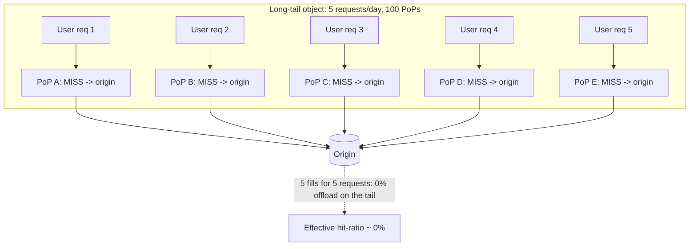
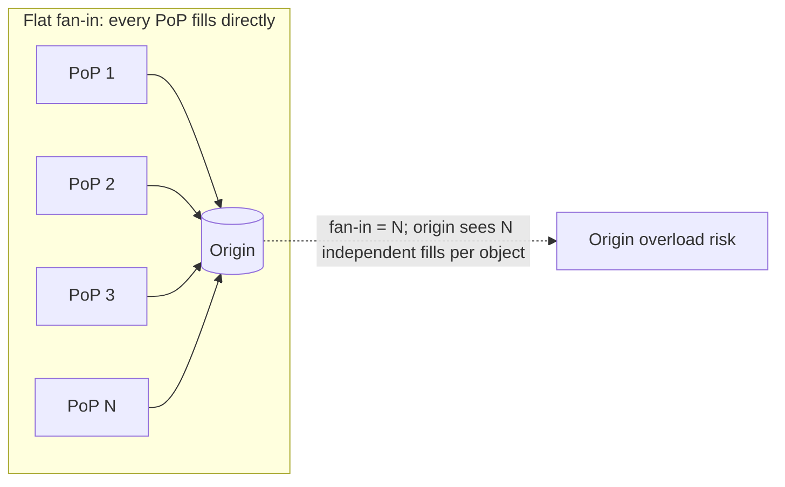
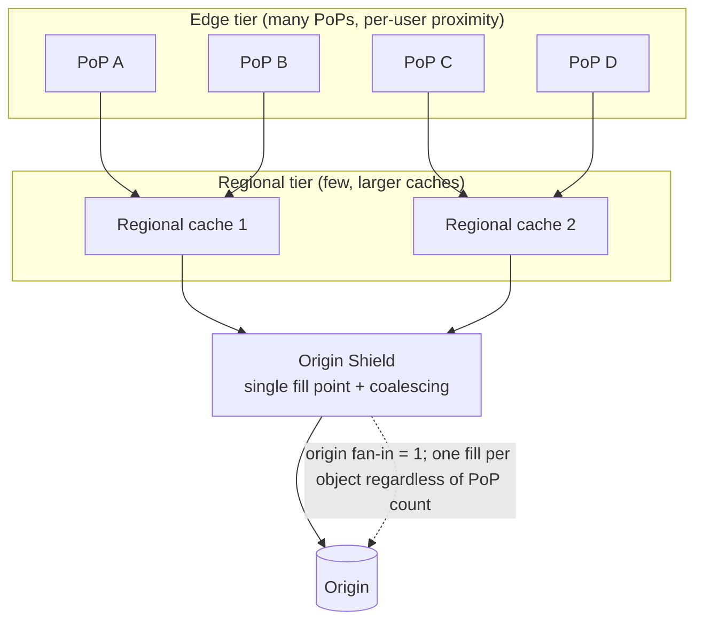
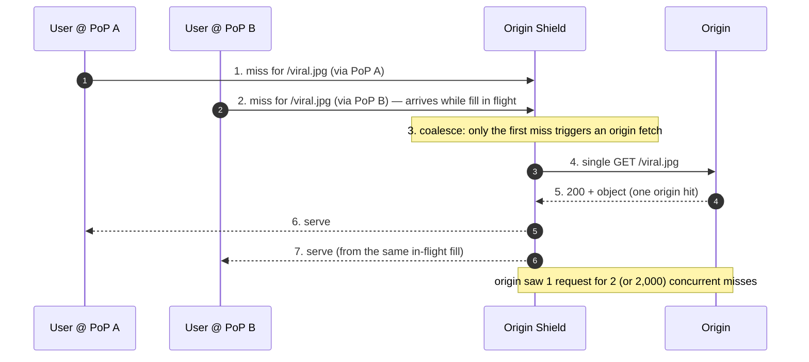
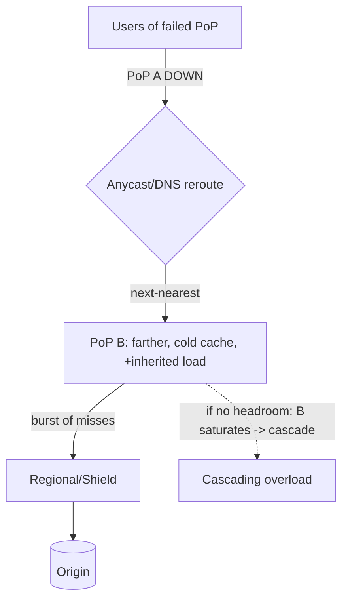

# Edge Locations — Senior

<!-- level-focus -->
At senior level, focus on this question:

> Which system invariant is affected by **Edge Locations** under failure, load, and change?

Use the smallest realistic scenario that exposes the decision and its failure behavior.
---

## 1. Responsibilities at This Level

- Own the **global hit-ratio SLO** (e.g., ≥ 95% edge offload) and the **origin-load
  budget** it protects — these are the two numbers the whole topology serves.
- Decide the **cache topology**: flat edge, two-tier (edge → regional), or edge → regional
  → origin shield — and justify it with cache-fill and fan-in math.
- Size PoP capacity: cache footprint (working set vs SSD/RAM per PoP), egress bandwidth,
  and TLS/compute headroom for peak plus a failed-neighbor's rerouted traffic.
- Define behavior on **PoP outage** (reroute to next-nearest healthy PoP) and **shield
  outage** (fail-through to origin vs fail to secondary shield) and validate it in game days.
- Prevent the two silent killers: **cache fragmentation** (long tail cold at every PoP)
  and **thundering herd** on cache-fill (a viral miss stampeding the origin).
- Know **when to stop adding PoPs** — the point where marginal PoPs add cost, fragment the
  tail further, and no longer move p95 latency.

---

## 2. The Core Problem: Cache Fragmentation Across Many PoPs

A CDN's value is offload: the fraction of requests served from an edge cache instead of
the origin. Intuitively, more PoPs = closer to users = better. But **each PoP has its own
independent cache**. Adding PoPs does *not* add cache sharing — it *splits* your request
stream across more, individually-colder caches.

Consider an object requested `R` times per day globally, spread over `N` PoPs. With even
distribution each PoP sees only `R/N` requests. For a cache to serve an object it must
first have been *filled* — and every object gets filled **once per PoP**, not once
globally. The **long tail** (objects requested a handful of times) is the problem: an
object requested 5 times/day, spread over 100 PoPs, is requested *less than once per PoP
per day* — so at almost every PoP the request is a **cold miss** that goes to origin.



The hot head of the catalog (a few objects with millions of requests) caches fine
everywhere — `R/N` is still huge. The tail does not. As catalogs grow (millions of SKUs,
per-user thumbnails, personalized manifests), the tail dominates the request mix, and a
flat fleet's aggregate hit-ratio *degrades* as you add PoPs. This is the counter-intuitive
core: **more edge locations can lower your global hit-ratio.**

---

## 3. Cache-Fill Amplification Without a Shield

Every cold miss at a PoP produces one **cache-fill request to the origin**. With a flat
topology, the origin sees fills from *all* PoPs independently. Define the **fill
amplification factor** as origin fill requests per unique object:

```text
Flat topology (no shield):
  fills_per_object  =  number of PoPs that independently miss and fill it
  worst case        =  N (every PoP misses the object at least once)

  For a warm cache, steady-state origin load ≈
      sum over objects of (fills to refill on TTL expiry, per PoP)
    = (unique objects) × (PoPs holding it) × (1 / TTL)

  A 60s TTL on a manifest, held at 100 PoPs:
      100 fills / 60s = ~1.7 origin req/s PER OBJECT, just to keep it warm.
  Multiply by thousands of hot-but-short-TTL objects → origin is hammered by REFILLS,
  not by user demand.
```

Two amplifiers stack here:

1. **Fan-in width** — with 100 PoPs, a single object's TTL expiry can trigger up to 100
   simultaneous refills. That is a built-in fan-in of `N` onto the origin.
2. **Thundering herd within a PoP** — when a popular object's TTL expires (or it was never
   cached), *concurrent* user requests at one PoP can all miss simultaneously and each
   spawn an origin fetch, unless the PoP does **request coalescing** (collapse concurrent
   misses for the same key into one origin fetch). Without coalescing, one hot key can
   generate hundreds of duplicate origin fetches from a *single* PoP.



The origin now sees traffic that scales with **PoP count and TTL churn**, not with unique
content demand. This is exactly backwards from what a CDN is supposed to do.

---

## 4. Tiered Caching and Origin Shield

The fix is to insert a **consolidation layer** between the edge PoPs and the origin, so the
origin sees fan-in of *one* (or a handful) instead of `N`.

- **Tiered / regional caching**: edge PoPs, on a miss, fetch from a smaller set of
  **regional (mid-tier) caches** instead of origin. A regional cache aggregates the misses
  of all edge PoPs in its region. The tail object requested 5 times globally may still miss
  at 5 different edges — but all 5 misses converge on (say) 2–3 regional caches, so the
  *second* request in a region is a HIT. Regional caches see `R/regions`, not `R/PoPs`, so
  they warm far more of the tail.
- **Origin shield**: a *single designated cache* (per origin, or per small set) that is the
  **only** node allowed to fill from origin. Every miss, from every tier, funnels through
  the shield. The origin's fan-in collapses to 1. The shield does the request coalescing
  globally: N PoPs missing the same object during a spike produce **one** origin fetch.



Staged view of a cold viral object with a shield, showing coalescing turning `N` origin
fetches into `1`:



The shield converts fill amplification of `N` into `1`, and tiering warms the tail. Both
are pure origin-protection and hit-ratio wins — at the cost of one extra internal hop on a
miss (edge → regional → shield → origin adds intra-network RTT, but only on the *miss*
path, and misses are the minority once warm).

---

## 5. Flat vs Tiered — the Hit-Ratio / Origin-Load Table

Worked model: catalog with a hot head (95% of requests) and a long tail (5% of requests
across millions of objects), `N = 100` PoPs, `R_regions = 6` regional caches, 1 shield.
Numbers are illustrative but directionally accurate for a tail-heavy workload.

| Property | Flat edge (100 PoPs, no shield) | Two-tier (edge → regional) | Edge → regional → shield |
|---|---|---|---|
| Origin fan-in per object | up to `N` (100) | up to `R_regions` (6) | **1** |
| Tail hit-ratio (edge) | ~5–20% (tail cold everywhere) | ~40–60% (regional warms tail) | ~40–60% edge, near 100% offload at shield |
| **Global offload (hit-ratio)** | ~85% (head saves you; tail leaks) | ~95% | **~98–99%** |
| Origin req/s (steady, refills) | High — scales with PoP count × TTL churn | Medium | **Low — ~unique-object demand** |
| Origin req/s (viral spike) | Spike × up to `N` (herd, no coalesce) | Spike × `R_regions` | **1 fetch (coalesced)** |
| Extra miss-path latency | 0 internal hops | +1 hop (regional) | +2 hops (regional + shield) |
| New SPOF introduced | none (no shared node) | regional cache (per region) | **the shield** (mitigate: pairs/HA) |
| Best when | small hot catalog, few PoPs | large tail, many PoPs | large tail + origin is precious/expensive |

The pattern: tiering trades a small amount of **miss-path latency** for a large reduction
in **origin load** and a large gain in **tail hit-ratio**. The shield trades one more hop
and a new SPOF for **origin fan-in collapse** and **global herd protection**. For any
origin that is expensive, rate-limited, or slow (a database-backed dynamic origin, a
third-party bucket with egress fees), the shield pays for itself immediately.

---

## 6. PoP Capacity and Hot-Content Distribution

Owning PoP capacity means sizing four independent limits — the one you hit first is your
real ceiling:

1. **Cache footprint** — a PoP holds a finite working set (RAM tier + SSD tier). If the
   region's hot working set exceeds the PoP's cache, you thrash: useful objects get evicted
   to make room for others, hit-ratio drops, and origin/shield fills rise. Size the cache
   to hold the **p95 regional working set**, not the whole catalog.
2. **Egress bandwidth** — a PoP is a pipe. A PoP fronting a video event can be
   bandwidth-bound long before it is CPU-bound. Capacity plan for **peak concurrent
   viewers × bitrate**, plus headroom for a failed neighbor's rerouted load.
3. **TLS / compute** — connection setup, TLS handshakes, and any edge compute consume CPU.
   New-connection storms (mobile networks churning connections) can exhaust CPU while
   bandwidth is idle.
4. **Fill throughput to the next tier** — a cold PoP (fresh region, post-purge) fills
   heavily; the link to the regional/shield tier must absorb it.

**Hot-content distribution** is where capacity meets the fragmentation problem. The
Zipf-like popularity curve means a handful of objects account for most bytes. Those are
cheap to cache (fits in RAM at every PoP). The danger is a **single hyper-hot object**
whose demand at *one* PoP exceeds that PoP's egress — the classic "a country watching one
livestream" case. Mitigations you own:

- **Request coalescing** so the hot object is fetched from the tier *once* per PoP, not
  once per viewer.
- **Tiered fan-out for delivery** (not just fill): let the regional tier absorb the fill
  fan-out so the origin/shield isn't the bottleneck for the hot object.
- **Capacity headroom for failover**: if a neighboring PoP dies and reroutes its hot-object
  traffic to you, you inherit its egress. Plan each PoP to survive **its own peak + a
  fraction of a neighbor's peak**, or the outage cascades.

---

## 7. Edge Compute Trade-offs

Running code *at* the PoP (request rewriting, auth checks, personalization, A/B routing,
lightweight APIs) is powerful because it eliminates an origin round trip — the latency win
is the whole point. But the edge runtime is deliberately constrained, and senior ownership
means knowing what you give up.

| Aspect | Edge compute (at PoP) | Origin/regional compute |
|---|---|---|
| Latency to user | Very low (code runs at nearest PoP) | Adds origin RTT (tens–hundreds of ms) |
| Runtime limits | Tight CPU-ms / memory caps, short wall-clock budget per request | Full server resources |
| State | Ephemeral, per-PoP; **no strong global state** | Central DB, transactions, strong consistency |
| Consistency of data it reads | Eventually-consistent edge KV; propagation lag across PoPs | Strong, single source of truth |
| Cold starts / footprint | Isolate-based, must be tiny | Warm long-lived processes fine |
| Debuggability | Distributed across all PoPs; harder to observe | Centralized logs/traces |
| Blast radius of a bad deploy | **Global** — pushed to every PoP at once | Regional/gradual by default |

The core trade-off: **edge compute buys latency by giving up state and headroom.** Put at
the edge only work that is (a) latency-sensitive, (b) small in CPU/memory, and (c) tolerant
of eventual consistency and per-PoP-local state — e.g., token validation, header
manipulation, geo-routing, cache-key normalization, request coalescing logic. Keep at the
origin anything needing transactions, large working memory, strong consistency, or a big
blast radius on failure. A payment write does not belong at the edge; a JWT signature check
does. And treat edge deploys with the caution their **global blast radius** demands: a bad
edge function is live everywhere at once.

---

## 8. Failure Modes You Own

**PoP outage → reroute to a farther PoP.** When a PoP fails (or is drained), the anycast /
DNS layer reroutes its users to the next-nearest healthy PoP. Two consequences:

- **Latency regression** for those users — they are now served from farther away (the whole
  reason that PoP existed). This is usually acceptable; the alternative is an error.
- **Cold cache + capacity shock at the neighbor** — the receiving PoP has *none* of the
  failed PoP's warm objects, so it sees a burst of misses (fill spike to the tier) *and*
  inherits the failed PoP's request load and egress. If the neighbor lacked headroom, the
  outage **cascades**: the neighbor saturates, reroutes further, and so on. Capacity plan
  for this (Section 6).



**Shield as a bottleneck / SPOF.** The shield's virtue — every fill funnels through it — is
also its risk. If the shield node/cluster is undersized, it becomes the throughput
bottleneck for *all* origin fills. If it dies with no fallback, either every miss fails or
every miss stampedes the origin directly (losing the protection precisely when you need
it). Mitigations you must design in:

- Run the shield as an **HA pair / small cluster**, not a single node.
- Define **fail-through** behavior explicitly: on shield loss, do misses fail to a
  *secondary* shield, or fall through to origin? Falling through re-exposes the origin to
  fan-in — acceptable only if the origin can briefly take it.
- Size the shield for **peak fill throughput**, and keep coalescing on so a spike is one
  fetch.

**Thundering herd on the shield.** A globally viral cold object, or a mass TTL expiry
(everything cached at the same second because it was all purged/deployed together), can
cause many misses to hit the shield simultaneously. Defenses:

- **Request coalescing** at the shield (dedupe concurrent misses for the same key → one
  origin fetch). This is the single most important herd defense.
- **Stale-while-revalidate**: serve the slightly-stale cached copy while one background
  fetch refreshes it — turns a synchronous herd into one async refill.
- **TTL jitter**: randomize expiry so objects don't all expire at the same instant.
- **Negative caching**: cache 404s/errors briefly so a missing object doesn't stampede.

---

## 9. When More PoPs Stop Helping

Adding PoPs has sharply diminishing — then *negative* — returns. Recognize the ceiling:

- **Latency is already dominated by other terms.** Once a user's nearest PoP is ~20–40 ms
  away, most of their page latency is TLS setup, DNS, application/origin work on the miss
  path, and client rendering — not the last few ms of edge proximity. Another PoP 200 km
  closer shaves a couple of ms off an already-small term. Measure the **latency budget**;
  if edge-proximity is not the dominant term, more PoPs don't move p95.
- **Fragmentation outweighs proximity.** Each new PoP splits the request stream further,
  cooling the tail (Section 2). Past a point, the hit-ratio loss (more origin/shield fills,
  more tail misses) costs more latency than the proximity gain — *unless* you also deepen
  tiering. The right move at scale is usually **more regional depth, not more edges.**
- **Capacity and cost.** Every PoP is fixed cost: hardware, peering, ops, and a warm cache
  to maintain. Low-traffic PoPs never warm their cache (perpetually cold tail) yet still
  cost money and add a failover-capacity liability.
- **Operational blast radius.** More PoPs = more places for edge deploys to go wrong, more
  peering relationships, more to monitor.

The senior heuristic: **add PoPs to reach unserved geographies; add tiers (regional +
shield) to protect hit-ratio and origin.** When someone proposes doubling PoP count "for
latency," ask for the latency-budget breakdown showing edge proximity is the dominant term
and the hit-ratio model showing the tail won't fragment further. Usually the real fix is
tiering, coalescing, and TTL/cache-key hygiene — not more edges.

---

## 10. Senior Checklist

- [ ] Global hit-ratio SLO and origin-load budget defined; dashboards track edge offload,
      shield offload, and origin fill req/s separately.
- [ ] Cache topology chosen with an explicit fan-in/fill-amplification model — not "more
      PoPs is better." Tail hit-ratio modeled, not assumed.
- [ ] Origin shield (or equivalent consolidation tier) deployed for any expensive,
      rate-limited, or slow origin; fan-in collapse to ~1 verified.
- [ ] **Request coalescing** enabled at each tier and at the shield; thundering-herd
      defenses (stale-while-revalidate, TTL jitter, negative caching) in place.
- [ ] PoP capacity sized on the binding limit (cache footprint / egress / TLS-CPU / fill),
      **with headroom to absorb a failed neighbor's rerouted load** — cascade tested in a
      game day.
- [ ] Shield runs HA (pair/cluster); fail-through behavior on shield loss (secondary vs
      origin fall-through) is explicit and tested.
- [ ] Edge compute is limited to latency-sensitive, small, eventually-consistent,
      local-state work; edge deploys treated as global-blast-radius changes (gradual rollout,
      fast rollback).
- [ ] A written answer to "when do we stop adding PoPs?" backed by the latency-budget
      breakdown and the fragmentation/hit-ratio model.

*Next step:* [Edge Locations — Professional](professional.md)

---

## Apply it

1. State the system invariant that **Edge Locations** must protect.
2. Mark ownership, state, and failure propagation at each boundary.
3. Compare two designs under load, dependency failure, and future change.
4. Define recovery and compatibility behavior before implementation.
5. Test the riskiest assumption with a focused experiment.

## Verify your work

- The experiment supports the design with evidence, not preference.
- Failure injection shows the blast radius and recovery path.
- Compatibility checks cover old and new callers or data.
- Operational signals reveal invariant violations and recovery progress.

## Review questions

- Which invariant must remain true when Edge Locations fails?
- Where should recovery responsibility live, and why?
- Which assumption deserves an experiment before implementation?
- How can the design evolve without changing every consumer at once?
