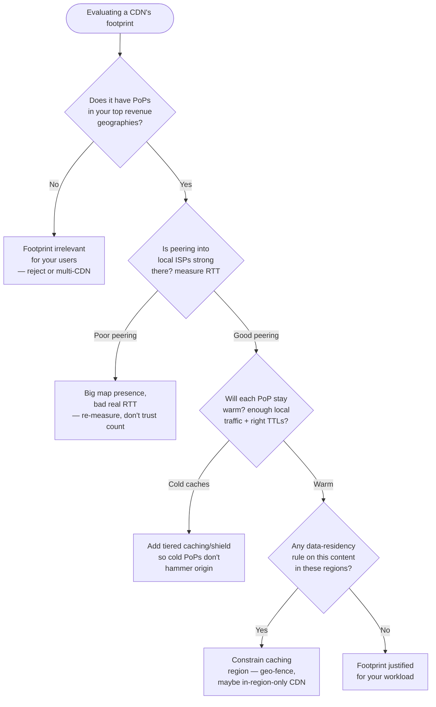
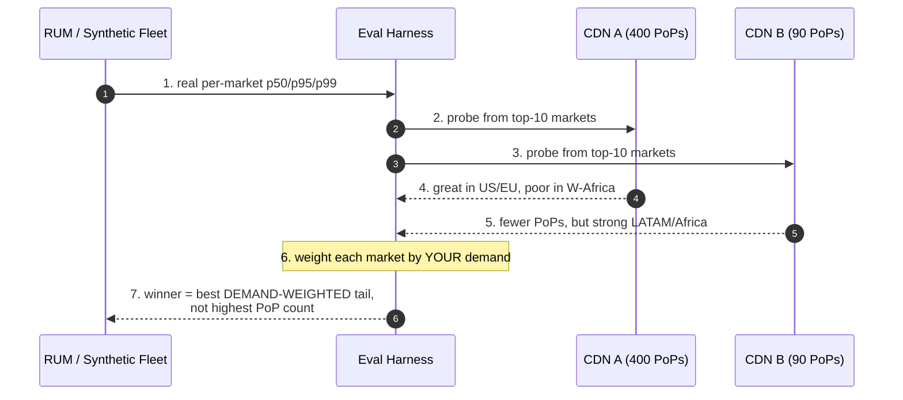
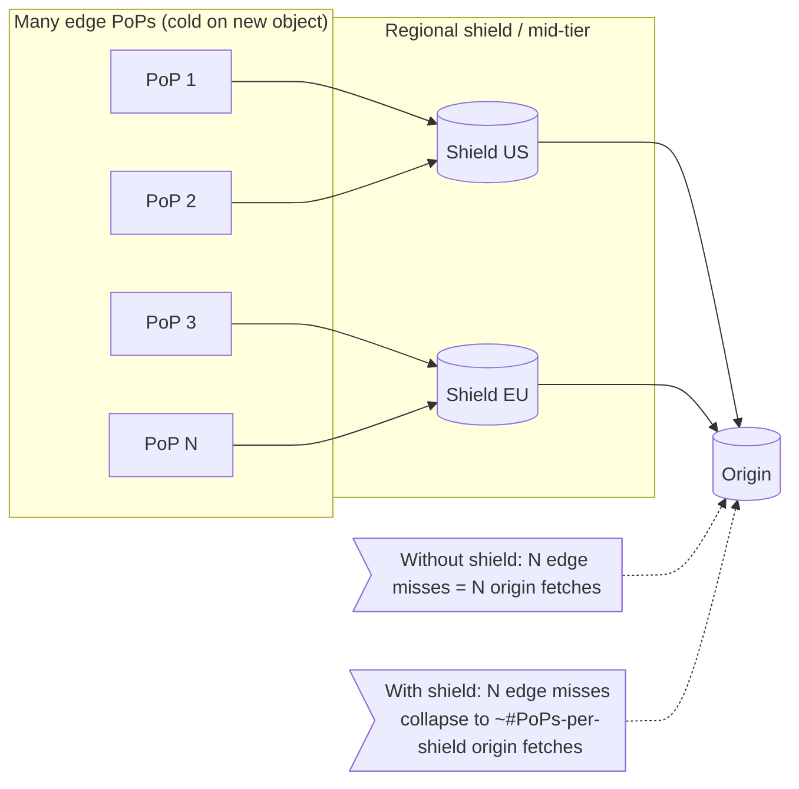
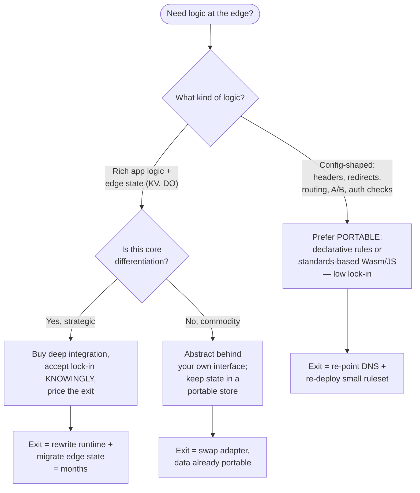

# Edge Locations — Staff

At Staff/Principal level, "edge locations" stops being a feature comparison and
becomes a **procurement, sovereignty, and latency-budget decision that binds the
company for years**. The junior question is "how many PoPs does this CDN have?"
The staff question is "does *this* CDN's footprint reduce tail latency for *our*
users, in *our* markets, under *our* legal constraints, at a cost that beats the
next-cheapest option — and does buying its edge-compute runtime lock us in?"

Marketing counts PoPs. Your users experience the ~3 PoPs nearest to *them*. A CDN
with 400 PoPs that has none in Lagos serves your Nigerian users worse than a
20-PoP CDN with strong West-African presence. **More PoPs is not more better.**

---

## Table of Contents

1. [The Staff Framing: Footprint Is a Means, Not a Metric](#1-the-staff-framing-footprint-is-a-means-not-a-metric)
2. [Mapping PoP Footprint to *Your* User Geography](#2-mapping-pop-footprint-to-your-user-geography)
3. [When a Bigger Edge Network Is — and Isn't — Justified](#3-when-a-bigger-edge-network-is--and-isnt--justified)
4. [Data Residency & Sovereignty Constraints on Edge Caching](#4-data-residency--sovereignty-constraints-on-edge-caching)
5. [Tiered Caching / Shield: Cost, Origin Offload, and the Long Tail](#5-tiered-caching--shield-cost-origin-offload-and-the-long-tail)
6. [Edge Compute: Build-vs-Buy and Vendor Lock-In](#6-edge-compute-build-vs-buy-and-vendor-lock-in)
7. [CDN Selection: A Comparison Framework](#7-cdn-selection-a-comparison-framework)
8. [Tying Edge Strategy to the Latency Budget](#8-tying-edge-strategy-to-the-latency-budget)
9. [Multi-CDN, Migration Cost, and Exit Strategy](#9-multi-cdn-migration-cost-and-exit-strategy)
10. [The Cost Model: What You Actually Pay For](#10-the-cost-model-what-you-actually-pay-for)
11. [Staff Judgment Checklist & Anti-Patterns](#11-staff-judgment-checklist--anti-patterns)

---

## 1. The Staff Framing: Footprint Is a Means, Not a Metric

A PoP (Point of Presence) is an edge location: a rack (or facility) of caching
servers, sometimes with compute, peered into local ISPs and IXPs, that terminates
the user's TLS connection close to them. The value of a PoP is entirely
**conditional on two things**:

1. **Proximity to real users** — network-path proximity (RTT, peering quality),
   not just map distance. A PoP 50 km away reached over a congested transit link
   can be slower than one 500 km away reached over a clean peered path.
2. **Cache effectiveness at that PoP** — a PoP only helps if the content the local
   users want is *hot* there. A thinly-trafficked PoP has a cold cache and a low
   hit ratio, so it fetches from origin/shield anyway — adding a hop, not removing
   one.

The classic staff mistake is treating **PoP count** as the figure of merit. PoP
count is a vendor's *supply-side* number. What matters is the **demand-weighted
coverage**: for each geography that generates your revenue/traffic, what p95/p99
RTT does this vendor deliver, and what steady-state cache-hit ratio can you
sustain there given your object catalog and request distribution?

> **Rule of thumb:** Any given user is served by a small handful of nearby PoPs.
> Doubling a vendor's *global* PoP count changes nothing for a user whose nearest
> PoP was already good and everything for a user who previously had none nearby.



**Staged reasoning:** you gate on *your* geography first (Q1), then correct for
peering reality vs map distance (Q2), then for cache warmth (Q3), then for legal
constraints (Q4). A vendor can pass Q1 on a slide and fail Q2 in production.

---

## 2. Mapping PoP Footprint to *Your* User Geography

The evaluation is **demand-weighted**, not vendor-weighted. Concretely:

1. **Pull your own traffic distribution.** Group requests (and, separately,
   revenue) by country/region and, ideally, by ASN/metro. You will typically find
   a heavy head — often 5–10 markets produce 80% of traffic — and a long tail.
2. **Get real RTT per market, not brochure maps.** Use RUM (Real User
   Monitoring — `PerformanceResourceTiming`, `Navigation Timing`, or a synthetic
   fleet) to measure actual p50/p95/p99 latency from each market to each
   candidate CDN. Run a **before/after or A/B test** on real users; do not trust
   a vendor's coverage map or a single synthetic probe.
3. **Weight by demand.** A PoP that improves p99 for 0.3% of traffic is worth far
   less than shaving 20 ms off the metro that produces a third of your revenue.
4. **Watch the tail, not just the mean.** CDNs converge on the well-connected
   head (US, EU, coastal East Asia). Differentiation shows up in the **tail
   markets** — interior India, West Africa, LATAM interior, SEA islands. If those
   are strategic for you, that is where footprint actually matters.



**Anti-pattern:** choosing the CDN with the most PoPs because it "future-proofs"
you. You pay for reach into markets you have no users in, while a competitor with
targeted presence in *your* markets serves your users better for less.

---

## 3. When a Bigger Edge Network Is — and Isn't — Justified

Paying a premium for a larger/denser edge network is justified when the marginal
latency (or offload) it buys clears a real business threshold. It is **not**
justified by default.

**A bigger footprint is usually justified when:**

- **Latency is revenue-linked** and you have measured the elasticity — e-commerce
  conversion, ad auctions, search, live-video join time, interactive gaming. If a
  100 ms improvement in a key market moves conversion measurably, denser presence
  in that market pays for itself.
- **You are entering new geographies** where incumbents (yours or competitors')
  already have edge presence and users have a fast alternative.
- **Origin egress/compute is the bottleneck** and a denser, warmer edge tier
  raises offload enough that origin savings dominate the CDN premium.
- **You need in-region presence for sovereignty** (see §4) — sometimes the
  footprint requirement is legal, not performance.

**A bigger footprint is usually NOT justified when:**

- Your traffic is concentrated in a few well-served metros — a mid-tier CDN
  already puts a warm PoP near ~all your users; extra global PoPs are dead weight.
- Content is **long-tail / low-hit-ratio** (personalized, per-user, rarely
  re-requested). More PoPs just means more cold caches; the wins come from origin
  design and tiered caching, not raw PoP count.
- Objects are **large but infrequently accessed** — bandwidth cost dominates and
  is often *cheaper* on a leaner provider; proximity barely moves total transfer
  time for a 2 GB download over a warm path.
- Your workload is **dynamic/uncacheable** — the edge terminates TLS and does
  route optimization, but a fancier cache footprint adds little; invest in edge
  compute or origin locality instead.

> The staff test: *"State the marginal latency (ms) the bigger footprint buys, in
> which demand-weighted markets, and the business metric it moves. If you can't
> fill that sentence in with measured numbers, you're buying a slide."*

---

## 4. Data Residency & Sovereignty Constraints on Edge Caching

A CDN's design goal — cache content in as many places, as close to users, as
possible — is in direct tension with laws that dictate **where data may physically
reside**. At staff scope you must reason about this *before* choosing a footprint,
because it can invalidate an otherwise-great vendor.

Key constraints to reason about (verify specifics with counsel — the rules change):

- **GDPR (EU/EEA)** — personal data leaving the EEA needs a lawful transfer
  mechanism. A CDN that caches a personalized, PII-bearing response in a
  non-adequate country is a transfer. Static, non-personal assets (images, JS,
  CSS) are usually low-risk; personalized/authenticated responses are not.
- **Data-localization regimes** (e.g., certain requirements in Russia, China,
  India's sector-specific rules, and others) may mandate that categories of data
  be stored/processed **in-country**. This can force an **in-region or in-country
  CDN** rather than a global one, or geo-fencing of what may be cached where.
- **Sector rules** — health (e.g., HIPAA-covered PHI in the US), finance, and
  government/public-sector regimes constrain where regulated payloads may be
  cached and processed at the edge.

**Design levers to satisfy residency without abandoning the edge:**

| Lever | What it does | Trade-off |
|---|---|---|
| **Cache only non-personal assets** | Static images/JS/CSS at the edge; personalized/PII responses go direct to a compliant origin | Loses edge acceleration for dynamic/personalized content |
| **Geo-fencing / regional PoP restriction** | Restrict caching of a content class to PoPs in permitted regions | Users outside the region lose local caching → higher latency |
| **In-region / sovereign CDN** | Use a provider or config that keeps cache + logs in-jurisdiction | Smaller footprint, higher cost, possible multi-CDN complexity |
| **Cache-key / bypass rules by content class** | Mark PII/regulated responses `private, no-store`; only cache public assets | Requires disciplined `Cache-Control` and response classification |
| **Tokenize/strip PII before edge** | Remove regulated fields so what's cached isn't personal data | Engineering cost; must be provably complete |

The subtle failure mode: **logs and edge-compute state also count**. Access logs
with IPs, edge KV stores, and durable edge state can each be regulated data in a
regulated region. Sovereignty is not solved by "we only cache images" if your edge
logs ship EU IPs to a US bucket.

> **Staff judgment:** treat residency as a *first-class selection filter*, not a
> post-hoc compliance patch. A vendor with a perfect footprint you legally can't
> use in your key market is the wrong vendor for that market.

---

## 5. Tiered Caching / Shield: Cost, Origin Offload, and the Long Tail

The paradox of a **large** footprint: the more edge PoPs you have, the more places
a *cold* object can miss and independently stampede your origin. With N edge PoPs,
a newly-published object can generate up to N origin fetches — one per PoP — for
the same byte range. Bigger footprint, *worse* origin thundering-herd, unless you
add a **mid-tier**.

**Tiered caching (a.k.a. Origin Shield / mid-tier cache):** edge PoPs, on a miss,
fetch from a designated **parent/shield cache** (a smaller set of regional caches)
instead of directly from origin. The shield collapses many edge misses into few
origin fetches.



**Why staff care about the economics:**

- **Origin offload dominates cost at scale.** Origin egress + origin compute is
  frequently more expensive per byte than CDN egress. Raising cache-hit ratio from
  95% → 98% can cut origin traffic by >50% on some distributions — often a bigger
  win than shaving edge latency.
- **A shield tier is not free.** You pay for the extra hop's bandwidth
  (edge→shield), and a shield miss adds latency (extra hop) on cold content. The
  trade is: *slightly worse cold-object latency* for *dramatically lower origin
  load and better warm-hit ratio*.
- **Long-tail catalogs** (huge object counts, low per-object popularity) are where
  tiering earns its keep — no single edge PoP keeps the tail warm, but the shield
  aggregates enough requests to hold more of it.

**Staff decision:** enable shield/tiered caching when origin protection or origin
egress cost is the constraint, or when a **large footprint** makes the
cold-object herd real. Skip or minimize it when your catalog is small and hot
everywhere (edge caches stay warm; the extra hop just adds latency), or when your
content is uncacheable anyway.

---

## 6. Edge Compute: Build-vs-Buy and Vendor Lock-In

Edge PoPs increasingly run **compute** (Cloudflare Workers, Fastly
Compute@Edge/VCL, AWS CloudFront Functions + Lambda@Edge, Akamai EdgeWorkers).
This turns "where do we cache" into "where do we *run logic*", and introduces the
single largest lock-in risk in the CDN decision.

**Where the lock-in lives:**

- **Proprietary runtimes & APIs.** Some edge runtimes are V8-isolate JavaScript
  with vendor-specific KV/Durable-Object/cache APIs; some are Wasm; some are a
  DSL (Fastly VCL). Logic written against one vendor's edge API does not port to
  another without a rewrite.
- **Stateful edge primitives.** Edge KV stores, durable objects, edge databases,
  and coordination primitives are the *stickiest* — they hold state and encode
  data models you can't lift-and-shift.
- **Cold-start & execution model differences.** V8 isolates vs containerized
  functions vs Wasm have different cold-start, CPU-time, and memory limits;
  code tuned to one model may not meet SLOs on another.



**Staff build-vs-buy stance:**

- **Buy** the edge platform (nobody should build a global PoP network) — but be
  deliberate about **how deeply** you couple to its proprietary compute layer.
- **Keep edge logic thin and portable by default.** Header rewrites, routing,
  auth token validation, simple personalization, and A/B assignment should be
  expressible as portable rules or standards-tracking code (WinterCG-style
  Web APIs, Wasm), so a CDN swap is a re-deploy, not a re-architecture.
- **Isolate deep edge-compute behind an internal interface.** If you must use
  vendor KV/durable state, wrap it so the blast radius of a migration is one
  adapter, and keep the **authoritative** state in a portable store.
- **Price the exit before you enter.** For any strategic edge-compute bet, write
  down what a migration to a second vendor costs (rewrite + state migration +
  re-validation). If nobody can estimate it, you've under-priced the lock-in.

> Distinguish **CDN caching lock-in** (low — swapping caching CDNs is mostly DNS +
> cache-header config) from **edge-compute lock-in** (high — proprietary runtime +
> state). The first is cheap to reverse; the second can be a multi-quarter rewrite.

---

## 7. CDN Selection: A Comparison Framework

This compares **archetypes**, not a moment-in-time price sheet (list prices and
PoP counts change constantly — always re-verify against current vendor docs). The
point is the **shape of the trade-offs** a staff engineer weighs.

| Dimension | Hyperscaler-integrated (e.g. CloudFront) | Performance/edge-native (e.g. Cloudflare, Fastly) | Enterprise/carrier-scale (e.g. Akamai) | Regional / sovereign CDN |
|---|---|---|---|---|
| **Footprint shape** | Broad, tracks the cloud's regions/edges | Dense in well-connected metros; strong global | Very large, deep last-mile/ISP peering | Concentrated in-jurisdiction |
| **Best when** | Origin already on that cloud (egress + integration) | Latency-sensitive, edge-compute-forward | Massive scale, tough markets, media | Data-residency mandates dominate |
| **Edge-compute model** | Functions/Lambda@Edge (cloud-coupled) | V8 isolates / Wasm / VCL (fast, proprietary) | EdgeWorkers (proprietary) | Varies; often limited |
| **Lock-in risk** | Cloud-ecosystem coupling | High if you adopt KV/durable edge state | Config/DSL coupling | Vendor + jurisdiction coupling |
| **Pricing shape** | Per-GB egress + requests; cloud-friendly | Often flat/predictable tiers; low egress on some plans | Negotiated enterprise commit | Regional pricing, often higher/GB |
| **Cache invalidation** | Path-based; can be slower/limited | Fast, often instant / tag-based purge | Feature-rich purge | Varies |
| **Residency support** | Regional controls, varies | Regional/data-locality features | Strong regional/sector options | Native strength |

**How to *use* this table (staff process):**

1. **Filter by residency first** (§4) — eliminate vendors you legally can't use in
   a key market before comparing performance.
2. **Filter by demand-weighted RTT** (§2) — measure, don't read maps.
3. **Then** weigh edge-compute needs and lock-in (§6) and total cost (§10).
4. **Assume multi-CDN is possible** — the "one vendor" framing is often a false
   constraint (§9).

> No single provider wins every axis. Staff work is scoring each dimension against
> *your* weighting (which markets, which content, which legal regime, how much
> edge logic) — not picking the one with the biggest number anywhere.

---

## 8. Tying Edge Strategy to the Latency Budget

Edge decisions must be justified inside an **explicit end-to-end latency budget**,
not made in isolation. The edge only owns *part* of the user-perceived latency:

```
User-perceived latency ≈
    DNS/connection setup
  + client → nearest PoP RTT          ← edge FOOTPRINT affects this
  + TLS handshake (often at PoP)      ← edge terminates TLS → cheaper here
  + [cache HIT: serve from PoP]       ← cache-hit RATIO affects this
    OR
    [cache MISS: PoP → shield → origin round trips + origin processing]
  + response transfer time            ← object size / bandwidth
```

**What this means for footprint spend:**

- **Footprint mainly buys down the `client→PoP RTT` term and improves hit ratio.**
  If your budget is dominated by *origin processing* or *object size*, a bigger
  footprint spends money where the budget isn't — you should be optimizing origin
  or payload instead.
- **Do the arithmetic per market.** If your budget is 200 ms and the current
  nearest-PoP RTT is 15 ms in a metro, a denser footprint that shaves it to 10 ms
  is 5 ms of a 200 ms budget — likely not worth a premium. If another market sits
  at 120 ms RTT because it has *no* nearby PoP, closing that gap is the highest-ROI
  edge spend you have.
- **Cache-miss cost is the hidden term.** A miss turns one RTT into
  edge→shield→origin round trips *plus* origin processing. Improving hit ratio
  (via tiering, TTLs, cache-key hygiene) can dominate footprint density for the
  *effective* budget users feel.
- **Diminishing returns are real.** Below the RTT floor set by physics (speed of
  light in fiber, ~5 µs/km one-way) and peering, extra PoPs stop helping. Know
  where each market sits relative to that floor.

> **Staff framing:** every dollar of edge spend must name the latency-budget term
> it reduces and the market it reduces it in. "We bought a bigger CDN" is not a
> latency-budget line item; "we cut p95 in São Paulo from 120 ms to 25 ms, which
> moved checkout conversion" is.

---

## 9. Multi-CDN, Migration Cost, and Exit Strategy

At scale, "which CDN" is often the wrong question — the answer can be **more than
one**. Multi-CDN mitigates single-vendor outages and lets you route each market to
whichever provider is fastest/cheapest there.

**Why staff reach for multi-CDN:**

- **Resilience** — a single CDN outage is a full outage for a CDN-fronted site.
  Multi-CDN with health-based DNS/steering fails traffic over.
- **Per-market optimization** — pick the strongest provider *per geography*,
  turning "best global footprint" into "best footprint *for each of my markets*".
- **Commercial leverage & lock-in insurance** — a live second vendor keeps
  pricing honest and de-risks the primary.

**Costs and constraints (why it isn't free):**

- **Lowest-common-denominator features.** Multi-CDN pushes you toward portable
  caching config and *away* from deep proprietary edge compute — you can't rely on
  vendor-specific KV/DO if traffic can land on either provider. This is exactly
  why §6's "keep edge logic portable" discipline pays off.
- **Cache-hit dilution.** Splitting traffic across two CDNs halves the traffic
  warming each one's cache → lower hit ratios on each unless volume is huge.
- **Operational complexity.** Two purge pipelines, two configs, two log formats,
  a steering layer (managed DNS/traffic-steering) to run and monitor.

**Exit strategy as a first-class artifact.** For your primary CDN, staff engineers
should be able to answer, *today*: How fast can we cut over? (DNS/CNAME + config
re-point is hours-to-days for pure caching; edge-compute rewrites are
weeks-to-months.) What's stuck? (Proprietary edge state, DSL configs, purge
tooling.) The cheaper your exit, the more leverage you hold and the less a bad
vendor decision can hurt you — which is why lock-in (§6) is a *strategic* variable,
not a technical footnote.

---

## 10. The Cost Model: What You Actually Pay For

Footprint decisions are cost decisions. The bill is rarely "one price per GB":

| Cost component | Driver | Staff lever |
|---|---|---|
| **Edge egress (bandwidth)** | GB served to users; **priced per region** (cheap in US/EU, dearer in APAC/SA/Oceania) | Compression, right-sizing objects, per-region traffic mix |
| **Requests** | Number of HTTP requests (esp. small objects/APIs) | Bundle assets, raise TTLs, reduce chatty requests |
| **Origin egress + origin compute** | Cache MISSES hitting origin | Raise hit ratio; tiered caching/shield (§5) |
| **Tiered-caching / shield hop** | Extra edge→shield bandwidth | Enable only where offload/herd protection justifies it |
| **Edge compute** | Invocations + CPU-time + edge state storage | Keep functions thin; watch KV/DO storage growth |
| **Invalidation / purge** | Some vendors meter purges or tag-based invalidation | Design cache keys/TTLs to purge less often |
| **Commit / minimums** | Enterprise commits, regional minimums | Negotiate against measured, demand-weighted volume |

**Key economic insights for footprint choices:**

- **Regional egress pricing can flip the "bigger is better" logic.** Serving a
  market from an expensive-egress region costs more *per GB* — a footprint
  decision has a direct, region-dependent unit cost, not a flat one.
- **Origin offload often dwarfs edge latency in $ terms.** For heavy origins, the
  hit-ratio improvement from tiering/shield saves more money than any latency
  win — and can justify a provider on economics alone (§5).
- **Edge compute cost scales with invocations + state, not just bandwidth.** A
  cheap-looking edge function called on every request, holding growing KV state,
  becomes a line item — and a lock-in liability — that footprint comparisons miss.

> The staff cost question is never "$/GB list price". It's **"total cost to serve
> *my* demand-weighted traffic mix, at *my* hit ratio, in *my* regions, with *my*
> edge-compute usage — plus the priced-in cost of exit."**

---

## 11. Staff Judgment Checklist & Anti-Patterns

**Do:**

- Evaluate footprint **demand-weighted** against *your* user geography and RTT,
  measured with RUM/A-B, not vendor maps (§2).
- Make **data residency a first-class selection filter**, before performance (§4).
- Treat **caching lock-in (low)** and **edge-compute lock-in (high)** as separate
  risks; keep edge logic portable by default and price every deep-integration exit
  (§6, §9).
- Tie every edge-spend decision to a **named latency-budget term in a named
  market**, with the business metric it moves (§8).
- Use **tiered caching/shield** to protect origin and raise hit ratio when a large
  footprint or heavy origin makes cold-object herds real (§5).
- Model **total cost** including regional egress, requests, origin offload, edge
  compute + state, and **exit cost** (§10).

**Don't (anti-patterns):**

- **PoP-count worship** — buying the biggest global footprint for users who live
  in three metros already well served (§1–§2).
- **Cargo-cult edge compute** — moving core stateful logic onto a proprietary edge
  runtime with no portability plan, then being unable to leave (§6).
- **Residency as an afterthought** — picking a footprint, then discovering it's
  illegal for your key market (§4); forgetting that **logs and edge state** are
  regulated data too.
- **Cold-cache blindness** — adding PoPs without tiering, then wondering why origin
  load and the long tail got *worse* (§5).
- **Flat-price thinking** — comparing $/GB list prices while ignoring regional
  egress, origin offload, and exit cost (§10).
- **Single-CDN by default** — assuming one vendor when per-market multi-CDN would
  serve users better and de-risk the bet (§9).

**The one-line staff test:** *"Name the market, the measured latency-budget term
this edge decision improves, the legal constraint it respects, and the cost —
including exit — it incurs. If any of those four is missing, you're buying a
brochure, not an edge strategy."*

> 🎞️ **See it animated:** [Cloudflare — how a CDN works](https://www.cloudflare.com/learning/cdn/what-is-a-cdn/) · [AWS CloudFront edge locations](https://aws.amazon.com/cloudfront/features/)

---

*Next step:* [Edge Locations — Interview](interview.md)
