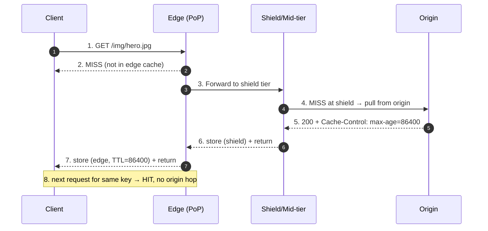
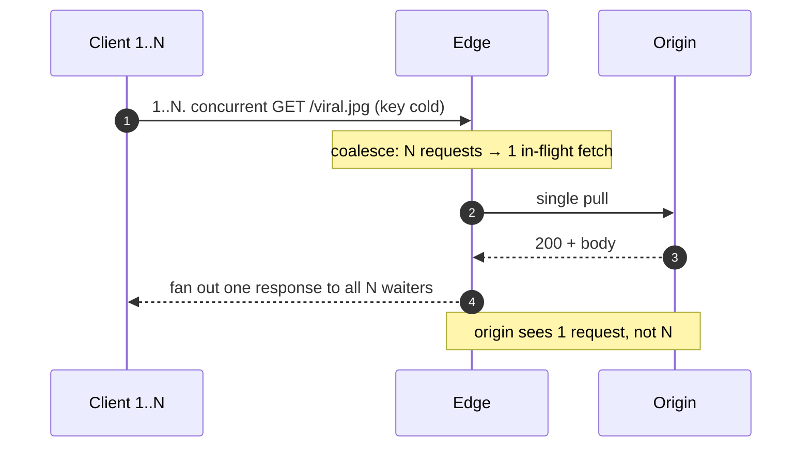
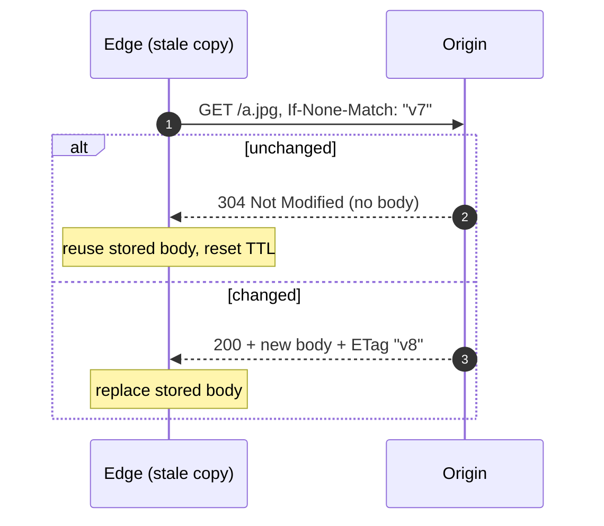
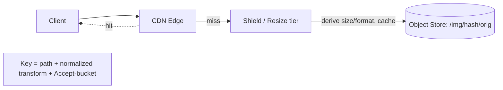

# Pull CDN — Interview

A pull CDN is the default operating mode of every commodity edge network (Cloudflare, Fastly, Akamai, CloudFront). The edge caches nothing up front; it *pulls* an object from your origin the first time an edge location is asked for it, stores it under a cache key with a TTL, and serves every subsequent request from the edge until the object expires or is evicted. This file drills the questions a senior candidate is expected to answer fluently: the miss path, pull vs push, `Cache-Control` semantics, the cold-cache stampede, hit-ratio math, revalidation and stale-serving, cache keys and `Vary`, multi-CDN, and end-to-end static/image delivery design.

## Table of Contents
1. [Q1: How does a pull CDN work?](#q1-how-does-a-pull-cdn-work)
2. [Q2: Pull vs push CDN — when each?](#q2-pull-vs-push-cdn--when-do-you-choose-each)
3. [Q3: What controls how long the edge caches an object?](#q3-what-actually-controls-how-long-the-edge-caches-an-object)
4. [Q4: The first-request penalty](#q4-what-is-the-first-request-penalty-and-how-do-you-hide-it)
5. [Q5: Cold-cache stampede / thundering herd](#q5-what-is-a-cold-cache-stampede-and-how-does-a-cdn-prevent-it)
6. [Q6: What is hit ratio and how do you reason about it?](#q6-what-is-hit-ratio-and-how-do-you-reason-about-it)
7. [Q7: Revalidation, ETag, and 304](#q7-how-does-revalidation-work-etag-last-modified-and-304)
8. [Q8: Serve-stale (SWR / SIE)](#q8-what-is-serve-stale-and-why-is-it-a-reliability-feature)
9. [Q9: Cache keys and Vary](#q9-what-is-a-cache-key-and-how-does-vary-affect-it)
10. [Q10: How do you invalidate a pull CDN?](#q10-how-do-you-invalidate-content-on-a-pull-cdn)
11. [Q11: `Cache-Control` directives cheat sheet](#q11-walk-me-through-the-cache-control-directives-that-matter)
12. [Q12: Multi-CDN](#q12-why-and-how-would-you-run-multiple-cdns)
13. [Q13: Design image delivery with a CDN](#q13-design-scenario-image-delivery-for-a-social-app)
14. [Q14: Design static asset delivery for an SPA](#q14-design-scenario-static-asset-delivery-for-a-web-app)
15. [Q15: Why can a pull CDN still hammer your origin?](#q15-your-cdn-is-live-but-origin-load-barely-dropped-why)
16. [Q16: Cacheability pitfalls](#q16-name-the-common-reasons-a-response-is-accidentally-uncacheable)

---

## Q1: How does a pull CDN work?

> A pull CDN lazily populates its cache. On the first request for an object at a given edge (a *miss*), the edge fetches it from origin, stores it keyed by the request's cache key with a TTL derived from response headers, and returns it to the client. Every later request that maps to that same key at that same edge (a *hit*) is served locally with no origin round-trip until the object expires or is evicted. You never pre-upload anything — the traffic itself drives what gets cached, so hot objects are cached and cold objects never consume edge storage.



The important nuance is that "the cache" is not one cache: it is per-PoP, and often per-server within a PoP, with an optional **shield / mid-tier** origin in front of the real origin. That hierarchy is what turns N cold PoPs into a small number of origin pulls instead of one per PoP.

---

## Q2: Pull vs push CDN — when do you choose each?

> In a **pull** CDN the edge fetches on demand; you configure an origin and cache headers and the CDN does the rest. In a **push** CDN you actively upload (push) objects to the CDN's storage ahead of time, and the CDN serves purely from that copy without ever contacting an origin on the read path. Pull is the default for the long tail of assets and for content that changes; push suits a bounded set of large, rarely-changing, high-value objects (software installers, game patches, video segments) where you cannot tolerate any first-request origin pull or where the origin may not even exist as a live service.

| Dimension | Pull CDN | Push CDN |
|---|---|---|
| Population | Lazy, on first miss | Eager, you upload |
| First-request latency | Slow (origin pull) | Fast (already there) |
| Origin required at read time | Yes (for misses/revalidation) | No |
| Storage cost | Only hot objects stored | You store everything you push, hot or not |
| Freshness control | TTL + purge | Re-upload / versioned paths |
| Operational effort | Set headers, done | Build & run a publish pipeline |
| Best for | Long-tail, dynamic-ish assets, most sites | Large, stable, cold-start-sensitive files |

In practice most "CDN" usage is pull. Push shows up for release artifacts and large media catalogs. A strong answer notes they are not mutually exclusive — you can pull for the site and push a curated hot set, and many modern CDNs blur the line with origin-storage buckets.

---

## Q3: What actually controls how long the edge caches an object?

> The origin's response headers, in a defined precedence. `Cache-Control` wins over `Expires`. Within `Cache-Control`, `s-maxage` (shared caches, i.e. the CDN) overrides `max-age` (any cache); `max-age` overrides `Expires`. `no-store` forbids caching entirely; `no-cache` allows storage but forces revalidation before every reuse; `private` tells shared caches (the CDN) not to store it at all. If none of these are present, CDNs fall back to a configured default TTL or heuristic freshness. Senior answer: never rely on defaults — set explicit `Cache-Control` per content class.

```text
Freshness precedence (shared cache / CDN):
  s-maxage  >  max-age  >  Expires  >  heuristic/default TTL

Typical policy by content class:
  Immutable, versioned asset (app.9f3c2.js):
      Cache-Control: public, max-age=31536000, immutable
  HTML shell (changes on deploy):
      Cache-Control: public, max-age=0, s-maxage=60, stale-while-revalidate=600
  Personalized API JSON:
      Cache-Control: private, no-store
```

The single most useful trick here is the `s-maxage` / `max-age` split: give the browser a short TTL (so a purge/deploy is visible quickly) but let the CDN hold it longer, so origin stays protected.

---

## Q4: What is the first-request penalty and how do you hide it?

> The first request to hit any given edge for an object is a guaranteed miss, so that user pays the full origin RTT plus the object's transfer time — sometimes worse than no CDN, because you've added an edge hop. Since caches are per-PoP, every PoP pays this once, and after an eviction or TTL expiry it recurs. Mitigations: (1) a **shield / mid-tier** so only the shield, not each of ~300 PoPs, pulls from origin; (2) **cache warming / prefetch** for known-hot objects (crawl or push them after a deploy); (3) generous TTLs plus `stale-while-revalidate` so expiry never blocks a user; (4) keeping origin fast and geographically close to the shield.

The candidate should quantify: with a shield, origin pull count drops from `O(#PoPs)` to `O(#shields)` per unique object — often a 100×+ reduction in origin fan-out on cold content.

---

## Q5: What is a cold-cache stampede and how does a CDN prevent it?

> A stampede (thundering herd / cache stampede) happens when many concurrent requests for the same cold or just-expired key arrive before the first origin fetch completes. Naively, each request independently misses and hits origin, so a single popular object can generate thousands of simultaneous origin requests — precisely at the worst moment (a viral spike, or a synchronized TTL expiry after a deploy). The CDN's defense is **request coalescing** (a.k.a. request collapsing): concurrent misses for the same key are held, one representative fetch goes to origin, and the response is fanned out to all waiters.



Additional defenses a senior mentions: **TTL jitter** (add randomness so a batch of objects doesn't expire in lockstep), **stale-while-revalidate** (serve the old copy while one background fetch refreshes), and **shielding** (collapse happens once per shield rather than per PoP). Note that coalescing only works *within* a cache node — cross-PoP dedup requires the shield tier.

---

## Q6: What is hit ratio and how do you reason about it?

> Hit ratio is the fraction of requests served from cache without an origin pull: `hits / (hits + misses)`. Measure two of them — **request hit ratio** (share of requests) and **byte hit ratio** (share of bytes), which diverge when a few large objects miss. The offered origin load and bandwidth savings are `1 − hitRatio`, so the last few percent are worth disproportionately more: going 90%→99% cuts origin traffic from 10% to 1%, a 10× reduction in origin load, not a 9% one.

```text
Origin QPS = client_QPS × (1 − request_hit_ratio)

Example — 100,000 req/s, hero-heavy site:
   hit ratio 90%  → origin sees 10,000 req/s
   hit ratio 99%  → origin sees  1,000 req/s   (10× less)
   hit ratio 99.9%→ origin sees    100 req/s   (100× less)

Drivers of hit ratio:
   ↑ TTL length              ↑ hit ratio (fewer expiries)
   ↑ cache-key cardinality   ↓ hit ratio (each variant is its own object)
   ↑ working-set size vs edge storage → ↓ (more evictions)
   shield tier               ↑ (collapses PoP-level misses)
```

Common cause of a mysteriously low hit ratio: over-splitting the cache key (see Q9) — query strings, cookies, or an over-broad `Vary` fragment one logical object into thousands of cache entries, each cold.

---

## Q7: How does revalidation work? ETag, Last-Modified, and 304?

> When a cached object goes stale (TTL elapsed) but the CDN needs to confirm freshness, it revalidates instead of blindly re-downloading. It sends a **conditional request** to origin: `If-None-Match: "<etag>"` and/or `If-Modified-Since: <date>`. If the object is unchanged, origin returns **`304 Not Modified`** with empty body — the CDN refreshes the object's TTL and reuses the stored body. If it changed, origin returns `200` with the new body. The win is bandwidth and latency: a 304 is a few hundred bytes regardless of object size, so revalidating a 5 MB image that hasn't changed costs almost nothing.



`ETag` (a content fingerprint) is preferred over `Last-Modified` because it's exact and sub-second; use `Last-Modified` as a cheaper fallback. `no-cache` (not `no-store`) is exactly "cache it but always revalidate before serving." `must-revalidate` forbids serving stale after expiry — the opposite of stale-while-revalidate.

---

## Q8: What is serve-stale and why is it a reliability feature?

> Serve-stale means the CDN returns an expired cached copy under two directives. **`stale-while-revalidate=N`**: for N seconds past expiry, serve the stale copy *immediately* to the user while asynchronously revalidating in the background — the user never waits on origin, and the next user gets the fresh copy. **`stale-if-error=N`**: if origin is down or returns 5xx during revalidation, keep serving the stale copy for N seconds rather than propagating the error. Together they decouple user-visible latency and availability from origin health.

```text
Cache-Control: public, max-age=60, stale-while-revalidate=600, stale-if-error=86400

Timeline for one object:
  t=0..60s      fresh        → serve from cache
  t=60..660s    stale (SWR)  → serve stale NOW, refresh in background
  origin 5xx    stale (SIE)  → keep serving stale up to 24h, shield the outage
```

This is why a well-tuned pull CDN can keep a site up through a full origin outage: as long as objects were cached and `stale-if-error` is generous, reads keep succeeding. The trade-off is bounded staleness, which is acceptable for most static and semi-static content and unacceptable for, say, account balances (mark those `no-store`).

---

## Q9: What is a cache key and how does `Vary` affect it?

> The **cache key** is the identity under which the CDN stores and looks up an object — by default `scheme + host + path` (and often the query string, depending on config). Two requests that produce the same key share one cached object. `Vary` extends the key by named request headers: `Vary: Accept-Encoding` means gzip and brotli variants are stored separately; `Vary: Accept-Language` forks the object per language. The danger is **cache fragmentation**: varying on a high-cardinality header (`User-Agent`, `Cookie`) explodes one logical object into thousands of near-duplicate entries, each cold, collapsing hit ratio.

```text
Base key:   https://cdn.example.com/products?id=42

Key-splitting inputs (each multiplies the entry count):
  query string params      ?id=42&utm_source=… → normalize/strip tracking params
  Vary: Accept-Encoding    → OK, low cardinality (gzip, br)   ✅
  Vary: Accept-Language    → OK if few locales                 ⚠️
  Vary: User-Agent         → thousands of variants             ❌ (fragmentation)
  Vary: Cookie             → effectively per-user, uncacheable  ❌

Hygiene:
  - strip/normalize marketing query params before keying
  - Vary only on headers that genuinely change the bytes
  - never Vary on Cookie for a shared/cacheable response
```

Senior signal: proactively normalizing the cache key (sorting/stripping query params, canonicalizing host case, limiting `Vary`) is often the single biggest lever on hit ratio.

---

## Q10: How do you invalidate content on a pull CDN?

> Two families. **TTL-based (soft) invalidation**: content simply expires; you rely on short `s-maxage` for things that change. **Explicit purge**: call the CDN's purge API to evict a key immediately — by exact URL, by surrogate/cache tag, or by wildcard/prefix. The strongly preferred pattern, though, is **versioned immutable URLs** (`app.9f3c2b.js`, `hero.v8.jpg`): give changing assets a content hash in the path, cache them for a year with `immutable`, and "invalidate" by referencing a new URL. No purge race, no propagation delay, instant rollback.

| Method | Latency to take effect | Best for | Caveat |
|---|---|---|---|
| Short `s-maxage` | Up to the TTL | Frequently-changing HTML/JSON | Higher origin load |
| Exact-URL purge | Seconds–minutes | Emergency fix, single object | Global propagation lag; race with in-flight fills |
| Tag / surrogate-key purge | Seconds–minutes | "purge everything tagged product:42" | Requires tagging discipline at origin |
| Versioned immutable URL | Instant (new key) | Deployable static assets | Requires build-time hashing + reference rewrite |

The reason versioning beats purging: purge is a *distributed* operation racing against ongoing cache fills, so there's always a window of inconsistency; a new URL is a brand-new key with no old copy to race.

---

## Q11: Walk me through the `Cache-Control` directives that matter.

> The candidate should rattle these off with the shared-cache angle.

| Directive | Meaning | Notes for a CDN |
|---|---|---|
| `public` | Any cache may store it | Required to cache authenticated-context responses |
| `private` | Only the browser may store it | CDN must NOT store; use for per-user data |
| `no-store` | Never store, anywhere | Truly sensitive/dynamic; kills hit ratio by design |
| `no-cache` | Store but revalidate before every reuse | Not "don't cache" — a common misread |
| `max-age=N` | Fresh for N s in any cache | Browser + CDN unless overridden |
| `s-maxage=N` | Fresh for N s in shared caches | Overrides `max-age` at the CDN only |
| `must-revalidate` | No serving stale after expiry | Opposite of stale-while-revalidate |
| `immutable` | Won't change during its freshness | Skip revalidation entirely; pair with a year `max-age` |
| `stale-while-revalidate=N` | Serve stale, refresh async | Latency shield (Q8) |
| `stale-if-error=N` | Serve stale on origin error | Availability shield (Q8) |

The two follow-ups interviewers love: "difference between `no-cache` and `no-store`?" (revalidate-always vs never-store) and "how do you make the browser refresh fast but keep the CDN warm?" (short `max-age`, long `s-maxage`).

---

## Q12: Why and how would you run multiple CDNs?

> **Multi-CDN** routes traffic across two or more providers to remove the single-vendor dependency. Motivations: availability (survive a provider-wide outage — these do happen), performance (different CDNs win in different regions/ISPs), cost (steer volume to the cheaper provider up to commit tiers), and negotiating leverage. Routing is done via **DNS** (managed/weighted, latency-based, or geo) or a smart CNAME/steering layer, ideally driven by **RUM** (real-user-monitoring) data so you send each region to whichever CDN is actually fastest there.

```text
Multi-CDN routing strategies:
  DNS weighted      → static % split (e.g., 70/30), simple, coarse
  Latency/geo DNS   → send region to its best-performing CDN
  RUM-driven steering → continuously re-weight by measured p50/p95 per CDN/region
  Failover          → health-check origin/CDN, drop a failing provider from rotation
```

Costs a senior flags: each CDN caches independently, so cold-start and origin pull load *multiply* across providers unless you front them with a shared shield/origin-storage tier; config drift across providers is a real operational tax; and DNS TTLs bound how fast you can shift traffic during an incident. Multi-CDN is worth it above a certain scale/availability bar, over-engineering below it.

---

## Q13: Design scenario — image delivery for a social app.

> **Prompt:** "Users upload photos; serve them globally, fast, cheap." Walk the interviewer through it.

**Requirements.** Read-heavy (read:write often 100:1+), global audience, images are immutable once uploaded, multiple sizes/formats needed, must survive origin blips.

**Design.**
1. **Origin = object store** (S3/GCS). Never serve user images from an app server; the store is the durable origin the pull CDN points at.
2. **Immutable, versioned keys.** Upload path includes a content hash: `/img/<hash>/orig.jpg`. Since the bytes never change under a key, cache `public, max-age=31536000, immutable`. No purge ever needed.
3. **On-the-fly variants at the edge.** Request `?w=400&format=auto`; an image-resizing layer (edge function or a resize origin behind the shield) produces and caches the variant. Cache-key includes the normalized transform params only — nothing else.
4. **Shield tier** in front of the object store so the first request per size, not per PoP, pulls/renders.
5. **`format=auto`** negotiates AVIF/WebP/JPEG via `Accept` — `Vary: Accept` but with normalization to a few buckets so the key doesn't fragment.
6. **stale-if-error** long, so an object-store hiccup is invisible to readers.



**Why it's strong:** immutable keys make invalidation a non-problem, the resize tier keeps you from pre-generating every size, the shield caps origin fan-out, and `stale-if-error` covers durability blips. **Estimation sanity check:** at 100k img req/s and 99% hit ratio, the object store/resize tier sees ~1k req/s — trivial.

---

## Q14: Design scenario — static asset delivery for a web app.

> **Prompt:** "Ship JS/CSS/HTML for an SPA behind a CDN; deploys must be instant and safe to roll back."

**Design.**
- **Fingerprinted bundles.** The build emits `app.<contenthash>.js`, `styles.<contenthash>.css`. Serve them `public, max-age=31536000, immutable` — a year at the edge, zero revalidation, and a new deploy is just new filenames (instant, atomic, trivially rollbackable to the prior hash).
- **The HTML shell is the one mutable entry point.** It references the current hashed bundles, so it must *not* be cached hard. Use `Cache-Control: public, max-age=0, s-maxage=30, stale-while-revalidate=300`: browsers always revalidate, the CDN holds it ~30s to absorb load, and SWR keeps latency flat during a deploy.
- **Deploy sequence:** upload hashed assets first (so they're pullable), then flip the HTML to reference them. Old bundles keep working for clients mid-session because their hashes still resolve.
- **Purge only the HTML** on urgent rollback (small, single key); the hashed assets are self-invalidating.

```text
Asset class           Cache-Control                                        Invalidation
--------------------  ---------------------------------------------------  ------------------
app.<hash>.js/.css    public, max-age=31536000, immutable                  new hash (never purge)
index.html (shell)    public, max-age=0, s-maxage=30, stale-while-reval..  short TTL / purge shell
/api/* (dynamic)      private, no-store                                    n/a
```

The core idea an interviewer wants: **separate the immutable long-cached assets from the single short-cached mutable entry point.** That gives you a ~100% hit ratio on the heavy bytes and instant, atomic, reversible deploys.

---

## Q15: Your CDN is live but origin load barely dropped — why?

> This is a diagnostic question; a senior enumerates causes and how to confirm each.

```text
Likely causes (check hit-ratio + cache-status logs first):
  1. Uncacheable responses      → Set-Cookie / Cache-Control: private / no-store on
                                   responses that could be shared. Fix headers.
  2. Cache-key fragmentation    → query-string or Vary explosion; each request is a
                                   fresh miss. Normalize key, trim Vary. (Q9)
  3. TTL ~0 / missing headers   → CDN falls back to a tiny default and revalidates
                                   constantly. Set explicit max-age/s-maxage.
  4. No shield tier             → every PoP independently pulls cold objects; fan-out
                                   ≈ #PoPs. Add a shield/origin-shield. (Q4)
  5. Highly dynamic/personalized→ genuinely uncacheable; consider edge compute or
                                   micro-caching (1–5s) for hot dynamic paths.
  6. Cache too small / churny   → working set >> edge storage → constant eviction;
                                   check eviction rate.
```

The one-line method: **read the `X-Cache` / cache-status header and hit-ratio metric per path**, then bucket traffic by cache status. The dominant MISS/UNCACHEABLE bucket points straight at the cause.

---

## Q16: Name the common reasons a response is accidentally uncacheable.

> A crisp list separates candidates who've operated a CDN from those who've only read about one.

- **`Set-Cookie` on a shared response** — many CDNs refuse to cache anything that sets a cookie; strip cookies from static-asset responses at origin.
- **`Cache-Control: private` / `no-store`** applied too broadly by a framework default (Express, Rails, Spring often default to no-cache).
- **`Vary: Cookie` or `Vary: *`** — keys per-user or forbids caching outright.
- **Missing freshness headers** so the CDN's default TTL is 0 or a tiny heuristic.
- **`Authorization` header present** — some CDNs treat authed requests as private unless you explicitly opt in with `public`.
- **Query-string cache-busting on every request** (e.g., appending `?t=<now>`), making every request a unique cold key.
- **`POST`/non-idempotent methods** — not cached by default; only safe methods (`GET`, `HEAD`) are.
- **Chunked/streaming or `Content-Length: 0` oddities** and 5xx responses that shouldn't be cached but sometimes are (or vice versa) — verify with negative caching config.

The senior habit is to **audit the response headers of your top URLs by traffic**, not to assume the CDN is doing its job. Most "the CDN isn't helping" incidents are an origin-header bug, not a CDN one.

---

*Next step:* [Push CDN — Junior](../push-cdn/junior.md)
