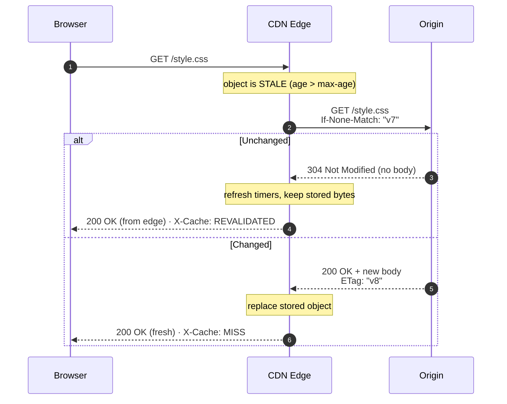
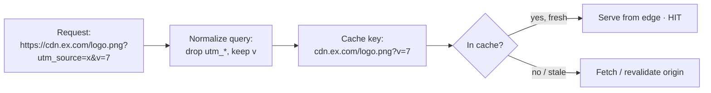

# Pull CDN — Middle

<!-- level-focus -->
At middle level, focus on this question:

> Where does **Pull CDN** belong in a maintainable component, and which trade-off selects the design?

Use the smallest realistic scenario that exposes the decision and its failure behavior.
---

## 1. The freshness lifecycle at the edge

Every cached object at the edge moves through three states, defined by RFC 9111 (HTTP Caching):

- **Fresh** — the object's age is below its freshness lifetime (`max-age`/`s-maxage`). The edge serves it directly. No origin contact.
- **Stale** — age has exceeded the freshness lifetime. The edge *may not* serve it blindly; it must **revalidate** with origin (unless `stale-while-revalidate`/`stale-if-error` grants a grace window).
- **Absent** — never fetched, or evicted. The next request is a MISS and triggers an origin fetch.

The freshness lifetime is computed by the cache, not sent as a literal. Precedence (RFC 9111 §5.2.2.10, §5.3):

1. `s-maxage` (shared caches only — the CDN is a shared cache)
2. `max-age`
3. `Expires` (absolute date; legacy, prefer `Cache-Control`)
4. Heuristic freshness (if none present and the status is cacheable) — often `~10%` of `(now − Last-Modified)`. **You never want heuristic caching in production**; it is unpredictable. Always send an explicit directive.

> 🎞️ **See it animated:** [MDN — HTTP caching](https://developer.mozilla.org/en-US/docs/Web/HTTP/Caching) · [Cloudflare — What is a CDN?](https://www.cloudflare.com/learning/cdn/what-is-a-cdn/)

---

## 2. Cache-Control directives you actually set

`Cache-Control` is the single header that governs caching in HTTP/1.1+ (RFC 9111). It carries *response directives* (what caches may do with this response) and *request directives* (rare from browsers, ignored here). The ones you configure on the origin:

| Directive | Applies to | Effect | When you use it |
|-----------|-----------|--------|-----------------|
| `max-age=N` | all caches | Fresh for `N` seconds from when the response was generated | Baseline TTL for every cacheable asset |
| `s-maxage=N` | **shared** caches (CDN) | Overrides `max-age` at the edge only | Long edge TTL, short browser TTL |
| `public` | all caches | Explicitly cacheable even if normally not (e.g., `Authorization` present) | Auth'd-but-shareable assets |
| `private` | browser only | **Edge must not store it** | Per-user HTML, dashboards |
| `no-cache` | all caches | May store, but **must revalidate** before every reuse | Content that changes silently but is expensive to fetch |
| `no-store` | all caches | Must not store *at all*, anywhere | Secrets, one-time tokens, PII |
| `must-revalidate` | all caches | Once stale, **must not** serve without successful revalidation | Correctness-critical data |
| `immutable` | all caches | Content will never change during its lifetime — skip revalidation entirely | Fingerprinted/hashed static assets |
| `stale-while-revalidate=N` | shared caches | Serve stale for up to `N`s while revalidating in the background | Trade slight staleness for zero-latency refresh |
| `stale-if-error=N` | shared caches | Serve stale for up to `N`s if origin errors | Availability during origin outages |

The two most-confused pairs:

- **`no-cache` ≠ `no-store`.** `no-cache` means "store it, but *always* check with origin before reuse" — you still save bandwidth on `304`s. `no-store` means "never write it to disk" — every request is a full origin fetch. Reach for `no-cache` far more often than `no-store`.
- **`private` ≠ `no-store`.** `private` lets the *browser* cache but forbids the *edge*. `no-store` forbids both. Per-user API responses that are safe in the user's own browser want `private`, not `no-store`.

Concrete header, a hashed JS bundle that will live at the edge for a year and never be revalidated:

```http
Cache-Control: public, max-age=31536000, immutable
```

Concrete header, a personalized HTML page — cacheable in the user's browser for 60s, never at the shared edge:

```http
Cache-Control: private, max-age=60
```

---

## 3. `s-maxage`, `public/private`, and the shared-cache rules

The CDN edge is, in RFC 9111 terms, a **shared cache**. This has two consequences you must design around.

**(1) `s-maxage` gives you two-tier TTLs.** You almost always want the edge to hold an object *longer* than the browser, because purging the edge is easy (one API call) but you cannot reach into a million browsers. Set a short `max-age` for browsers and a long `s-maxage` for the edge:

```http
Cache-Control: public, max-age=60, s-maxage=86400
```

Here the browser re-checks after 60s, but the edge serves for a full day — and if you deploy, you purge the edge and every browser converges within 60s.

**(2) Shared caches refuse to store responses with credentials — unless told otherwise.** By RFC 9111 §3.5, a shared cache MUST NOT store a response to a request with an `Authorization` header, *unless* the response carries `public`, `s-maxage`, or `must-revalidate`. So a public, cacheable-but-authenticated asset needs an explicit opt-in:

```http
Cache-Control: public, max-age=300
```

Conversely, any response that is truly per-user must be `private` (or `no-store`), or you risk **cache poisoning across users** — user A's response served to user B. This is the single highest-severity CDN bug; treat `private` on user-specific responses as non-negotiable.

| Response nature | Correct directive |
|-----------------|-------------------|
| Same bytes for everyone, long-lived | `public, max-age=…, immutable` |
| Same for everyone, edge longer than browser | `public, max-age=60, s-maxage=86400` |
| Per-user, browser-cacheable | `private, max-age=…` |
| Per-user, never store | `no-store` |
| Public but slow-to-generate, must always be current | `public, no-cache` (store + revalidate) |

---

## 4. Conditional revalidation: ETag, Last-Modified, and 304

When an edge object goes stale (or is marked `no-cache`), the edge doesn't blindly re-download it. It sends a **conditional request** using a *validator* the origin gave it earlier. If nothing changed, origin replies `304 Not Modified` with **no body** — the edge refreshes its freshness timers and reuses the stored bytes. This is the mechanism that makes `no-cache` and short TTLs cheap.

Two validators:

- **`ETag`** — an opaque version tag (a hash or version id). Strong (`ETag: "a1b2"`) means byte-for-byte identical; weak (`ETag: W/"a1b2"`) means semantically equivalent. The edge echoes it back in **`If-None-Match`**.
- **`Last-Modified`** — a timestamp. The edge echoes it in **`If-Modified-Since`**. Coarser (1-second resolution) and clock-dependent; `ETag` is preferred when both are available. Per RFC 9111, if both validators are present the origin evaluates `If-None-Match` first.



The bandwidth win is real: a `304` is typically a few hundred bytes of headers versus re-shipping a multi-KB (or MB) body. On a `no-cache` asset every request revalidates, but only *changed* objects pay the full transfer cost.

Concrete origin response that enables revalidation:

```http
HTTP/1.1 200 OK
ETag: "9f8b2c-v7"
Last-Modified: Tue, 24 Jun 2026 09:00:00 GMT
Cache-Control: public, max-age=300
```

Concrete conditional request the edge sends once stale, and the ideal reply:

```http
GET /style.css HTTP/1.1
If-None-Match: "9f8b2c-v7"
If-Modified-Since: Tue, 24 Jun 2026 09:00:00 GMT
```

```http
HTTP/1.1 304 Not Modified
ETag: "9f8b2c-v7"
Cache-Control: public, max-age=300
```

> **Pitfall — weak vs. strong ETags.** Many origins (and reverse proxies) auto-generate ETags from inode+mtime+size, which differ across your load-balanced origin servers. If server A minted `"abc"` and the conditional request lands on server B minting `"def"`, you get a `200` instead of a `304` on *unchanged* content — silent revalidation misses. Either make ETags deterministic (content hash) or disable auto-ETag and rely on `Last-Modified`.

---

## 5. The `Vary` header and its pitfalls

`Vary` tells caches: "this response depends on the value of the listed request headers; store a **separate variant** per distinct value." `Vary: Accept-Encoding` correctly keeps the gzip and Brotli copies separate. Legitimate and necessary.

The pitfall is **cardinality**. Each distinct combination of the varied headers is a *separate cache entry sharing the same URL*. If the cardinality is high, your hit ratio collapses:

- **`Vary: User-Agent`** — the classic disaster. There are effectively unlimited UA strings; you fragment the cache into near-uniqueness and every request becomes a MISS. Never do this at the edge.
- **`Vary: Cookie`** — usually means "un-cacheable at the edge" in practice, because cookies are per-user. If you must vary on a *specific* cookie, strip all others first.
- **`Vary: *`** — RFC 9111 says this response is uncacheable by shared caches. Occasionally emitted by frameworks; watch for it eating your hit ratio.

| `Vary` value | Cardinality | Verdict |
|--------------|-------------|---------|
| `Accept-Encoding` | ~2–3 (gzip, br, identity) | Safe and required for compression |
| `Accept-Language` | Bounded (your supported locales) | OK if you normalize to supported set |
| `Origin` | Bounded (allowed CORS origins) | OK, needed for correct CORS caching |
| `User-Agent` | Unbounded | **Never** — cache fragmentation |
| `Cookie` | Per-user, unbounded | Effectively uncacheable |
| `*` | N/A | Uncacheable by shared caches |

Two rules that keep `Vary` sane:

1. **Normalize before you vary.** Many CDNs normalize `Accept-Encoding` down to the supported set automatically. If you vary on `Accept-Language`, collapse `en-US`, `en-GB`, `en` to a single canonical `en` at the edge before it becomes part of the variant key.
2. **Vary is invisible in URLs — audit it.** A response with `Vary: X-Whatever` looks identical to one without, but silently multiplies cache entries. Grep your origin responses for unexpected `Vary` before blaming the CDN for a low hit ratio.

---

## 6. Cache key composition: host + path + query

The **cache key** is the identity under which the edge stores and looks up an object. By default most CDNs key on:

```
scheme + host + path + query-string   (+ any Vary'd headers as variants)
```

Two consequences you must manage:

**(1) Query strings fragment the cache.** `/img/logo.png` and `/img/logo.png?utm_source=twitter` are, by default, **two different keys** — even though the bytes are identical. Marketing/analytics params (`utm_*`, `fbclid`, `gclid`) are the usual culprits: they don't change the response but shatter your hit ratio into thousands of near-duplicates. Configure the CDN to **ignore or allow-list** query params on cache-key computation:

- *Ignore* `utm_*`, `fbclid`, `gclid`, session ids.
- *Include only* the params that genuinely select content (`?v=`, `?size=`, `?page=`).

**(2) Case and ordering matter.** `?a=1&b=2` and `?b=2&a=1` may be distinct keys unless the CDN sorts params. Normalize (sort, lowercase where safe) to consolidate.

You can also *widen* the key when needed: to serve device-specific images at the same URL, add a normalized `Device-Type` header (mobile/tablet/desktop — bounded cardinality) to the key rather than abusing `Vary: User-Agent`.



> **Rule of thumb:** every dimension you add to the cache key divides your hit ratio by its cardinality. Keep the key as narrow as correctness allows.

---

## 7. Origin TTL vs. edge override

Two places decide how long the edge holds an object, and you must know which wins:

- **Origin-driven TTL (the default and preferred model)** — the edge honors the `s-maxage`/`max-age`/`Expires` the origin sends. The origin is the source of truth; change the header, and edge behavior changes on the next fetch. This is the RFC-compliant, portable approach — it works identically across CDN vendors and browsers.
- **Edge override (CDN config)** — the CDN's rules engine (page rules, cache rules, behaviors) can *override* origin headers: force a fixed edge TTL regardless of what origin says, cache normally-uncacheable responses, or ignore `Cache-Control` entirely.

When they conflict, **the edge override wins at the edge** — because the CDN applies its own policy before honoring origin headers. That power is a double-edged sword:

- **Legit use:** the origin (e.g., an S3 bucket or a framework you don't control) emits no caching headers or bad ones. An edge rule like "cache everything under `/static/` for 30 days" fixes it without touching origin.
- **Danger:** an edge override that forces a long TTL will happily cache a `private` or `Set-Cookie` response and leak it across users if you're not careful. **Never force-cache a path that can return per-user content.**

The cleanest mental model: let the **origin own TTLs via headers** as the default, and use **edge overrides only as a targeted patch** for origins you can't fix. Document every override — an undocumented "cache all HTML for 1 hour" rule is a future incident.

| Scenario | Who should decide TTL |
|----------|----------------------|
| You control the origin app | Origin headers (`s-maxage`) |
| Third-party/object-store origin with no headers | Edge override (bounded to safe paths) |
| Emergency: origin shipped `max-age=0` by mistake | Edge override as hotfix, then fix origin |
| Per-user or auth'd content | Neither force-caches — `private`/`no-store` |

---

## 8. Reading cache status headers (HIT / MISS / REVALIDATED)

You cannot trust that your headers "worked" until you see the edge report a HIT. Every major CDN adds a debug header on the response; read it with `curl -I` (or DevTools → Network → Headers):

- **Generic proxies (Varnish/Fastly-style):** `X-Cache: HIT` / `MISS`, sometimes `X-Cache-Hits: N`.
- **Cloudflare:** `CF-Cache-Status:` with values `HIT`, `MISS`, `EXPIRED`, `REVALIDATED`, `STALE`, `UPDATING`, `BYPASS`, `DYNAMIC`.
- **Fastly:** `X-Served-By` (which POP), `X-Cache: HIT, MISS`, `X-Cache-Hits`.
- **AWS CloudFront:** `X-Cache: Hit from cloudfront` / `Miss from cloudfront` / `RefreshHit from cloudfront`.

| Status | Meaning | What to check if you didn't expect it |
|--------|---------|---------------------------------------|
| `HIT` | Served from edge, fresh | (Desired) |
| `MISS` | Not at this POP; fetched from origin | Cold cache, low traffic, or cache key too fragmented |
| `EXPIRED` / `REVALIDATED` | Was stale; revalidated with origin (often a `304`) | TTL too short, or `no-cache` in play |
| `STALE` | Served stale (via `stale-while-revalidate`/`stale-if-error`) | Origin slow/down, or grace window active |
| `BYPASS` | A rule told the edge not to cache | Check page/cache rules |
| `DYNAMIC` (CF) / `Miss` always | Not cacheable per headers | `private`, `no-store`, `Set-Cookie`, or `Vary` too wide |

**Debugging loop:** hit the URL twice.

```bash
# First request warms the edge; second should be a HIT.
curl -sI https://cdn.example.com/style.css | grep -iE 'cf-cache-status|x-cache|cache-control|etag|vary|age'
curl -sI https://cdn.example.com/style.css | grep -iE 'cf-cache-status|x-cache|age'
```

If the second request is still `MISS`/`DYNAMIC`, walk the checklist in order: (1) Is `Cache-Control` cacheable (not `private`/`no-store`/`max-age=0`)? (2) Is there a rogue `Set-Cookie` or `Vary`? (3) Is the query string fragmenting the key? (4) Did you hit a different POP? The **`Age`** header (seconds the object has been at the edge) is your proof it's actually being reused — a non-zero and growing `Age` across requests confirms real caching.

---

## 9. A correct header recipe by asset class

Putting it together — the headers you'd actually ship, keyed by what the asset *is*:

**Fingerprinted static asset** (`app.a1b2c3.js`, hashed filename → content never changes for a given URL):

```http
Cache-Control: public, max-age=31536000, immutable
```

**Unversioned static asset** (`/logo.png` — same URL, may change on redeploy):

```http
Cache-Control: public, max-age=300, s-maxage=86400
ETag: "logo-v7"
```

Short browser TTL, long edge TTL, ETag so stale edge copies revalidate cheaply; purge the edge on deploy.

**Compressible text at the edge:**

```http
Cache-Control: public, max-age=3600
Vary: Accept-Encoding
```

**Semi-dynamic HTML** (shared across users, changes silently, must always be current):

```http
Cache-Control: public, no-cache
ETag: "home-2026-06-24-13:00"
```

Edge stores it but revalidates every time; unchanged pages return `304` — cheap and always-fresh. Add `stale-while-revalidate=30` to remove the revalidation latency from the request path.

**Per-user API/JSON:**

```http
Cache-Control: private, max-age=0, must-revalidate
```

Browser may cache per-user but must revalidate; edge never stores.

**Secrets / one-time content:**

```http
Cache-Control: no-store
```

---

## 10. Checklist

- Send an **explicit** `Cache-Control` on every response — never rely on heuristic freshness.
- Use `private` (not just `no-store`) for per-user content the browser may keep; use `no-store` only for true secrets.
- Split browser vs. edge TTL with `s-maxage`; keep the edge longer than the browser so you can purge fast.
- Emit a **deterministic** `ETag` (content hash) or a stable `Last-Modified` so `no-cache` and short TTLs are cheap via `304`.
- Audit `Vary`: allow `Accept-Encoding`, normalize `Accept-Language`, and **never** `Vary: User-Agent` or unbounded `Cookie`.
- Strip cache-busting query params (`utm_*`, `fbclid`, `gclid`) from the cache key; include only params that select content.
- Prefer origin-header TTLs; use edge overrides only as documented, path-scoped patches — and never force-cache a path that can return per-user data.
- Verify with two `curl -I`s: confirm `X-Cache`/`CF-Cache-Status: HIT` and a growing `Age` before declaring a config correct.

---

*Next step:* [Pull CDN — Senior](senior.md)

---

## Apply it

1. Find a real component where **Pull CDN** affects an interface or dependency.
2. Write two plausible choices and the constraint that favors each one.
3. Make the smallest reversible change at that boundary.
4. Exercise the component alone, then exercise the integrated flow.
5. Keep the decision note with the evidence that selected the option.

## Verify your work

- A focused check proves the local behavior.
- An integrated check proves callers and dependencies still agree.
- Logs, traces, compiler output, or benchmarks expose the boundary.
- Reverting the change restores the previous behavior without unrelated edits.

## Review questions

- Which boundary is most affected by Pull CDN?
- What constraint would make you choose the alternative design?
- How would you isolate a local defect from an integration defect?
- What evidence shows that the change remains maintainable?
