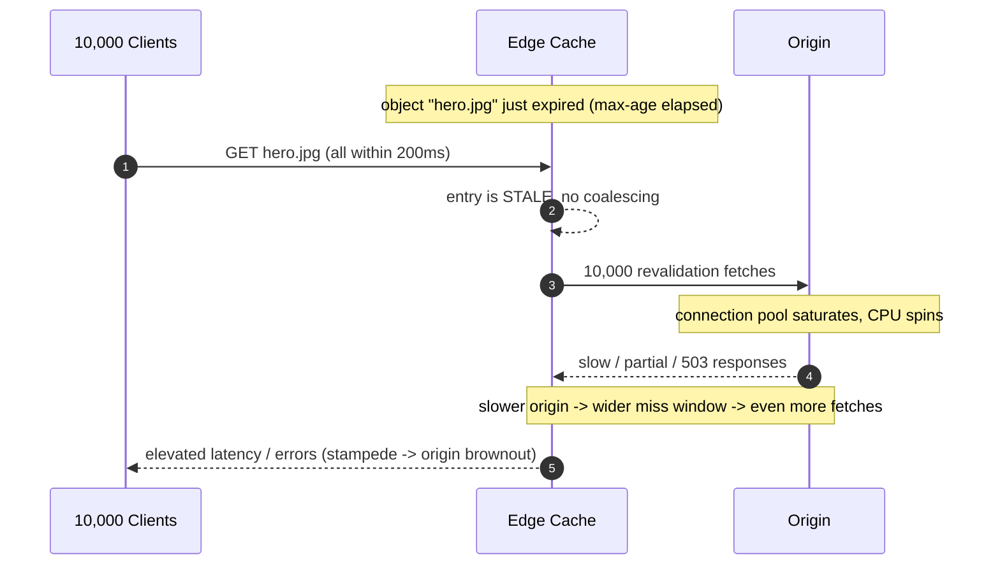
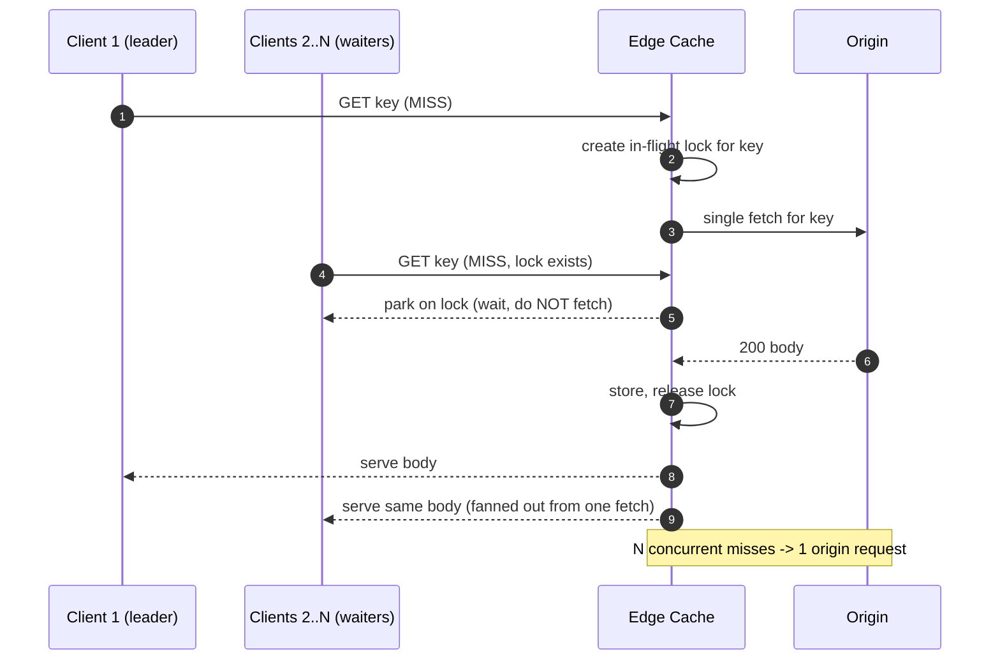
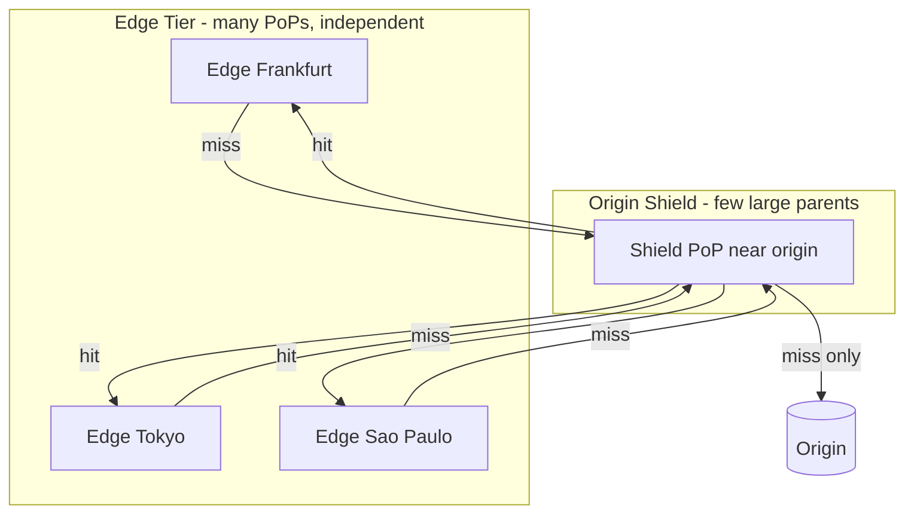
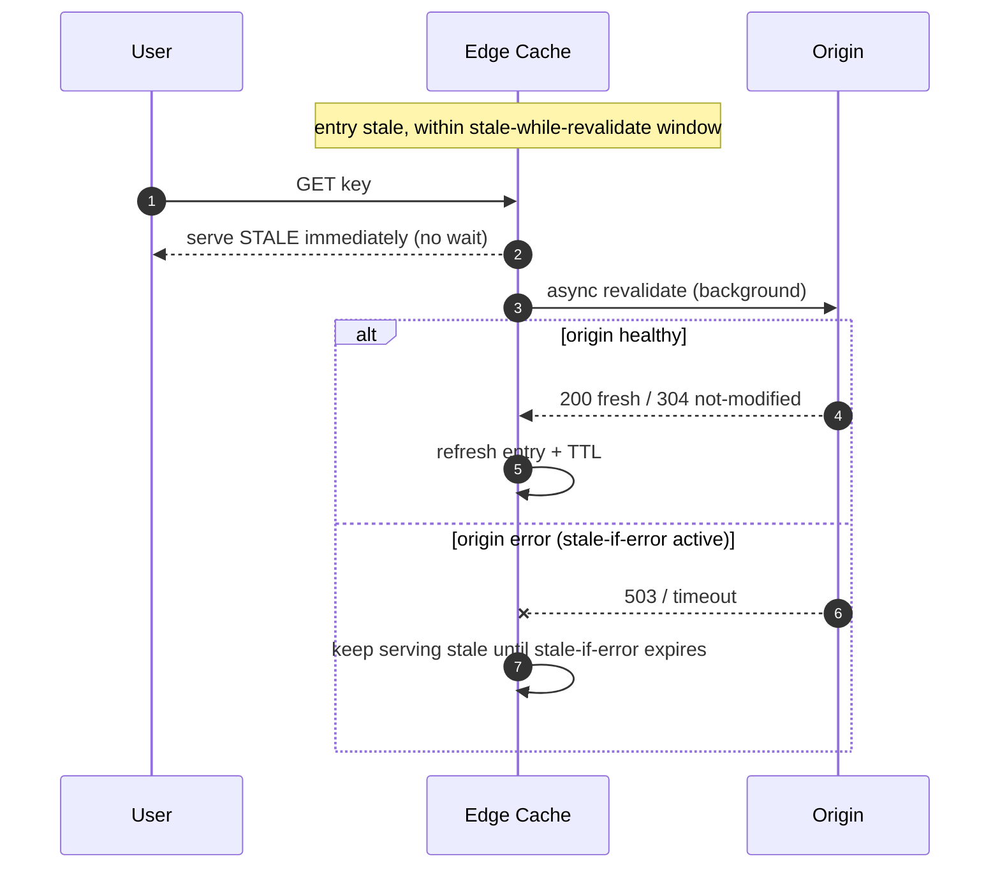

# Pull CDN — Senior

<!-- level-focus -->
At senior level, focus on this question:

> Which system invariant is affected by **Pull CDN** under failure, load, and change?

Use the smallest realistic scenario that exposes the decision and its failure behavior.
## 1. What a Pull CDN Actually Guarantees

A **pull** (origin-fetch) CDN caches objects *lazily*: the first request for an object
at a given edge is a **cache miss**, the edge fetches ("pulls") it from origin, stores
it under a **cache key**, and serves subsequent requests locally until the entry
expires or is evicted. Contrast with a **push** CDN, where you actively upload content
to edges before any user asks for it. Pull is the default model of every general-purpose
CDN (CloudFront, Fastly, Akamai, Cloudflare) because it needs zero pre-publication
choreography — you point a hostname at your origin and traffic self-populates the cache.

The senior mental shift: a pull CDN is not a content store, it is a **demand-driven
reverse-proxy cache with a global footprint**. Everything that follows — freshness,
stampedes, eviction, poisoning — is a consequence of *lazy population + finite storage +
independent edges*. Two facts frame every trade-off:

- **Each edge (often each cache server within a PoP) is an independent cache.** A miss is
  not per-CDN, it is per-edge (per-tier, per-shard). A file "in cache" globally can still
  miss in Frankfurt while it hits in Ashburn. Your effective hit ratio is the *aggregate*
  across all these independent caches, and cold caches are the norm right after a deploy,
  a cache purge, or a traffic shift to a new PoP.
- **Freshness is governed by HTTP caching semantics (RFC 9111).** `Cache-Control`
  `max-age`/`s-maxage`, `ETag`/`Last-Modified` for revalidation, and the cache key
  (typically method + host + path + a controlled set of headers/query params) are the
  levers. Get these wrong and you either serve stale garbage or destroy your hit ratio.

The core object lifecycle at one edge:

The two dangerous transitions are `Absent -> Fresh` (a **cold miss**) and
`Stale -> Fresh` (an **expiry miss**). Both send a request to origin, and both — under
concurrency — are where the **thundering herd** lives (§3).

---

## 2. Cache-Hit Ratio: the Core Lever

Everything a pull CDN buys you — latency, origin offload, cost, resilience — is a
monotonic function of **cache-hit ratio (CHR)**. It is the single number a senior owner
watches. Define it precisely, because "hit ratio" hides two different things:

- **Request Hit Ratio (RHR)** = hits / total requests. Governs origin **QPS** offload.
- **Byte Hit Ratio (BHR)** = bytes served from cache / total bytes. Governs origin
  **bandwidth** offload and egress cost. BHR ≠ RHR: a CDN can hit 98% of *requests*
  (mostly small hot objects) yet miss on the large-but-rare objects that dominate bytes,
  giving a much lower BHR. Watch both — they optimize different origin resources.

The offload leverage is nonlinear near the top. Origin-facing request rate is:

```text
origin_QPS = client_QPS x (1 - RHR)

At 1,000,000 client QPS:
  RHR = 0.90  ->  origin sees 100,000 QPS
  RHR = 0.95  ->  origin sees  50,000 QPS   (half the origin fleet)
  RHR = 0.99  ->  origin sees  10,000 QPS   (a tenth)
  RHR = 0.999 ->  origin sees   1,000 QPS

The jump from 99% to 99.9% cuts origin load 10x. The last percent is where the money is.
```

The senior levers that move CHR — in order of typical impact:

| Lever | Mechanism | Effect on CHR | Risk if botched |
|-------|-----------|---------------|-----------------|
| **TTL length** (`s-maxage`) | Longer freshness window -> fewer expiry misses | High | Serving stale content; hard-to-purge mistakes |
| **Cache-key hygiene** | Strip unkeyed query params / headers that don't change the response | High | Over-stripping collapses distinct responses; under-stripping fragments cache |
| **Tiered caching / origin shield** | Parent tier absorbs child misses (§5) | High (esp. long-tail) | Extra intra-CDN latency on true misses |
| **`Vary` discipline** | Minimize dimensions the response varies on | Medium–High | `Vary: User-Agent`/`Cookie` shatters cache into millions of variants |
| **Normalization** | Canonicalize URLs, sort query params, lowercase host | Medium | Two URLs -> two entries for one object |
| **SWR / SIE** | Serve stale while revalidating -> expiry never blocks a user | Medium (latency), high (resilience) | Extends staleness window |
| **Compression variants** | Coordinate `Accept-Encoding` with `Vary` | Low–Medium | br/gzip/identity triples the entry count |

A concrete, common self-inflicted wound: a marketing team appends `?utm_source=...`,
`?utm_campaign=...`, `?fbclid=...` to links. If those params are part of the cache key,
**every share creates a unique cache entry for the same asset**, driving RHR toward zero
and hammering origin. The fix is one line of cache-key policy: strip the tracking params
(they don't change the response body). This is the highest-ROI hour a senior can spend on
a CDN — audit what is actually in the cache key.

---

## 3. The Thundering Herd: Cache Stampede on Cold and Expired Objects

A **cache stampede** (a.k.a. thundering herd, dog-piling) happens when many concurrent
requests miss on the **same** object at the **same** edge at the **same** moment, and each
independently decides to fetch from origin. One expiry becomes a synchronized flood.

Two triggers:

1. **Cold miss on a hot object.** A popular asset was never cached at this edge (new PoP,
   post-purge, post-deploy). The first N requests arrive within the origin's fetch latency
   window; all N see "absent"; all N fetch. If the object gets 50k QPS and origin fetch
   takes 200 ms, that is up to **10,000 simultaneous origin fetches for one file**.
2. **Synchronized expiry.** A hot object was cached with `max-age=60`. Sixty seconds later
   it expires for *everyone* at once. Every in-flight request now sees "stale," and — absent
   coalescing — each revalidates against origin. This is worse than the cold case because
   it repeats *every TTL period*, forever, on your hottest content.

The damage is not merely load — it is a **positive feedback loop**. The origin, hit by the
herd, slows down. Slower origin -> longer fetch window -> *more* requests pile into the
same miss -> more concurrent fetches -> origin slower still. This is how a CDN, whose whole
job is to protect origin, can *amplify* a load spike into an origin outage.



Three orthogonal mitigations, best combined:

- **Request coalescing (§4)** — collapse concurrent misses for one key into one origin fetch.
- **Tiered caching / origin shield (§5)** — funnel all edge misses through a single parent so
  origin sees at most one fetch per object regardless of how many edges are cold.
- **Stale-while-revalidate (§6)** — never let *users* wait on the miss; serve the stale copy
  and revalidate in the background. Combined with jittered TTLs (add ±10% randomness to
  `max-age`) this also *de-synchronizes* expiry so herds never form in the first place.

---

## 4. Request Coalescing / Collapsed Forwarding

**Request coalescing** (Varnish calls it *request coalescing*; nginx `proxy_cache_lock`;
Traffic Server *read-while-writer*; the generic term is **collapsed forwarding**) is the
per-edge fix for a stampede: when multiple requests for the same cache key miss
concurrently, **exactly one** goes to origin (the "leader"); the rest **wait** on that
in-flight fetch and are served from its result. N concurrent misses become 1 origin fetch.



Design nuances a senior must get right:

- **Scope.** Coalescing is per cache node. In a PoP with M cache servers behind a hash-based
  director, the object may hash to one server (good — one fetch per PoP) or, under some
  configs, be requestable on several (M fetches). Consistent-hash sharding of the cache key
  *within* a PoP is what makes coalescing effective at the PoP level, not just per-thread.
- **Hangs propagate.** If the leader's origin fetch stalls, every waiter stalls with it.
  You **must** bound the wait (a coalescing/lock timeout) so a slow origin doesn't convert a
  1-request stampede into an N-request *latency* stampede. On timeout, either fail fast or let
  a second leader try — never release all waiters to hammer origin.
- **Uncacheable responses break it.** If the fetched response turns out to be `Cache-Control:
  no-store` or a 500, waiters can't be served from a stored copy. Policy must decide: serve the
  uncacheable response to all waiters (fan-out the single fetch's result) or re-dispatch. Most
  implementations fan out the single result — which is correct and keeps origin protected.
- **Coalescing is necessary but not sufficient.** It collapses the herd *within one node*. If
  200 edges are simultaneously cold (global purge, new release), you still get up to 200 origin
  fetches. That is precisely what the **origin shield** (§5) exists to collapse.

---

## 5. Tiered Caching and the Origin Shield

Independent edges are the enemy of origin offload for **unpopular** content and **globally
cold** moments. **Tiered caching** inserts one or more **parent** cache layers between the
edge tier and origin. A child edge miss goes to a **parent** (often a small set of large PoPs
close to origin, the **origin shield**); only a parent miss reaches origin.



Why this is the highest-leverage structural change for offload:

- **De-duplicates cold misses across the globe.** If an object is cold at 100 edges, all 100
  edge misses converge on the shield; the shield fetches origin **once** and serves the other
  99 from its own cache. Origin sees 1 fetch instead of 100. This is coalescing (§4) *across
  edges*, achieved by funneling through a shared parent.
- **Rescues the long tail.** A rarely-requested object may expire at an edge before its second
  request arrives (edge hit ratio ~0 for that object). At the shield, requests from *all* edges
  aggregate, so the object stays warm at the parent even while it's cold at every child. Tiered
  caching converts "cold at every edge, always" into "warm at the parent" — see §7.
- **Concentrates origin connections.** Origin now talks to a handful of shield PoPs, not
  thousands of edge servers. Connection pools, TLS sessions, and rate limits become tractable;
  you can pin origin firewall rules to shield IP ranges.

The cost is a **second network hop on true misses** (edge -> shield -> origin) and added
operational complexity. The trade-off:

| Topology | Origin fetches on a global cold event | True-miss latency | Long-tail hit ratio | Complexity |
|----------|---------------------------------------|-------------------|---------------------|------------|
| Flat (edge -> origin) | Up to (#cold edges) | Lowest (1 hop) | Poor (fragmented) | Lowest |
| Single-tier shield | ~1 per object | +1 hop on miss | Good | Medium |
| Multi-tier (regional parents + shield) | ~1 per object | +1–2 hops on miss | Best | Highest |

Rule of thumb: enable an origin shield whenever origin is expensive, fragile, or
bandwidth-constrained, or whenever you have many PoPs and a large long tail. Skip it only for
tiny footprints where the extra hop's latency outweighs the offload — rare for real workloads.

---

## 6. Stale-While-Revalidate and Stale-If-Error (RFC 5861)

`stale-while-revalidate` (SWR) and `stale-if-error` (SIE) are `Cache-Control` extensions
standardized in **RFC 5861** (the freshness/staleness model itself is **RFC 9111**). They
change *who waits* on a miss and *what happens when origin is down* — two of the most
important resilience levers in a pull CDN.

```text
Cache-Control: max-age=60, stale-while-revalidate=30, stale-if-error=86400
```

- **`stale-while-revalidate=30`** — for up to 30 s **after** the object goes stale, the cache
  MAY serve the **stale** copy **immediately** to the user and revalidate with origin **in the
  background**. The user never pays the revalidation latency; the herd never forms because the
  first request triggers one async revalidation and everyone else is served the cached copy.
  This is the direct antidote to the *synchronized-expiry* stampede of §3.
- **`stale-if-error=86400`** — if a revalidation (or fetch) fails with a network error or 5xx,
  the cache MAY serve the **stale** copy for up to 24 h instead of surfacing the error. This is
  your **origin-outage insurance** (§9): the CDN keeps serving last-known-good content while
  origin is down, turning a hard outage into invisible, bounded staleness.

The state machine SWR/SIE add to §1:



The senior trade-off is explicit and must be a conscious product decision: **SWR/SIE trade
freshness for latency and availability.** You are promising users a bounded window of stale
content in exchange for never blocking on origin and never propagating origin failures. Choose
the windows per content class — long SWR/SIE for a product catalog or CSS bundle, zero for a
bank balance or inventory count. Pair SWR with **TTL jitter** so a batch of objects cached
together don't all expire in the same second.

---

## 7. Long-Tail Content and Eviction Under Finite Edge Storage (LRU/LFU)

Edge storage is **finite** (SSD/RAM per PoP), but the content catalog is often effectively
unbounded and its popularity is **long-tailed** (Zipfian): a few objects are extremely hot,
and a very long tail is each requested rarely. This is the defining tension of edge caching.

Consequences a senior must design around:

- **The tail can't all fit, and shouldn't.** With Zipf-distributed demand, a small cache
  captures most *requests* (the head) even though it holds a tiny fraction of *objects*. This
  is exactly why RHR can be 95%+ with a cache far smaller than the catalog. But BHR for the
  tail stays low, and tail objects churn.
- **One-hit-wonders pollute the cache.** Tail objects requested exactly once still consume a
  slot on their miss, evicting something more valuable. Naive LRU is vulnerable: a burst of
  cold, never-to-be-requested-again objects (e.g., a crawler scanning every URL) can **flush
  the hot set out** ("cache pollution" / scan resistance failure).

Eviction policy trade-offs:

| Policy | Keeps | Strengths | Weaknesses |
|--------|-------|-----------|------------|
| **LRU** | Most-recently-used | Simple, O(1), great temporal locality | Scan-vulnerable; one-hit-wonders evict the hot set |
| **LFU** | Most-frequently-used | Protects the hot head; scan-resistant | Cold-start bias (new hot objects can't build count); needs aging or it ossifies |
| **LFU with aging / TinyLFU** | Frequency w/ decay + admission filter | Scan-resistant *and* adapts to shifting popularity; admission control blocks one-hit-wonders | More state (frequency sketch, e.g., Count-Min) |
| **SLRU / ARC / S3-FIFO** | Segmented / adaptive | Balances recency and frequency; strong hit ratios in practice | More complex; tuning sensitivity |
| **Size-aware (GDSF)** | Value/size ratio | Optimizes **byte** hit ratio and origin bandwidth | Complex cost function; can starve large hot objects |

Modern edge caches lean toward **admission control + frequency-aware** policies
(TinyLFU-family, S3-FIFO) precisely to survive the long tail: an **admission filter** decides
whether a newly-fetched object is even *worth* caching (has it been seen before recently?),
which stops one-hit-wonders from evicting the hot set. Combine with **tiered caching (§5)**:
let the *tail* live at the parent/shield (which aggregates enough demand to keep it warm) while
the *edge* holds only the head. This is the canonical division of labor — **edge caches the
hot, parent caches the warm, origin owns the cold** — and it is what makes a pull CDN economical
against an unbounded, long-tailed catalog.

---

## 8. Origin-Offload Economics

The business case for a pull CDN is **origin offload**: every hit is a request your origin
fleet and origin bandwidth *don't* serve. Senior ownership means being able to put numbers on
it and know where the break-even sits.

```text
Worked example — read-heavy media API, static assets:
  Client traffic:      500,000 req/s peak, avg object 200 KB
  Client bandwidth:    500,000 x 200 KB = 100 GB/s = 800 Gbps

  Without CDN (RHR = 0):
    Origin must serve 500,000 req/s and 800 Gbps egress.
    -> a large origin fleet + very expensive cloud egress at retail rates.

  With CDN at RHR = 0.95, BHR = 0.92:
    Origin QPS      = 500,000 x (1 - 0.95) = 25,000 req/s   (20x offload)
    Origin egress   = 800 Gbps x (1 - 0.92) = 64 Gbps       (12.5x offload)
    CDN egress cost is typically far below cloud origin-egress list price,
    AND you shed 95% of origin compute.

  Push RHR to 0.99 (via shield + longer TTL + key hygiene):
    Origin QPS      = 5,000 req/s    (a further 5x cut on the origin fleet)
```

The economic levers map one-to-one onto the technical ones:

- **Higher RHR shrinks the origin fleet** (compute, DB reads behind it, connection pools).
- **Higher BHR shrinks origin egress**, usually the largest line item; CDN egress is cheaper
  per GB than cloud origin egress, and cache hits avoid origin egress entirely.
- **Tiered caching (§5) both raises offload and concentrates origin traffic**, so you can
  right-size origin for the *shield miss rate*, not the client rate.
- **The tail is where naive designs bleed money**: low-hit-ratio tail objects still cost origin
  fetches. Admission control (§7) and shielding (§5) are the cost-control mechanisms.

The counter-intuitive senior insight: **the last percent of hit ratio has the largest dollar
impact**, because origin load scales with `(1 - RHR)`. Going 95% -> 99% doesn't feel like much,
but it cuts origin-facing traffic by 5x — often the difference between one origin region and
three. Treat CHR as a first-class, dashboarded, alerted SLI, not a vanity metric.

---

## 9. Failure Modes: Origin Outage and Cache Poisoning

Two failure modes define pull-CDN operational maturity.

### 9.1 Origin Outage — Serve-Stale as the Safety Net

When origin goes down, a pull CDN's behavior on **misses and expirations** determines whether
users see an outage. Without mitigation, every stale object triggers a failing revalidation and
the CDN starts returning 5xx — the CDN *transmits* the origin outage. With **`stale-if-error`
(§6)** and a generous SWR window, the CDN keeps serving last-known-good content, and the outage
is invisible for cached objects (only genuinely-uncached objects fail). Design points:

- Set `stale-if-error` deliberately per content class; a long window (hours to a day) for
  slowly-changing assets is cheap insurance.
- **Negative-cache carefully.** Caching a 5xx or 404 with a long TTL during an origin blip
  *pins* the failure into the cache and serves it after origin recovers. Cache error responses
  only with **short** TTLs (seconds), or not at all.
- **Coalescing (§4) protects recovery.** When origin comes back, the herd of pent-up misses
  must not immediately re-stampede it. Coalescing + jittered TTLs smooth the recovery.

### 9.2 Cache Poisoning via Unkeyed Inputs

**Web cache poisoning** is the highest-severity CDN vulnerability class. It exploits a mismatch:
the origin's response depends on some input (a header, a query param) that the CDN does **not**
include in the **cache key** — an **unkeyed input**. An attacker crafts a request whose unkeyed
input makes origin emit a malicious response, which the CDN then **stores under the normal key**
and serves to **every subsequent legitimate user**.

```text
Poisoning via unkeyed header:
  Cache key       = host + path                      (X-Forwarded-Host NOT in key)
  Origin behavior = reflects X-Forwarded-Host into an absolute URL in the body
                    (e.g., a <script src="//..."> or a redirect Location)

  Attacker:  GET /home   X-Forwarded-Host: evil.com
             -> origin builds page with <script src="//evil.com/x.js">
             -> CDN caches it under key (host + /home)

  Victims:   GET /home   (normal)
             -> served the POISONED page with attacker-controlled script  == stored XSS at CDN scale
```

Defenses (defense-in-depth, all owned by the CDN/origin senior):

- **Minimal, explicit cache keys.** Include *only* inputs that legitimately change the response;
  strip everything else (tracking params, hop-by-hop headers). This is the same hygiene that
  raises hit ratio (§2) — good keying is both a *performance* and a *security* control.
- **Any input that affects the body MUST be either in the key or in `Vary`.** An unkeyed input
  that changes the response is a poisoning vector by definition.
- **Don't reflect untrusted headers** (`X-Forwarded-Host`, `X-Forwarded-Scheme`, `X-Original-URL`,
  custom debug headers) into cacheable responses at origin.
- **Guard `Vary` against explosion** — `Vary: User-Agent`/`Cookie` fragments the cache
  catastrophically (§2). Prefer strict keys over broad `Vary`.
- **Refuse to cache responses that set cookies or vary on auth**; `Cache-Control: private`/
  `no-store` for anything user-specific. Never let a personalized response be shared-cached.

The unifying lesson: **the cache key is a security boundary.** Every unkeyed input that reaches
origin and influences the body is a latent poisoning bug. Auditing the cache key (§2) pays off
three times — hit ratio, cost, and security.

---

## 10. When Pull Is the Right Model

Pull vs push is a real design decision; senior judgment is knowing which the workload wants.

| Dimension | Pull (origin-fetch) | Push (pre-publish) |
|-----------|---------------------|--------------------|
| Population | Lazy, on first request | Eager, uploaded ahead of demand |
| First request per edge | MISS (origin fetch latency) | HIT (already placed) |
| Operational burden | Minimal — point DNS at origin | Must actively distribute + track content |
| Storage efficiency | Only caches what's demanded | Stores everything pushed, demanded or not |
| Freshness control | TTL + revalidation (RFC 9111) | Explicit publish/invalidate lifecycle |
| Best for | Large, dynamic, or unpredictable catalogs; long tail; web/API assets | Small, known, latency-critical sets; large media pre-staged for a launch/event |
| Cold-start risk | Yes — first-request misses, stampedes | No — content pre-warmed |

**Pull is the right default when:**

- The catalog is **large or unbounded** and you can't (or won't) pre-publish all of it —
  lazy population means you only pay to cache what's actually requested.
- Content is **generated or changes** and freshness is best expressed via TTL + revalidation
  rather than a manual publish step.
- You want **operational simplicity** — no publish pipeline, no content-tracking system; the
  cache self-populates from real demand.
- Demand is **unpredictable**; pull naturally caches whatever gets popular without you
  forecasting it.

**Prefer push (or pre-warming) when:**

- The content set is **small, known, and latency-critical**, and even a single cold-miss on the
  first request is unacceptable (e.g., a live-event launch where the first viewer must not wait
  on origin).
- You must guarantee content is **placed before an announced spike** — a pull CDN's cold caches
  would stampede origin at T-zero unless you **pre-warm** (a hybrid: pull CDN + a warm-up pass
  that pulls hot objects into edges before the event).

In practice most real systems are **pull with targeted pre-warming and an origin shield** — pull
for the operational simplicity and long-tail economics, pre-warming for the handful of assets
where a cold miss is intolerable, and the shield (§5) to keep the whole thing from crushing
origin when caches are cold.

---

## 11. Senior Checklist

- [ ] **Cache-hit ratio (RHR *and* BHR) is a dashboarded, alerted SLI** — not a vanity number;
      you know your origin-QPS and egress offload at current CHR and at the next percentage point.
- [ ] **Cache key audited**: only response-affecting inputs are keyed; tracking params stripped;
      no untrusted header reaches origin unkeyed (poisoning + hit-ratio in one review).
- [ ] **Stampede mitigations layered**: request coalescing on every cache node, an **origin
      shield** to collapse cross-edge cold misses, and **`stale-while-revalidate`** so users never
      block on expiry. Coalescing wait is bounded so a slow origin can't create a latency herd.
- [ ] **TTLs jittered** (±10%) so hot objects don't expire in the same second and re-form a herd.
- [ ] **Origin-outage insurance in place**: `stale-if-error` windows set per content class; error
      responses negative-cached only with short TTLs; recovery smoothed by coalescing + jitter.
- [ ] **Eviction fits the long tail**: frequency-aware / admission-controlled policy (TinyLFU /
      S3-FIFO family) at the edge; the warm tail pushed to the shield; edge holds the hot head.
- [ ] **Pull-vs-push decided consciously** per content class, with **pre-warming** for the assets
      where a first-request cold miss is unacceptable.
- [ ] **Freshness model documented** against RFC 9111 (`max-age`/`s-maxage`, `ETag` revalidation)
      and RFC 5861 (SWR/SIE) so on-call knows exactly why any object is stale, fresh, or served-stale.

---

*Next step:* [Pull CDN — Professional](professional.md)

---

## Apply it

1. State the system invariant that **Pull CDN** must protect.
2. Mark ownership, state, and failure propagation at each boundary.
3. Compare two designs under load, dependency failure, and future change.
4. Define recovery and compatibility behavior before implementation.
5. Test the riskiest assumption with a focused experiment.

## Verify your work

- The experiment supports the design with evidence, not preference.
- Failure injection shows the blast radius and recovery path.
- Compatibility checks cover old and new callers or data.
- Operational signals reveal invariant violations and recovery progress.

## Review questions

- Which invariant must remain true when Pull CDN fails?
- Where should recovery responsibility live, and why?
- Which assumption deserves an experiment before implementation?
- How can the design evolve without changing every consumer at once?
