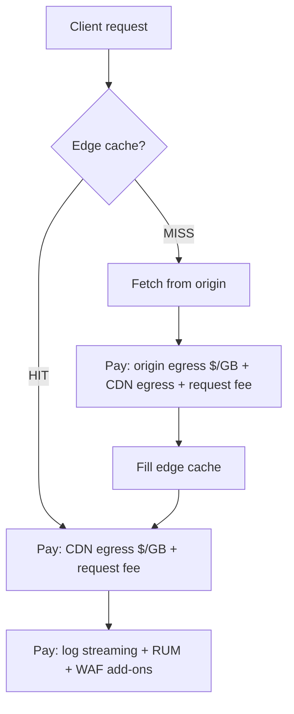
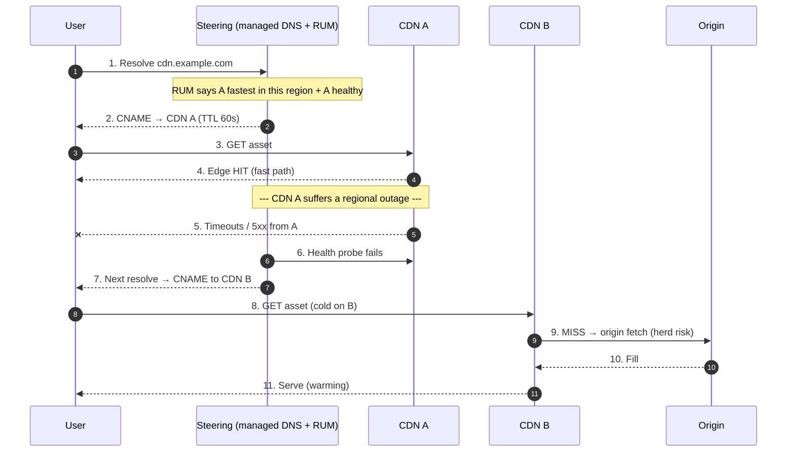

# Pull CDN — Staff

At the staff level, a pull CDN stops being a caching mechanism and becomes a *procurement and governance* problem. You are no longer asking "how does origin-pull work?" — the professional tier answered that. You are asking: is a CDN even the right dependency to take on for this traffic? If yes, one vendor or several? Who is allowed to change a `Cache-Control` header, and what breaks across a dozen teams when they do? What does the CDN actually cost once egress, request fees, and the human cost of operating cache policy are all on the same page? And what is the single lever — cache-hit ratio — that moves that cost the most? This page treats the CDN as a multi-year, cross-org, cost-and-contract decision, not a config toggle.

## Table of Contents

1. [Pull vs push as an organizational decision, not a protocol one](#1-pull-vs-push-as-an-organizational-decision-not-a-protocol-one)
2. [The CDN cost model: what you actually pay for](#2-the-cdn-cost-model-what-you-actually-pay-for)
3. [Cache-hit ratio is the cost lever](#3-cache-hit-ratio-is-the-cost-lever)
4. [Who owns cache-control policy across teams](#4-who-owns-cache-control-policy-across-teams)
5. [Multi-CDN: the three reasons and the real cost](#5-multi-cdn-the-three-reasons-and-the-real-cost)
6. [Multi-CDN steering and failover architecture](#6-multi-cdn-steering-and-failover-architecture)
7. [Build vs buy vs multi-buy](#7-build-vs-buy-vs-multi-buy)
8. [Contracts, SLAs, and what a CDN SLA does not cover](#8-contracts-slas-and-what-a-cdn-sla-does-not-cover)
9. [Observability: RUM, hit-ratio SLOs, and the log-cost trap](#9-observability-rum-hit-ratio-slos-and-the-log-cost-trap)
10. [When NOT to put a CDN in front](#10-when-not-to-put-a-cdn-in-front)
11. [Second-order consequences and the decision record](#11-second-order-consequences-and-the-decision-record)
12. [Staff signals and anti-patterns](#12-staff-signals-and-anti-patterns)

---

## 1. Pull vs push as an organizational decision, not a protocol one

Mechanically, pull (origin-pull) and push (pre-provisioned) differ in one line: pull fetches from origin on the first miss and caches lazily; push uploads assets to the edge before any request arrives. The professional tier covers that. The staff question is *who has to do work, and how often they get paged* under each model.

Pull is the default for a reason that is organizational, not technical: **it requires no coordination.** A team deploys a new asset behind the CDN, and the CDN populates itself on demand. Nobody has to run a distribution job, nobody has to know the edge topology, and there is no separate "did the push complete?" pipeline to own and alert on. The cost of pull's laziness — a cold cache on the first request per region, and a thundering-herd risk on origin during a purge or a cold start — is absorbed by cache-lock/coalescing features the vendor already operates. In a large org, "no coordination required" is worth more than the latency of a few cold misses.

Push earns its complexity only when the assets are large, few, predictable, and latency-critical from the very first byte: a game-day binary that 50 million clients will pull in the same 10 minutes, a video VOD catalog you can pre-warm, a firmware rollout. There, pre-positioning avoids a synchronized origin stampede and guarantees the first user in every region gets an edge hit. But push means someone owns a distribution pipeline, its failure modes, its partial-completion states, and the reconciliation between "what origin thinks is deployed" and "what the edge is actually serving." That is a standing team cost.

| Axis | Pull (origin-pull) | Push (pre-provisioned) |
|---|---|---|
| Coordination cost | None — self-populating | Standing pipeline + ownership |
| First request per region | Cold miss (one slow request) | Warm (pre-positioned) |
| Origin stampede risk | Yes, on cold/purge; mitigated by coalescing | Low — traffic hits warm edge |
| Wasted storage | None — only requested assets cached | Pays to store assets nobody requests |
| Best fit | Long-tail, unpredictable, many small assets | Few large assets, predictable synchronized demand |
| Who gets paged | Origin team on stampede | Pipeline team on push failure |

The staff read: **default to pull; adopt push only for a named, quantified stampede or first-byte-latency problem, and only if a team will own the pipeline.** Pull-with-pre-warm (a script that requests hot URLs from each PoP before a launch) captures most of push's benefit without standing up a distribution system — reach for it before real push.

## 2. The CDN cost model: what you actually pay for

Engineers under-price CDNs because they think of "the CDN bill" as a single number. It is three meters running at once, plus a fourth that hides in the observability budget:

- **Egress bandwidth ($/GB served to clients).** The dominant line item for media-heavy traffic. Priced per region (Asia-Pacific and South America are typically 2–4× North America/Europe) and per commit tier — the more you commit, the lower the marginal $/GB. A byte served from edge cache still costs egress; the CDN did not make bandwidth free, it made it *closer and cheaper than origin egress*.
- **Requests ($/10k or $/million HTTP requests).** Dominant for APIs and sites with many tiny assets. A page with 200 small resources costs 200 request-events even if the bytes are trivial. This is why bundling and HTTP/2 multiplexing are cost decisions, not just latency ones.
- **Origin egress / mid-tier fetch cost.** Every cache miss pulls from origin, and *that* transfer costs your cloud provider's egress ($/GB from S3/GCS/your DC to the CDN). A low hit ratio means you pay CDN egress AND origin egress for the same bytes.
- **The hidden fourth meter — logs and add-ons.** Real-user monitoring, per-request logs streamed to your SIEM, WAF, image optimization, edge compute, and TLS at scale are all metered separately and can quietly rival the bandwidth bill. Log egress at high QPS is a classic surprise line item.



The load-bearing insight: **a miss is not neutral — it is a double charge.** You pay origin egress to fill the cache AND CDN egress to serve the client. So the cost curve is not linear in traffic; it is steeply sensitive to hit ratio. That is what makes hit ratio the lever.

## 3. Cache-hit ratio is the cost lever

Two numbers matter and are routinely confused. **Request hit ratio** = cached requests / total requests. **Byte hit ratio** = bytes served from cache / total bytes served. Byte hit ratio is the one that maps to the egress bill, because a single 4 GB video miss costs more origin egress than ten thousand cached 1 KB JSON hits. Optimize the wrong one and you can raise request hit ratio while the money keeps leaking through a handful of large cold objects.

Model the origin-egress cost as a function of byte hit ratio `h`:

```text
origin_egress_bytes = total_bytes_served × (1 − h)
origin_egress_cost  = origin_egress_bytes × origin_$/GB

Worked example — 5 PB/month served, origin egress $0.05/GB (5,000,000 GB total):
  h = 0.85  →  origin egress = 750,000 GB  → $37,500/mo
  h = 0.95  →  origin egress = 250,000 GB  → $12,500/mo
  h = 0.98  →  origin egress = 100,000 GB  → $ 5,000/mo

Ten points of byte hit ratio (0.85 → 0.95) removed 500,000 GB of origin egress
and $25,000/month — before counting the origin compute the misses would have cost.
```

The levers that move byte hit ratio, in rough order of leverage:

- **TTL discipline.** The single most common cause of a low hit ratio is short or missing TTLs. An asset with `max-age=60` is re-fetched constantly; the same asset with `max-age=31536000` plus a content hash in the filename (`app.a3f9c1.js`) is effectively cached forever and invalidated by *renaming*, not purging. Immutable-versioned URLs are the cleanest cache strategy that exists.
- **Cache key hygiene.** Every dimension in the cache key fragments the cache. Varying on `Accept-Encoding` is necessary; varying on a random analytics query string, a session cookie, or `User-Agent` shatters one hot object into thousands of unique-but-identical cold ones. Normalizing query strings and stripping tracking params at the edge can lift hit ratio by tens of points with no origin change.
- **Cacheability of the long tail.** A tiered/mid-tier cache (regional shield PoP between edge and origin) consolidates misses so the origin sees one fetch per object instead of one per edge PoP. This is a config choice with a direct hit-ratio and origin-load payoff.
- **Segmenting cacheable from uncacheable.** Serve personalized/dynamic responses on a path the CDN is told to bypass, so they don't pollute cache metrics or the key space, and keep the static path aggressively cacheable.

Staff framing: **hit ratio is a shared, funded engineering target, not an incidental metric.** A one-point drop in byte hit ratio across a large property is a five-figure monthly cost event and an origin-capacity event simultaneously. Which is exactly why the next question — who is allowed to change the headers that set it — is a governance question.

## 4. Who owns cache-control policy across teams

`Cache-Control`, `Surrogate-Control`, `Vary`, and cache-key config are the highest-leverage, lowest-visibility settings in the stack. A single product team shipping `Cache-Control: no-store` on a hot endpoint "to be safe" can collapse the byte hit ratio for a whole property and page the origin team at 3 a.m. — and nobody connects the deploy to the incident because the header change looked like an app-level detail. This is a classic tragedy-of-the-commons: each team optimizes for its own correctness/freshness fears, and the shared cache asset degrades.

The failure mode is *diffuse ownership*. If every team can set its own cache headers with no guardrail, three things happen: hit ratio drifts down over quarters as freshness paranoia accumulates; purge storms become common as teams over-purge instead of using versioned URLs; and no single person can answer "why did our CDN bill jump 30% this month?" The answer is usually forty small header changes, none individually alarming.

The staff move is to make cache policy a **paved road with a small owning team and explicit escape hatches**:

- A platform/edge team owns the *defaults and the guardrails*: default TTLs by content type, the canonical cache-key normalization, the allowed `Vary` dimensions, and a policy-as-code check in CI that flags `no-store`/`no-cache`/`max-age=0` on paths tagged as cacheable.
- Product teams own *freshness decisions within the guardrail* — they can shorten a TTL for a genuinely volatile resource, but the change is visible, reviewed, and attributed.
- Purges are a *governed API*, not a free-for-all. Prefer versioned/immutable URLs so "invalidation" is a deploy, not a purge; when purge is unavoidable, it is rate-limited and logged so a bad purge is diagnosable.
- Hit ratio and CDN cost are on a dashboard with an *owner*, reviewed like any other SLO, so drift is caught in a week, not a quarter.

The principle: **the cache is a shared resource; shared resources need a steward and a guardrail, or they erode.** You are not centralizing control to be bureaucratic — you are preventing a commons collapse whose cost lands on a team that didn't cause it.

## 5. Multi-CDN: the three reasons and the real cost

Multi-CDN — running two or more providers behind a steering layer — is one of the most over-adopted patterns in the field. There are exactly three legitimate reasons, and "resume-driven resilience" is not one of them:

1. **Availability / vendor diversity.** CDNs have global outages — a bad config push, a BGP incident, a DNS failure at the provider. A single-CDN property is exactly as available as its one vendor. If your uptime target is genuinely coupled to a CDN outage that has happened to that vendor before, a second provider you can steer to is real insurance.
2. **Performance by geography.** No CDN is the fastest everywhere. Provider A may have the best PoP density and peering in North America while Provider B wins in India or Brazil. Real-user-measurement-driven steering can route each region to its fastest provider — a measurable latency win for a global audience.
3. **Cost arbitrage and commit leverage.** Two providers competing for your traffic is negotiating power. You can steer commit-covered volume to the cheaper provider and use the credible threat of shifting traffic to hold pricing down at renewal. This only works if switching is *technically real*, which multi-CDN makes it.

And the cost — which is why it is over-adopted, because the cost is invisible until you own it:

- **Steering infrastructure.** DNS-based or RUM-based traffic steering is a system you now operate, with its own failure modes. Your steering layer can now be the outage.
- **Configuration drift across providers.** Every cache rule, header behavior, WAF rule, TLS setting, and redirect must be replicated and kept in sync across providers that have *different config models and different default behaviors*. A rule that works on A silently behaves differently on B. This is the dominant hidden cost.
- **Halved hit ratios.** Splitting traffic across two CDNs means each provider's cache sees roughly half the traffic, so each warms more slowly and evicts sooner — **your aggregate hit ratio drops, your origin load rises, and your egress bill goes up** on both providers. Multi-CDN adopted for cost can *raise* cost if you don't account for cache fragmentation.
- **Doubled operational surface.** Two dashboards, two support relationships, two sets of logs to normalize, two on-call runbooks, two invoices to reconcile.

| Dimension | Single CDN | Multi-CDN |
|---|---|---|
| Availability ceiling | One vendor's uptime | Survives one vendor's outage |
| Geo performance | Best-effort, one footprint | Route each region to fastest |
| Negotiating leverage | Weak (lock-in) | Strong (credible switching) |
| Aggregate hit ratio | Higher (undivided cache) | Lower (cache fragmented) |
| Config surface | One model | N models kept in sync (drift risk) |
| Operational load | One set of tooling | N sets + steering layer |
| When it wins | Most properties | Uptime-critical, global, or high-spend |

Staff read: **multi-CDN is insurance and leverage, not a default.** Adopt it when a quantified availability requirement, a measured geo-performance gap, or a spend large enough that arbitrage pays for the operational overhead justifies it. Below roughly the spend where a single point of hit-ratio is worth a headcount's attention, single-CDN with a *tested, documented failover procedure to a warm-standby second provider* gives most of the availability benefit at a fraction of the standing cost.

## 6. Multi-CDN steering and failover architecture

If you do run multi-CDN, the steering layer is the decision. The two common approaches are DNS-based steering (a managed DNS provider returns the CNAME of the chosen CDN based on geo/health/weight) and client-side/RUM steering (the client measures each CDN and picks, or a control plane fed by RUM adjusts DNS weights). DNS steering is simpler and provider-agnostic but bounded by DNS TTL — failover is as slow as the TTL plus resolver caching, so a 60s TTL means up to ~a minute of traffic still hitting a dead CDN.



Two staff-level design consequences fall out of this diagram. First, **failover is not free at the origin.** When you shed CDN A onto CDN B, B's cache is cold for A's hot objects, so a burst of misses hits origin exactly when you are already in an incident — origin must be sized (or shield-cached, or request-coalesced) to survive a failover stampede, or the failover just moves the outage. Second, **failover speed is bounded by your slowest cache layer**, usually DNS TTL; if seconds matter (video, trading), you need client-side steering with fast local health signals rather than waiting on DNS. Keep the standby provider *warm* — send it a few percent of live traffic continuously — so failover lands on a partially-populated cache, not an empty one. A cold standby is a slower outage, not a fix.

## 7. Build vs buy vs multi-buy

Almost no one should build a CDN. The point of asking is to know *why* buying is right, so you can defend it and know the narrow cases where it flips.

| Option | When it wins | Hidden cost |
|---|---|---|
| **Buy (single commercial CDN)** | Almost every case — reach, PoPs, DDoS scrubbing, and peering are commodity-priced and impossible to replicate | Vendor lock-in, egress markup, opaque routing you can't tune |
| **Multi-buy (multi-CDN)** | Uptime-critical, globally distributed, or spend large enough that arbitrage/insurance pays for the steering + drift overhead | Config drift, fragmented hit ratio, steering layer as new SPOF |
| **Build (own edge/PoPs)** | Delivery *is* the core product at a scale where vendor margin exceeds the cost of an edge org (hyperscalers, the largest video/streaming players) | Multi-hundred-person org: peering deals, hardware in dozens of metros, 24/7 NOC, years of lead time |

The build-vs-buy math is dominated by a single fact: **a CDN's moat is physical presence and peering agreements, not software.** You can write a cache in a weekend; you cannot acquire racks in 100 metros, negotiate settlement-free peering with every major ISP, and staff a global NOC in under years and hundreds of people. Building only pays when your egress volume is so large that the *vendor's margin on your bandwidth* exceeds the fully-loaded cost of that org — a threshold reached by a handful of companies on Earth, all of whom deliver content *as their product*. For everyone else, "build" is a decade-long distraction from the actual business. The real decision for a staff engineer is almost always **single-buy vs multi-buy**, framed by §5.

## 8. Contracts, SLAs, and what a CDN SLA does not cover

A staff engineer reads the SLA before the datasheet, because the datasheet is marketing and the SLA is the contract. The gaps matter more than the numbers:

- **The uptime SLA usually covers availability, not performance.** "99.9% availability" typically means the edge answered *something*; it says nothing about cache hit ratio, tail latency, or whether your origin got hammered. A CDN can be "up" while serving your traffic slowly or forcing everything to origin. Your SLO (§9) must measure what you actually care about, which the vendor SLA does not.
- **Remedies are service credits, not damages.** When a CDN outage costs you a launch or a day of revenue, the contractual remedy is a credit worth a small fraction of your monthly bill — nowhere near your loss. The SLA transfers reputational risk to you. This asymmetry is *the* financial argument for multi-CDN on truly revenue-critical paths: you cannot buy adequate protection through the SLA, so you buy it through architecture.
- **Commit contracts create switching friction.** Volume commits get you a lower $/GB but lock a floor of spend; if you shift traffic to a second provider mid-term you may still owe the first. Negotiate commits with the multi-CDN endgame in mind, or the arbitrage you built the architecture for is contractually blocked.
- **Egress pricing is negotiable and tiered; list price is a starting bid.** At scale, published $/GB is a ceiling. Regional pricing, overage rates, and log/add-on fees are all levers. A second provider on the table is your leverage.

The judgment: **the SLA protects the vendor, not you.** Treat it as a floor of accountability, size your own SLOs and observability independently, and use architecture (failover, multi-CDN) — not the contract — to protect the revenue the SLA won't.

## 9. Observability: RUM, hit-ratio SLOs, and the log-cost trap

You cannot manage a CDN from the vendor dashboard alone, because the vendor measures *its* edge, not *your users*. Staff-level CDN observability rests on three legs:

- **Real-user monitoring (RUM).** Synthetic checks from clean datacenters lie — they never see the corporate proxy, the mobile carrier NAT, or the region where the CDN's peering is poor. RUM (a beacon from real client sessions reporting per-request timing, cache status, and errors) is the only source of truth for *delivered* performance and is the data that drives geo-steering in multi-CDN. Fund it as core telemetry, not a nice-to-have.
- **Hit-ratio SLOs.** Byte hit ratio (§3) is an SLO with an owner and an error budget, precisely because it is the cost and origin-load lever. A byte-hit-ratio SLO of, say, 95% with alerting on sustained drops turns a slow, invisible cost leak into a paged, diagnosable event — you catch the forty-header-changes drift of §4 in a week.
- **Per-request logs — and their cost.** Full CDN logs streamed to your analytics/SIEM are invaluable for debugging and security, and they are a *major, easily-overlooked cost line* (the hidden fourth meter of §2). At high QPS, log egress and ingestion can rival the bandwidth bill. Sample aggressively for analytics, keep full logs only where security or compliance requires, and put the log-pipeline cost on the same dashboard as the bandwidth cost so it can't hide.

The staff synthesis: **measure what your users get, not what the vendor claims; make hit ratio an owned SLO; and treat observability itself as a metered cost.** The observability budget is not separate from the CDN budget — at scale it is part of it.

## 10. When NOT to put a CDN in front

The most senior move is knowing when the CDN is the wrong answer. A CDN in front of the wrong traffic adds cost, latency, and a failure mode with zero benefit:

- **Highly dynamic or personalized responses.** If nearly every response is unique per user (a logged-in dashboard, a personalized feed, a cart), the cache hit ratio is near zero. You pay the request fee, add a network hop, add the CDN as a dependency that can fail — and cache nothing. The right pattern is to CDN the *static shell and assets* and let the personalized API path bypass the cache, not to wrap the whole thing.
- **Low or purely regional traffic.** A CDN's value is geographic distribution and offload. An internal tool with a hundred users in one city, or a service whose entire audience sits next to the origin, gets little offload and no meaningful latency win — the origin was already close. The CDN is added operational surface for negligible benefit.
- **Write-heavy / API-mutating paths.** `POST`/`PUT`/`DELETE` and anything with side effects are uncacheable by definition. Routing them through a CDN buys nothing but a hop (though a CDN's DDoS/WAF/TLS-termination value can still justify fronting these paths — for protection, not caching; be explicit about which benefit you're buying).
- **Strong-consistency, must-be-fresh reads.** If a stale read is a correctness bug (a bank balance, an inventory count at checkout), the safe TTL is near zero, which means near-zero hit ratio — you've added a hop and a failure mode to avoid caching. Serve these from origin with proper caching *inside* your system.

The rule: **a CDN pays off for cacheable, geographically-spread, read-heavy static or semi-static content.** The further your traffic is from that profile, the more a CDN is cost and risk masquerading as best practice. Junior engineers put a CDN in front of everything because it's "the scalable thing to do"; staff engineers put it only where the hit ratio will actually be high.

## 11. Second-order consequences and the decision record

The downstream effects that surface 6–12 months after a CDN decision, and that you should have written down before adopting:

- **Cache policy drift** (§4) silently erodes hit ratio and inflates cost over quarters if there's no steward. *Watch:* byte hit ratio trend on a dashboard with an owner.
- **Multi-CDN config drift** (§5) turns a resilience investment into a source of subtle, provider-specific bugs. *Watch:* config parity checks between providers in CI.
- **Vendor lock-in via proprietary edge features.** Edge compute, custom WAF rules, and vendor-specific config bind you to one provider and quietly kill the switching leverage multi-CDN was supposed to buy. *Watch:* how much of your edge logic is portable vs vendor-locked.
- **Failover that was never tested** (§6) is a latent outage, not a fallback — the standby is cold, the runbook is stale, and the origin isn't sized for the herd. *Watch:* date of last successful failover drill.
- **Log/observability cost creep** (§9) grows with traffic and can outrun the bandwidth savings that justified the CDN. *Watch:* observability cost as a fraction of total CDN spend.

Capture the decision as an ADR: pull vs push (and why), single vs multi-CDN with the quantified reason from §5, the hit-ratio SLO and its owner, the cache-policy guardrail, the failover procedure, and the exit/switching plan. The ADR exists so the *next* engineer inherits the reasoning, not just the config — and so a header change three teams away can be traced back to the policy it violated.

## 12. Staff signals and anti-patterns

**Signals of staff-level CDN judgment:**

- Defaults to pull; adopts push (or pre-warm) only for a named, quantified stampede or first-byte problem with an owning team.
- Prices the CDN as *four* meters — egress, requests, origin-egress-on-miss, and observability — and knows a miss is a double charge.
- Treats byte hit ratio as a funded, owned SLO because it's the cost and origin-load lever, and distinguishes it from request hit ratio.
- Puts cache-control policy on a paved road with a steward and a CI guardrail, using immutable-versioned URLs so invalidation is a deploy, not a purge storm.
- Adopts multi-CDN for a *quantified* availability, geo-performance, or arbitrage reason — and accounts for the fragmented hit ratio and config-drift cost it brings.
- Sizes origin for the failover stampede and keeps the standby CDN warm; tests failover on a schedule.
- Reads the SLA for what it *doesn't* cover, protects revenue with architecture rather than service credits, and knows exactly which traffic should *not* be behind a CDN at all.

**Anti-patterns:**

- Putting a CDN in front of everything, including personalized/dynamic/write paths, and celebrating a 5% hit ratio.
- Chasing request hit ratio while a handful of large cold objects leak the entire egress budget.
- Letting every team set its own cache headers with no guardrail, then being unable to explain a 30% bill jump.
- Adopting multi-CDN for "resilience" without a steering layer, warm standby, config-parity checks, or the spend to justify the overhead — and quietly *raising* cost via cache fragmentation.
- Trusting the vendor SLA and dashboard as your source of truth instead of RUM and your own hit-ratio SLO.
- Building a CDN when your egress volume is nowhere near the threshold where vendor margin exceeds a global edge org's cost.
- Treating the cache as free coordination that magically stays correct, rather than a shared resource that erodes without a steward.

*Next step:* [Pull CDN — Interview](interview.md)
