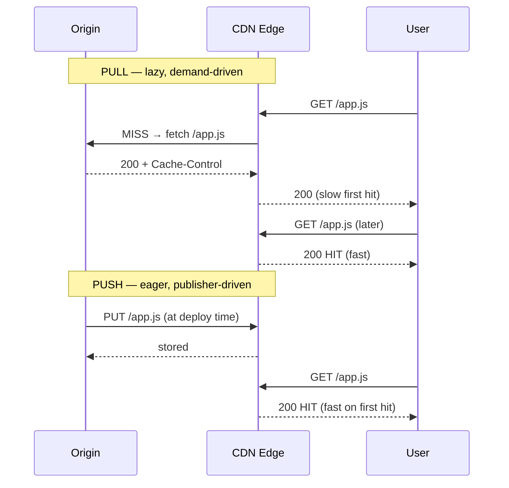
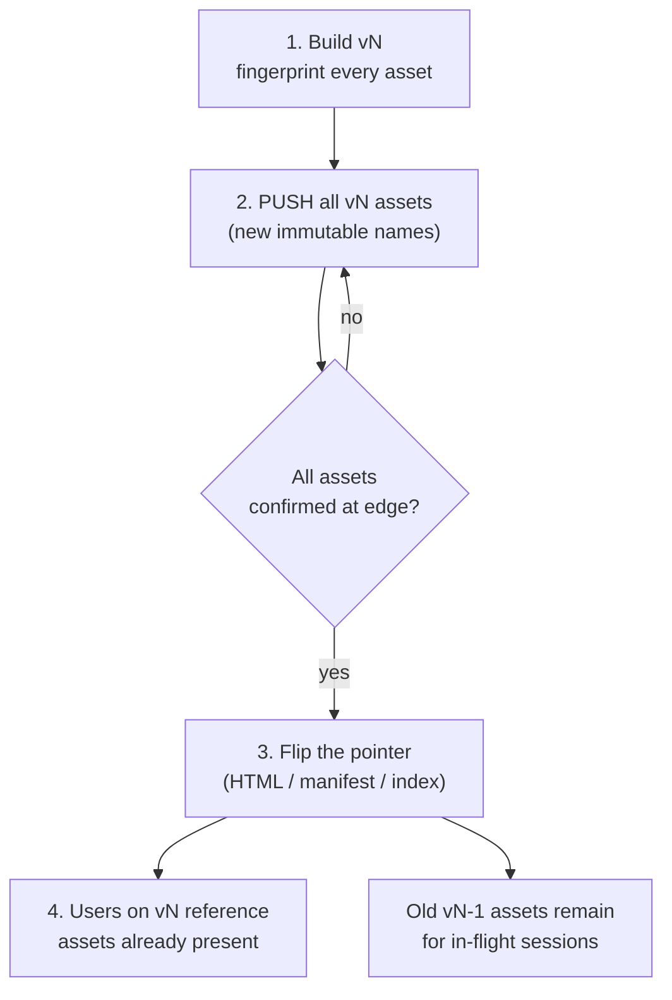
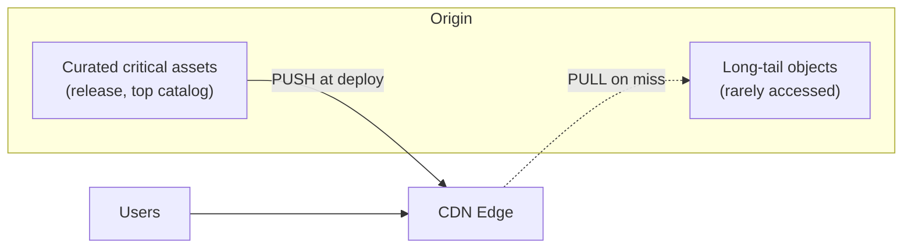

# Push CDN — Interview

A push CDN is one where **you** (the origin) proactively upload content into the CDN's storage ahead of demand, rather than letting the CDN lazily fetch it on the first cache miss. This tier drills the trade-offs an interviewer probes: when push beats pull, the first-request penalty, storage economics, immutable naming, version-swap consistency, hybrid designs, pre-warming, and a large-release distribution scenario.

## Contents

1. [Q1: What is a push CDN?](#q1-what-is-a-push-cdn)
2. [Q2: Push vs pull — the core mechanical difference](#q2-push-vs-pull--the-core-mechanical-difference)
3. [Q3: When do you pick push over pull?](#q3-when-do-you-pick-push-over-pull)
4. [Q4: What is the first-request penalty and how does push remove it?](#q4-what-is-the-first-request-penalty-and-how-does-push-remove-it)
5. [Q5: What is the storage-cost trade-off?](#q5-what-is-the-storage-cost-trade-off)
6. [Q6: Why immutable, fingerprinted asset names?](#q6-why-immutable-fingerprinted-asset-names)
7. [Q7: How does a version swap propagate consistently?](#q7-how-does-a-version-swap-propagate-consistently)
8. [Q8: What does a hybrid push/pull architecture look like?](#q8-what-does-a-hybrid-pushpull-architecture-look-like)
9. [Q9: How do you pre-warm a CDN for a launch?](#q9-how-do-you-pre-warm-a-cdn-for-a-launch)
10. [Q10: How does push interact with invalidation and TTLs?](#q10-how-does-push-interact-with-invalidation-and-ttls)
11. [Q11: How do you handle failed or partial pushes?](#q11-how-do-you-handle-failed-or-partial-pushes)
12. [Q12: How is origin offload different under push vs pull?](#q12-how-is-origin-offload-different-under-push-vs-pull)
13. [Q13: Scenario — distribute a large global software release](#q13-scenario--distribute-a-large-global-software-release)
14. [Q14: Scenario — a global video catalog](#q14-scenario--a-global-video-catalog)
15. [Q15: What are the common failure modes and anti-patterns?](#q15-what-are-the-common-failure-modes-and-anti-patterns)

---

## Q1: What is a push CDN?

A push CDN is a distribution model where the origin **publishes content into the CDN's storage or edge caches before it is requested**. The push happens on your schedule (a deploy, a release cutover, a nightly sync), not on user demand. The CDN acts as an authoritative store of what you gave it; it does not go back to origin on a miss because, by design, there should be no miss for pushed content.

Contrast with the default CDN model — **pull** — where the edge holds nothing until a user requests an object, at which point it fetches from origin (a cache miss), caches it per the response's TTL, and serves subsequent requests locally.

The mental model: **push = you manage what lives at the edge; pull = the CDN manages it based on traffic.** Push shifts control (and responsibility) to the publisher.

## Q2: Push vs pull — the core mechanical difference

The difference is *who initiates the transfer and when*.



Under pull, the *first* user in each region pays the origin round-trip. Under push, the origin round-trip is paid once, in advance, by your deploy pipeline — so the very first user already gets an edge HIT.

## Q3: When do you pick push over pull?

Pick **push** when the content set is known ahead of time, changes on your schedule, and either the first-request penalty or origin load matters:

| Signal | Favors push | Favors pull |
|---|---|---|
| Content set knowable in advance | Yes (release artifacts, catalog) | No (long-tail, user-generated) |
| Object popularity | Cold-start-sensitive (launches) | Naturally hot, self-warming |
| Object count / cardinality | Bounded, curated | Huge, unpredictable long tail |
| Update cadence | Deploy-driven, batched | Continuous, ad hoc |
| Origin cost of a miss | High (slow, expensive, or fragile origin) | Acceptable |
| Operational simplicity wanted | No (you run the sync) | Yes (CDN does the work) |
| Storage cost sensitivity | Low (you'll pay to store everything) | High (pay for hot subset only) |

Rule of thumb: **push for a curated, launch-critical, deploy-versioned set; pull for a large or unpredictable long tail.** Most real systems combine both (Q8).

## Q4: What is the first-request penalty and how does push remove it?

The first-request penalty is the latency the *first* requester in a given edge/region suffers on a pull CDN because the object isn't cached yet: the edge must open (or reuse) a connection to origin, wait a full RTT plus origin processing, receive the bytes, then relay them. For a distant origin this can be hundreds of milliseconds to seconds, and it recurs **per edge location** (each PoP has its own cache) and **per object**.

Push removes it by pre-populating the edge, so the first user hits a warm cache. This matters most for:

- **Launch moments** — everyone arrives in a narrow window; a cold edge means a thundering herd of misses all stampeding origin at once.
- **Sparse-but-critical assets** — a rarely-fetched but must-be-fast object (e.g., a security patch) never gets to "warm up" naturally under pull.

The subtlety: pull's penalty is *amortized* — only unlucky first-hitters pay, and popular objects warm themselves. Push pays the cost *deterministically and up front* regardless of whether the object ends up popular.

## Q5: What is the storage-cost trade-off?

Push means you store the **entire published set at the edge (or in CDN-managed storage) whether or not it's ever requested.** Pull stores only what traffic actually pulls in, and evicts the cold tail under LRU/LFU pressure. So:

- **Push cost ≈ f(total corpus size × replication footprint).** You pay to keep everything resident.
- **Pull cost ≈ f(working-set size).** You pay for the hot subset; the long tail costs nothing at the edge.

For a small, uniformly-hot corpus (a web app's JS/CSS bundle) push storage is trivial and the offload is excellent. For a huge catalog with a heavy long tail (millions of rarely-viewed videos), pushing everything is wasteful — you'd pay to store objects almost no one watches. That is exactly the case where pull (or hybrid) wins: let the edge cache only what's watched.

Interview one-liner: **push trades storage dollars for tail-latency determinism.** Whether that trade is good depends entirely on your corpus's popularity distribution.

## Q6: Why immutable, fingerprinted asset names?

Because it converts a hard problem (cache invalidation) into a trivial one (never invalidate). A **fingerprinted** (a.k.a. content-hashed, digest-named) asset embeds a hash of its bytes in its filename:

```
app.a3f9c1e8.js      main.7b2d.css      logo.9f1c...4a.png
```

Consequences:

- The name is now a **function of content**: different bytes ⇒ different name. Two versions never collide.
- You can serve every fingerprinted object with `Cache-Control: public, max-age=31536000, immutable`. It is safe to cache "forever" at every layer because that exact URL will never change meaning.
- **Deploying a new version = pushing a new file under a new name**, not overwriting an old one. There is nothing to invalidate; the old file simply stops being referenced.

This is the pattern that makes push CDNs pleasant: you push additively, never in place, and never fight cache staleness on the assets themselves.

## Q7: How does a version swap propagate consistently?

The trap is atomicity. If your HTML references `app.<hash>.js` and users can receive an old HTML pointing at a new (not-yet-pushed) bundle — or vice versa — they get a broken, mixed-version page. The safe sequence is **push immutable leaves first, flip the mutable pointer last:**



Key ideas:

- **Immutable assets are content-addressed → strongly consistent by construction.** A given URL always returns the same bytes everywhere; there is no propagation race on them.
- **The only mutable object is the entry point** — the HTML page, the JSON manifest, or the "current version" index. That one object flips last, after every asset it references is confirmed present at all edges.
- **Keep old versions live** during the overlap window so users mid-session (holding old HTML) still resolve their old assets. Garbage-collect stale versions later, not at cutover.

The entry-point flip is where you might still face short-lived edge inconsistency (some PoPs see new, some old) — bound it with a short TTL on the entry point, and design both versions to be independently servable so a mixed window is harmless.

## Q8: What does a hybrid push/pull architecture look like?

Almost every mature setup is hybrid. You **push the critical, curated, launch-sensitive set and pull the long tail:**



- **Push:** app bundles, the newest release binaries, trending/top-of-catalog items, launch pages — anything where a cold first hit is unacceptable.
- **Pull:** everything else — the archive, the long tail, per-user or per-region niche content — where lazy fetch-on-miss is fine and you'd rather not pay to store it warm.

This gives you push's determinism where it matters and pull's storage efficiency everywhere else. The routing is usually by path/prefix or by an origin config that marks certain prefixes as pre-populated.

## Q9: How do you pre-warm a CDN for a launch?

Pre-warming is push-in-spirit even on a pull CDN: you force the edges to hold the content *before* real traffic arrives. Techniques:

- **Explicit push / prefetch API** — many CDNs expose a "load into cache" or storage-upload API. You enumerate the launch assets and upload/prefetch them to the PoPs (often region-targeted).
- **Synthetic request warming** — issue requests to edge nodes (per region) for each critical URL so the pull path fetches and caches them ahead of the crowd. Useful when there's no native push API.
- **Warm the working set, not everything** — pre-fetch the assets you *know* will be requested at T0 (the launch page, the hero video's first segments, the installer), not the whole corpus.
- **Verify coverage** — check cache-status headers (HIT/MISS) across a sample of PoPs before you flip DNS/announce, so you don't discover cold edges under peak load.
- **Stagger by geography** if the launch rolls out timezone-by-timezone, warming each region just ahead of its wave.

The goal is to make the launch's first requests all HITs and to keep the origin from being stampeded by a synchronized miss storm.

## Q10: How does push interact with invalidation and TTLs?

For **properly fingerprinted content, you rarely invalidate** — new content is a new name, so you push additively and let old names age out. This is the ideal and the reason to prefer immutable naming.

You still need invalidation/TTL discipline for the **mutable entry points** (the HTML, manifest, `latest` pointer):

- Give entry points a **short TTL** (seconds to a few minutes) so a version flip propagates quickly without an explicit purge on every deploy.
- Use **explicit purge/invalidate** for corrections — a bad build shipped, a legal takedown, a security issue — where you cannot wait for TTL expiry.
- Prefer **soft-purge / stale-while-revalidate** semantics where available so a purge doesn't create a synchronized cold-miss stampede.

Rule: **immutable leaves = cache forever; mutable pointers = short TTL + on-demand purge.** Push doesn't eliminate invalidation, it *relocates* it onto a tiny set of pointer objects.

## Q11: How do you handle failed or partial pushes?

A push is a distributed write across many PoPs; some will fail or lag. Design for it:

- **Confirm before cutover.** Never flip the entry point until every referenced asset is confirmed present at all target edges. Treat the push as a transaction with a "commit" (the pointer flip) that only happens after all leaves land.
- **Idempotent, content-addressed pushes.** Because names are content hashes, re-pushing a failed object is safe and naturally idempotent — you can retry freely.
- **Retry with backoff** per-PoP; track per-region completion, not just a global "done."
- **Keep the previous version fully live** so a failed/partial new push means users simply keep seeing the old, working version rather than a broken half-swap.
- **Roll back by re-flipping the pointer**, not by mass-deleting — since old assets are still present, reverting is just pointing the manifest back.

The invariant: **the pointer flip is the only step that can make new content user-visible, and it happens only after the push is fully verified.**

## Q12: How is origin offload different under push vs pull?

Both offload origin, but the shape differs:

- **Pull** offloads origin *after* the first miss per object per edge. Under a synchronized launch, that first wave can be a **miss storm** — many edges hitting origin simultaneously — unless you add request-coalescing/shielding (an origin-shield tier) or pre-warm.
- **Push** offloads origin *completely for the pushed set*: the edge never goes back to origin, so there is **no miss storm at all** for those objects. Your origin serves the CDN once (at push time) and can even be scaled down or taken offline afterward for static releases.

This is a strong push argument for events like game-day launches or OS updates: the origin's peak load is decoupled from user peak, because all the origin work happened during the controlled push, not during the traffic spike.

## Q13: Scenario — distribute a large global software release

*"You must ship a multi-gigabyte software release (installer + patches) to millions of users worldwide at a fixed release time. Design the delivery."*

Reason out loud:

1. **This is the canonical push case.** The set is known, launch-critical, cold-start-sensitive, and the origin must not be stampeded. Every user wants a fast first byte simultaneously.
2. **Fingerprint and version everything.** Each binary/patch gets a content-hashed, immutable URL; serve with `max-age` far in the future + `immutable`. A new release is new names, not overwrites.
3. **Push before the announcement.** Upload all release artifacts into CDN storage / edge caches across all regions ahead of the release window. Verify per-region coverage via cache-status sampling.
4. **Flip the pointer at T0.** A tiny, short-TTL `latest.json` manifest (or update-check endpoint) is what clients poll; it flips to the new version only after the push is confirmed everywhere. This is the atomic cutover.
5. **Support resumable, chunked downloads** (HTTP range requests) so multi-GB transfers survive flaky connections and the edge serves ranges from cache.
6. **Keep the prior release live** for clients that haven't updated and for rollback (just re-flip the manifest).
7. **Origin is quiet at peak** — it did its work during the push, so the traffic spike is absorbed entirely by warm edges with zero misses.

Result: deterministic fast first byte, no miss storm, atomic version cutover, trivial rollback.

## Q14: Scenario — a global video catalog

*"Now it's a video catalog of millions of titles, most rarely watched, a few extremely popular. Design delivery."*

The corpus shape changes the answer — this is **hybrid, not pure push:**

1. **Segment the content** (chunked HLS/DASH) and fingerprint segments/manifests so each segment is immutable and cacheable forever.
2. **Push the head of the distribution** — new releases, trending titles, and the *first few segments* of popular content (so playback starts instantly, warm). Warming just the opening segments captures most of the cold-start benefit cheaply.
3. **Pull the long tail** — the millions of rarely-watched titles fetch on miss and are cached only while there's demand, then evicted. Pushing them all would blow up storage cost for content almost no one plays (Q5).
4. **Short-TTL manifests, immutable segments** — manifests flip to reflect new renditions/versions; segments never change under a URL.
5. **Origin shield** in front of origin so long-tail misses coalesce and don't hammer origin.
6. **Pre-warm predictable spikes** — a big premiere gets its opening segments pushed to the relevant regions just before drop.

The interviewer is checking whether you recognize that a heavy long tail flips the storage trade-off and pushes you toward hybrid — you push the cold-start-critical head and pull the tail.

## Q15: What are the common failure modes and anti-patterns?

- **Non-atomic swap** — flipping the entry point before all referenced assets are pushed, producing mixed-version breakage. Fix: push leaves, confirm, then flip the pointer (Q7).
- **Overwriting in place** instead of using immutable names — reintroduces invalidation pain and cache-staleness races. Fix: content-hash everything (Q6).
- **Pushing the whole long tail** — paying to store cold content warm. Fix: hybrid; push the head, pull the tail (Q5, Q14).
- **No push verification** — announcing before edges are actually warm, so the launch hits cold PoPs. Fix: sample cache-status per region before cutover (Q9, Q11).
- **Long TTL on the mutable pointer** — makes version swaps and emergency fixes slow. Fix: short TTL + on-demand purge on entry points only (Q10).
- **Deleting old versions at cutover** — breaks in-flight sessions and removes rollback. Fix: keep the previous version live through an overlap window (Q7, Q11).
- **Treating push as fire-and-forget** — ignoring per-PoP partial failures. Fix: idempotent retries + per-region completion tracking (Q11).

*Next step:* [Cache Invalidation — Junior](../cache-invalidation/junior.md)
