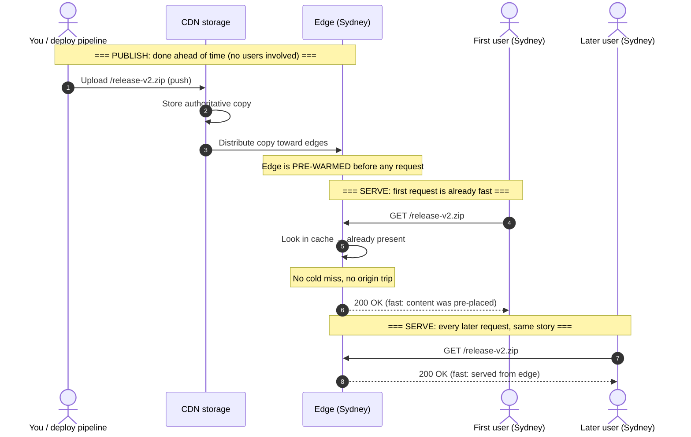

# Push CDN — Junior

<!-- level-focus -->
At junior level, focus on this question:

> How can I apply **Push CDN** in one small example and prove the result?

Use the smallest realistic scenario that exposes the decision and its failure behavior.
## 1. Recap: distance costs time

Your **origin** — the server holding the authoritative copy of your files — lives in one place, say a data centre in Virginia. A user in Sydney is roughly 16,000 km away, and because data cannot travel faster than light (slower still through fibre), every round trip across the Pacific costs on the order of **200–300 ms** before any real work happens. A CDN fixes this by keeping copies on **edge servers** (also called **PoPs** — points of presence) in many cities, so a Sydney user talks to a Sydney edge over a local, few-millisecond hop.

The open question is *how the file gets onto that edge in the first place*. There are exactly two answers, and push is the one where you take charge.

## 2. Two ways to fill an edge: pull vs push

- **Pull:** the edge starts **empty**. The first time a user requests a file, the edge fetches it from your origin, caches it, and serves that copy to everyone afterwards. The cache fills itself, driven by real traffic — but the *first* visitor to each edge pays for the origin trip.
- **Push:** **you** upload files into the CDN's storage *before* any user asks. The edge (or a nearby CDN storage tier it reads from) already has the content, so even the first request is served fast. Nothing is left to chance or to an unlucky first visitor.

The difference is one of **timing and initiative**. Pull is *reactive and lazy* — content moves to the edge on demand. Push is *proactive and eager* — content moves to the edge on **your** schedule, as an explicit publishing step.

## 3. What "push" means

"Push" means you **proactively place content** into the CDN instead of letting it trickle in. Concretely, the CDN gives you a **storage location** — think of it as a bucket or upload endpoint the CDN owns. Your workflow becomes:

1. Build or prepare the asset (a video file, an app installer, a big archive).
2. **Upload** it to the CDN's storage — via an API call, a CLI, or your deploy pipeline.
3. The CDN **distributes** that copy across its network so edges can serve it.
4. From then on, users are served the copy the CDN already holds — no origin involved at request time.

The mental image: with pull you *point* the CDN at your origin and hope; with push you *hand* the CDN your files and know exactly what is stored where. **You** decide what exists at the edge and when it lands there — publishing is a step you perform, not a side effect of traffic.

## 4. Why push avoids the first-request penalty

Recall pull's one honest cost: on a **cold cache**, the first request travels user → edge → **origin** → edge → user, so the first visitor eats the full transpacific round trip. That penalty is paid once per file per edge, then amortised across everyone after.

Push removes it entirely. Because you uploaded ahead of time, there is **no cold-cache miss to pay** — the content is already positioned when the first request lands. The first user is treated exactly like the thousandth: served locally, fast. This matters most when a "first request" is likely to be rare and *visible*: for a file downloaded a handful of times, under pull every visitor risks being that unlucky first one, whereas push guarantees all of them are warm.

Trade the automatic-but-lazy convenience of pull for a **deliberate, pre-warmed** edge, and the first-request penalty simply never happens.

## 5. A publish → serve walk-through

Push has two distinct phases that happen at *different times*. **Publish** happens once, when you release the file — driven by you. **Serve** happens later, every time a user asks — driven by traffic, but always from an already-populated edge.

Read it as: **before** — you upload and the CDN spreads the copy out; **during serve** — the edge already holds the file, so the very first request is a hit, not a miss; **after** — every subsequent request is identically fast. Contrast this with pull, where the first *serve* is what triggers the fetch. Under push, the fetch already happened, on your terms, during publish.

## 6. The cost of push: you own the uploads

Push is not free convenience — it moves work onto you.

- **You manage what's stored.** The cache no longer self-populates from traffic. If you forget to push a file, it isn't there; users get a **404**, not a slow-but-correct pull.
- **You pay to store everything you push,** whether or not anyone downloads it. Pull only ever stores what users actually request; push stores the full set you uploaded.
- **You must re-push to update.** Change the file at origin and the pushed copy is now **out of date** until you upload the new version. There is no automatic "fetch the latest on next request."

So push shifts you from *set-and-forget* to *deliberate publishing*: more control, more certainty about edge contents — but more operational responsibility. That trade only pays off for the right kind of content.

## 7. When to choose push over pull

Push earns its keep when the content is:

- **Large** — big videos, game assets, OS images, installers, firmware. The origin fetch under pull would be slow and heavy; pre-placing it means no user ever waits on that transfer.
- **Infrequently changing** — release artifacts, archived media, versioned downloads. You upload once and it stays put; you rarely pay the re-push cost.
- **Known in advance** — you have a fixed, enumerable set of files (a product's downloads, a media library) rather than an open-ended, traffic-driven long tail.
- **Sensitive to the first-request penalty** — low-frequency downloads where "the first user is slow" is unacceptable, because there may not be enough traffic to amortise a pull miss.

Conversely, if you have a huge, ever-changing library of small assets driven by unpredictable traffic (typical website images, CSS, JS), **pull** is usually the better default — self-populating, minimal effort, and its one-time penalty is quickly washed out by popularity.

## 8. Push vs pull, at a glance

| Aspect | Push CDN | Pull CDN |
| --- | --- | --- |
| Who fills the cache | **You** upload files ahead of time | Edge fetches on first request |
| Initiative / timing | Proactive — on your publish schedule | Reactive — lazily, on first demand |
| Setup & upkeep | Higher — you manage uploads and updates | Low — point CDN at origin, forget it |
| First request | **Fast** — content already placed | Slow (cache miss, origin pull) |
| Storage | Everything you push, wanted or not | Only what users actually request |
| Updating content | You must re-push the new version | Re-fetched when TTL expires |
| Best for | Large, stable, known assets; rare-access files | Big libraries, popular & changing assets |

The one-line rule: **pull is lazy and automatic; push is eager and deliberate.** Reach for push when you know exactly which large, slow-changing files must be warm at the edge and want to guarantee even the first visitor is fast.

## 9. Key terms

| Term | Meaning |
| --- | --- |
| **Origin** | The authoritative server holding the real, up-to-date files |
| **Edge / PoP** | A CDN server near users that caches and serves copies |
| **Push** | Proactively uploading content into the CDN's storage ahead of demand |
| **Pull** | Letting the edge lazily fetch from origin on the first request |
| **CDN storage** | The bucket / endpoint the CDN owns where you place pushed files |
| **Pre-warm** | Having content already at (or near) the edge before any request |
| **First-request penalty** | The slow first fetch pull pays on a cold cache — absent under push |
| **Re-push** | Uploading a new version to replace an out-of-date pushed copy |

**Sources:** [Cloudflare — What is a CDN?](https://www.cloudflare.com/learning/cdn/what-is-a-cdn/), [Cloudflare — Push vs. pull CDN](https://www.cloudflare.com/learning/cdn/glossary/push-vs-pull-cdn/), [MDN — HTTP caching](https://developer.mozilla.org/en-US/docs/Web/HTTP/Caching).

*Next step:* [Push CDN — Middle](middle.md)

---

## Apply it

1. Choose one small, known input for **Push CDN**.
2. Predict the output or observable behavior.
3. Run the smallest example or probe that exercises the concept.
4. Change one input to trigger a failure or boundary case.
5. Explain the evidence using the guide's vocabulary.

## Verify your work

- Record the exact input, command or code path, and output.
- Repeat the probe and confirm the result is consistent.
- Show one expected success and one expected failure.
- Resolve any difference between the prediction and the evidence.

## Review questions

- What problem does Push CDN solve in the example?
- Which input changes the observed result, and why?
- What is the smallest useful success check?
- Which beginner mistake would your evidence catch?
