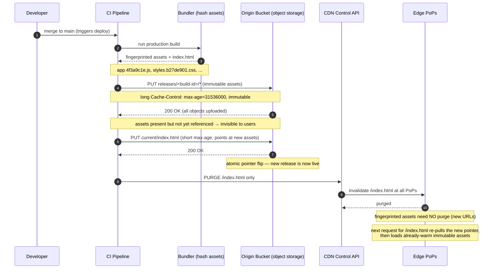

# Push CDN — Middle

<!-- level-focus -->
At middle level, focus on this question:

> Where does **Push CDN** belong in a maintainable component, and which trade-off selects the design?

Use the smallest realistic scenario that exposes the decision and its failure behavior.
## 1. What "push" really means today

The naive picture of push — *"I upload `logo.png` directly to every one of 300 edge PoPs"* — describes almost no real CDN. Distributing bytes to hundreds of geographically dispersed caches is a hard, stateful problem you do not want to own. Instead, "push" in modern practice means one of two things:

- **You own the origin, and you write to it eagerly.** The CDN is still fundamentally pull-based between edge and origin, but *you* control a single authoritative store (typically an S3-compatible bucket or a dedicated "CDN storage" tier) and you populate it *before* traffic arrives, rather than generating content on the fly. The CDN pulls from that store on miss, but because the object is guaranteed present, correctly named, and correctly headed, the pull is fast, predictable, and never returns a surprise 404 or a half-built asset.
- **The CDN offers a genuine pre-distribution / storage product** (e.g., a "CDN storage" or "prefetch" API) where uploading an object is contractually a push to the network's own replicated storage layer, and the object is warmed toward edges proactively.

The unifying idea: **the content exists in a known, complete state before the first user request**, and *you* decide when it appears and disappears. Contrast this with a pull CDN, where the *first* user for each file at each edge triggers an origin fetch and eats the miss penalty. Push trades operational effort for **determinism**: no cold-start penalty, no "who is the unlucky first visitor," and full control over exactly which bytes are live.

## 2. Two flavours of push: storage-origin vs true pre-distribution

It is worth being precise about the two mechanisms, because they have different guarantees and costs.

| Dimension | Storage bucket as origin | True pre-distribution (warmed to edge) |
|---|---|---|
| Where content lives | One (or few) origin bucket(s) — object storage | Replicated across the CDN's edge storage layer |
| Edge fill | Still lazy pull from bucket on first miss | Object proactively pushed / prefetched to PoPs |
| First-request latency | Fast-ish: edge → bucket (regional), no app compute | Fastest: object already at the serving edge |
| Who guarantees completeness | You (write object fully before it's referenced) | CDN, once the push/prefetch call returns |
| Cost model | Storage GB-month + edge egress + origin egress | Storage GB-month + often per-object push fees |
| Typical trigger | `PUT` object on deploy | Explicit prefetch/warm API call per URL |
| Best for | The default for static sites, JS/CSS bundles, images | Launch events, large videos, must-be-warm-globally assets |

Most teams use **storage-bucket-as-origin** as their baseline (it is cheap and simple), and reach for **explicit prefetch/warming** only for a small set of high-stakes assets — a product-launch video, a Black-Friday landing page — where they cannot tolerate even one slow first request per PoP. The two compose: bucket-as-origin handles the long tail; a prefetch call handles the handful of assets that must be globally warm at a known instant.

## 3. Immutable asset naming: fingerprinted filenames

The single most important discipline in a push workflow is **content-addressed, immutable asset naming**. Instead of publishing `app.js` and later overwriting it, you compute a hash of the file's *contents* and bake it into the filename:

```
app.js            →  app.4f3a9c1e.js
styles.css        →  styles.b27de901.css
hero.jpg          →  hero.a1b2c3d4.jpg
```

The hash (a "fingerprint," usually a truncated SHA-256 or content digest) is a pure function of the bytes. Change one byte and the filename changes; identical bytes always produce the same name. This property is what makes push safe and cache-friendly:

- **The URL becomes immutable.** `app.4f3a9c1e.js` will *never* contain different content, so you can serve it with the strongest possible caching header — `Cache-Control: public, max-age=31536000, immutable` — and never worry about staleness. There is no cache-invalidation problem for the asset itself, because a *new* version has a *new* URL.
- **Deploys become additive, not destructive.** A new build writes `app.9e8d7c6b.js` alongside the old file. Nothing is overwritten, so an in-flight page that already fetched the old bundle keeps working. This is the foundation of atomic, zero-downtime frontend deploys (see §4).
- **Invalidation shrinks to almost nothing.** Because asset URLs never change meaning, you rarely purge them. The only thing that must change on each deploy is the *entry point* that references them — typically `index.html`, which is served with a *short* TTL (see §7).

The one file you must **not** fingerprint is the HTML (or manifest) that points at the fingerprinted assets — otherwise nobody could find the new entry point. This split — **long-lived immutable assets + short-lived mutable entry point** — is the core caching pattern of every mature push pipeline.

## 4. Content versioning and atomic deploys

Fingerprinting gives you immutable *assets*; versioning gives you an immutable *set*. A robust push layout publishes each build into a **versioned prefix** so an entire release is one atomic unit:

```
s3://cdn-assets/
  releases/
    build-2026-07-01-a1b2c3/       ← immutable release directory
      app.4f3a9c1e.js
      styles.b27de901.css
      hero.a1b2c3d4.jpg
      index.html
  current  →  points at build-2026-07-01-a1b2c3   ← the only mutable pointer
```

The deploy becomes a two-phase operation: **(1)** upload the entire new release directory (nobody references it yet, so partial uploads are invisible); **(2)** flip a single small pointer — a `current` symlink, a routing rule, or a short-TTL `index.html` — to the new release. Because only one tiny mutable object changes, the switch is effectively atomic, and rollback is just flipping the pointer back to the previous release directory, which is still fully present.

This is why push pairs so well with object storage: storage is cheap enough to keep the last N releases live simultaneously, giving you instant rollback with no rebuild.

## 5. The publish pipeline: from CI to edge

Here is the canonical flow for a static-asset push pipeline triggered by a git merge. The build produces fingerprinted assets, CI uploads them to the origin bucket, then flips the pointer and (only for the mutable entry point) invalidates the edge cache.



Read it as three beats. **Upload immutable assets** — safe to do at any time because their URLs are new and unreferenced. **Flip the mutable pointer** — a single short-TTL object, so the release goes live atomically. **Purge only the pointer** — because every fingerprinted asset is a brand-new URL, only `index.html` (or the manifest) ever needs invalidation, keeping purge scope tiny and fast.

## 6. Publishing via API / CLI: concrete examples

The upload step is just object-storage writes plus header control. A minimal S3-compatible sync in CI:

```bash
# 1. Upload immutable, fingerprinted assets with a 1-year immutable header.
#    --exclude the HTML so it doesn't inherit the long TTL.
aws s3 sync ./dist/ s3://cdn-assets/releases/$BUILD_ID/ \
    --exclude "index.html" \
    --cache-control "public, max-age=31536000, immutable" \
    --content-type-by-extension

# 2. Upload the mutable entry point LAST, with a short TTL so new deploys surface fast.
aws s3 cp ./dist/index.html s3://cdn-assets/current/index.html \
    --cache-control "public, max-age=60, must-revalidate"

# 3. Purge only the entry point from the edge cache.
#    (Provider-specific; shown here as a generic control-API call.)
curl -X POST "https://api.cdn.example/v1/purge" \
     -H "Authorization: Bearer $CDN_TOKEN" \
     -d '{"paths": ["/index.html"]}'
```

Two details that separate a correct pipeline from a broken one:

- **Order matters.** Immutable assets go up *first*; the entry point goes up *last*. If you flip the pointer before all assets are present, a user can load an `index.html` that references a `app.9e8d7c6b.js` that isn't uploaded yet — a broken deploy. Upload-then-flip enforces the "assets exist before referenced" invariant from §4.
- **Headers are set at publish time.** In a push model, *you* own the caching headers on every object as you write it. This is a real advantage over pull, where headers come from the origin app and are easy to get wrong per-response. Here they are declarative, per-object, and reviewable in the CI config.

For **true pre-distribution**, add a warm/prefetch call for the specific hot URLs after publish:

```bash
# Proactively warm the launch video to all PoPs before the announcement.
curl -X POST "https://api.cdn.example/v1/prefetch" \
     -H "Authorization: Bearer $CDN_TOKEN" \
     -d '{"urls": ["https://cdn.example/launch/2026-hero.mp4"]}'
```

## 7. Syncing, invalidation, and expiry

Push shifts the freshness question from "when does the edge re-check origin?" to "when do I, the publisher, change what exists." Three mechanisms interact:

- **Sync** — the act of reconciling the bucket to the build output. `aws s3 sync` (and equivalents) uploads new/changed objects and can `--delete` ones no longer in the source. With fingerprinting you almost never *change* an object; you *add* new ones, which is why deploys are additive and safe.
- **Invalidation / purge** — explicitly telling edges to drop a cached copy. Because immutable assets get new URLs, purge is reserved for the short list of mutable objects (the entry point, an API-driven manifest). Keeping purge scope tiny is deliberate: wildcard purges (`/*`) are slow, sometimes rate-limited, and cause a cache-miss stampede back to origin.
- **Expiry (TTL) as a safety net.** Even in push, edges still honour `Cache-Control`. The mutable entry point carries a *short* TTL (say 60 s) so that even if a purge is missed or delayed, the new release surfaces within a minute. Immutable assets carry a *year-long* TTL because they never change. TTL here is a backstop, not the primary control — the primary control is *what you publish*.

The mental shift from pull: in pull, staleness is governed by TTL and revalidation against a live origin. In push, staleness is governed by **your publish actions** — content is exactly as fresh as your last deploy, and expiry mainly guards against a missed purge.

## 8. Storage cost of holding everything

Push's defining cost is that **you pay to store the complete corpus, not just the popular slice.** A pull CDN's edge caches hold only what users actually request, and cold objects are evicted; push requires the authoritative store to hold *every* object that could ever be served, popular or not, plus (with versioning) several historical releases.

A concrete estimate for a media-heavy site:

```
Assets per release:   50,000 objects, avg 200 KB
  = 50,000 × 200 KB = 10 GB per release

Releases kept live:   10 (for instant rollback)
  = 10 × 10 GB = 100 GB in origin object storage

Monthly storage cost (S3-class, ~$0.023/GB-month):
  = 100 GB × $0.023 ≈ $2.30 / month   ← storage is cheap

Now the long-tail penalty:
  Of 50,000 assets, suppose only 5,000 (10%) are ever requested.
  Pull would cache ~5,000 hot objects at the edge and store the rest nowhere extra.
  Push stores all 50,000 in the origin bucket regardless — you pay for the 90%
  that nobody ever downloads.
```

Two lessons fall out of this arithmetic. First, **raw storage is usually cheap** — object storage is pennies per GB-month, so holding all objects and many releases rarely dominates the bill. Second, the *real* cost of "hold everything" is **operational, not dollars**: lifecycle management. You must prune old release directories (a lifecycle rule that expires releases older than N days or keeps the last N), or the bucket grows without bound and rollback/audit gets noisy. The standard fix is an **object-storage lifecycle policy**:

```
Lifecycle rule:
  prefix: releases/
  action: expire objects older than 90 days
  keep:   the last 10 release directories (via versioning or explicit retention)
```

## 9. Push vs pull: operational trade-offs

| Aspect | Push CDN | Pull CDN |
|---|---|---|
| Cache fill | You publish before traffic (eager) | Edge fetches on first miss (lazy) |
| First request | Fast — content already present | Slow — one miss per file per PoP |
| Freshness control | Publish actions (deterministic) | TTL + revalidation against origin |
| Invalidation scope | Tiny (only the mutable pointer) | Larger; every changed URL may need purge |
| Origin load pattern | Steady writes at deploy time | Read spikes on cache misses / after purge |
| Storage cost | Hold the full corpus + N releases | Only what users request; cold objects evicted |
| Header control | Per-object, set at publish time (declarative) | Per-response from origin app (easy to get wrong) |
| Setup / ops effort | Higher — pipeline, versioning, lifecycle rules | Lower — point CDN at origin |
| Ideal fit | Static sites, versioned bundles, launch-critical assets | Large/unpredictable libraries, changing dynamic content |

The decision is rarely "push *or* pull" globally. A common mature setup is **push for the deployable frontend** (fingerprinted JS/CSS/HTML, where determinism and atomic rollback matter) and **pull for user-generated or long-tail media** (where you cannot pre-enumerate the corpus and lazy fill is exactly right). The skill at this level is choosing per content class, not per site.

## 10. Middle checklist

- [ ] Static assets are **content-fingerprinted**; asset URLs are treated as immutable and served `max-age=31536000, immutable`.
- [ ] The entry point (`index.html`/manifest) is **not** fingerprinted and carries a **short** TTL as a freshness backstop.
- [ ] Deploys are **additive**: new release uploaded to a versioned prefix *before* the pointer is flipped (upload-then-flip ordering enforced in CI).
- [ ] Purge scope is limited to the **mutable pointer only**; no routine wildcard purges.
- [ ] Caching headers are set **per object at publish time**, reviewable in the pipeline config.
- [ ] An object-storage **lifecycle policy** prunes old releases so "hold everything" doesn't grow unbounded.
- [ ] Explicit **prefetch/warm** calls exist only for the small set of launch-critical, must-be-globally-warm assets.
- [ ] Rollback is defined and tested: flip the pointer back to a still-present prior release directory.

**Sources:** [MDN — HTTP Cache-Control](https://developer.mozilla.org/en-US/docs/Web/HTTP/Headers/Cache-Control), [RFC 9111 — HTTP Caching](https://www.rfc-editor.org/rfc/rfc9111), [AWS — Amazon S3 as a static website / origin](https://docs.aws.amazon.com/AmazonS3/latest/userguide/WebsiteHosting.html), [AWS — S3 Lifecycle configuration](https://docs.aws.amazon.com/AmazonS3/latest/userguide/object-lifecycle-mgmt.html).

*Next step:* [Push CDN — Senior](senior.md)

---

## Apply it

1. Find a real component where **Push CDN** affects an interface or dependency.
2. Write two plausible choices and the constraint that favors each one.
3. Make the smallest reversible change at that boundary.
4. Exercise the component alone, then exercise the integrated flow.
5. Keep the decision note with the evidence that selected the option.

## Verify your work

- A focused check proves the local behavior.
- An integrated check proves callers and dependencies still agree.
- Logs, traces, compiler output, or benchmarks expose the boundary.
- Reverting the change restores the previous behavior without unrelated edits.

## Review questions

- Which boundary is most affected by Push CDN?
- What constraint would make you choose the alternative design?
- How would you isolate a local defect from an integration defect?
- What evidence shows that the change remains maintainable?
