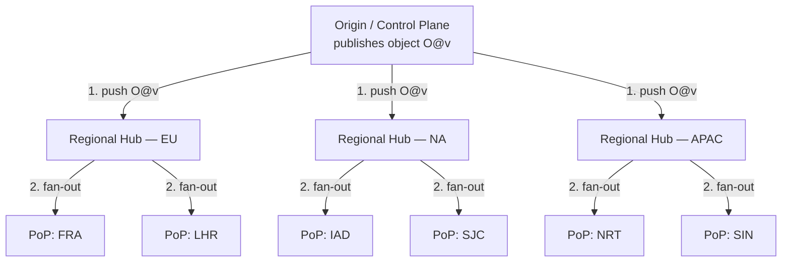
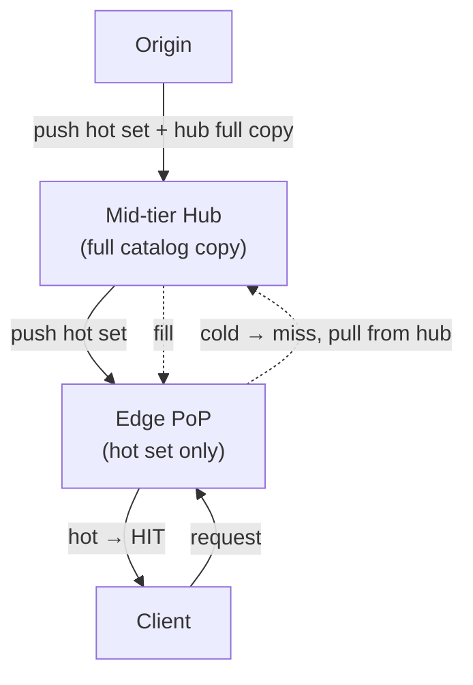

# Push CDN — Professional

<!-- level-focus -->
At professional level, focus on this question:

> How should teams adopt and operate **Push CDN** with measurable outcomes and limited coordination?

Use the smallest realistic scenario that exposes the decision and its failure behavior.
## 1. The Push Inversion and Why It Changes the Math

In a **pull CDN** the edge is a demand-driven cache. The first request for an object at a PoP misses, the PoP fetches from origin (or a mid-tier), stores the result subject to its freshness headers, and serves subsequent requests locally. The steady-state footprint at each PoP is not the catalog — it is the *working set* the local audience actually requests, bounded by the cache size and shaped by the eviction policy. Correctness is trivially "the response is fresh per RFC 9111"; nothing needs to have converged.

A **push CDN** distributes objects to PoPs *before* they are requested. The operator (or a pipeline triggered by a publish event) writes each object out to some set of PoPs so that the first user request is already a hit. This is the right model when a *cold miss is unacceptable* — a software update rollout where 50 million clients wake at 09:00 UTC and hit origin simultaneously (a thundering herd the pull model absorbs poorly), a game patch, a video segment for a scheduled premiere, or any launch where the "prime the cache" step must complete deterministically before traffic arrives.

The inversion moves the hard problem from **cache management** (eviction, TTL, revalidation) to **distributed state convergence**:

- The unit of correctness becomes *"has version `v` of object `O` reached every PoP in its target set?"*
- Between the publish instant and full convergence there is an unavoidable window in which different PoPs may hold different versions — a genuine eventual-consistency problem, not a caching detail.
- Storage is no longer working-set-bounded; if you replicate the full catalog everywhere, each PoP must hold the *entire* catalog, and the aggregate footprint multiplies by the PoP count.

Everything that follows is a consequence of these three facts.

---

## 2. The Distribution Model: Replication Fan-Out

The naive distribution topology is a **star**: origin (or a control plane) opens a connection to every PoP and streams the object. If there are `P` PoPs and the object is `S` bytes, origin must egress `P · S` bytes, and its uplink bandwidth `B_o` becomes the bottleneck. Total fan-out time is at least `P · S / B_o` — linear in the number of PoPs. At planetary scale (`P` in the hundreds) this saturates origin and starves the tail PoPs.

Production push systems therefore use a **tree (or DAG) fan-out through mid-tier hubs**, sometimes reinforced with peer-to-peer replication *inside* a region. Origin pushes to a small number of regional hubs; each hub fans out to the PoPs it parents. With a balanced tree of fan-out degree `k` and `P` leaf PoPs, the depth is `⌈log_k P⌉` and each internal node egresses only `k · S` bytes rather than `P · S`.



The staged progression of one object through the tree — origin commit, hub receipt, leaf receipt, leaf acknowledgement — is the state machine each object traverses:

The key theoretical property: an object is **safe to serve globally** only in the `Converged`/`Serving` states. In `PartiallyConverged`, a request routed to a lagging PoP either misses (if that PoP has no copy at all) or — worse — serves a *stale prior version*. Managing what happens in that window is the whole of §8.

---

## 3. Propagation-Time Bounds and the Convergence Window

Define the **propagation delay** `D_i` of PoP `i` as the wall-clock time from the origin commit of version `v` to the instant PoP `i` can serve `v`. The **convergence time** of the object is `D_max = max_i D_i` — the system has converged only when the slowest target PoP is done. This is the CDN analogue of "replication lag," and it is dominated by the tail, not the mean.

For the tree topology, `D_i` decomposes along the path from origin to leaf `i`:

```
D_i  =  Σ over each hop h on the path  ( T_prop_h + S / B_h + T_queue_h )
```

where `T_prop_h` is one-way propagation latency of hop `h` (speed-of-light + routing, ~tens of ms intercontinental), `S / B_h` is the transmission (serialization) time of an `S`-byte object over a link of bandwidth `B_h`, and `T_queue_h` is queueing/scheduling delay at the node (contention with other concurrent objects in the same push wave).

Two regimes fall out:

- **Small objects, many of them** (a manifest, thousands of tiny assets): `S / B_h → 0`, so `D_i ≈ depth · (T_prop + T_queue)` — **latency-bound**. Convergence time is set by tree depth and per-hop RTT, and by how well the control plane pipelines the many small transfers.
- **Large objects, few of them** (a 4 GB game patch): `T_prop` is noise next to `S / B_h`, so `D_i ≈ Σ S / B_h` — **bandwidth-bound**. The narrowest link on the path dictates convergence time, and the tree's value is that it keeps origin off that path.

The **convergence window** `W = D_max` is the interval during which the guarantees of §8 are at risk. A star topology has `D_max ≈ P · S / B_o` (origin-serialized); a depth-`d` tree has `D_max ≈ d · (T_prop + S/B_leaf)` plus tail queueing — the difference between minutes and seconds at scale. Because the window is a **tail quantity**, the operationally meaningful metric is not mean `D` but a high percentile — a PoP whose ACK is lost and must retry can dominate `D_max`, which is why push pipelines pair fan-out with per-PoP ACK tracking and bounded-retry timeouts, and why the version-swap protocol (§8) must never flip the global pointer until `D_max` has elapsed *with confirmation*, not merely on a timer.

---

## 4. Content-Addressed, Fingerprinted, Immutable Naming

The eventual-consistency window of §3 becomes tractable only if content is **immutable under a stable name**. The design rule that makes push CDNs safe: *never mutate the bytes behind a URL; publish a new URL instead.*

**Fingerprinted naming.** The build pipeline hashes each object's content and embeds a prefix of that digest in the filename or path:

```
app.js            →  app.4f9a2c1e.js
main.css          →  main.b73d0af5.css
sprite.png        →  sprite.9c1e77b0.png
```

The name is now a function of the bytes. Two consequences follow directly:

1. **Content addressing** — identical content deduplicates to one name; a byte change *forces* a new name. There is no such thing as "the same URL with different content," which is exactly the failure mode that makes cross-edge staleness observable.
2. **Immutability by construction** — because a change of bytes changes the name, the object at any given name can be declared *never-changing*, and therefore cached forever anywhere without revalidation.

This turns the version-swap problem into a **pointer-flip problem**. The immutable, fingerprinted assets are pushed and converge on their own timeline; a single small, *mutable* indirection — the HTML document, a manifest, or a version pointer — is what actually changes to reference the new fingerprints. Convergence of the large payload is decoupled from the atomic act of switching versions (see §8).

A companion technique is a **content-addressed manifest**: publish `manifest.json` (itself fingerprinted, e.g. `manifest.a1b2c3.json`) listing `{logical-name → fingerprinted-name}`. Clients resolve logical names through the manifest, so a release is atomic in the manifest even while individual assets stream to the edge independently.

---

## 5. `Cache-Control: immutable` and the Freshness Model

RFC 9111 defines HTTP caching freshness: a stored response is fresh while its age is below the freshness lifetime derived from `Cache-Control: max-age` (or `Expires`). But even within `max-age`, a client that *reloads* a page will typically send a conditional revalidation (`If-None-Match` / `If-Modified-Since`) — a wasted round-trip that yields `304 Not Modified` for content that, thanks to fingerprinting, *cannot* have changed.

**RFC 8246** defines the `immutable` extension to `Cache-Control` precisely for this case:

```
Cache-Control: public, max-age=31536000, immutable
```

`immutable` is a signal that the response body will *not* change during its freshness lifetime, and therefore a client **must not send a conditional revalidation request even on an explicit reload**. It is the exact semantic match for a fingerprinted asset: the name pins the bytes, so revalidation is provably pointless.

The correct freshness policy for a push CDN is thus a two-class split:

| Object class | Naming | Header | Rationale |
|---|---|---|---|
| Fingerprinted asset (`app.4f9a2c1e.js`) | content-addressed, immutable | `public, max-age=31536000, immutable` | bytes pinned to name → cache forever, never revalidate (RFC 8246) |
| Indirection (`index.html`, `manifest`) | stable, mutable | `no-cache` or short `max-age` + `ETag` | must revalidate to observe the version swap |

`no-cache` (per RFC 9111) does **not** mean "do not store" — it means "store, but revalidate before reuse." That is exactly what the mutable indirection needs: the client always checks whether the pointer moved, but the heavy immutable assets it points to are served from cache with zero validation traffic. This split is what lets the convergence window of §3 be hidden entirely from clients: they never see a half-swapped release because they only ever fetch a complete, self-consistent manifest and the immutable assets it names.

---

## 6. Storage Footprint Math: A Worked Calculation

Push, in its purest **full-replication** form, holds the entire catalog at every PoP. The aggregate storage is not the catalog size — it is the catalog multiplied by the replication factor and the PoP count.

Let:

```
C   = catalog size (logical bytes of distinct content)
R   = per-PoP replication factor (local redundancy: replicas/erasure within a PoP)
P   = number of PoPs holding a full copy
V   = number of live versions retained (for instant rollback)
```

The aggregate footprint of full replication is:

```
Footprint_full  =  C · R · P · V
```

**Worked example.** A media/software CDN with:

```
C = 20 TB   distinct current-catalog content
R = 1.4     local durability overhead (e.g. RAID-6 / erasure at each PoP ≈ 40% overhead)
P = 120     PoPs, each holding a full copy
V = 2       keep current + previous version for instant rollback
```

Aggregate stored bytes:

```
Footprint_full = 20 TB · 1.4 · 120 · 2
               = 20 · 1.4 · 120 · 2  TB
               = 6,720 TB
               ≈ 6.72 PB
```

That is **336×** the logical catalog (`1.4 · 120 · 2 = 336`). The `P` factor is the multiplier that makes naive full replication expensive: adding a PoP does not add a cache — it adds an entire catalog copy.

**Propagation cost of one release.** Suppose a release updates 15% of the catalog, `S_rel = 0.15 · 20 TB = 3 TB` of changed bytes, and each PoP is fed by a leaf link of `B_leaf = 10 Gb/s = 1.25 GB/s`. Bandwidth-bound convergence time per PoP:

```
D_leaf ≈ S_rel / B_leaf = 3 TB / 1.25 GB/s
       = 3,000,000 MB / 1250 MB/s
       = 2,400 s ≈ 40 min
```

Under a **star** topology origin would additionally serialize `P · S_rel = 120 · 3 TB = 360 TB` on its own uplink; at a 100 Gb/s (12.5 GB/s) origin link that is `360e6 MB / 12500 MB/s ≈ 28,800 s ≈ 8 hours` — origin-bound, and the reason star fan-out is untenable. A depth-2 tree keeps origin egress at `hubs · S_rel` (say 3 hubs → 9 TB, ~12 min) and lets the 40-min leaf transfers run in parallel across all PoPs, so `D_max ≈ 40 min + hub time`, not 8 hours. The lesson is quantitative: **the fan-out topology, not the raw byte count, sets the convergence window.**

---

## 7. The Tradeoff Surface: Full Replication vs Tiered/On-Demand Fill

Full replication buys guaranteed hit-on-first-request everywhere at the cost of `C · R · P · V` storage and a full-catalog transfer per release. Most catalogs have a heavy **Zipfian access skew**: a small hot set drives the overwhelming majority of requests, and a long cold tail is rarely (or never) requested at any given PoP. Paying to store the cold tail at *every* PoP is largely wasted.

**Tiered / on-demand fill** is the hybrid. The operator pushes only a designated **hot set** to every PoP (guaranteeing no cold miss for the content that matters), and lets the cold tail be **pulled** on demand from a nearby **mid-tier hub** that *does* hold a full copy. A PoP miss on cold content is a fast intra-region hub fetch (single-digit ms to low tens of ms), not an origin round-trip — so the tail latency penalty is small while the storage saving is large.



Let `f_hot` be the fraction of the catalog in the pushed hot set. A tiered PoP stores roughly `C · R · f_hot` (plus a bounded pull-cache for recently-fetched tail), and the mid-tier hubs hold the full copy shared across all PoPs in a region:

```
Footprint_tiered ≈ C · R · (f_hot · P  +  H)      where H = number of full-copy hubs
```

With the §6 numbers and `f_hot = 0.2`, `H = 6`:

```
Footprint_tiered ≈ 20 · 1.4 · (0.2 · 120 + 6) · V
                 = 20 · 1.4 · (24 + 6) · 2
                 = 20 · 1.4 · 30 · 2  TB
                 = 1,680 TB ≈ 1.68 PB
```

a **4× reduction** versus 6.72 PB, at the cost of a hub-fetch on the (rare) cold-tail request.

| Dimension | Full replication (push everything) | Tiered / on-demand fill (push hot set, pull tail) |
|---|---|---|
| Aggregate storage | `C·R·P·V` (grows linearly in P) | `C·R·(f_hot·P + H)·V` (P-term scaled by f_hot) |
| First-request latency | Hit everywhere, always | Hit for hot set; hub-fetch (~ms–tens ms) for cold tail |
| Per-release transfer | Full changed set to *every* PoP | Changed hot set to PoPs; full set to hubs only |
| Convergence window | Large (all bytes to all PoPs) | Small (hot set to PoPs; tail lazily filled) |
| Origin/hub load on miss | None (never misses) | Bounded hub load on cold-tail misses |
| Best fit | Small/critical catalogs; launch primes; cold-miss unacceptable | Large skewed catalogs; storage-cost-sensitive; tail-latency-tolerant |
| Failure mode | Wasted storage on cold content | Hub becomes hot-spot if skew estimate is wrong |

The decision is fundamentally the storage-vs-tail-latency knob `f_hot`: push more (toward 1) and you approach full replication's guarantees and cost; push less (toward the true hot set) and you approach pull's economics with a push floor under the content that must never cold-miss.

---

## 8. Consistency Models for a Version Swap

A **version swap** publishes version `v+1` of a logical object and must transition global reads from `v` to `v+1`. During the convergence window `W` (§3), PoPs disagree about which version they hold. The consistency question is: *what can a client observe, and what must it never observe?*

The floor requirement is **read-your-writes at the edge**: after the control plane reports the swap as committed, any client that observes `v+1` at one PoP must never subsequently observe `v` at another PoP (no going backwards in the client's timeline). A weaker but common target is **monotonic reads** (a session never regresses to an older version), and the strongest is **atomic global swap** (every PoP flips at the same logical instant — practically unachievable without freezing traffic).

Three implementable models, in increasing strength:

| Model | Mechanism | Client can observe during W | Guarantee |
|---|---|---|---|
| **Best-effort push, flip-on-arrival** | each PoP starts serving `v+1` the moment its copy converges | mix of `v` and `v+1` across PoPs; a session may flip-flop | eventual consistency only — *no* monotonicity |
| **Converge-then-flip (pointer gate)** | push immutable assets; flip a *versioned manifest pointer* only after `D_max` confirmed by all target PoPs | manifest reads see `v` until global flip, then all see `v+1` | monotonic + read-your-writes (via manifest gate) |
| **Two-phase publish** | phase 1: distribute + verify assets everywhere (they are dormant, addressed by fingerprint); phase 2: atomically flip the small manifest pointer at every PoP | never a half-swapped release; assets pre-positioned so flip is instant | closest to atomic swap; bounded flip skew |

The production pattern is **two-phase publish riding on immutable naming** (§4–5). Because assets are fingerprinted and immutable, `v` and `v+1` *coexist* at every PoP under different names — pushing `v+1`'s assets never disturbs `v`'s. The only thing that must swap is the tiny mutable indirection (manifest/pointer), served `no-cache` so clients always revalidate it. The flip is therefore cheap, near-atomic, and reversible.

```mermaid
sequenceDiagram
    autonumber
    participant CP as Control Plane
    participant PoP as Edge PoPs (all)
    participant Cl as Client
    Note over CP,PoP: Phase 1 — pre-position immutable assets (fingerprinted)
    CP->>PoP: push v+1 assets (new names, dormant)
    PoP-->>CP: ACK converged (wait for D_max, all PoPs)
    Note over CP,PoP: v assets still serving; v+1 present but unreferenced
    Note over CP,PoP: Phase 2 — atomic pointer flip
    CP->>PoP: flip manifest pointer → v+1
    Cl->>PoP: GET manifest (no-cache → revalidate)
    PoP-->>Cl: manifest v+1 (references v+1 fingerprints)
    Cl->>PoP: GET app.<v+1-hash>.js
    PoP-->>Cl: 200 (immutable, already local)
    Note over Cl,PoP: read-your-writes: once client sees v+1 manifest,<br/>every asset it names is present at every PoP
```

Why this delivers read-your-writes at the edge: the flip is gated on *global* convergence of the immutable assets (phase 1 completes only when all target PoPs ACK), so by the time *any* client can observe the `v+1` manifest, *every* PoP already holds every `v+1` asset the manifest names. A client that later routes to a different PoP therefore cannot regress: the worst case is that PoP still serves the `v` *manifest* (if the flip is mid-propagation), but never a `v+1` manifest pointing at assets some PoP lacks. Rollback is symmetric and instant — re-point the manifest to `v`, whose immutable assets were never deleted (that is the `V ≥ 2` factor in §6). The convergence window is thus *hidden behind the pointer*: expensive to close, but invisible to clients because reads only ever see complete, self-consistent versions.

---

## 9. Decision Framework

- **Cold miss unacceptable, small/critical catalog** (launches, patches, scheduled premieres) → **full replication**. Accept `C·R·P·V` storage; the guarantee is worth it.
- **Large, skew-heavy catalog, cost-sensitive** → **tiered fill**: push the hot set, pull the tail from mid-tier hubs. Tune `f_hot` to the measured access distribution.
- **Any push system** → make content **immutable and fingerprinted** so versions coexist and the swap reduces to a pointer flip; serve assets `immutable` (RFC 8246), indirection `no-cache` (RFC 9111).
- **Version swaps** → use **two-phase publish**: pre-position and confirm convergence to `D_max`, then flip a small manifest pointer. Never flip on a timer; flip on confirmed ACKs.
- **Topology** → never star at scale; fan out through regional hubs so origin egress is `O(hubs·S)` not `O(P·S)`, and the convergence window is depth-bounded, not P-bounded.
- **Retention** → keep `V ≥ 2` live versions so rollback is a pointer flip, not a re-distribution.

---

## Apply it

1. Define the user or business outcome that **Push CDN** should improve.
2. Assign one owner for code, contracts, operations, and incidents.
3. Split delivery into reversible increments that produce evidence early.
4. Publish responsibilities, escalation paths, and compatibility windows.
5. Stop or expand only when the agreed measures support that decision.

## Verify your work

- Each increment has an owner, rollback path, and observable exit condition.
- Adoption, reliability, delivery time, and coordination cost are measured.
- Incident and migration exercises prove that responsibility is executable.
- The old path is removed only after telemetry proves it is unused.

## Review questions

- Which measurable outcome justifies investing in Push CDN?
- Which team owns the full lifecycle and incident response?
- What reversible increment produces the earliest useful evidence?
- Which exit condition proves that migration or adoption is complete?
