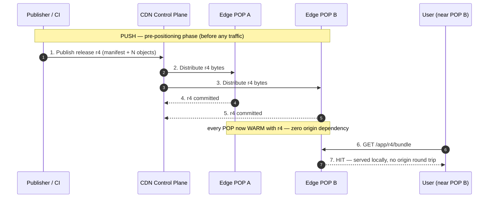
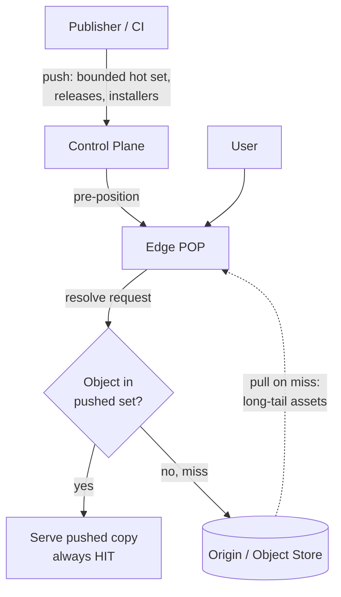

# Push CDN — Senior

<!-- level-focus -->
At senior level, focus on this question:

> Which system invariant is affected by **Push CDN** under failure, load, and change?

Use the smallest realistic scenario that exposes the decision and its failure behavior.
## 1. Responsibilities at This Level

At the senior level you are not choosing "a CDN" — you are choosing a **content
distribution strategy** and owning its consequences:

- **Model selection per workload.** The same product often needs both: push for
  the software installer, pull for user-uploaded avatars. You decide the boundary
  and justify it with numbers (catalog size, request distribution, launch risk).
- **Propagation SLOs.** Define what "the release is live" means. Is it live when
  the origin has the new bytes, when 50% of POPs have them, or when the *last*
  POP confirms? Push makes this measurable; you own the target and the dashboard.
- **Atomicity guarantees.** Guarantee that no client ever sees a mix of v3 and v4
  assets, even during a 20-minute global propagation window. This is a design
  problem, not a config toggle.
- **Cost ownership.** Push means paying to store the *entire* catalog at *every*
  POP (or every POP in a tier) regardless of whether a byte is ever read. You own
  the trade-off between that storage bill and the origin-egress + tail-latency
  bill that pull incurs.
- **Failure detection.** Pull fails "loudly" (a miss, an origin 5xx). Push fails
  *silently* — a stale version sits warm and fast at the edge, serving wrong
  content at full speed. You own the tooling that catches this.

---

## 2. Push vs Pull — The Core Model Difference

**Pull (on-demand):** the edge holds nothing until a user asks. First request for
an object is a **miss** → the edge fetches from origin, caches, then serves.
Population is *demand-driven*; the working set at the edge equals what users
actually request, bounded by TTL and eviction.

**Push (pre-positioned):** you (the publisher) actively upload content to edge
storage *before* any user requests it. Population is *publish-driven*; the edge
holds what you decided to place there, and objects live until you explicitly
remove or replace them — there is typically **no TTL-based eviction** of pushed
content, because eviction would defeat the guarantee that the edge is warm.



The defining property: with push, **the first user and the millionth user have
the same latency**, and the origin sees **zero** read traffic for pushed objects.
With pull, the first user in each region pays the origin round-trip and the origin
sees a miss-rate proportional to catalog churn and POP count.

| Dimension | Pull (on-demand) | Push (pre-positioned) |
|---|---|---|
| **Edge population** | Lazy, demand-driven | Eager, publish-driven |
| **First-request latency** | Miss → origin round trip (cold) | HIT — always warm |
| **Origin read load** | Proportional to miss rate × POP count | ~Zero for pushed objects |
| **Freshness / invalidation** | TTL + purge; risk of stale-on-miss | Explicit swap; risk of stale-if-not-swapped |
| **Edge storage cost** | Only the hot working set | **Entire catalog × every POP** |
| **Cost driver** | Origin egress + tail latency | Edge storage + distribution bandwidth |
| **Predictability at launch** | Cold-start miss storm on release | Deterministic — warm before flag flips |
| **Operational surface** | Cache-header tuning, purge API | Manifest/version pipeline, propagation tracking |
| **Best for** | Long-tail, unpredictable, huge catalog | Bounded, predictable, high-value catalog |

---

## 3. When Push Wins

Push earns its cost in a narrow but important set of workloads:

**1. Large media / software distribution with a bounded catalog.**
Game clients, OS updates, app installers, ML model weights, container base images.
The catalog is finite and known, each object is large, and *everyone* pulls the
*same* bytes. Pulling would mean a thundering herd of misses hammering the origin
the moment a release drops. Pushing pre-warms every POP so day-one download demand
is served entirely from the edge.

> Worked example — game patch day. 40 GB client update, 5 M players downloading in
> the first 6 hours. With pull, the first player per POP triggers a 40 GB origin
> fetch, and cold POPs serialize behind origin bandwidth during the exact spike
> you cannot afford. Pushing the 40 GB to all POPs the night before means launch
> traffic never touches origin. The 40 GB × POP-count storage cost is trivial next
> to the origin egress and the reputational cost of a stalled launch.

**2. Predictable catalogs where the working set ≈ the whole catalog.**
If almost every object is requested somewhere within its lifetime, pull's
"only cache what's hot" advantage evaporates — you end up caching nearly
everything anyway, but *reactively* and with a miss penalty on each cold object.
Push just does it deterministically.

**3. Avoiding origin load spikes.**
Push decouples the origin from user traffic entirely for the pushed set. The
origin becomes a *publishing* endpoint (write-mostly, low QPS) rather than a
*serving* endpoint (read-heavy, spiky). This is a availability win: origin
capacity planning stops depending on user traffic patterns.

**4. Guaranteed-warm edges for launches / synchronized releases.**
A coordinated global launch (a new album at midnight, a keynote demo, a
regulatory-mandated document update) needs every region warm at the *same
instant*. Push lets you stage the bytes everywhere in advance, then flip a single
manifest pointer — see §5. Pull cannot guarantee this; each region warms only as
its first local user arrives, producing a ragged, latency-skewed rollout.

---

## 4. The Storage-vs-Traffic Cost Trade-off

This is the central senior trade-off. **Push converts a traffic problem into a
storage problem.** You stop paying per-miss origin egress and instead pay to store
every object at every POP, *including objects that are rarely or never read*.

```text
Pull cost model (per object, per region):
  cost ≈ (miss_rate × object_size × origin_egress_$/GB)
       + (P(cold) × tail_latency_penalty)          # SLA / UX cost
  → You pay ONLY for what is requested. Cold long-tail objects cost ~nothing.

Push cost model (per object):
  cost ≈ object_size × POP_count × edge_storage_$/GB/month
       + object_size × POP_count × distribution_$/GB   # one-time per publish
  → You pay for EVERYTHING, everywhere, forever — read or not.
```

The break-even is governed by the **access distribution**, not the raw catalog
size:

```text
Let:
  S    = catalog size (GB)
  N    = number of POPs holding a full copy
  h    = fraction of catalog actually requested per region ("hot fraction")

Pull stores ≈ S × h per region  (only the hot slice materializes)
Push stores ≈ S     per region  (the whole thing, unconditionally)

Push storage overhead factor ≈ 1 / h.
  If 90% of objects are read somewhere (h = 0.9): push overhead is ~1.1× — cheap.
  If only 5% of objects are ever read (h = 0.05): push wastes 20× the storage
    on cold bytes — pull is dramatically cheaper.
```

**The decision rule:** push wins when the catalog is *small enough* that
`S × N × storage_$` is less than the origin-egress + tail-latency cost pull would
incur, **and** the hot fraction `h` is high (little cold long-tail to subsidize).
Push loses when the catalog is huge with a long cold tail (user-generated content,
a 10 PB media library where 99% of assets are viewed once a year).

**Storage bloat is the failure mode of this trade-off** (see §7): because pushed
objects have no eviction, an undisciplined pipeline accumulates every version
ever published at every POP, and the storage bill grows monotonically until
someone builds retention.

---

## 5. Consistency, Versioning, and Atomic Swaps

Push introduces a consistency problem pull mostly avoids. Distribution is **not
instantaneous** — a global publish takes seconds to tens of minutes to reach every
POP. During that window the fleet is in a **partially propagated** state: some POPs
have v4, some still have v3. Three hazards follow:

- **Cross-asset skew.** A page loads `index.html` (v4) from a fast POP but
  `bundle.js` (still v3) from a lagging POP → broken page. The unit of atomicity
  must be the *release*, not the individual object.
- **Mid-flight version flip.** A user's session starts on v3 and a subsequent
  request lands on a POP that just swapped to v4 → inconsistent experience.
- **Cache-busting.** Overwriting an object in place (`bundle.js`) is fatal: any
  client or intermediary holding the old bytes under the same URL serves stale
  content with no way to distinguish versions.

**The correct pattern is immutable, content-addressed objects + an atomic manifest
pointer swap.** Never mutate a published object. Publish every version under a
version-scoped or hash-scoped path (`/r4/bundle.<hash>.js`), push *all* of a
release's objects to *all* POPs, wait for full propagation, then flip a single
tiny pointer (the manifest / current-version file) atomically. The pointer flip is
the only mutation, and it is small enough to swap near-instantly.

```mermaid
sequenceDiagram
    autonumber
    participant CI as CI / Publisher
    participant Ctrl as Control Plane
    participant POPs as All Edge POPs
    participant U as User

    Note over CI,POPs: Phase 1 — stage immutable objects (no user impact)
    CI->>Ctrl: 1. Publish release r4 objects under /r4/<hash>...
    Ctrl->>POPs: 2. Distribute r4 bytes to every POP
    POPs-->>Ctrl: 3. Each POP ACKs "r4 fully committed"
    Note over Ctrl,POPs: "current" pointer still → r3; users unaffected

    Note over Ctrl,POPs: Phase 2 — barrier: wait for 100% propagation
    Ctrl->>Ctrl: 4. All POPs report r4 present? (else: hold / rollback)

    Note over Ctrl,POPs: Phase 3 — atomic swap (one tiny pointer)
    Ctrl->>POPs: 5. Set current = r4 (manifest pointer flip)
    U->>POPs: 6. GET /current/app
    POPs-->>U: 7. Resolves → r4 — every POP now consistent

    Note over Ctrl,POPs: Rollback = flip pointer back to r3 (r3 bytes still present)
```

Design consequences:

- **Barrier before swap.** The control plane must confirm *every* target POP holds
  the full release before flipping the pointer. Flip early and you serve a mix; a
  lagging POP resolves `/current` to a version it doesn't have → miss or error.
- **Keep the previous version's bytes resident** for the rollback window. Because
  objects are immutable and version-scoped, rollback is *also* a pointer flip —
  instant, and it needs no re-distribution because r3 bytes never left the edge.
- **Cache-busting is free** with content-addressed URLs: a changed object has a
  new hash → new URL → no intermediary can serve stale bytes under it. The only
  thing that must be revalidatable/short-TTL is the tiny manifest pointer itself.
- **Partial-propagation policy.** Decide up front: if POP #340 of 350 never ACKs,
  do you (a) hold the release, (b) flip anyway and let that POP fall back to
  origin/pull for `/current`, or (c) abort? Each is defensible; the choice is a
  senior judgment call tied to your availability SLO.

---

## 6. Hybrid Push + Pull Architectures

The mature answer is rarely "all push" or "all pull." Most large systems run a
**hybrid**: push the small, high-value, launch-critical set; pull the large,
unpredictable long tail. This captures push's warm-launch guarantee for the assets
that need it while letting pull's demand-driven economics handle everything else.



Common hybrid patterns:

- **Tiered pre-warming.** Push to a small set of **regional origin-shield / parent
  POPs**, not to every edge. Edges pull from the nearby warm shield on miss. This
  bounds storage cost (you store the full catalog at ~10 shields, not 350 edges)
  while still protecting the origin from spikes and keeping edge misses cheap and
  local. This is the most common real-world compromise.
- **Predictive push (pull with a warming hint).** Run pull as the base model, but
  proactively push objects you *predict* will be hot — a new release, a video
  about to be promoted on the homepage — moments before demand arrives. You get
  pull's economics with push's spike protection for the assets that matter.
- **Push manifest, pull chunks.** For large media, push the small manifest/index
  (so discovery and version resolution are always warm and atomic) and pull the
  large data chunks on demand. The atomic-swap guarantee lives on the tiny
  manifest; the heavy bytes ride the cheaper pull path.

The senior skill is drawing the push/pull boundary deliberately and revisiting it
as the access distribution shifts — an asset that was long-tail can become
launch-critical, and vice versa.

---

## 7. Failure Modes Unique to Push

Push has a distinct failure surface. The unifying theme: **push failures are
silent and fast**, whereas pull failures are loud and slow. A stale pushed object
serves at full edge speed with a perfect cache-hit metric — nothing looks wrong.

**1. Stale pushed content (the swap that never happened).**
An object was pushed once and never updated, or a publish job silently failed to
reach some POPs. Because pushed content has no TTL, it will serve the *old* bytes
*forever* at full speed. There is no miss to trigger a refresh.
*Mitigation:* treat every publish as versioned and verified — the control plane
must reconcile "what each POP holds" against "what the current manifest declares,"
and alert on drift. Never rely on TTL expiry as a safety net; there isn't one.

**2. Incomplete / partial propagation.**
The publish reaches most POPs but not all, and the pointer is flipped anyway.
Users routed to a lagging POP get a version that resolves to bytes it doesn't have
→ hard error or an unintended fallback. Worse, cross-asset skew produces broken
composite pages.
*Mitigation:* the propagation barrier of §5 — confirm 100% (or a defined quorum)
before swap; expose a per-release "propagation completeness" gauge; define the
partial-propagation policy explicitly.

**3. Storage bloat.**
Every version, at every POP, with no eviction. Without a retention policy the
storage footprint grows monotonically and unboundedly — old releases, abandoned
experiments, orphaned objects whose manifest no longer references them all
accumulate.
*Mitigation:* garbage-collect versions older than the rollback window; enforce a
retention SLA; track "resident versions per POP" and alert when it exceeds N.
Reachability must be computed from live manifests, not guessed.

**4. Distribution pipeline as a new SPOF / bottleneck.**
The control plane that fans content out to every POP is now on the critical path
for every release. If it is slow or down, you cannot publish — and if it pushes
*bad* bytes, it pushes them *everywhere* simultaneously. Push amplifies mistakes
to global scale instantly.
*Mitigation:* canary the push (a few POPs first, verify, then fan out); make the
pipeline idempotent and resumable; keep rollback a pure pointer flip.

**5. Poisoned edge / consistent corruption.**
A corrupt or malicious object pushed globally is now warm and fast at every POP —
pull would at least re-fetch from origin on TTL expiry, but push has no such
self-heal.
*Mitigation:* content-addressed integrity (hash in the URL), signed manifests, and
a fast global purge-and-repush path.

```text
Detection posture (what to actually monitor for a push CDN):
  - manifest-vs-resident drift per POP        → catches stale / failed pushes
  - per-release propagation completeness (%)  → catches incomplete propagation
  - resident version count per POP            → catches storage bloat
  - time-to-full-propagation (SLO)            → catches slow / stuck distribution
  - integrity check on pushed objects (hash)  → catches poisoned edge
  NOTE: cache-HIT-rate is USELESS here — a stale push is a 100% HIT.
```

---

## 8. When Push Is the Wrong Model

Push is a specialized tool; reaching for it by default is a classic
over-engineering mistake. Prefer pull when:

- **The catalog is huge with a long cold tail.** User-generated content, a photo
  service, a video library where the vast majority of objects are viewed rarely.
  Pushing everything means paying `1/h` storage overhead (§4) to pre-position bytes
  nobody reads. Pull's demand-driven population is exactly right here.
- **Content is dynamic or per-user.** Personalized responses, API payloads,
  session-specific data — there is nothing static to pre-position, and pushing is
  meaningless. This is dynamic-acceleration / pull territory.
- **The access pattern is unpredictable.** If you cannot tell in advance what will
  be hot, you cannot pre-position it usefully; you'd push everything (bloat) or
  guess wrong. Pull adapts to reality automatically.
- **Freshness must be immediate and content changes constantly.** A catalog that
  mutates faster than it can propagate spends all its time in partial-propagation
  states. Pull with short TTLs (or purge-on-write) is simpler and safer.
- **You lack the operational maturity to run a versioned pipeline.** Push's
  correctness *depends* on immutable versioning, propagation barriers, retention
  GC, and drift detection. Without that discipline, push's silent-staleness and
  bloat failure modes will bite. Pull is more forgiving: TTL expiry is a built-in
  (if crude) self-heal that a push system deliberately gives up.

> Senior heuristic: **default to pull; add push surgically** for the bounded,
> high-value, launch-critical, predictably-hot subset where a cold-start miss storm
> or a ragged global rollout is genuinely unacceptable. If you cannot name *which
> specific assets* need push and *why pull's cold-start hurts them*, you don't need
> push yet.

---

## 9. Senior Checklist

- [ ] Push/pull boundary drawn per-workload and justified with the hot-fraction
      `h` and the storage-vs-egress cost comparison — not by default.
- [ ] Every pushed object is **immutable and version/hash-scoped**; nothing is
      overwritten in place (cache-busting is free by construction).
- [ ] Release is the unit of atomicity; a **propagation barrier** confirms full
      (or quorum) POP coverage before the manifest pointer flips.
- [ ] Rollback is a pointer flip to a still-resident previous version; the
      rollback window is defined and the old bytes are retained for it.
- [ ] **Partial-propagation policy** is written down (hold / flip-with-fallback /
      abort) and tied to the availability SLO.
- [ ] **Retention / GC** removes versions past the rollback window; resident
      version count per POP is bounded and alerted.
- [ ] Monitoring targets push's real risks — **manifest-vs-resident drift,
      propagation completeness, time-to-propagate** — not cache-hit-rate (a stale
      push reads as 100% HIT).
- [ ] Distribution pipeline is canaried, idempotent, resumable, and not an
      unmitigated global SPOF for bad-byte fan-out.
- [ ] Hybrid considered: push the hot/launch set, pull the long tail; tiered
      origin-shield used to bound edge storage where full-fleet push is too costly.

*Next step:* [Push CDN — Professional](professional.md)

---

## Apply it

1. State the system invariant that **Push CDN** must protect.
2. Mark ownership, state, and failure propagation at each boundary.
3. Compare two designs under load, dependency failure, and future change.
4. Define recovery and compatibility behavior before implementation.
5. Test the riskiest assumption with a focused experiment.

## Verify your work

- The experiment supports the design with evidence, not preference.
- Failure injection shows the blast radius and recovery path.
- Compatibility checks cover old and new callers or data.
- Operational signals reveal invariant violations and recovery progress.

## Review questions

- Which invariant must remain true when Push CDN fails?
- Where should recovery responsibility live, and why?
- Which assumption deserves an experiment before implementation?
- How can the design evolve without changing every consumer at once?
