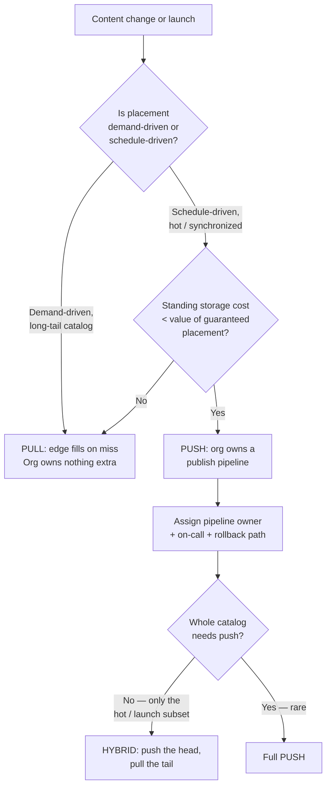
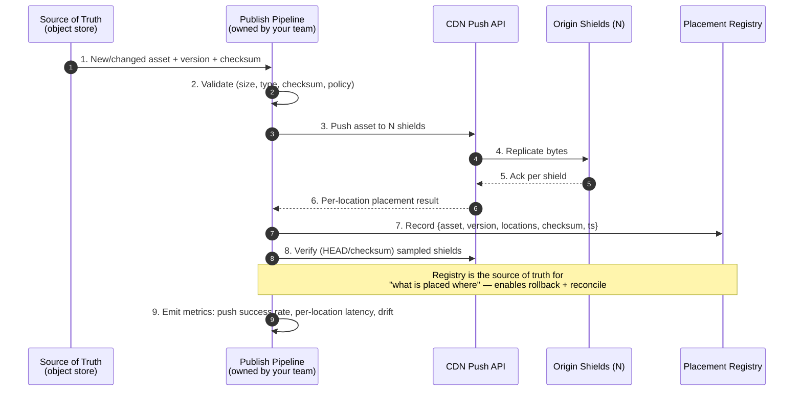
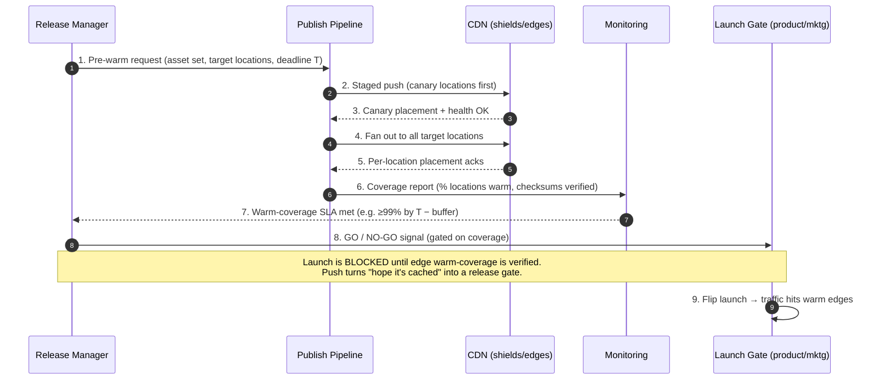

# Push CDN — Staff

> **Axis:** organizational scope & judgment — NOT the mechanics of push vs pull (that is `junior`/`middle`/`senior`) nor the freshness/consistency math (`professional`). This file answers: as a Staff/Principal engineer, when do you commit an organization to a **push** delivery model, who owns the publish pipeline, how do you model its total cost, and how do you coordinate it across many teams and large launches over years?

---

## Table of Contents

1. [The Staff Framing: Push Is an Ownership Decision, Not a Config Flag](#1-the-staff-framing-push-is-an-ownership-decision-not-a-config-flag)
2. [Push vs Pull vs Hybrid — The Strategic Comparison](#2-push-vs-pull-vs-hybrid--the-strategic-comparison)
3. [The Total-Cost Model: Storage-Heavy vs Egress-Heavy Billing](#3-the-total-cost-model-storage-heavy-vs-egress-heavy-billing)
4. [Operational Ownership of the Publish Pipeline](#4-operational-ownership-of-the-publish-pipeline)
5. [Rollback of a Bad Push](#5-rollback-of-a-bad-push)
6. [Release Coordination for Large Launches (Pre-Warming Edges)](#6-release-coordination-for-large-launches-pre-warming-edges)
7. [Vendor Capabilities That Make Push Viable](#7-vendor-capabilities-that-make-push-viable)
8. [Build vs Buy vs Adopt](#8-build-vs-buy-vs-adopt)
9. [When NOT to Use Push](#9-when-not-to-use-push)
10. [Second-Order Consequences & the Metrics You Watch](#10-second-order-consequences--the-metrics-you-watch)
11. [Staff Checklist](#11-staff-checklist)

---

## 1. The Staff Framing: Push Is an Ownership Decision, Not a Config Flag

A pull CDN is *demand-driven*: the edge fetches from origin on the first miss, and the CDN's cache-fill logic decides what lives where. Nobody on your team runs the fill. A **push CDN inverts this**: your organization becomes responsible for *placing* content on edges (or origin shields) ahead of demand, tracking what is where, expiring it, and reconciling the edge footprint against the source of truth. That responsibility does not disappear if you buy a managed product — it moves into a **publish pipeline you now own and must staff, monitor, and put on-call.**

The junior/senior tiers treat push as a technique. At Staff scale the question is different and sharper:

- **Push turns delivery into a deploy.** Every content change becomes a distribution job with a success rate, a latency, a failure mode, and a rollback. You are signing up to operate a fleet-wide replication system, not to set `Cache-Control`.
- **Push moves cost from egress to storage.** You stop paying primarily for bytes served on miss and start paying to keep bytes resident across a large number of PoPs whether or not they are requested. This is a **billing-shape change** that can be a huge win or a huge waste depending on the catalog's access distribution (§3).
- **Push is a coordination surface.** For a synchronized launch — a game patch, a film drop, a firmware update, a Black Friday asset bundle — push lets you guarantee the bytes are already at the edge before the traffic hits. That guarantee is a *cross-team promise* you make to marketing, product, and downstream services.

The core Staff judgment: **push earns its keep only when the value of guaranteed placement (predictable first-byte latency, no origin thundering-herd, launch-time certainty) exceeds the standing storage cost plus the operational cost of owning the pipeline.** Most catalogs do not clear that bar; a minority — large, hot, launch-synchronized, latency-critical — clear it decisively.



The decision that most often survives contact with reality is **not full push — it is hybrid**: push the small, hot, launch-critical head of the catalog; let the long tail fill on demand via pull. Full push across an entire large catalog is almost always a cost mistake; §3 and §9 explain why.

---

## 2. Push vs Pull vs Hybrid — The Strategic Comparison

| Dimension | **Pull CDN** | **Push CDN** | **Hybrid (push head, pull tail)** |
|-----------|-------------|-------------|-----------------------------------|
| Who decides placement | CDN (on first miss) | **Your org** (publish pipeline) | Your org for the head; CDN for the tail |
| First-request latency | Cold miss → origin RTT | Warm — bytes pre-placed | Warm for the head; cold for the tail |
| Origin load at launch | Thundering herd on miss storm | None (edges pre-loaded) | None for pushed assets |
| Dominant cost driver | Egress + request volume | **Standing edge/shield storage** | Storage for head + egress for tail |
| Cost efficiency for long-tail | High (only stores requested) | **Poor** (stores unrequested bytes) | High (tail stays demand-driven) |
| Cost efficiency for hot head | Repeated origin fills on eviction | **High** (placed once, served many) | High |
| Operational ownership | Minimal — CDN owns fill | **Heavy** — publish pipeline, on-call, reconciliation | Moderate — pipeline scoped to the head |
| Launch readiness (pre-warm) | Best-effort; may still miss | **Deterministic** — verified placement | Deterministic for the launch bundle |
| Rollback of a bad asset | Purge + re-fill on demand | **Re-push prior version fleet-wide** | Re-push head; purge tail |
| Freshness / invalidation | TTL + purge; simple mental model | Must actively expire/replace pushed copies | Two models to reason about |
| Failure blast radius | Localized (one edge misses) | Fleet-wide (a bad push hits all edges) | Bounded to the pushed subset |
| Good fit | Long-tail, unpredictable, most web assets | Hot, large, synchronized, latency-SLA assets | Catalogs with a clear hot/cold split (the common case) |

**How to read this table as a Staff engineer:** the columns are not "better/worse" — they are *different bill shapes and different ownership burdens*. Pull is the correct default because it externalizes both placement decisions and standing storage cost. You move toward push only for the subset of content where the pull defaults visibly fail: a cold-miss latency you cannot tolerate, an origin that cannot survive a launch miss-storm, or a repeatedly-evicted hot object whose re-fill cost exceeds the cost of pinning it. In practice that subset is a *head*, not the whole catalog, which is why the winning architecture is usually the third column.

---

## 3. The Total-Cost Model: Storage-Heavy vs Egress-Heavy Billing

The single most important Staff artifact for this decision is a **TCO model that makes the billing-shape switch explicit.** Pull bills you mostly for *bytes served* and *requests*. Push bills you mostly for *bytes resident × number of locations × time*, plus the amortized cost of running the pipeline. Getting the crossover point right is the whole game.

```text
PULL cost (per month, per object class):
  C_pull ≈ egress_GB × price_egress
         + requests × price_per_10k_requests
         + origin_fill_egress × price_origin_egress   (re-fills after eviction)

PUSH cost (per month, per object class):
  C_push ≈ resident_GB × N_locations × price_edge_storage
         + push_bandwidth_GB × price_push          (replicating to N locations)
         + egress_GB × price_egress                (you still pay to serve)
         + pipeline_ops_amortized                  (people + tooling + on-call)

  Note: push does NOT remove egress — you still pay to serve bytes to users.
        Push REMOVES cold-miss origin fills and ADDS standing storage.
```

**The two forces that decide it:**

1. **Access concentration.** If a small fraction of objects serves the vast majority of requests (a steep head, classic ~80/20 or steeper), pushing *that head* is cheap-per-value: little resident storage, enormous served volume. Pushing the *tail* is the opposite: you pay `resident_GB × N_locations` for bytes almost nobody requests. **Push only what is hot enough that standing storage < avoided re-fill + latency value.**

2. **Location fan-out (N).** Push cost scales with the number of PoPs you replicate to. A CDN with hundreds of PoPs makes *full* push expensive fast, because storage cost is multiplied by N. This is why mature push offerings replicate to a **small number of origin-shield / regional tiers** and let the last-mile edge pull from the shield — you get warm shields (no origin herd, low fan-out storage) without paying to pin every byte at every last-mile edge.

**Worked example — a games publisher's patch-day bundle:**

```text
Catalog: 4 TB of live game assets. Hot launch bundle (the new patch) = 40 GB.
Locations to place at: 20 origin shields (NOT hundreds of edges).
Launch: 5M players pull the 40 GB patch within the first 6 hours.

PULL-only (no push):
  First requests miss → 20 shields each fill 40 GB from origin ≈ near-simultaneous
  origin egress spike; realistic thundering-herd risk of origin saturation and
  elevated P99 for the first cohort. Served egress: 5M × 40 GB = 200 PB (dominant
  cost either way).

HYBRID (push the 40 GB bundle to 20 shields, pull the 4 TB tail on demand):
  Extra standing storage: 40 GB × 20 = 800 GB pinned for ~2 weeks — trivial.
  Push bandwidth: 40 GB × 20 = 800 GB replicated once — trivial vs 200 PB served.
  Origin fill storm at launch: eliminated (shields pre-warmed).
  Served egress: identical 200 PB (push does not change what users download).

  → The push cost is a rounding error against served egress, and it buys a
    deterministic, herd-free launch. This is a textbook push win — BUT only for
    the 40 GB head, not the 4 TB catalog.
```

The Staff takeaway: **push rarely reduces your egress bill — it reduces origin load, tail latency, and launch risk, at the price of standing storage that is only justified for the hot head.** If someone proposes pushing the whole catalog "to make everything fast," the TCO model kills it: you multiply cold-tail storage by N locations and gain nothing, because nobody requests the tail.

---

## 4. Operational Ownership of the Publish Pipeline

Choosing push creates a new production system: the **publish pipeline** that gets bytes from the source of truth onto the CDN's push storage, verifies placement, and reconciles drift. Someone owns it, someone is paged for it, and it needs the same rigor as any deploy system.



**What ownership actually entails:**

- **A source of truth + a placement registry.** You must be able to answer "what version of asset X is on which locations right now?" A push system without a registry is unrollbackable and undebuggable. The registry is as important as the bytes.
- **Idempotent, versioned pushes.** Pushes must be re-runnable (a retried push must not corrupt state) and versioned (asset-vN, never mutate in place), so that verification and rollback are checksum-comparisons, not guesses.
- **Verification, not fire-and-forget.** A push API returning 200 means "accepted," not "resident on every location." Sample-verify placement (HEAD/checksum) and record per-location success. Partial placement is the normal failure mode, not an edge case.
- **Reconciliation / drift detection.** Edges get evicted, replaced, or added; the fleet's actual state drifts from the registry. A periodic reconcile job re-pushes missing hot assets and prunes stale ones. Without it, "pushed" silently degrades into "mostly pushed."
- **Clear ownership boundary.** Decide explicitly: does the **producing team** run the push (they know the content) or a **central platform team** run it as a paved road (consistent tooling, one on-call)? The common scalable answer: platform owns the pipeline *mechanism* + on-call; producing teams own *what* they publish through a self-serve API. Ambiguity here is where 3 a.m. pages go unowned.

The Staff failure to avoid: treating push as "upload and forget." Push without a registry, verification, and reconciliation is not a delivery strategy — it is undetected partial coverage that produces cold misses exactly when you believed you had guaranteed warmth.

---

## 5. Rollback of a Bad Push

Push amplifies blast radius: a pull CDN serving a bad asset misses on one edge at a time; a push CDN has *actively distributed the bad bytes to every location*. Rollback must therefore be a first-class, rehearsed capability — the reason immutable, versioned assets and the registry matter.

```text
Rollback playbook for a bad push:

  1. DETECT: monitor (error rate, checksum mismatch, user reports, canary failure)
     flags asset-vN as bad. Freeze further publishes of that asset.

  2. IDENTIFY: query the placement registry for every location holding vN.

  3. DECIDE the mechanism:
     a) RE-PUSH prior good version (asset-vN-1) fleet-wide — the clean path,
        possible ONLY because you kept the prior version and never mutated in place.
     b) REPOINT the manifest/reference from vN back to vN-1 (fastest if consumers
        resolve by manifest indirection — flip a pointer, no byte movement).
     c) PURGE vN + let pull re-fill vN-1 from origin (last resort; reintroduces
        cold-miss latency and origin load during the incident).

  4. VERIFY: re-run placement verification; confirm registry reflects vN-1 on all
     hot locations; watch the health metric recover.

  5. POSTMORTEM: why did a bad asset pass pipeline validation + canary?
```

**Staff-level design choices that make rollback cheap:**

- **Manifest indirection.** Have consumers reference content by an indirection (a manifest, a versioned URL prefix) rather than a mutable path. Rollback becomes *flip the pointer* (option b) — near-instant, no re-replication. This is the single highest-leverage design decision for push rollback.
- **Canary the push.** Push to a small subset of locations (or a shadow prefix) first, verify health, then fan out. A staged push turns a fleet-wide incident into a contained one.
- **Never mutate in place.** In-place overwrite destroys the prior version and makes rollback impossible without re-fetching from an external source of truth mid-incident. Immutability is what makes option (a) exist.
- **Bounded re-push throughput.** Fleet-wide re-push consumes push bandwidth; know how long a full rollback physically takes (bytes × N ÷ push throughput) so the incident commander has a real ETA, not hope.

The judgment: with pull, "bad asset" is a purge; with push, "bad asset" is a *distributed rollback*, and its cost/latency is a property you designed in (or failed to) long before the incident.

---

## 6. Release Coordination for Large Launches (Pre-Warming Edges)

The flagship reason organizations adopt push is **launch-time certainty**: guaranteeing the bytes are already at the edge (or shield) *before* a synchronized traffic surge, so the first cohort of users gets warm-cache latency and the origin never sees a miss storm. This is inherently cross-team — the push schedule must be coordinated with the launch schedule owned by product/marketing.



**What Staff coordination looks like:**

- **Warm-coverage becomes a launch gate.** The go/no-go decision is conditioned on a *measured* coverage number ("≥99% of target locations verified warm by T − 30 min"), not on faith. Push is what makes that gate possible; without it you cannot promise it.
- **Pre-warm with a time buffer.** Push completes *before* the launch with margin for retries and partial-placement recovery. The pipeline's fleet-wide push throughput sets how early you must start — a Staff engineer computes this, not guesses it.
- **Stage the push (canary → fan-out).** Same discipline as a deploy: verify a few locations before committing bandwidth to all N, so a bad launch bundle is caught pre-fan-out.
- **Coordinate the *reveal*, not just the placement.** Bytes can be pre-placed under an unguessable/version-gated path so they are resident but not yet referenced; the launch flips the manifest pointer to reveal them. This decouples "content is warm everywhere" from "content is live," which is exactly what a synchronized global launch needs.
- **Communicate the contract across teams.** Marketing owns the launch time; the platform team owns warm-coverage; product owns the manifest flip. The Staff engineer's job is to make these interfaces explicit (who signals whom, what the gate metric is) so the launch does not hinge on a Slack message at T−0.

This is the capability pull simply cannot promise: pull is best-effort warmth, and a global launch is precisely the moment when best-effort produces a synchronized miss storm. If your organization runs large synchronized launches with hard latency expectations, that recurring need — not raw performance — is the real justification for owning a push pipeline.

---

## 7. Vendor Capabilities That Make Push Viable

Push is only worth owning if the CDN vendor exposes the primitives that let you operate it safely. When evaluating providers, a Staff engineer checks for these specifically — their absence turns push from "supported" into "hand-rolled and fragile."

- **A real push/pre-position API** with per-location placement results (not just "accepted") so you can build verification and a registry.
- **Origin-shield / regional tiering**, so you push to a *small N* of shields rather than every last-mile edge — the difference between affordable and absurd storage cost (§3).
- **Immutable, versioned object support** (content-addressed or version-prefixed) so rollback and verification are checksum comparisons.
- **Manifest / indirection support** (fast pointer flips) for cheap rollback and launch reveals (§5, §6).
- **Placement/coverage reporting** — an API or dashboard answering "what is resident where," or you must reconstruct it yourself.
- **Staged/canary push** and **bounded purge/re-push throughput with SLAs**, so incident ETAs are real.
- **Cost transparency on storage-per-location**, because push economics live or die on `resident_GB × N` and you must be able to model it before committing.

Consult the specific provider's official documentation for exact capabilities and pricing; capabilities and terminology differ across vendors and change over time. The Staff discipline is to map *your* required primitives (verification, shields, versioning, indirection, coverage reporting) against the vendor's actual offering before adopting — not to assume "supports push" means "supports the push you need."

---

## 8. Build vs Buy vs Adopt

| Option | When it wins | Hidden cost |
|--------|-------------|-------------|
| **Buy** (managed CDN push feature) | You need push semantics but not custom placement logic; vendor exposes the primitives in §7 | Lock-in to the vendor's push model + registry; storage-per-location pricing; migration friction if you outgrow it |
| **Build** the publish pipeline *on top of* a CDN's push API | The pipeline (validation, registry, verification, reconcile, launch gates) is org-specific and a differentiator (e.g. a games/streaming platform whose launches are the business) | You now own and staff a production replication + reconciliation system with on-call, forever |
| **Adopt** a general delivery/replication tool or multi-CDN abstraction | You need vendor-neutral placement across multiple CDNs and control the orchestration layer | Operational burden, upgrade treadmill, and you re-own verification/registry across heterogeneous backends |

**The realistic Staff decision:** *buy the byte-movement, build the pipeline.* Almost nobody should build push storage/replication itself — CDNs do that better. But the **publish pipeline** (validation, versioning, placement registry, verification, reconciliation, canary, and launch gates) is where your org-specific risk lives, and it is usually built in-house on top of the vendor's push API. Where launches *are* the product (game patches, film releases, large firmware/OTA fleets), that pipeline is a genuine differentiator and worth the standing team. Where content is incidental to the product, even the pipeline should be minimized — which usually means dropping to hybrid or pure pull (§9).

**Reversibility:** adopting push is closer to a *one-way-ish door* than pull is. Once launches depend on warm-coverage gates and rollback depends on the placement registry, unwinding push means rebuilding those guarantees on pull's best-effort semantics. Keep the exit visible: hybrid (push a shrinking head) is the natural de-scoping path back toward pull.

---

## 9. When NOT to Use Push

Push is the *wrong* answer more often than it is the right one. The characteristic Staff mistake is a less-experienced engineer reaching for push to "make everything fast" and importing a fleet-wide replication system to solve a problem pull already solves for free.

**Do not use push when:**

- **The catalog is long-tail / low-hit.** Pushing bytes nobody requests pays `resident_GB × N_locations` for zero benefit. Pull is strictly cheaper and simpler. This is the number-one anti-pattern.
- **Content changes constantly.** High churn means constant re-push, constant reconciliation, constant rollback surface. Pull with sane TTLs is far cheaper to operate; push shines for content that is *placed once and served many times*, not content in flux.
- **You have no launch-synchronization or latency-SLA need.** If best-effort warmth is fine and origin can absorb miss storms, push buys you nothing but a pipeline to run.
- **You cannot staff the pipeline.** Push without an owner, registry, verification, and reconciliation degrades to undetected partial coverage — worse than pull because you *believe* you are warm. If you cannot fund the on-call, do not adopt push.
- **The whole catalog "needs to be fast."** It doesn't — the *head* does. The right answer is hybrid: push the hot/launch subset, pull the tail. Full push is the over-engineered trap.
- **The vendor lacks shields/versioning/coverage-reporting (§7).** Without those primitives you are building push on sand; the operational cost balloons.

The simpler alternatives an over-eager engineer skips past: **tune pull first** (longer TTLs, `stale-while-revalidate`, origin shielding to break the herd) and reach for push *only* for the specific assets where measured cold-miss latency or launch risk proves pull insufficient.

---

## 10. Second-Order Consequences & the Metrics You Watch

**Downstream effects 6–12 months after adopting push:**

- **Publish becomes a bottleneck at launch scale.** As launches grow, fleet-wide push throughput and verification time become the critical path for go-live. You'll be forced to invest in push parallelism, canary tiers, and coverage SLAs — plan for it.
- **The placement registry becomes load-bearing.** Rollback, reconciliation, and coverage reporting all depend on it. It quietly becomes a tier-1 system; treat its availability and correctness accordingly.
- **Storage cost creep from stale placements.** Without disciplined expiry/reconcile, old versions accumulate across N locations and the storage bill grows silently. A reconcile job that prunes is not optional.
- **Cross-team coupling to the launch gate.** Once marketing/product depend on warm-coverage as a go/no-go signal, your pipeline's reliability is *their* launch risk. That coupling is powerful (you can guarantee launches) and dangerous (your outage blocks theirs) — govern it with clear SLAs.
- **Cognitive load on operators.** Two delivery mental models (push freshness + pull TTLs in a hybrid) increase the surface engineers must reason about. Document which content class uses which, or on-call will guess wrong during incidents.

**The metrics that tell you the decision is going wrong:**

| Metric | Healthy signal | Decision-is-going-wrong signal |
|--------|----------------|-------------------------------|
| Warm-coverage % at launch T | ≥ target (e.g. 99%) with buffer | Coverage missed → launches gated on hope, not push |
| Push success rate / per-location | High, stable | Rising partial-placement → registry lies, cold misses hide |
| Standing storage cost vs served value | Storage ≪ value of pushed head | Storage growing on cold tail → you pushed too much |
| Reconcile drift | Small, self-healing | Growing drift → "pushed" is silently degrading |
| Rollback time (measured, not assumed) | Within incident budget | Unknown or too slow → no real rollback capability |
| Fraction of catalog pushed | Bounded to the hot head | Creeping toward the whole catalog → hybrid discipline lost |

The single best leading indicator that push has stopped paying off: **storage cost rising while the pushed set spreads into the cold tail.** That is the moment to de-scope back toward hybrid — push a smaller head, let pull reclaim the tail.

---

## 11. Staff Checklist

- [ ] Decision captured as an ADR: *why push (or hybrid)* for this specific content class, with the TCO model and the crossover point that flips push vs pull, not a hand-wave.
- [ ] Scoped to the **hot / launch head**, with the long tail explicitly left on pull (hybrid) unless a full-push justification survives the cost model.
- [ ] TCO models `resident_GB × N_locations × price` against pull's egress + re-fill cost; push to **shields (small N)**, not every edge.
- [ ] Publish pipeline has a **placement registry**, **versioned/immutable assets**, **verification** (not fire-and-forget), and a **reconcile/drift** job.
- [ ] Ownership assigned: platform owns the pipeline mechanism + on-call; producing teams own what they publish. No unowned 3 a.m. pages.
- [ ] Rollback is designed and **rehearsed** — manifest indirection for pointer-flip rollback, canary push before fan-out, measured full-rollback ETA.
- [ ] Large launches gated on **measured warm-coverage** with a time buffer; the cross-team go/no-go interface (who signals whom) is explicit.
- [ ] Vendor evaluated against the §7 primitives (shields, versioning, coverage reporting, staged push, storage cost transparency) before adoption.
- [ ] "When NOT to use push" written down so others don't cargo-cult full-catalog push; pull tuning (TTL, `stale-while-revalidate`, shielding) tried first.
- [ ] Exit path visible: hybrid de-scoping (shrink the pushed head) is the documented route back toward pull if the economics turn.

*Next step:* [Push CDN — Interview](interview.md)
