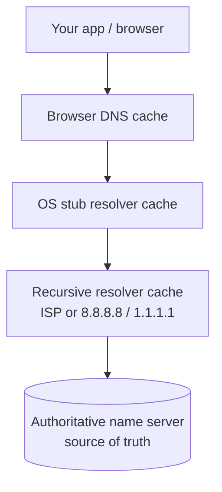
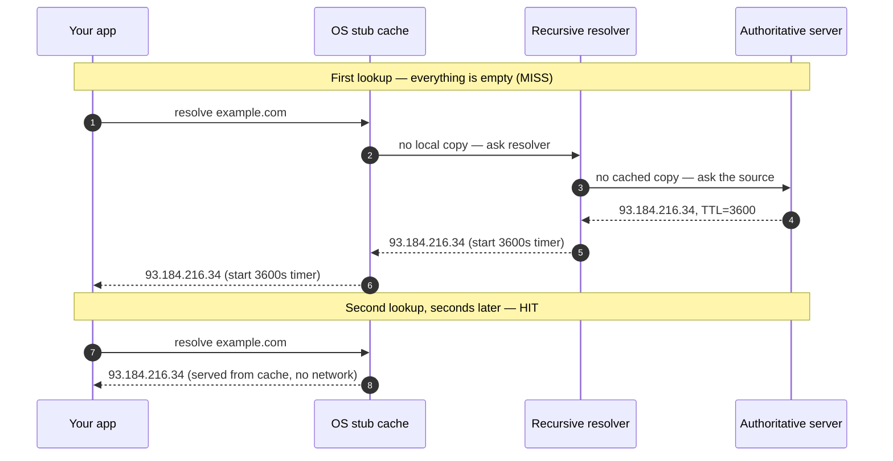
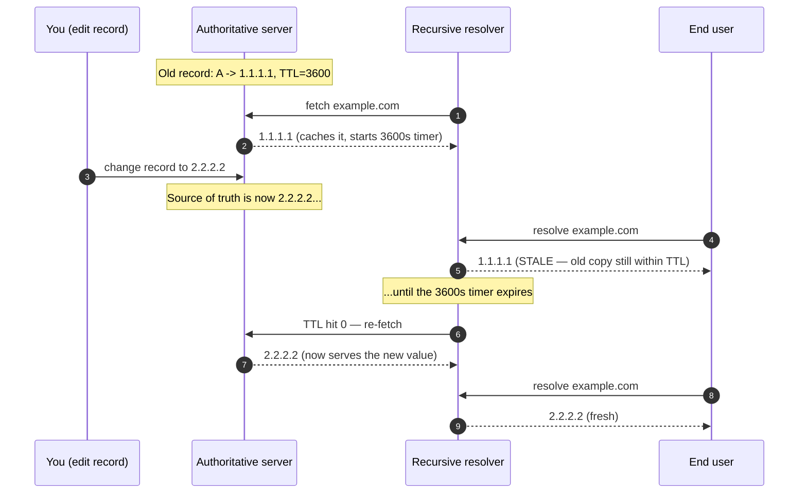

# DNS Caching & TTL — Junior

<!-- level-focus -->
At junior level, focus on this question:

> How can I apply **DNS Caching & TTL** in one small example and prove the result?

Use the smallest realistic scenario that exposes the decision and its failure behavior.
## 1. Why DNS answers are cached

A cold DNS lookup — one where nothing along the path remembers the answer — is a multi-hop journey. Your resolver has to ask a root server *which servers run `com`*, then ask a `com` server *which servers run `example.com`*, then ask `example.com`'s own servers for the final address. Each hop is a network round trip, and some of those servers live on other continents. Doing that on every single request would add tens or hundreds of milliseconds before your browser could even open a connection.

But look at what you're asking for: the IP address behind a name. That address is stable — it might not change for weeks or months. Asking for it fresh every time is like re-reading the entire phone book to look up a friend whose number you already know. So DNS caches: once an answer has been fetched, every machine on the path keeps it and reuses it for the next identical question. The full cross-planet journey happens once; afterward the answer is served locally in microseconds.

Caching is not an optimization bolted onto DNS — it is a core part of the design. Without it, root and TLD servers would be crushed under the query volume of the entire internet. With it, the vast majority of lookups are answered by a nearby cache and never reach the authoritative source at all.

## 2. What TTL means

Every DNS record comes with a **TTL — Time To Live** — a number of *seconds* that says: "you may reuse this answer for this long." It is the record owner's promise about freshness. A TTL of `3600` means "this answer is good for one hour"; a TTL of `30` means "only trust this for 30 seconds, then ask again."

The TTL is set by whoever controls the domain's authoritative records. When a resolver caches an answer, it starts a countdown from that TTL value. While the countdown is above zero, the cached copy is served directly. When it hits zero, the entry is **expired** — the cache throws it away, and the next request for that name triggers a fresh lookup.

Two things make TTL easy to reason about once you see them:

- **TTL is a maximum, not a schedule.** It is the *longest* a cached answer may be kept, not a guarantee it will be kept that long — a cache under memory pressure may evict an entry early.
- **The countdown is per-cache.** Each layer that caches an answer runs its own timer, and those timers start at different moments. This is exactly why a change to a record doesn't take effect everywhere at once (see [section 7](#7-why-a-change-isnt-instant-propagation)).

The authoritative TTL and the meaning of the fields in a record are defined in **RFC 1035** ("Domain Names — Implementation and Specification"), which specifies TTL as a 32-bit value in seconds.

## 3. The layers that cache

There isn't one cache — there's a *stack* of them, each closer to you than the last. A lookup checks them from the top down, and the first one that still holds a live answer wins. If you understand which layer holds a copy, you understand why clearing one cache (say, your browser's) may not fix a stale answer that's still sitting in another.



Reading top to bottom, the request only travels further down when the layer above it has no live copy:

| Cache layer | Who runs it | Scope (who shares it) | Typical control |
| --- | --- | --- | --- |
| **Browser DNS cache** | Your browser (Chrome, Firefox) | Just that one browser process | Clear via the browser's internal DNS page/settings |
| **OS stub resolver cache** | Your operating system | Every app on your machine | `ipconfig /flushdns` (Windows), `sudo dscacheutil -flushcache` (macOS) |
| **Recursive resolver cache** | Your ISP, company, or a public resolver (`8.8.8.8`, `1.1.1.1`) | *Everyone* using that resolver | You don't control it; it clears on TTL expiry |
| **Authoritative name server** | The domain owner | Not a cache — this is the source of truth | The owner edits records here |

The key insight for a junior engineer: the **recursive resolver cache is shared by many users**. When it holds an answer, thousands of people are served the same cached copy. That is what protects the authoritative servers — and also what makes a stale entry there affect far more people than a stale entry in your own browser.

## 4. Miss then hit: watching the cache work

The clearest way to see caching is to compare the *first* lookup of a name against the *second*. The first pays the full price (a cache **miss**); the second is served locally (a cache **hit**).



On the first lookup, no one has the answer, so the question travels all the way to the authoritative server and comes back carrying `TTL=3600`. Every layer that sees the answer stores it and starts its own 3,600-second countdown. On the second lookup a moment later, the OS stub cache still holds a live copy — the request never even reaches the resolver, let alone the authoritative server. That is the entire payoff of caching: the expensive path runs once, and repeated questions are answered instantly and locally until the TTL expires.

## 5. Watching TTL count down with `dig`

You can watch the TTL countdown yourself with `dig`, the standard DNS lookup tool. The TTL is the number in the second column of the answer, and it *decreases* on repeated queries because the resolver is serving you an aging cached copy.

Run the same query twice, a few seconds apart, against the same recursive resolver:

```text
$ dig example.com

;; ANSWER SECTION:
example.com.        3600    IN    A    93.184.216.34
                    ^^^^
                    TTL: this answer is good for 3600 more seconds
```

Wait ten seconds, then ask again:

```text
$ dig example.com

;; ANSWER SECTION:
example.com.        3590    IN    A    93.184.216.34
                    ^^^^
                    TTL has dropped — the resolver cached it 10s ago
```

The TTL fell from `3600` to `3590`. You didn't fetch a fresh answer; the resolver served you *its* cached copy and reported how much life it has left. Keep querying and you'll watch the number tick down toward zero. When it reaches `0`, the next query forces the resolver to re-fetch from the authoritative server — and you'll see the TTL jump back up to the full `3600`, restarting the cycle.

Two useful details:

- A **falling** TTL means you're hitting a cache. A TTL that shows the *full* original value every time usually means you're either the first to ask or you're querying the authoritative server directly.
- To bypass the recursive cache and ask the authoritative server for the true, un-decremented TTL, you can query it directly: `dig @<authoritative-server> example.com`.

## 6. Negative caching: remembering "no"

Caching a successful answer is obvious. Less obvious — but just as important — is caching a *failure*. If a resolver asks for a name that doesn't exist, it gets back an `NXDOMAIN` ("no such domain") response. Rather than re-asking the authoritative server every time some client fumbles a typo like `exampel.com`, the resolver caches the *absence* of the record. This is **negative caching**, defined in **RFC 2308**.

The lifetime of a cached "no" isn't taken from the missing record's TTL (there is no record). Instead it comes from the domain's **SOA (Start of Authority) record**, whose *minimum* field specifies how long negative answers may be cached. So a nonexistent name is remembered as nonexistent for that duration.

Why this matters to you early on: if you create a brand-new subdomain, but you (or someone else) already queried that name *before* it existed, the `NXDOMAIN` may be cached. Your new record then appears "broken" for a while — not because you configured it wrong, but because a negative answer is still sitting in a cache, counting down. It's the same expiry mechanism as positive caching, just applied to "no."

## 7. Why a change isn't instant: "propagation"

New engineers are often surprised that editing a DNS record — pointing `example.com` at a new IP address — doesn't take effect immediately for everyone. People call this delay **"propagation,"** as though the new value is slowly spreading across the internet. That word is a bit misleading. Nothing is being pushed anywhere. What's actually happening is that **old cached copies are still alive and haven't expired yet.**

Recall from [section 2](#2-what-ttl-means) that every cache runs its own TTL countdown, started at the moment *it* fetched the answer. When you change the authoritative record, every cache that already holds the *old* value keeps serving it until *its own* timer hits zero. Only then does it re-fetch and pick up your new value. Different caches started their timers at different moments, so they expire at different times — which is why the change seems to "roll out" gradually rather than flip all at once.



The practical rule that falls out of this: **the maximum time a change takes to be seen everywhere is bounded by the record's TTL** (plus small effects from negative caching and misbehaving caches). If a record's TTL is one hour, a change can take up to an hour to be honored by a cache that fetched the old value moments before you edited it.

This is also why the standard trick before a planned change is to **lower the TTL in advance**. Drop it to `60` seconds a day ahead of the switch; caches pick up the low TTL, and by the time you make the real change, every cache expires within a minute — so the cutover is nearly immediate. Afterward you raise the TTL back up for efficiency.

## 8. The TTL tradeoff

Choosing a TTL is a genuine tradeoff, and it's worth seeing the shape of it now even at a junior level. A **long** TTL means answers are cached for a long time: fewer queries reach the authoritative servers, lookups are faster and cheaper, and the source of truth is well protected. But changes are slow to take effect, and if the record points at a failed server, clients keep being sent to the dead address until the cache expires. A **short** TTL means the opposite: changes take effect quickly and failover is fast, but caches expire constantly, so query volume on the authoritative servers goes up and the average lookup is a little slower.

| | Long TTL (e.g. 86400 / 1 day) | Short TTL (e.g. 60 / 1 minute) |
| --- | --- | --- |
| **Query load on authoritative servers** | Low — answers reused for a long time | High — caches re-fetch constantly |
| **Average lookup speed** | Faster — usually a cache hit | Slower — more misses reach the source |
| **How fast a change takes effect** | Slow — up to a full day | Fast — within about a minute |
| **How fast a failover completes** | Slow — clients stuck on old target | Fast — clients repointed quickly |
| **Good for** | Stable records that rarely change | Records you may need to move quickly |

There's no universally "correct" TTL — it depends on how stable the record is and how fast you might need to change it. Rarely-changing infrastructure records take a long TTL; records fronting something you may need to fail over take a short one. The middle levels of this topic go deeper into tuning TTLs for load, failover, and cost.

## 9. Key takeaways

- DNS caches answers because resolving a name from scratch is a slow, multi-hop journey, and the answer rarely changes — caching is core to the design, not an add-on.
- **TTL** is a number of *seconds* attached to every record saying how long a cached copy may be reused. It is a maximum, and each cache counts it down independently (RFC 1035).
- Answers are cached at a *stack* of layers: **browser → OS stub resolver → recursive resolver → (authoritative source)**. The recursive resolver's cache is shared by many users.
- The first lookup of a name is a **miss** (full journey); a repeat lookup within the TTL is a **hit** (served locally, no network).
- `dig` shows the TTL in the answer, and it **counts down** on repeated queries because you're being served an aging cached copy; at zero, the answer is re-fetched.
- **Negative caching** (RFC 2308) remembers that a name *doesn't* exist, using the SOA minimum — a new record can look "broken" if an old `NXDOMAIN` is still cached.
- A record change isn't instant. "Propagation" is really just *old cached copies expiring* — the delay is bounded by the record's TTL, which is why you lower the TTL before a planned change.
- TTL is a tradeoff: long = fast and cheap but slow to change; short = agile but higher load and slower average lookups.

> References: [RFC 1035 — Domain Names: Implementation and Specification](https://www.rfc-editor.org/rfc/rfc1035) · [RFC 2308 — Negative Caching of DNS Queries](https://www.rfc-editor.org/rfc/rfc2308) · [MDN — DNS](https://developer.mozilla.org/en-US/docs/Glossary/DNS) · [Cloudflare Learning — What is DNS?](https://www.cloudflare.com/learning/dns/what-is-dns/)

*Next step:* [DNS Caching & TTL — Middle](middle.md)

---

## Apply it

1. Choose one small, known input for **DNS Caching & TTL**.
2. Predict the output or observable behavior.
3. Run the smallest example or probe that exercises the concept.
4. Change one input to trigger a failure or boundary case.
5. Explain the evidence using the guide's vocabulary.

## Verify your work

- Record the exact input, command or code path, and output.
- Repeat the probe and confirm the result is consistent.
- Show one expected success and one expected failure.
- Resolve any difference between the prediction and the evidence.

## Review questions

- What problem does DNS Caching & TTL solve in the example?
- Which input changes the observed result, and why?
- What is the smallest useful success check?
- Which beginner mistake would your evidence catch?
